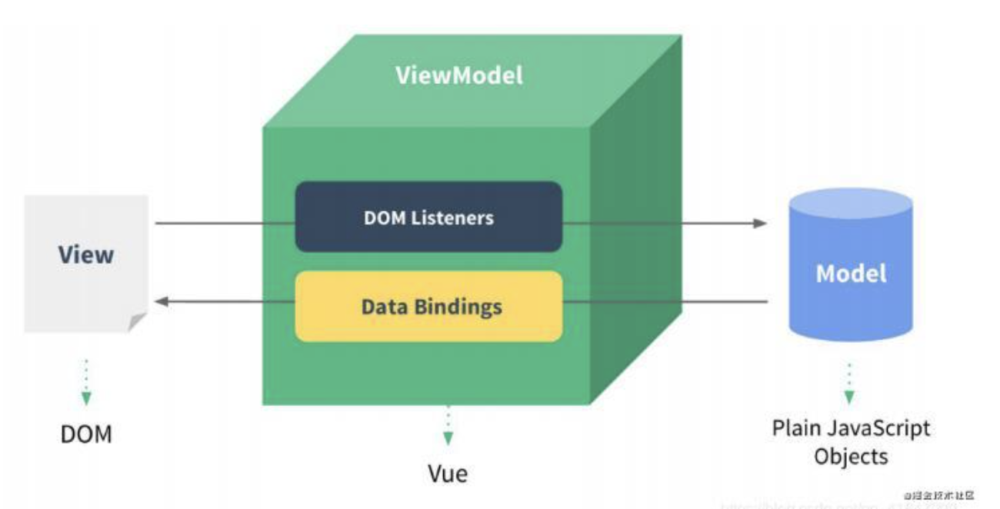

---
layout: post
title: 2021-7-8-Vue笔记（一）
date: 2021-7-4
categories: blog
tags: [前端]
description: Vue笔记（一）


## 07-Vue的mvvm
Model View ViewModel是一种软件架构模式。与在MVC区别就是控制器的逻辑和数据分开，用一个叫ViewModel去管理。



## 08 Vue里传入的options选项  

el: string|HTMLElement, 决定之后Vue实例会管理哪一个DOM。
data: Object|Function, Vue实例对应的数据对象  
methods: 定义属于Vue的一些方法，可以在其他地方调用，也可以在指令中使用。  

## 09-Vue的生命周期  


一般情况下，在created函数里做网络请求，将请求数据保存到data里。

## 11-插值操作-mustache语法
也就是双括号语法。
```
<!DOCTYPE html>
<html lang="en">
<head>
    <meta charset="UTF-8">
    <title>Title</title>
</head>

<body>
    <div id="app"> 
        {{message}} <h1>{{name}}</h1>
        <h4>{{message + " " + name}}</h4>
    </div>
    
<script src="vue.js"></script>
<script>
    // let (定义变量) const (定义常量)
    const app = new Vue({
        el: "#app",     // 用于挂载要管理的元素
        data: {         // 定义数据
            message: "你好呀",
            name: "codewt"
        }
    })


    // 命令式编程/声明式编程
</script>
</body>
</html>
```

## 10-一些指令
v-on: function_name，将事件绑定到Vue中的methods里。示例：  
```html
<div id="app">
    <button v-on:clickfunc>点击</button>
</div>

<script>
const app = new Vue({
    el: "#app",
    data: {},
    methods: {
        clickfunc: function () {
            console.log("hello world");
        }
    }
})
</script>
```
v-once: 只需要展示一次数据，当数据修改时，DOM显示不更改。
v-html: 将标签字符串解析成DOM。
```html
    # message是html语句
    <div v-html> {{message}} </div>
```
v-text（少用）: 把变量文本放到DOM展示，功能通mustache语法。
```html
# ，小李被msg内容覆盖掉
<div v-text="msg">, 小李</div>
```
v-pre: 原封不动地显示内容，而不使用mustache语法，会显示两个大括号，不做任何解析。  
v-cloak(少用): 当渲染延迟时，会短暂出现{{message}}，这样看起来很不好看，v-cloak用于隐蔽显示，在Vue解析之前，有一个v-cloak属性，当Vue解析之后，会将所有v属性删除。那么结合style可以实现解析完后才显示：  
```
<style>
  [v-cloak] {
      display: none;
  }
</style>
<div id="app v-cloak>
{{message}}
</div>
```
v-bind: 绑定属性，动态决定属性。因为mustache只能用于内容，不能用于属性，所以必须要使用v-bind指令。v-bind语法糖，因为经常用所以可以简写 :attr  
```html


<p>url content:{{url}}</p>
<a v-bind:href="url"></a>
<a :href="url">
```  

**v-bind**也可以动态绑定样式的class，这里给active绑定。比如:  
```html
<div id="app" :class="{active: isActive}"> some text 
    # 通过布尔值确定标签有没有该类名
    <h2 class="otherclass" v-bind:class="{类名1: ：boolean, 类名2: boolean}" ></h2>
</div>

const app = new Vue({
    el: "#app",
    data: {
        message: "你好啊",
        isactive: true;
    }
})

<style>
    .active{
        color: red;
    }
</style>

```
*v-bind** 绑定methods：
直接绑定一个方法，然后methods里的方法返回一个JSONObject对象，键值对class:boolean。  
```html
<h2 v-bind:class="getClasses()">
```
**v-bind**的数组语法：
```html
# 单引号：当作字符串解析，不加单引号：当作变量解析
<h2 :class="['active', line]">
```

**v-bind动态绑定style**  
```html
    # <h2 :style="{key(CSS属性名): value}"></h2>
<h2 id="app" :style="{font-size: '50px'}"></h2>

<script>
const app = new Vue({
    el: "#app",
    data: {
        message: "你好啊",
    }
})
</script>
```


