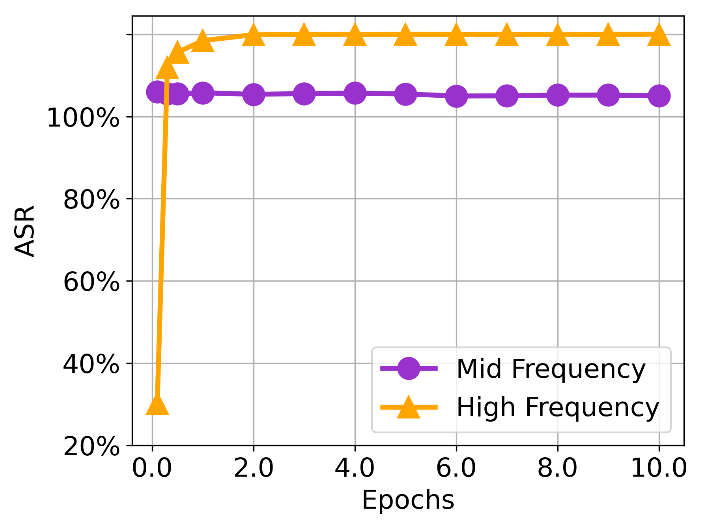
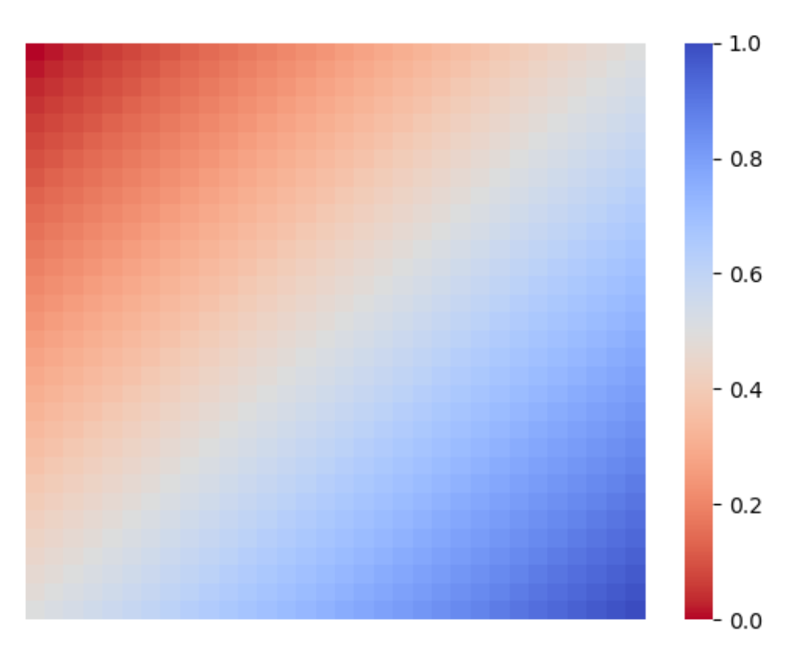

---
layout: post  
title: 2021-09-13-论文绘图
date: 2021-09-13
categories: blog
tags: [论文绘图]
description: 论文绘图。
---  
## 论文绘图  
### 1. 折线图  
设置图片的各个属性
```python  
import matplotlib.pyplot as plt

plt.rcParams['figure.figsize'] = (6.0, 4.5)  # 设置figure_size尺寸
plt.rcParams['savefig.dpi'] = 300   # 保存图片分辨率
plt.rcParams['figure.dpi'] = 300    # 分辨率
plt.grid(axis="x")                  # 设置x轴方向网格背景
plt.grid(axis="y")                  # 设置y轴方向网格背景  

# 准备数据
x = [0.1, 0.3, 0.5, 1, 2, 3, 4, 5, 6, 7, 8, 9, 10]
ba = [86.06, 85.56, 85.52, 85.77, 85.39, 85.57, 85.69, 85.47, 84.99, 85.02, 85.2, 85.2, 85.02]
asr = [10.25, 91.87, 95.61, 98.45, 99.9, 99.98, 99.94, 99.99, 99.96, 99.97, 99.9, 99.98, 100]

# 绘制第一条折线，颜色是darkorchid，线宽是3，点的标记是圆，marksize是13，图例注记的label是Mid Frequency
# 颜色也可以自定义，，不用c ，用color； 
# color="123456" or color="(r, g, b)", color=(r, g, b, a)
l1 = plt.plot(x, ba, c="darkorchid", lw=3, marker="o", ms=13,  label="Mid Frequency")

# 绘制第二条折线
l2 = plt.plot(x, asr, c="orange", lw=3, marker="^", ms=13, label="High Frequency")

# 设置轴的刻度值和显示的符号，设置轴的字体大小为16
plt.xticks(ticks=[0.0, 2.0, 4.0, 6.0, 8.0, 10.0], labels=["0.0", "2.0", "4.0", "6.0", "8.0", "10.0"], fontsize=16)
plt.yticks(ticks=[0,20, 40, 60, 80, 100], labels=["20%", "40%", "60%", "80%", "100%"],fontsize=16)

# 设置轴的标签
plt.xlabel("Epochs", {"size": 16})
plt.ylabel("ASR", {"size": 16})

#设置图例注记的字体大小为16
plt.legend(prop={"size": 16})

# 设置多余空白去除，如果不设置可能会出现轴标签跑出图片，显示不出来或者显示一半
plt.tight_layout()

# 保存图片为矢量图，格式为svg
plt.savefig("CIFAR10_Frq.svg", format="svg")

# 保存为位图，并去除多余空白，分辨率为300
plt.savefig('CIFAR10_Frq.png',  bbox_inches='tight', dpi=300, pad_inches=0.0)
# 显示图片
plt.show()
```  

显示结果：  


plot函数里传入线条样式linestyle=""或ls=，样式如下:  
|符号|样式|
|:----:|:----:|
|-|实线(solid)|
|--|短线(dashed)|
|-.|短点相间线(dashdot)|
|: | 虚点线(dotted)|  

marker样式传参：  
(1)marker -- 折点形状  
(2)markeredgecolor 或 mec -- 折点外边颜色  
(3)markeredgewidth 或 mew -- 折点线宽  
(4)markerfacecolor 或 mfc --折点实心颜色  
(5)markerfacecoloralt 或 mfcalt  
(6)markersize 或 ms --折点大小  

marker符号表：  
|符号|说明|
|:----:|:----:|
|.|point marker|
|,|pixel marker|
|o|circle marker|
|v|triangle_down marker|
|^|triangle_up marker|
|<|triangle_left marker|
|1|tri_down marker|
|2|tri_up marker|
|3|tri_left marker|
|4|tri_right marker|
|s|rectangle marker|
|p|pentagon marker|
|*|star marker|
|h|hexagon1 marker|
|H|hexagon2 marker|
|+|plus marker|
|x|x marker|
|D|diamond marker|
|d| thin_diamond marker|
|\||vline marker|
|_|hline marker|

### 保存图片  
```python  
import matplotlib.pyplot as plt
import numpy as np

img = np.zeros((32, 32, 3), dtype=np.float)
plt.imshow(img)
plt.savefig('tmp.png',  bbox_inches='tight', dpi=300, pad_inches=0.0)

```  

### 2. 热力图  
```python
import matplot.pyplot as plt
import seaborn
import numpy as np


data = np.zeros((32, 32), dtype=np.float)
for i in range(32):
    for j in range(32):
        data[i][j] = i + j
data = data / np.max(data)

plt.axis("off")
# cmap设置颜色变化
ax = seaborn.heatmap(data, cmap="coolwarm_r")
# plt.savefig("frequency_map.png", bbox_inches='tight', dpi=300, pad_inches=0.0)
plt.show()

```  

绘制结果如下：  
  

其他颜色变化cmap参数：  
Accent, Accent_r, Blues, Blues_r, BrBG, BrBG_r, BuGn, BuGn_r, BuPu, BuPu_r, CMRmap, CMRmap_r, Dark2, Dark2_r, GnBu, GnBu_r, Greens, Greens_r, Greys, Greys_r, OrRd, OrRd_r, Oranges, Oranges_r, PRGn, PRGn_r, Paired, Paired_r, Pastel1, Pastel1_r, Pastel2, Pastel2_r, PiYG, PiYG_r, PuBu, PuBuGn, PuBuGn_r, PuBu_r, PuOr, PuOr_r, PuRd, PuRd_r, Purples, Purples_r, RdBu, RdBu_r, RdGy, RdGy_r, RdPu, RdPu_r, RdYlBu, RdYlBu_r, RdYlGn, RdYlGn_r, Reds, Reds_r, Set1, Set1_r, Set2, Set2_r, Set3, Set3_r, Spectral, Spectral_r, Wistia, Wistia_r, YlGn, YlGnBu, YlGnBu_r, YlGn_r, YlOrBr, YlOrBr_r, YlOrRd, YlOrRd_r, afmhot, afmhot_r, autumn, autumn_r, binary, binary_r, bone, bone_r, brg, brg_r, bwr, bwr_r, cividis, cividis_r, cool, cool_r, coolwarm, coolwarm_r, copper, copper_r, cubehelix, cubehelix_r, flag, flag_r, gist_earth, gist_earth_r, gist_gray, gist_gray_r, gist_heat, gist_heat_r, gist_ncar, gist_ncar_r, gist_rainbow, gist_rainbow_r, gist_stern, gist_stern_r, gist_yarg, gist_yarg_r, gnuplot, gnuplot2, gnuplot2_r, gnuplot_r, gray, gray_r, hot, hot_r, hsv, hsv_r, icefire, icefire_r, inferno, inferno_r, jet, jet_r, magma, magma_r, mako, mako_r, nipy_spectral, nipy_spectral_r, ocean, ocean_r, pink, pink_r, plasma, plasma_r, prism, prism_r, rainbow, rainbow_r, rocket, rocket_r, seismic, seismic_r, spring, spring_r, summer, summer_r, tab10, tab10_r, tab20, tab20_r, tab20b, tab20b_r, tab20c, tab20c_r, terrain, terrain_r, twilight, twilight_r, twilight_shifted, twilight_shifted_r, viridis, viridis_r, vlag, vlag_r, winter, winter_r

### 3. 箱式图  
```python
import numpy as np
import matplotlib.pyplot as plt
import matplotlib.ticker as ticker
x_pos = np.random.randint(100, size=(100, ))
x_clean = np.random.randint(100, size=(100, ))

# 设置字体类型和大小
plt.rcParams["font.family"] = "Times New Roman"     
plt.rcParams["font.size"] = 34

# 设置label的小数点为2位
plt.gca().yaxis.set_major_formatter(ticker.FormatStrFormatter('%.2f'))

# 设置多余空白去除，如果不设置可能会出现轴标签跑出图片，显示不出来或者显示一半
plt.tight_layout()

plt.boxplot([x_pos, x_clean], labels=["Poison", "Benign"], showfliers=False, widths=0.65, sym="", flierprops={"marker": "x", "markersize": 15, "markerfacecolor": "red", "markeredgecolor": "red"}, boxprops={"linewidth": 5}, medianprops={"linewidth": 3},capprops={"linewidth": 5},whiskerprops={"linewidth": 5})
plt.show()
```


