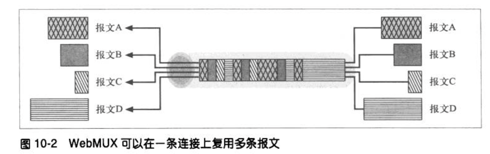

---
layout: post  
title: 2021-8-4-HTTP权威指南阅读（一）
date: 2021-8-4
categories: blog
tags: [HTTP,技术]
description: 2021-8-4-HTTP权威指南阅读，记录一下关键的笔记内容。
---  

## 1. URL与资源  
URI是统一资源表示，它的类型分为两类，URL(统一资源定位)和URN(统一资源名)，但是URN应用较少所以URI也可以称之为URL。  
URL组成：协议+主机+文件路径  

片段：有些资源类型，比如HTML，除了资源级外，还可以做进一步的划分，比如对一个带有章节的大型文本文档来说，资源的URL会指向一个文档，但理想的情况是能够指定资源中的章节。为了引用部分资源或者资源的片段，URL可以指向HTML文档中的一个特定的图片或小节，用#+片段名表示，比如：  
http://www.joes-hardware.com/tools.html#drills  
HTTP服务器通常值处理整个对象，而不是对象片段，浏览器获得整个资源后会分片段来显示。  

URL只能使用安全字母表中的字符，但是为了在URL中假如非安全字符，所以产生了一种编码：  
安全字符集：  
* 数字、大小写字母  
* 转义字符: %后面跟两个表示字符ASCII码守卫十六进制数  

例如：~会被转义成%7E, 空格被转义成%20，%被转义成%25  
保留字符也要转义，保留字符：  
|字符|保留/受限|  
|:----:|:----:|
|%|编码字符转义标志|
|/|保留作为路径组件中分隔路径段的定界符|
|.|保留在路径组件中使用|
|..|保留在路径组件中使用|
|#|保留作为分段定界符使用|
|?|保留作为查询字符串定界符使用|  
|...|...|  

## 2. HTTP报文  
请求报文格式：  
```html  
<method> <request-url> <version>
<headers>

<entity-body>
```

响应报文格式：  
```html  
<version> <status> <reson-phrase>
<headers>

<entity-body>
```  

HTTP响应报文状态码：  
|状态码|已定义范围|分类|
|:----:|:----:|:----:|
|100-199|100-101|信息提示|
|200-299|200-206|成功|
|300-399|300-305|重定向(资源已转移)|
|400-499|400-415|客户端错误|
|500-599|500-505|服务器错误|

常见状态码：  
|状态码|原因短语|含义|
|:----:|:----:|:----:|
|200|OK|成功，请求的所有数据都在报文体中|
|401|Unauthorized(未授权)|需要输入用户名和密码|
|404|Not Found(未找到)|服务器无法找到要请求的URL对应的资源|

### 请求报文的Method  
* GET
* HEAD
* POST
* PUT
* DELETE

GET和HEAD是安全的方法，对服务器不会产生什么影响，其中HEAD的功能是返回与GET请求结果相同的首部，也就是说它只返回首部，其功能概括为：  
1. 再不获取资源的情况下了解资源的情况
2. 通过查看响应中的状态码，看看某个对象是否存在
3. 通过查看首部，测试资源是否被修改了

服务器的开发者必须确保返回的首部与GET请求返回的首部完全相同。  

PUT：  
PUT 方法会向服务器写入文档，其语义就是用请求的主体部分创建一个由请求的URL命名的一个文档，如果那个URL已经存在，则就用主体部分去替代它。  

POST：  
POST方法起初是用来向服务器输入数据的，实际上通常用它来支持HTML的表单。POST用于向服务器发送数据，PUT用于向服务器上传资源存储数据，侧重存储。  

TRACE：  
客户端发起一个请求时，这个请求可能要穿过防火墙、代理、网关或其他一些应用程序，每个中间节点都可能会修改原始的HTTP请求，TRACE可以让服务器返回最终被收到的HTTP请求的报文，该方法一般用于诊断  

OPTIONS：  
请求WEB服务器告知其支持的各种功能。  

### 首部  
Accept: 告知服务器客户端会接受什么样的媒体类型。  

HTTPS就是在HTTP和TCP之间插入一个称之为SSL密码加密层。

## 4-连接管理  
### TCP的性能聚焦  
1. TCP连接的握手时延  

因为一般情况下发送一个HTTP报文都很短，一个TCPpacket就可以容下，但是却要用50%的时间建立连接，代价较大。  

2. TCP慢启动问题  

TCP连接会随着时间进行自我“调谐”，起初会限制连接的最大速度，如果数据传输成功，会随着时间的推移会提高传输的速度，这种调谐被称为**TCP的慢启动问题**，用于防止因特网的突然过载和拥堵。  

TCP慢启动限制了一个TCP端点在任意时刻可以传输的分组数，简单来说每成功接收一个分组，发送端就有了发送另外两个分组的权限，如果某个HTTP事物有大量数据要发送，是不能一次就将所有分组都发送出去。必须发送一个分组，等待确认；然后可以发送两个分组，每个分组都必须被确认，这样可以发送四个分组。这种方式被称为“打开拥塞窗口”。

由于存在这种拥塞控制特性，所以新连接的传输速度会比已经交换过一定量数据的、已调谐连接慢一些，由于已调谐连接速度块，所以HTTP中有一些可以崇勇现存连接的工具。  

3. Nagle算法与TCP_NODELAY  

TCP的数据流接口里，应用程序可以通过它将任意尺寸的数据放入TCP栈中，然而首部占了40字节如果放入数据过少，会降低TCP分组传输效率。Nagle算法会将数据先缓存起来，等到足够1500字节后再进行发送。等到其他所有分组都确认后，再发送非全尺寸的分组。

Nagle算法会带来HTTP性能问题，首先小的HTTP报文可能无法填满一个分组而产生时延。其次Nagle算法和延迟确认之间的交互存在问题，Nagle会延迟等待发送，而延迟确认会在缓存区等待能够捎带的确认分组。所以HTTP应用程序通常会在自己的栈中置设TCP_NODELAY，禁用Nagle算法提高性能，这么做必须保证向TCP写入大块的数据。  

4. TIME_WAIT累计和端口耗尽  

当某个TCP端点关闭TCP连接时，会在内存维护一个小的控制块，用来记录最近所关闭连接的IP和端口号。这类信息一般维持最大分段使用期的两倍2MSL，防止在2MSL时间内创建关闭并重新创建两个具有相同IP地址和端口号的连接。  
但是如果在做压力测试时，只有少数个客户端多次连接同一台服务器，serverIP，serverPort都是固定的，clientIP只有少数几个值，clientPort是唯一会变化的(60000个)，这样在2MSL内端口是不能用的，则很容易出现端口耗尽问题，严重降低操作系统的速度。所以最好用虚拟IP进行处理或者增加客户端数量进行测试。

### HTTP连接的处理  
* Connection首部

Connection首部控制连接情况，对于代理来说，在应用发送之前需要删除调Connection首部。值close表示发送完毕后关闭连接。(只针对close选项)

* 并行连接

浏览器可以完整的请求HTML页面，然后打开多条连接并行的执行多个HTTP事务。  
加快原因：克服单条连接的空载时间（如TCP握手时间并行）和带宽限制，加载速度也会有所提高(链路上一个TCP的速度是有限制的，单条连接没有充分利用整个带宽)，Web渲染是并行的，接受点数据就渲染出来。  
并行连接不总是快：1. 客户端的网络带宽不足时，大部分的时间都用来传送数据，一个连接到速度较快的服务器上的HTTP事务就会很容易耗尽所有可用的带宽(链路层一直碰撞，一直失败)，如果并行加载多个对象，则有限的带宽中每个对象都会以较慢的速度按比例加载。2. 并且大量连接会浪费很多内存资源，从而引发性能问题。  

事实上浏览器确实使用了并行连接，但是为将他们的并行连接总数限制为一个较小的值（通常为4个），服务器端可以随意关闭来自特定客户端的超量连接。  

但是并行连接可以看起来快一点，因为每个组件都在加载中。  

* 持久连接  
快的原因：没有了TCP慢启动、没有了TCP握手时延。  
Connection: Keep-Alive: 请求将连接保持在活跃状态  

**Keep-Alive和哑代理**  

在代理情况下，代理应当删除HTTP请求头部的Connection项目，否则会出现以下情况：  

这种情况会使浏览器一直处于刮起状态，知道客户端或服务器超时，并将其关闭为止。为了避免这种情况，代理是不能转发Connection以及任何包含Keep-Alive首部，另外，也不能转发Peoxy-Authenticate，Proxy-Connection、Transfer-Encoding和Update。  

Proxy-Connection：  
浏览器只添加Proxy-Connection，部分代理能够将其转化为Connection: Keep-Alive，对于单代理是可行的，但是对于多层代理就不可行。  

* HTTP/1.1 持久连接  
默认持久连接是激活的，除非收到报文头含有Connection: close的头。当然，不管报文头取什么值，服务器和客户端都可以在任意时刻关闭连接。HTTP/1.1 应用程序必须能够从异步的关闭中恢复出来，只要不存在可能会累积起来的副作用，客户端都应该重试这条请求。客户端如果收到响应之前连接就被关闭了，那么客户端应当重新发送请求。一般情况下，一个客户端只能维护两条持久连接。  

### 管道化连接  
前一个刚发出去就可以发送下一个，他们的时间是重叠的。  

### 关闭连接的奥秘  
1. 任意解除连接  

2. Content-Length及截尾操作  

一些老的服务器会省略Content-Length首部，但是会给客户端或代理发送一条随连接关闭的HTTP响应。  

3. 连接关闭幂等  

管道方式发送HTTP不能发送非幂等事务（POST），而可以发幂等的（GET、HEAD、PUT、DELETE、TRACE、OPTIONS）。幂等：执行多次操作和一次操作结果一样。  

4. 正常连接关闭  

完全关闭和半关闭：套接字调用close()可以关闭TCP的输入信道和输出信道，调用shurdown可以只关闭其中一个，此时称为半关闭。  

TCP关闭及重置错误：如果在管道持久化连接时，使用半关闭来防止对等实体收到非预期的写入错误。  

正常情况下，应用程序首先关闭输出信道，然后等待另一实体关闭输出信道，当两端都告诉对方不会再发送任何数据后，连接就会被完全关闭。

### 重定向使用时机  
* **永久删除的资源**：资源已经被移动到新的位置或被重命名，有了一个新的URL。Web服务器可以告诉客户端资源已经被重命名，这样就可以到新的地址去寻找该资源。  
* **临时删除的资源**，服务器希望客户端将来还能回头使用老的URL，但是本次请求暂时先去新的地址寻找。  
* **URL增强**：服务器通常重定向来重写URL，往往用于嵌入上下文。当请求到达时，服务器会生成一个新的包含了嵌入式状态信息的URL，并将用户重定向到这个新的URL，客户端会重新发送请求，新的请求会包含完整的、经过状态增强的URL。
* **负载均衡**：如果一个超载的服务器收到请求，服务器可以将客户端重定向到一个负载不太重的服务器上。  
* **服务器关联**：Web服务器上可能会有某些用户的本地信息，服务器可以将客户端重定向到包含那个客户端信息的服务器上去。  
* **规范目录名称**：客户端请求的URI是一个不带尾部斜线的目录名时，大多数Web服务器都会将客户端重定向到一个加了斜线的URI上，这样相对链接就可以正常工作。  

## 5-代理  
Web上的代理服务器是**代表客户端**完成事务处理的中间人，如果没有Web代理，HTTP客户端就要直接与HTTP服务器进行对话；有了Web代理，客户端就可以与代理进行对话，然后由代理代表客户端与服务器进行交流，客户端仍然会完成事务的处理，但它是通过代理服务器来提供的优质服务实现的。  

HTTP的代理服务器既是Web服务器又是Web客户端，也就是既能发送请求又能响应请求。  

### 代理与Web网关的区别  
**代理**连接的是两个或多个使用相同协议的应用程序，而网关连接的则是使用两个或多个不同协议的端点，**网关**扮演的是协议转换器的角色，即使客户端和服务器使用的是不同的协议，客户端也可以通过它完成与服务器之间的事务处理。  
> HTTP/POP网关：把HTTP的前台和POP E-mail的后端连接起来。网关将Web事务转换成适当的POP事务，这样用户就可以通过HTTP读取E-mail了。

### 使用代理的原因  
1. 儿童过滤器，过滤成人内容
2. 文档访问控制
3. 安全防火墙：限制哪些应用层协议的数据可以流入或流出哪一组织
4. Web缓存：代理缓存了常用文档的本地副本，并将他们按需提供。
5. 反向代理：代理可以假扮Web服务器，这些代理能够接收到发给服务器的真实请求，与Web服务器不同的是他们还可以发起与其他服务器的通信，以便按需定位所请求的内容。  
6. 当作内容路由器的使用，根据网络流量状况以及内容类型将请求导向特定的Web服务器。
7. 转码服务器：代理服务器在将内容发送给客户端之前，可以修改内容的主体格式，例如在传送GIF图片时可以转成JPEG后再发给用户。
8. 匿名者：代理服务器可以删除HTTP报文中的身份特性，从而提供高度的私密性和匿名。（Referer、Cookie、User-Agent删除OS信息、删除From或Referer来掩盖用户访问过其他站点。）
9. 代理认证  

### 代理的部署位置  
**出口代理**： 可以固定在本地网络的出口点。
**入口代理**： 放置在ISP访问点上，用以处理来自客户的聚合请求，ISP使用缓存代理来存储常用文档的副本，以提高用户的下载速度。  
**反向代理**：  会部署在网络边缘，在Web服务器之前，作为替代物使用，这样可以提高服务器的安全特性，或者将快速的Web服务器缓存放在较慢的服务器之前，以提高性能。  
**网络交换代理**：  可以将具有足够处理能力的代理放在网络之间的因特网对等交换点上，通常缓存来减轻因特网节点的拥塞，并对流量进行监视。  


### 代理服务器如何获取流量  
* 修改客户端，配置浏览器的代理  
* 修改网络： 在客户端不知道的情况下，拦截网络流量并将其导入代理，这种拦截通常都依赖于监视HTTP流量的和交换设备及路由设备，在客户端毫不知情的情况下对其进行拦截。
* 修改DNS的命名空间，放在Web服务器之前的代理服务器会假扮Web服务器的名字和IP地址，要实现这一点可以手动编辑DNS名称列表。真实的服务器IP名字被修改，替代物就可以接收到流量  
* 修改Web服务器(重定向)：将某些Web服务器哦诶秩为向客户端发送一条HTTP重定向命令(响应码为305)，将客户端请求重定向到一个代理上去，收到重定向指令后客户端会与代理进行通信。  

### HTTP报文中代理URI和服务器URI的不同  
客户端向Web服务器发送请求时，请求行只包含部分URI(无协议、主机和端口)，在向代理发送请求时，需要包含完整的URI，如：  
GET http://www.marys-antiques.com/index.html HTTP/1.0  
User-Agent: SuperBrowser v1.3  

### 追踪报文  
Via首部字段列出了报文途径每个中间节点（代理或网关）有关的信息，报文每经过一个节点，必须将中间节点添加到Via列表尾。  

代理也可以用Via首部来检测网络中的路由循环，代理应该在发送一条请求之前，在Via首部插入一个与其自身有关的独特字符串，并在输入的请求中查找这个字符串，以检测网络中是否存在路由循环。  

### 代理认证  
代理可以作为访问控制设备使用。HTTP定义了一种名为代理认证(proxy authentication)的机制，这种机制可以组织对内容的请求，直到用户向代理提供了有效的访问权限证书为止。  

* 对受限内容的请求到达一台代理服务器时，代理服务器可以返回一个要求使用访问证书的407 Proxy-Authentication Required 状态码，以及一个用于描述怎样提供这些证书的OProxy-Authentication首部字段。
* 客户端接收到407响应后，会尝试在本地数据库或者提示用户来搜索需要的证书
* 只要获得证书用户就会重新发送请求，在Proxy-Authentication 首部字段提供所要求的证书。  
* 如果证书有效，代理就会将原始请求沿着传输链路向下传送，否则就发送另一条407应答。  

传输链路中有多个代理，且都需要认证时，代理认证通常无法很好地工作。  

## 6-缓存  
### 缓存的原因  
冗余数据的传输、带宽瓶颈、瞬间拥塞（突发性新闻）、距离时延  

### 新鲜度检测  
原始服务器的内容可能会有变化，缓存要不时对其进行检测，看看它们保存的副本是否发生变化，这被称为再验证。缓存对副本再验证时，会向原始服务器发送一个小的304 Not Modified进行响应，然后缓存会将副本标记为新鲜，这被称为再验证命中。  

再验证头部：GET If-Modified-Since: Date 请求，以下时三个结果：  
* 再验证命中：服务器会返回一个304 Not Modified 响应
* 再验证微命中：服务器会向客户端发送一条普通的带有完整内容的HTTP 200 OK 响应。
* 对象删除：服务器返回一个404 Not Found 响应，缓存也会删除其副本。  

区分命中和未命中情况：  
Date首部，客户端判断响应报文中Date首部是否比当前时间早，当然Age首部也可以。  

### 缓存处理步骤  
1. 接收请求报文
2. 解析，提取出URL和首部  
3. 查询，缓存查看是否有本地副本可用，没有就获取一份副本并将其保存在本地
4. 新鲜度检测，缓存查看已缓存副本是否足够新鲜，如果不是，就询问服务器是否有任何更新
5. 创建响应，缓存会用新的首部和已缓存的主体来构建一条响应报文
6. 发送，缓存通过网络将响应发回给客户端
7. 日志，缓存可选地创建一个日志文件条目来描述这个事务。  

### 文档过期  
通过特殊的HTTP Cache-Control首部和Expires首部，HTTP让原始服务器向每个文档附加了一个过期时间，就像食品的保质期一样。文档过期之前，缓存可以以任意频率使用这些副本而无需与服务器联系。  

Cache-Control: max-age 定义以秒为单位的相对使用期限。  
Expires: Date 指定了一个绝对的过期时间。  

服务器再验证：过期后再进行验证，更新过期时间。  
当缓存代理过期时，需要向服务器进行再验证，一般有两个首部：  
* If-Modified-Since: \<Date\>  

如果从指定日期之后文档被修改过了，就执行请求的方法。可以与Lats-Modified服务器响应首部配合使用。
* If-None-Match: \<Tags\>  

服务器可以为文档提供特殊的标签，而不是将其与最近修改日期相匹配，这些标签就像序列号一样，如果已缓存标签与服务器文档中的标签有所不同，If—None-Match首部就会执行请求的方法。  


### 缓存与广告  
缓存会让隐藏广告的点击量，所以解决方法：  
* 强制再验证，虽然不请求内容，但是再发送一次再验证请求
* 日志迁移，缓存可以记录下所有的命中情况，那么缓存只要将命中日志发送给服务器即可。  
* 在HTTP协议中添加一个Meter首部，这个首部会周期性地将特定URL的命中次数回送给服务器，通过这种方式，服务器可以周期性地获取已缓存文档命中次数的更新。  

## 网关隧道中继  
开发者们可以在HTTP上捎回其他协议的内容，将其他协议的流量包裹在HTTP协议中，用HTTP通过隧道或中继的方式将这些流量传过公司的防火墙。

### 客户端和服务器端网关  
Web网关在一侧使用HTTP协议，在另一侧使用另一种协议。  
<客户端协议>/<服务器端协议>  
因此将HTTP客户端连接到NNTP新闻服务器的网关就是一个HTTP/NNTP网关，可以分为服务器网关和客户端网关(HTTP/*)。  
* 服务器端网关：通过HTTP与客户端对话，通过其他协议与服务器通信。  
* 客户端网关：通过其他协议与客户端对话，通过HTTP协议与服务器通信(*/HTTP)

### 协议网关  
单纯为了转换协议。  
HTTP/*: 服务器端Web网关  
HTTP/HTTPS: 服务器端安全网关，会自动加密用户的会话。  
HTTPS/HTTP: 客户端安全加速器网关，位于Web服务器之前，加速HTTPS的解密。  

### 资源网关  
最常见的网关：应用程序服务器，会将目标服务器与网关结合在一个服务器中实现。应用程序服务器是服务端网关，与客户端通过HTTP进行通信，并与服务器端的应用程序相连（微服务的其他程序）。  
通用网关接口Common Gateway Interface(**CGI**)是一个标准接口集，Web服务器可以用它来装在程序以响应对特定URL的HTTP请求，并收集程序的输出数据，将其放在HTTP响应中回送。  

### 5. 隧道  
该方法是通过HTTP应用程序访问使用非HTTP协议的应用程序。Web隧道允许用户通过HTTP连接发送非HTTP协议的流量，这样就可以在HTTP上捎带其他协议数据来。  


用CONNECT 建立HTTP隧道：
* 在上图中，客户端发送一条CONNECT请求给隧道网关。客户端的CONNECT方法请求隧道网关打开一条TCP连接（这里打开的是到目的主机的标准SSL端口443的连接）  
* 建立TCP连接  
* 网关发送一条200 响应通知客户端。
* 连接建立，此时客户端通过HTTP隧道发送的所有数据都会被直接转发给输出TCP连接


### SSL 隧道  
最初开发Web隧道是为了通过防火墙来传输加密的SSL流量，隧道会通过一条HTTP连接来传输SSL流量，以穿过端口80的HTTP防火墙。  
  
上图防火墙会拒绝端口443的流量，但是会接受HTTP承载的SSL的80端口流量。

### 中继  
HTTP中继(relay)是完全没有遵循HTTP规范的简单HTTP**代理**。中继负责处理HTTP中建立连接的部分，然后对字节进行盲转发。盲中继的问题如图：  
  
中继盲转发流量后，服务器返回keep-alive，但是中继等待关闭连接，此时服务器超时关闭后，客户端的下条连接没有握手直接发送流量，导致无法连接。  

## 7- Web机器人  
### 地址管理中有用的技术  
* 树和散列表记录已访问的URL
* 有损的存在位图记录爬过的URL，比如用一个散列函数将每个URL转换成一个定长的数字，这个数字在数组中有个相关的“存在位”。爬行过一个URL时，就将相应的“存在位”置位，如果已经爬过那个URL则置位。  
* 检查点，一定要讲已访问的URL列表保存到硬盘上，以防机器人程序崩溃。  
* 分类，多个计算机联合爬虫时，为每个机器人分配一个特定的URL“片”，由其负责爬行，机器人个体之间可能需要相互通信，来回传送URL。  

### 别名与规范化  
由于URL“别名”的存在，即使使用了正确的数据结构，有时也很难分辨出以前是否访问过某个页面。如下列情况：  
|第一个URL|第二个URL|什么时候是别名|
|:----:|:----:|:----:|
|http://www.foo.com/bar.html | http://www.foo.com:80/bar.html | 默认端口为80|
|http://www.foo.com/~fred | http://www.foo.com/%7Ffred | %7F与~相同 |
|http://www.foo.com/x.html#early | http://www.foo.com/x.html#middle |标签并没有修改页面实际内容|
|http://www.foo.com/readme.htm | http://www.foo.com/README.HTM |服务器是大小写无关的 |
|http://www.foo.com/ | http://www.foo.com/index.html | 默认页面为index.html |
|http://www.foo.com/index.html | http://209.231.87.45/index.html | www.foo.com使用这个IP地址 |  

规范化URL：
1. 如果没有指定端口，则向主机名中添加端口 ":80"。
2. 将所有转移符%xx转换成等价字符
3. 删除\#标签

机器人需要知道Web服务器是否大小写无关的才能避免别名问题  
机器人需要知道Web服务器上这个目录下的索引页面配置才能知道index是否是别名
即使知道IP地址和主机名指向同一个计算机，它还要知道Web服务器是否配置为进行**虚拟主机**操作，才知道这个URL是不是别名（虚拟主机见第五章）。  

也即是URL规范会可以消除一些基本的语法别名，但机器人还是会遇到其他的、将URL转换为标准形式也无法消除的URL别名。  

### 文件系统连接环路  
  
文件系统的符号连接会造成潜在的环路。爬虫时，可能存在如下：  
(1) GET xxx/index.html，然后找到指向xxx/subdir/index.html的URL，假如到队列中。  
(2) GET xxx/subdir/index.html后，在其中找到 /subdir/subdir/index.html  
...  
这样将一直循环下去。  

恶意网管发布一个看似普通的文件，实际上却是网关应用程序(CGI)的URL，这个应用程序可以在传输中构造出包含到了同一服务器上虚构的URL链接的HTML，请求这些虚构的URL时，这个邪恶的服务器就会捏造出一个带有新的虚构URL的新HTML页面来。  


### 避免循环和重复  
* 规范化URL  
* 广度优先爬行（只能降低影响）
* 节流：限制一段时间内机器人可以从一个Web站点获取页面的数量
* 限制URL长度
* URL/站点黑名单
* 模式检测，检测URL内是否出现循环，如/subdir/subdir/subdir...和/subdir/images/subdir/images...  
* 内容指纹：内容指纹的机器人会获取页面内容中的字节，并计算出一个校验和(checksum)，这个校验和事页面内容的压缩表示形式。如果机器人获取一个页面，而此页面的校验和曾经见过，他就不会再去爬行这个页面的链接了，最常用的是MD5校验和。有些会忽略页面的动态内容来计算校验和。  
* 人工监视  

### 机器人的HTTP  
建议机器人们实现HTTP如下头部：  
User-Agent: 将请求的机器人名字告知服务器  
From: 提供机器人的用户/管理者的Email地址  
Accept: 告知服务器可以发送哪些媒体类型，这有主意确保机器人只接收它感兴趣的内容（文本、图片等）  
Referer: 提供包含了当前请求URL的文档的URL  

Host：大多数服务器都被配置为提供一个特定的站点，因此不包含Host的爬虫提供一个默认站点。若服务器根据Host提供不同站点，Host没有的话，则只能获取默认站点的内容。  

机器人可以使用条件请求，判断请求的内容是否过期，若没过期则不用再请求相应的内容了。  

### 拒绝机器人访问  
robots.txt文件被称为存储访问控制信息文件，所有Web服务器都可以在服务器的文档根目录中提供一个可选的、名为robots.txt的文件。这个文件包含的信息说明了机器人可以访问服务器的哪些部分。例如：www.baidu.com/robots.txt  

robots.txt例子：  
```txt  
User-agent: Sogou Orion spider
Disallow: /baidu
Disallow: /s?
Disallow: /shifen/
Disallow: /homepage/
Disallow: /cpro
Disallow: /ulink?
Disallow: /link?
Disallow: /home/news/data/
Disallow: /bh
```  

1. User-Agent行，机器人名，*是通配符表示所有机器人  
2. Disallow和Allow行： 显式禁止或者显式允许特定机器人使用哪些URL  

当然，robots.txt是面向网站管理员的，但是也可以在HTML页面嵌入\<robot-control\>标签。例如：  
```html  
<META NAME="ROBOTS" CONTENT=directive-list>

<META NAME="ROBOTS" CONTENT="NOINDEX">
```  
directive-list:  
NOINDEX: 忽略这个文档文档  
NOFOLLOW: 不要爬这个文档的任何外链接  
NOAECHIVE: 不要缓存这个文档的本地副本  
ALL: 等价于INDEX，FOLLOW
NONE: 等价于NOINDEX, NOFOLLOW  

> META必须在HTML页面的head区域  

**搜索引擎的META标签**  
|name=|content=|描述|
|:----:|:----:|:----:|
|DESCRIPTION|<文本>|允许作者为Web页面定义一个短小的文本摘要，以供搜索引擎查看|
|KEYWORDS|<逗号列表>|关联一个由逗号分隔的Web页面描述词列表，为关键字搜索提供帮助|
|REVISIT-AFTER|<天数>|告诉机器人应该在指定天数后重访页面，估计那时候页面可能会发生变化|


## 8-HTTP-NG  
HTTP-NG: HTTP Next Generation.  
主题： 模块化和功能增强。也就是将协议模块化为三层，而不是将连接管理、报文处理、服务器处理逻辑和协议方法全都混在一起。  

* 第一层，**报文传输层**，这一层不考虑报文的功能，而是致力于端点间报文的不透明传输。报文传输层支持各种子协议栈（如无限环境下的协议栈），主要负责处理高效报文传输及处理。提出了WebMUX协议。  

* 第二层，**远程调用层**，定义请求/响应功能，客户端可以通过这些功能调用对服务器资源的操作。本层独立于报文传输层以及操作的精确语义。它只是提供了一种标准的方法来调用服务器上所有的操作。本层建议使用二进制连接协议。  

* 第三层，**Web应用层**，提供了大部分的内容管理逻辑。所有的HTTP/1.1方法(GET, POST, PUT等)，以及HTTP/1.1首部参数都是在这里定义的。  

  

HTTP-NG的很多基本原理和功能目标都是从**CORBA**和**DCOM**这样结构化的、面向对象的分布式对象系统中借鉴而来的。  

**报文传输**  
本层关注：1. 对豹纹进行管道化和批量化传输，降低往返时延；2. 重用连接；3. 在同一条连接上并行地复用多个报文流，防止报文流饿死的同时优化共享连接；4. 对报文进行有效的分段，使报文边界的确定更加容易。  

**远程调用**  
使用二进制连接协议，本层提供通用的请求/响应框架，客户端可通过此框架调用对服务器资源进行操作。  

**Web应用**  
提供与HTTP/1.1等价的功能和一些扩展接口。  




