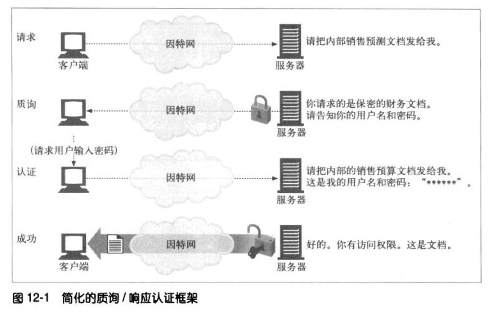
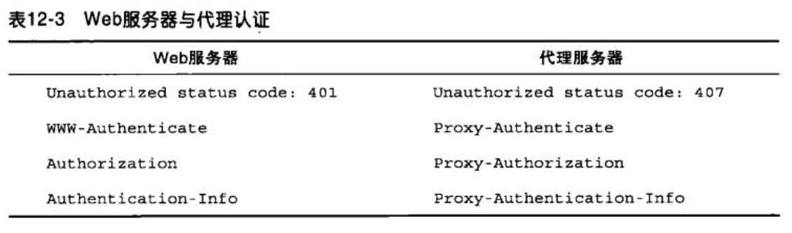
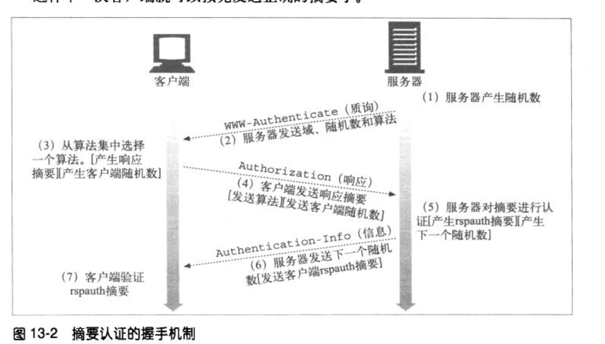
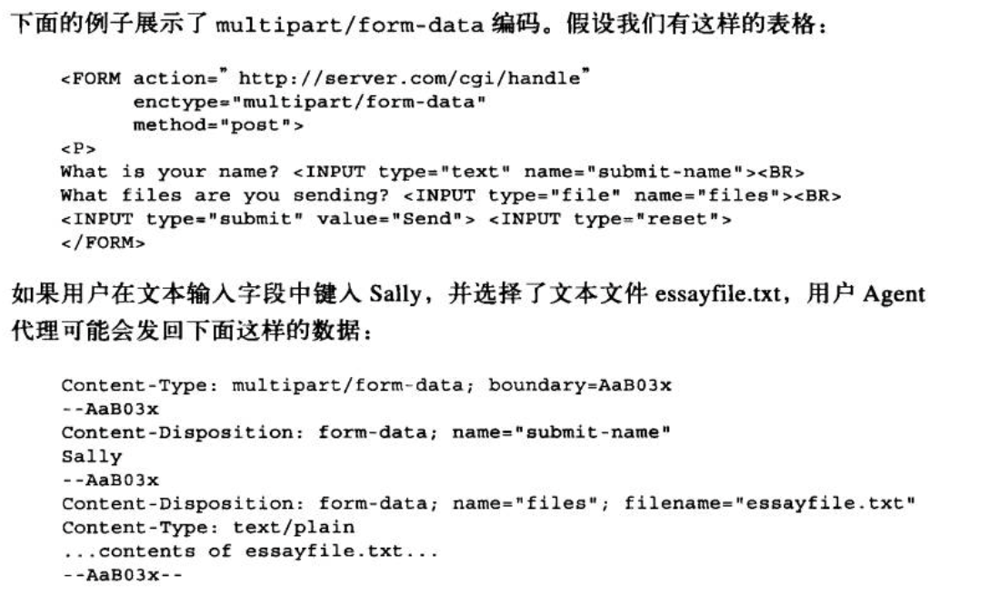
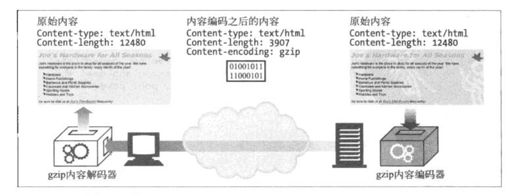

---
layout: post  
title: 2021-9-4-HTTP权威指南阅读（二）
date: 2021-9-4
categories: blog
tags: [HTTP,技术]
description: 2021-8-4-HTTP权威指南阅读，记录一下关键的笔记内容。
---  

## 1-客户端识别与Cookie机制  
用户识别机制包括：  
* 承载用户身份信息的HTTP首部  
* 客户端IP地址跟踪，通过用户的IP地址对其进行识别  
* 用户登录，用认证的方式来识别用户  
* 胖URL，一种在URL中嵌入识别信息的技术  
* cookie，一种功能强大且高效的持久身份识别技术  

### HTTP 首部  
下表给出最常见的用来承载用户相关信息的HTTP请求首部。  
|首部名称|首部类型|描述|  
|:----:|:----:|:----:|
|From| 请求|用户的E-mail地址|
|User-Agent| 请求|用户的浏览器软件|
|Referer|请求|用户是从这个页面依照链接跳转过来的|
|Authorization|请求|用户名和密码|
|Client-IP|扩展(请求)|客户端的IP地址|
|X-Forward-For|扩展(请求)|客户端的IP地址|
|Cookie|扩展(请求)|服务器产生的ID标签|

### 客户端IP地址  
缺点：  
1. 描述的是机器而不是用户  
2. DHCP协议动态分配IP，导致用户每次都会得到一个新的IP  
3. NAT方法导致内部客户端的IP地址被转换，无法得到真实的IP
4. HTTP代理和网关会打开一些新的连接与服务器通信，此时看到的IP不是用户的IP，而是代理的IP  

### 用户登录  
浏览器先向URL发送请求，然后服务器返回401 Not Login，并添加WWW-Authentication 首部，要求用户登录，此时弹出登录框。用户输入账户和密码后，重复原来的请求，这次它会添加一个Authentication首部，说明用户名和密码，对其加密。服务器知道用户身份后，客户端在每次需要使用用户名和密码时都会自动存储下发送的值，作为表示。这样在整个会话期间维持用户身份。  

### 胖URL
有些Web站点会为每个用户生成特定版本的URL来追踪用户身份。通常会对真正的URL进行扩展，在URL路径开始或结束的地方添加一些状态信息，用户浏览时，Web服务器会动态生成一些超链接，继续维护URL中的状态信息，例如：  
```txt  
www.xxx.com/exec/obidos/229220/002-1145265-8016828/
```  
002-1145265-8016828就是用户特有的标志。用户首次访问Web站点时，会生成唯一一个ID，用服务器可以识别的方式将这个ID添加到URL中，然后服务器就会将客户端重新导向这个胖URL，不论什么时候，只要用户收到对胖URL的请求，就可以去查找与那个用户ID相关的所有增量状态，然后重写所有的输出超链，使其成为胖URL，以维护用户的ID。  

缺点：  
1. 丑陋的URL
2. 无法共享URL，把这个URL分享出去，可能就会存在信息泄露问题  
3. 破坏HTTP缓存，因为每个URL都不同了  
4. 额外的服务器负荷，因为需要重新HTML页面使 URL变胖
5. 逃逸口，用户跳转到其他网站或者请求一个特定的URL使，就很容易无意中逃离胖URL的会话。只有当用户严格地追随预先修改过的链接时，胖URL才能工作。如果用户逃离此链接，就会丢失他的进展。  
6. 在会话间是非持久的，除非用户收藏了特定的胖URL，否则用户退出登录时，所有的信息都会丢失  

### Cookie  
**cookie类型**  
cookie分为两类： 会话cookie和持久cookie。会话cookie是一种临时cookie，它记录了用户访问站点时的设置和偏好，用户退出浏览器时cookie就被删除看。持久cookie生存时间更长，它们存储在硬盘上，浏览器退出计算机重启时它们仍然存在，通常持久cookie维护某个用户会周期性访问的站点和配置文件或登录名。  

会话cookie和持久cookie唯一区别是它们的过期时间。如果设置Discard参数或者没有设置Expires或Max-Agec参数来扩展过期时间，这个cookie就是一个会话cookie。  

**cookie如何工作**  
cookie由name=value的列表组成，它通过web服务器响应中的Set-Cookie或Set-Cookie2首部将其贴到用户身上。  

cookie是一种客户端状态，存储在客户端上，例如网景的Navigator会将cookie存在cookies.txt的文本文件中，例如：  
```txt  
# domain        allh    path    secure  expires     name    value  
www.baidu.com   FALSE   /       FALSE   1123432123  cc      23424
```  

domain表示域，cookie作用的服务器URL。  
allh：是域中所有主机都获取cookie还是只有制定了名字的主机获取。  
path：是域中与cookie相关的路径前缀。  
secure：是否只有在使用SSL连接时才发送这个Cookie  
expires：过期时间的UNIX秒数（绝对时间）  
name：cookie变量的名字
value：cookie变量的值  

**不同站点使用不同cookie**  
产生cookie的服务器可以向Set-Cookie响应首部添加一个Domain属性来控制哪些站点可以看到那个cookie，比如  
```txt  
Set-Cookie: user="mary17"; domain="artist.com"
```  

cookie的路径属性：通过domain+path属性设置cookie的使用范围：  
```txt  
Set-Cookie: pref=compact; domain="artist.con"; path=/autos/
```  
客户端只有访问xxx.artist.com/autos/xxx/xxx时才会携带该cookie  

**cookies版本0**  
Set-Cookie属性：  
NAME=VALUE  
Expires: 可选的。这个属性会指定一个日期字符串，用来定义cookie的实际生存期。一旦到了过期时间，就不再存储或发布这个cookie了，日期格式：WeekDay, DD-Mon-YY HH:MM:SS GMT，例如：  
```txt  
Set-Cookie: foo=bar; expires=Wednesday, 09-Nov-99 23:12:40 GMT
```  
Domain: 可选的，浏览器只向指定域中的服务器主机名发送cookie。  
Path: 只为置顶path发送cookie  
Secure: 只有在HTTP使用SSL安全连接时才会发送cookie，例如：  
```txt  
Set-Cookie: private_id=519; secure
```

**cookie版本1**  
Set-Cookie2属性：  
NAME=VALUE  
Version
Comment  
Discard: 如果提供了这个属性，则客户端程序终止时，指示客户端放弃这个cookie  
Domain  
Max-Age: 用于设置以秒为单位的cookie的生存期  
Path  
Port  
Secure  

Cookie2 首部携带  

小心处理带有Cookie首部的请求，带有Cookie的请求暗示了这个文档可能是私有的，要将私有内容标记为不可缓存。  

## 2-基本认证机制  

### HTTP质询/响应认证框架  

  

HTTP 提供了一个原生的质询/响应(challenge/response)框架，简化了对用户的认证过程。HTTP的认证模型如上图，Web应用程序收到一条HTTP请求报文时，服务器没有按照请求执行动作，而是以一个“认证质询”进行响应，要求用户提供一些保密信息来说明他是谁，从而对其进行质询。用户再次发起请求时，需要附上保密证书(用户名和密码)。如果证书不匹配，服务器可以再次质询或者产生一条错误信息。如果证书匹配，就可以正常完成请求了。  
认证分为**基本认证**和**摘要认证**。  

认证分为四个步骤：  
步骤一：  
请求；第一条没有认证信息的请求  
质询；WWW-Authentication; 服务器用401状态拒绝请求，说明需要用户提供用户名和密码。服务器上会分为不同区域，每个区域都有自己的密码，所以服务器会在WWW-Authentication首部对保护区域进行描述。同样，认证算法也是在WWW-Authentication中指定  
授权；Authentication；客户端重新发送请求，但这一次会附加一个Authentication首部，来说明认证算法、用户名和密码  
成功；Authentication-Info；如果授权证书是正确的，服务器就会将文档返回。有些授权算法会在可选的Authentication-Info首部返回一些与授权会话相关的附加信息  

### 代理认证  
中间的代理服务器也可以实现认证功能。有些组织会在用户访问服务器之前，用代理服务器对其进行认证。可以在代理服务器上对访问策略进行集中管理，因此，通过代理服务器提供对某组织内部资源的统一访问控制是一种很便捷的方式。这个过程第一步就是通过代理认证(proxy authentication)来识别身份的。  
代理认证和Web服务器身份验证步骤相同。但首部和状态吗稍有不同：  
  

### 基本认证的安全缺陷  
1. 用户名和密码按照明文编码，除非配合SSL加密信道，否则非常不安全。  
2. 用户名和密码可能会被暴力破解  
3. 用户将所有网站的用户名密码设置成一样，导致泄漏一个密码则其他网站密码也会泄露
4. 基本认证没有提供针对代理和作为中间人的中间节点的防护措施，它们没有修改认证首部，但却修改了报文的其余部分，这样就严重地改变了事务的本质。  
5. 假冒服务器很容易骗过几本认证


## 3-摘要认证  
摘要是对信息主体的浓缩。客户端认证时不发送密码，而只发送密码的摘要，服务器获得摘要后进行简单计算就可以判定摘要是否和密码对应。  

### 单向摘要  
摘要是一种单向函数，主要用于将无限输入值转换为有限的浓缩输出值。常见摘要：MD5(报文摘要的第五版)和SHA(安全散列算法)。MD5会将任意长度的字节序列转换为一个128位的摘要。  MD5会被写成32个十六进制(32 x 4)的字符，每个字符表示4位。  

### 用随机数防止重放攻击  
别有用心的人会截获摘要，一遍一遍地重放给服务器，为了防止这种情况发生，服务器可以向客户端发送一个称为随机数的特殊令牌，这个数会经常发生变化(可能是每毫秒或者是每次认证都变化)。客户端计算摘要之前要先将这个随机数令牌附加到密码上，在密码中加入随机数就会使摘要随着随机数的每一次变化而变化。随机数是在WWW-Authentication质询中从服务器传送给客户端的。  

### 摘要认证的握手机制  
  
注意，客户端也要产生随机数，并且对rspauth的摘要进行认证。  

### 摘要的计算  
当随机数过期时，即便老的Authentication首部所包含的随机数不再新鲜了，服务器也可以选择接受其中的信息。服务器也可以返回一个带有新随机数的401响应，让客户端重试这条请求；指定这个响应的stale=true，表示服务器在告知客户端选用新的随机数来重试，而不再重新提示输入新的用户名和密码了。  

**预授权**  
在普通的认证方式中，事务结束之前，每条请求都要有一次请求/质询的循环，如果客户端先知道下一个随机数是什么，就可以在发出请求之前，生成正确的Authorization首部了，这样就减少了请求/质询的步骤。预授权有三种方式：  
1. 服务器预先在认证结束时的Authentication-Info 首部发送下一个随机数  
缺点：破坏了对同一台服务器的多条请求进行管道化功能

2. 服务器允许在一小段时间内使用同一个随机数  
在有限的次数10次或者10秒内重用随机数。

3. 客户端和服务器使用同步的、可预测的随机数生成算法。
客户端和服务器可以采用时间同步的随机数生成算法，根据共享的密钥，生成第三方无法轻易预测的、相同的随机数序列（比如安全ID卡）。  

## 4-安全HTTP  
HTTPS是一种安全的HTTP形式，所有的HTTP请求和响应数据在发送到网络之前都要进行**加密**。HTTPS在HTTP下面提供了一个传输级的密码安全层（位于TCP上层），可以使用SSL，也可以使用其后继者TSL（Transport Layer Security, TLS）。由于SSL和TSL非常类似，这里不作区分。  
### 数字加密  
*对称密钥加密技术*. 编码时使用的密钥值和解码时使用的密钥值一样(e=d)。流行的密钥加密算法包括：DES, Triple-DES, RC2和RC4. 问题，每一对服务器客户端都需要保存一个共享的密钥
*不对称加密(公开密钥加密技术)*. 服务器产生一个公钥和私钥，私钥不公开，公钥公开。客户端用公钥对数据进行加密，服务器用私钥进行解密。例如：RSA.  
*混合加密系统*. 因为RSA速度慢，所以一半RSA用作传输对称加密系统中的共享密钥，而不做内容传输。  

### 数字签名  
发布者先对内容进行摘要，然后用私钥对摘要进行加密，并公布出(内容, 公钥, 加密后的签名)，接收端根据公布的公钥对加密后的签名进行解密得到摘要，若摘要和内容不符，则说明内容被篡改。  

### 数字证书  
数字证书(cert)包含了由某个受信任组织担保的用户或公司的相关信息。证书的主要内容：对象的名称（人、服务器、组织等）， 过期时间， 证书发布者， 来自证书发布者的数字签名。数字证书还包括对象的公开密钥，以及对象和所用签名算法的描述性信息。  

通过HTTPS建立了一个安全的Web事务之后，现代的浏览器都会自动获取所连接服务器的数字证书。如果服务器没有证书，安全连接就会失败，服务器证书包含很多字段比如：Web站点的名称和主机名，Web站点的公开密钥, 签名办法的机构名称, 来自签名办法机构的签名。浏览器收到证书时会对签名办法机构进行检查，如果这个机构是个很有权威的公共签名机构，浏览器可能已经知道其公开密钥了（浏览器会预先安装很多签名颁发机构的证书）。  

### HTTPS细节介绍  
HTTPS就是在安全的传输层上发送的HTTP。  
HTTP端口：80, HTTPS端口：443  
HTTPS中，客户端首先打开一条道Web服务器端口443（安全HTTP的默认端口）的连接。一旦建立TCP连接，客户端和服务器就会初始化SSL层，对加密参数进行沟通，并交换密钥。握手完成之后，SSL初始化就完成了，客户端就可以将请求报文发送给安全层了。在将这些报文发送给TCP之前，要先对其进行加密。  

**SSL握手**  
在发送已加密的HTTP报文之前，客户端和服务器
要进行一次SSL握手，在这个握手过程中，它们要完成以下工作：  
+ 交换协议版本号  
+ 选择一个两端都了解的密码
+ 对两端的身份进行认证  
+ 生成临时的绘画密钥，以便加密信道  

**服务器证书**  
SSL支持双向认证，将服务器证书承载回客户端，再将客户端的证书送回给服务器。而现在，浏览器并不经常使用客户端证书，也就是说服务器可以要求客户端证书也可以不要求。  

客户端一般检查服务器证书的如下信息：  
日期、签名颁发者可信度检测、签名检测（也就是校验码验证签名没被恶意篡改过）、站点身份检测（检测域名和当前通信服务器是否是同一个）  

### OpenSSL  
OpenSSL是SSL和TLS最常见的开源实现。  

### 通过代理以隧道形式传输安全流量  
HTTP SSL隧道协议，在开始加密之前，告诉代理想要连接的安全主机和端口，以明文形式告知。HTTP通过新的名为CONNECT的扩展方法来发送铭文形式的端点信息。然后直接在客户端和服务器之间**以隧道形式传输数据**。  

## 5-实体和编码  
### 多部分媒体类型  
若实体内有多个部分（比如提交填写好的表单和多部分范围响应）  
**多部分表单提交**  
HTTP使用Content-Type: multipart/form-data或Content-Type: multipart/mixed这样的首部以及多部分主体来发送这种请求，举例如下：  
Content-Type: multipart/form-data; boundary=[abcdefghijklmnopqrstuvwxyz]，其中boundary参数说明了分割主体中不同部分所用的字符串。  


### 内容编码  
HTTP应用程序有时候在发送之前需要对内容进行编码。编码过程如下：  
(1)网站生成原始响应报文，其中有原始的Content-Type和Content-Length首部。  
(2)内容编码服务器创建编码后的豹纹。编码后的报文有同样的Content-Type，但Content-Length可能不同。内容编码服务器在编码后的报文中增加Content-Encoding首部，这样接受的应用程序就可以进行解码了。
(3)接收程序得到编码后的报文进行解码，获得原始报文  
  


## 6-国际化  
服务器通过HTTP协议的Content-Type首部中的charset参数和Content-Language首部告知客户端文档的字母表和语言。这些首部描述实体主体的“信息盒子”里面装的是什么，如何把内容转换成合适的字符以便显示在屏幕上以及里面的词语表示的是哪种语言。  
客户端需要告知服务器用户理解何种语言，浏览器安装了何种字母表编码算法。客户端发送Accept-Charset首部和Accept-Language首部，告知服务器它理解哪些字符集编码算法和语言以及其中的优先顺序。  

下面的HTTP报文中的这些Accept首部可能是母语为法语的人发出的。他喜欢使用母语，但也会说一点儿英语，他的浏览器支持iso-8859-1西欧字符集编码和UTF-8 Unicode字符集编码：  
```txt
Accept-Language: fr, en;q=0.8
Accept-Charset: iso-8859-1, utf-8
```
参数"q=0.8"是质量因子，说明英语的优先级(0.8)比法语低(1.0).  

HTTP在Content-Type和Accept-Charset首部中使用标准化的MIME Charset标记。  
```txt  
us-ascii
iso-8859-1/-2/-3/.../-5
utf-8
windows-1252

```  

**Content-Type首部和Charset首部以及META标志**  
Web服务器通过Content-Type首部中使用charset参数把MIME字符集标记发送给客户端：  
```txt  
Content-Type: text/html; charset=iso-2022-jp
```  
如果没有显式地列出字符集，接收方可能就要设法从文档内容中推断出字符集。例如HTML内容来说，\<META HTTP-EQUIV="Content-Type"\>标记中找到字符集。  

客户端的请求可以显式告知服务器，它支持哪种字符集，例如：  
```txt  
Accept-Charset: iso-8859-1, utf-8
```  

**语言标记与HTTP**  
Content-Language和Accept-Language首部：  
```txt  
fr, mi, en
```  
一般由语言+国家表示， 例如：  
```txt  
zh_CN
```  

语言：  
```txt   
阿拉伯语    ar
汉语        zh
荷兰语      nl
英语        en
法语        fr
德语        de
```  
国家：  
```txt
巴西        BR
加拿大      CA
中国        CN
法国        FR
德国        DE
印度        IN
美国        US
```


