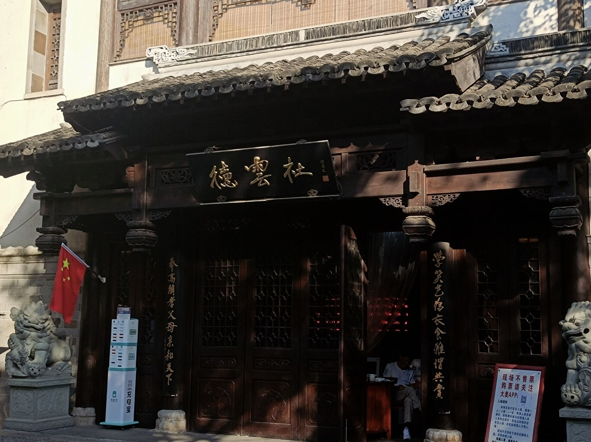
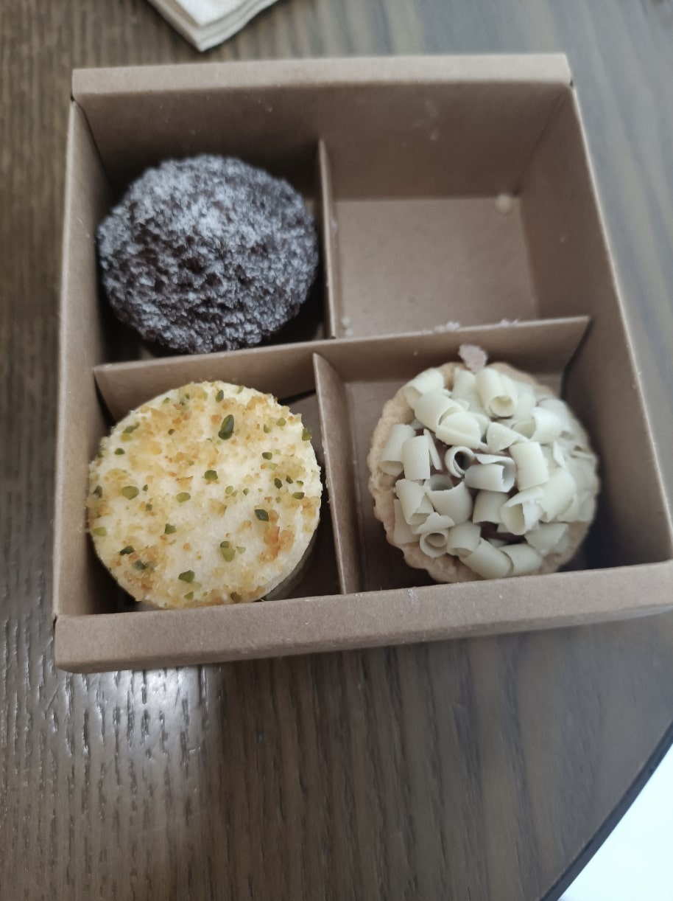
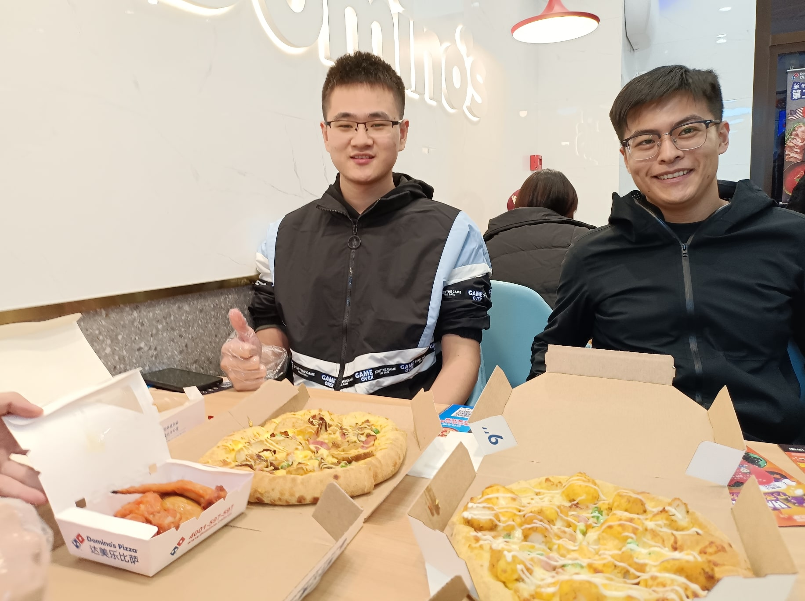
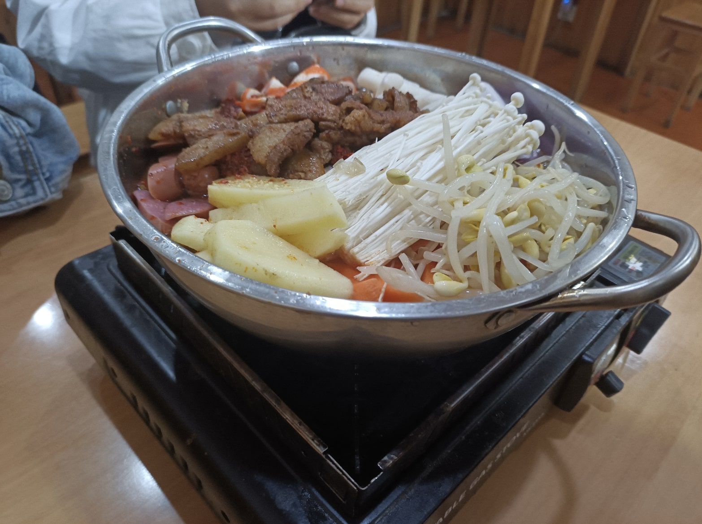
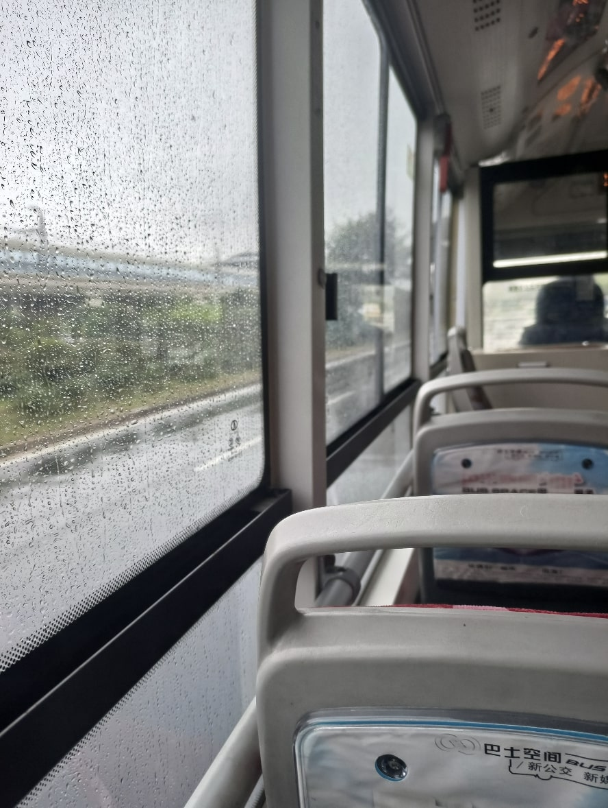
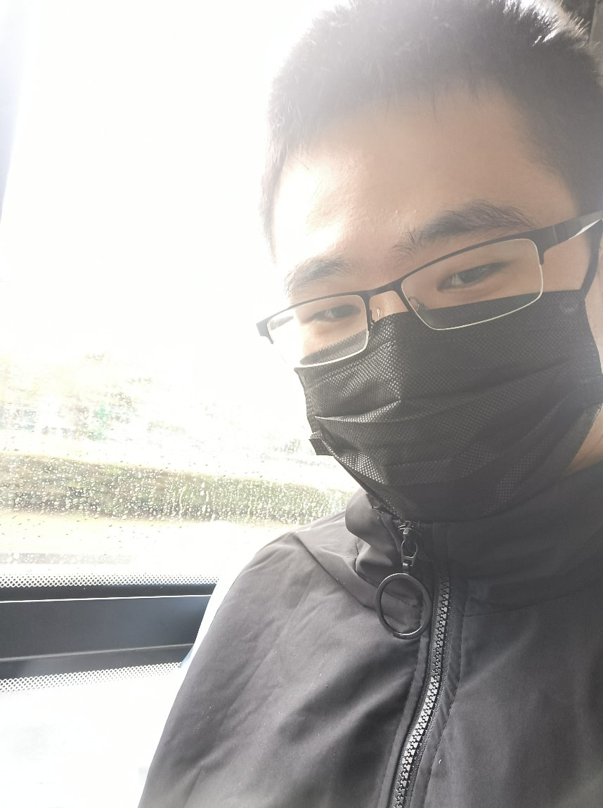
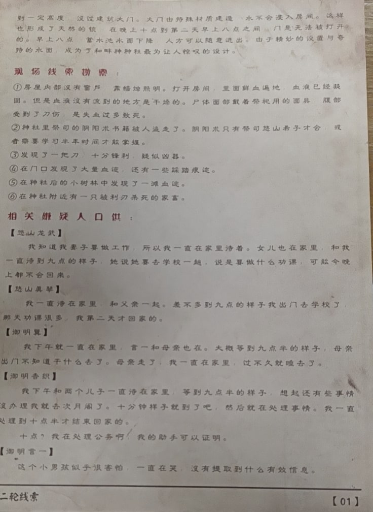
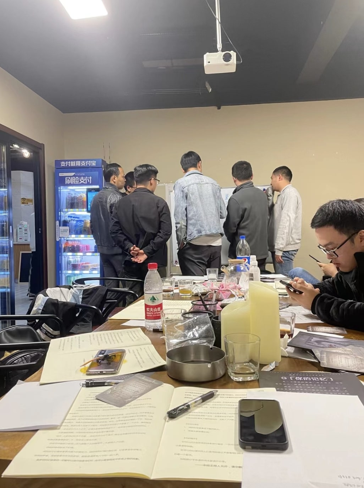
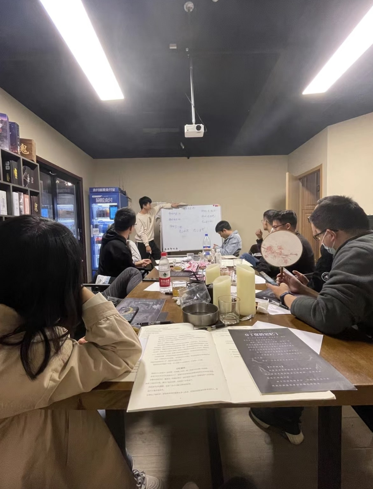

---
layout: post
title: 近期的约饭
date: 2021-10-21
categories: blog
tags: [约饭]
description:  今年十月四日一个人去老门东转了转，虽然之前去过了，但是实在是闲的无聊而且又不想学习，于是乎就出来玩。这个是团建里打剧本杀时的场景，那个剧本叫《死者在幻夜中醒来》，我觉得第一篇还挺有意思的，时间轮回，第二篇就有点扯，很多剧情特别奇怪。这是我第一次玩剧本杀，感觉挺有意思的，以后可以约其他朋友玩。
---  

## 老门东  
今年十月四日一个人去老门东转了转，虽然之前去过了，但是实在是闲的无聊而且又不想学习，于是乎就出来玩。
   
再一次路过德云社，可惜的是大麦APP上我从没有抢到过德云社的门票。好想进去看相声啊，哈哈。
  
老门东的古城墙，不知道怎么上去，就在下面转了转。
   

## 最近的约饭  
最近和博同学、新姐、王弘毅、陈思宇约了几顿饭哈哈，被安利了包括但不限于披萨、米粉、辛拉面和五食堂的炒饭。  

这张是和博同学在星巴克买的巧克力蛋糕，巨好吃！就是太贵了，一个要十几块钱呢，只不过之前是加一块钱活动赠的我才会买。  
  
这个是和新姐、宇哥去吃麦当劳，记得那天麦当劳做活动，虾球好像很便宜，结果到店里忘了点。
  

这个是之前吃达美乐披萨拍的，好好吃的披萨！
  

这个是在全州拌饭里点的火锅，四个人平均花了24块，吃的还挺好，几个人吃很划算。
  

## 打疫苗  
第二次打疫苗，记着那天正在赶某个会议，忙里偷闲得出来打疫苗了。  
  
  

## 团建打剧本杀  
这个是团建里打剧本杀时的场景，那个剧本叫《死者在幻夜中醒来》，我觉得第一篇还挺有意思的，时间轮回，第二篇就有点扯，很多剧情特别奇怪。这是我第一次玩剧本杀，感觉挺有意思的，以后可以约其他朋友玩。  
  
  
  
