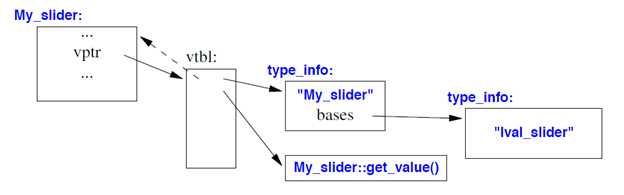

**1. \#include\<xxx\>的作用，#include\<xxx\>和#include \"\"的区别，#inlcude<xxx.h>的作用**。

**2. sizeof从什么时候开始计算值的，它是函数吗？**

**3. 什么是struct 对齐？**
```C++  
struct A{
    char a;
    double b;
    int c;
}
```  
请问`siezof(A) == ?`，`sizeof(struct A)`最小值应该是？

答：变量对齐要1+7+8+4 = 20字节，但是结构体中占用最大空间类型的是double, sizeof(double) == 8，所以还要结构体对齐，大小要是8的倍数，则对齐20 + 4 = 24字节，综上sizeof(struct A) == 24。

**4. extern "C"{}作用是什么？**
因为C++在编译的时候会对函数名字做改变，而extern "C" {...} 告诉编译器这段代码使用C风格编译成汇编。
一般用法，在头文件里的函数声明中：extern "C" {函数声明}。    

**5. 构造函数能够是虚函数，为什么？析构函数呢？**
答：虚函数的调用是通过虚函数表来查找的，而虚函数表由类的实例化对象的vptr指针(vptr可以参考C++的虚函数表指针vptr)指向，该指针存放在对象的内部空间中，需要调用构造函数完成初始化。如果构造函数是虚函数，那么调用构造函数就需要去找vptr，但此时vptr还没有初始化。
析构函数通常都是virtual的，因为子类可能申请了资源，如果父类指针没有调用子类析构函数那么可能存在资源无法释放的问题。

**6. 说说C++对象的存储空间**  
答：  
(1) 空对象: 1 字节
(2) 只有成员变量: 成员变量的空间。  
(3) 静态变量: 不占用对象存储空间，存放在数据段。
(4) 成员函数: 不占用空间。存放在.text段  
(5) 存在成员函数、虚函数但是没有成员变量: vptr的大小，64位机器是8字节。vptr是虚函数入口地址表指针，指向虚函数入口地址表。
(6) 当继承链上有多个虚函数，则要有多个vptr。在多继承层次结构中，创建的虚函数表指针（vptr）的确切数目是继承横向的分支数。(A -> B -> C)， sizeof(C) == 1 * sizeof(vptr)。
详情阅读：


**7. 说说C++的访问控制符的作用。**
(1) 修饰成员变量
(2) 访问控制符

**8. 下面代码编译运行结果是什么，为什么？**  
```C++
class A {
private: 
    int value;

public:
    A(int n){value = n;}
    A(A other) {value = other.value;}

    void print(){cout<<value<<endl;}    
}

int main(){
    A a = 10;       
    A b = a;
    b.print();
    return 0;
}
```
答：编译失败，因为拷贝构造函数A(A other) 传入的是A的一个实例，那么会形成无限递归调用，编译器能够提前检查出来，所以会编译失败。正确的形参是A(const A & other)。  


**9. 什么是单例模式？用C++实现一个单例模式**  
在程序运行时，保证一个类只有至多一个实例的模式。  

```C++
#include <mutex>

class Single {
private:
    mutex mu;
    Single(){/* ... */}

public:
    static Single * instance;

    Single *GetInstance(){
        if(instance == nullptr){
            mu.lock()
            if(instance == nullptr){
                instance = new Single();
            }
            mu.unlock()
        }
        return instance;
    }

}
Single::instance = nullptr;
```

C++ 11可以使用local static，局部静态。因为C++11后局部静态成了线程安全的，只有当构造函数结束时另一个进程才可访问。  

改成：  
```C++
class Singleton
{
private:
	Singleton() { };
	~Singleton() { };
	Singleton(const Singleton&);
	Singleton& operator=(const Singleton&);
public:
	static Singleton& getInstance() 
        {
		static Singleton instance;
		return instance;
	}
};
```
**10. 虚函数是如何实现的？**  
答：当一个类带有虚函数时，编译器会为该类构造一个虚函数表，它是一个指针数组，用于存放每个虚函数的入口地址。编译器在进行动态关联事，自底向上搜索在不同继承树上生成的虚函数表里名称类型相同的函数。

**11. 讲讲g++生成可执行文件的过程**
答：分为预处理、编译、汇编、链接。预处理就是将头文件拼接到.cpp文件里、将宏定义展开，生成.i文件。编译就是将C++语言生成进行词法分析、语法分析、语义分析和编译优化、中间语言生成、目标代码生成等过程，然后生成汇编语言.S文件。汇编过程就是将汇编文件生成可重定向目标文件.o文件，链接就是将.o文件和静态库文件合并成可执行文件，它包括地址和空间分配、符号决议和重定位。  

**12. 讲讲静态库和.o文件生成可执行文件的具体过程。**
参考《CSAPP》

**13. LL文法和LR文法，编译器的前端和后端是什么？**
答：LL文法是自顶向下的文法，LL(1)指的是向后看一个字符再规约。LR文法是自底向上规约的文法，LR(1)是指向后看一个字符再规约。编译器前端指的是生成与机器无关的中间代码，编译器后端指的是生成与机器相关的汇编代码。

**14. 静态链接库与动态链接库有什么区别？**
答：静态链接库是在链接阶段生成的，它会打包进可执行文件中。动态链接是在运行时加载到程序中，编译链接时只需要占位符标记即可。静态链接库一般用.a表示，动态链接库一般用.so表示。  
静态库升级需要重新编译整个程序，动态库不需要。

**15. 讲讲动态链接库加载过程**
答：当在shell中键入一个命令时，内核会创建一个新的进程，在往这个新的进程里加载可执行程序的代码段和数据段后，也会加载进动态连接器(/lib/ld-linux.so符号链接所指向的那个程序，它本身就是一个动态库)的代码段和数据。在这之后内核将控制传递给动态链接库的代码，动态链接库负责加载该命令应用程序所需使用的各种动态库，加载完毕后动态连接器才将控制传递给应用程序的main函数。

动态链接器可以检测到内存中是否已经加载，如果已经加载则将程序的虚拟地址空间映射到动态链接库的物理地址上，这样能够保证内存中只有唯一的一份动态链接库。
另外，动态链接库内还必须使用地址无关代码和加载时重定位。

> 当我们使用动态链接来构建程序时，这些符号重定位问题是怎么解决的呢？目前来说，Linux 下 ELF 主要支持两种方式：加载时符号重定位及地址无关代码。对于加载时重定位，其原理很简单，它与链接时重定位是一致的，只是把重定位的时机放到了动态库被加载到内存之后，由动态链接器来进行。

**16.讲讲C++类型转换**
const_cast: 用于将const指针或const引用转换成非const指针/引用，其指向的内容可以被改变。（但是原始的const 常量还是不变）。
static_cast: 编译时被转换，通常用于派生类向基类转换（向上转换），不会改变指针的值。也表示同种类型之间的转换，比如int转double，void * 转 int *。
dynamic_cast: 运行时类型转换，只能作用于指针或引用，通常用于**基类向派生类转换（向下转换）或者多继承之间转换基类**。对于多继承不同基类的转换，可能会改变指针的值。[链接](https://juejin.cn/post/6844903941637931021)。转换失败指针返回nullptr，引用返回bad_cast异常，较为安全。
reinterpret_cast: 不同类型之间的转换，任意类型的指针之间转换，对转换的结果不会做任何保证。比如int *转 int，int 转double *，A * 转B *（A、B无任何继承关系）。

static_cast转换时会执行截断、补齐，而reinterpret_cast只是将比特为拷贝过去，不会做任何补齐操作。

基类向派生类转换，必须使用dynamic_cast，只能作用于

**17. 讲讲多继承下的类型转换**

https://juejin.cn/post/6844903941637931021

**18. C++中的运行中动态类型识别RTTI，尤其是typeid和dynamic_cast**
通过RTTI，能够通过基类的指针或引用来检索其所指对象的实际类型。c++通过下面两个操作符提供RTTI。
（1）typeid：返回指针或引用所指对象的实际类型。
（2）dynamic_cast：将基类类型的指针或引用安全的转换为派生类型的指针或引用。

**对于带虚函数的类，在运行时执行RTTI操作符，返回动态类型信息；对于其他类型，在编译时执行RTTI，返回静态类型信息。**

type_info类的实现因编译器的不同而不同。但如下几个常用的操作符和函数是c++标准要求必须实现的：“t1 == t2”、“t1 != t2”、“t.name()”。typeid操作符的返回类型就是type_info。name()函数返回类型名字的c-style字符串，但字符串的格式可能不同的编译器略有不同。


dynamic_cast实现：


My_slider的type_info会被编译器产生出来。pb指向的对象的type_info会在运行时通过vptr取得。这两个type_info会被交给runtime library函数，比较之后告诉我们是否吻合。如果吻合，返回转换后的My_slider*；否则返回nullptr。

类的type_info保存在虚表的-1的位置上
https://www.cnblogs.com/younes/archive/2010/04/27/1722330.html


**19. 讲讲运行时多态的实现和虚函数表**
https://blog.csdn.net/qq_36359022/article/details/81870219

单继承下，只有一个虚函数表，派生类中同名的虚函数指针替换基类的同名虚函数指针。多继承下，派生类中每包含一个虚基类，都必须有一个虚函数表指针。  

1. 子类虚函数会覆盖每一个父类的每一个同名虚函数。
2. 父类中没有的虚函数而子类有，填入第一个虚函数表中，且用父类指针是不能调用。
3. 父类中有的虚函数而子类没有，则不覆盖。仅子类和该父类指针能调用。


**20. 讲讲iterator**

