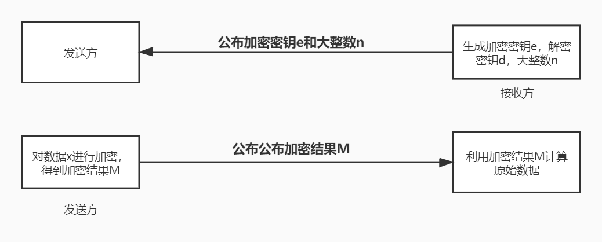

## 引言

事情是这样的，中午和小老板吃饭的路上时，王弘毅问我觉得离散数学助教简单不，然后我想当然地信誓旦旦地毫不犹豫地大声地（大概全世界都听到了）说离散数学是所有数学里最最简单的，然后小老板默不作声（因为他教离散数学）。后来意识到这一点，我们开始讨论了离散数学包括但不限于图灵机及图灵机可证明性问题，我深刻的意识到了离散数学并不是那么简单的（实际上大学里学的离散数学还是很简单！），然后就聊到了RSA不对称加密，这让我想起了大二时候我写过一篇关于RSA不对称加密的博客，那是我的第一篇博客。然后翻箱倒柜从QQ空间找到了（是的，当时还截图发QQ空间，我可真无聊），现在把它搬迁过来。

以下是博客原文：

最近接触到了一些基础密码学原理知识，再加上周末要考离散数学，所以把树上的RSA不对称加密的原理重新复习了一遍，写一篇博文来梳理一下。

RSA不对称加密系统是1976年麻省理工学院的三位研究院（R、S、A）所发明的。它广泛用于传输体积量小的数据，当使用这种密码系统时，知道怎样发送加密消息的人并不能解密消息，在这样的系统中，每个人都可以有一个众所周知的加密密钥。只有解密密钥是保密的，而只有消息的预期接收人能解密消息。下面简单介绍下RSA的工作原理。

**RSA密钥系统用到的数论知识：**
* 互素概念
* 欧拉函数 $ \phi $
* 欧拉定理
* 模指数运算
* 模逆概念
* 扩展的欧几里得算法

假设现在有消息接收方和消息发送方（以下简称接收方和发送方），情景如下：

接收方：产生三个核心元件：两把钥匙d、e，以及一个大数n。其中钥匙e被称作是加密密钥，钥匙d被称作是解密密钥，大数n通过某种特定的方法生成。接收方将加密密钥e和大数n公布出来，但是不公布解密密钥d。

发送方：得到来自于接收方的加密密钥e和解密密钥n，然后对某个数c进行如下加密（假设c=2017):

$$ M = 2017^{e}(mod \; n) $$

其中 mod n 表示取模，也就是求余数。注意，在数论中已经有快速求解模指数运算的方法。然后发送方光明正大地将M传送给接收方，此时即使有人知道了这个M也没办法反向推算出原数据2017，这是因为 $ M = x^{e}(mod\, n) $ 这个式子中知道x,e,n 求解 M 是一个非常快速的事情，而知道 M,e,n 去求解x是一个非常困难的事情。

接收方：获得来自发送方加密后的消息M，然后计算 $ C=M^{d}(mod\; n) $
，其中d是之前未公布的解密密钥。

## 举个例子：
接收方提供 $ e=13,d=937,n=2537 $  
发送方：加密2017， $ M=2017^{13} mod 2537 $
，则M=290  
接收方：解密290， $ C = 290^{937} mod\; 2537$ ，则C=2017  

可以看到上面的例子中接收方完美地计算得到了接收方发送的2017.

## 原理解释

从上面的讲解可以知道，不对称加密的主要核心操作都是在接收方完成的，那么接受方如何产生e, d, n的？

首先寻找两个非常大的素数p和q（上面的例子我选择的是43和59，一般情况下应该选择200位以上的大数，这样才确保安全）。令n = p * q，这个n就是我们需要公开的大数n。计算欧拉函数 $ \phi (n) = (p-1) * (q-1) $，随便选择一个加密密钥e，要求e是素数并且 $ gcd(\phi (n), e)=1 $ ，其中gcd是最大公因数，也就是
 $ \phi $ 必须要和加密密钥e互质。如果上式成立，则一定存在一个x满足 $ e * x = 1(mod \; \phi (n)) $，即e * x对 $ \phi $ 的余数是1.我们称x为e在模
 $ \phi $下的逆，其实就类似2和0.5一样，他们互为倒数乘积为1.

那么算出来的x我们令为d，则d就是我们的解密密钥。

注意，求解一个数的模逆就是求解线性同余方程组，利用扩展的欧几里得算法(exgcd)可以求出其逆d。至此便将这些数的来源讲解完毕。

## 过程推导

已知e,d,n，发送方的消息为a，那么设 $ a^{e} mod \; n = M $.  
接收方解密时： 

$$ M^{d} mod \; n = (a^{e} mod n)^{d} mod \; n = (a^{e*d} mod \; n)  (1)$$  

又因为  

$$ e*d = 1 + k * \phi (n) $$

所以  

$$ (1) = a^{1 + k*\phi} mod n = a * (a^{\phi})^{k} mod n $$

根据欧拉定理，如果gcd(a,m)=1，那么 $ a^{\phi} = 1 (mod \; n) $
那么  

$$ (1) = a mod \; n = a $$  

上面的欧拉定理可以说时加密系统的核心了，有了这个定理的保证，对a进行加密（乘方取模）然后对加密信息进行解密（同样乘方取模），能够顺利的还原成原来的信息。

