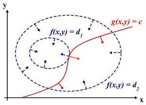
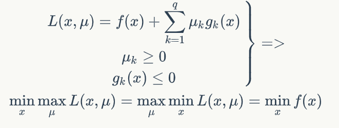
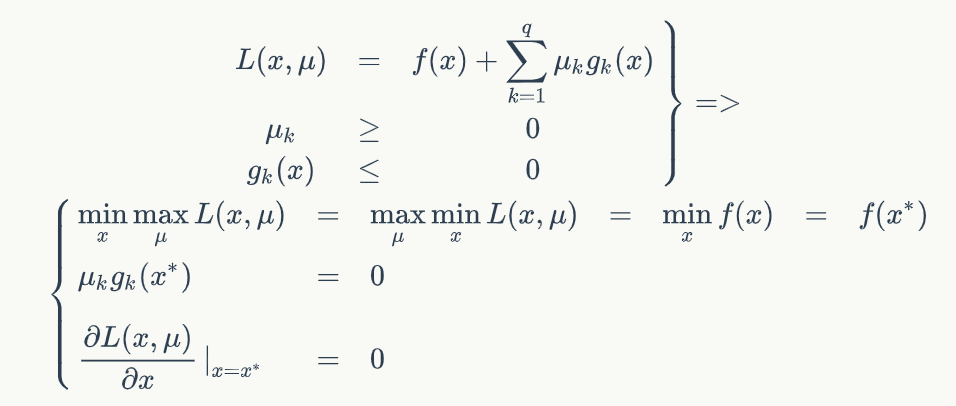
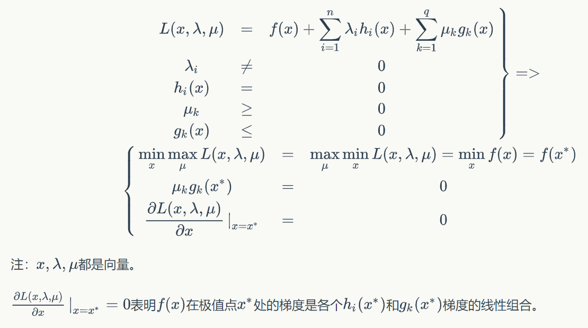

原文章[地址](https://www.zybuluo.com/evilking/note/946537)

拉格朗日乘子法是为了求解最优化问题而设计的一种方法，本篇会详细讲解下拉格朗日乘子法的解法过程，以及由来；进一步讲解拉格朗日乘子法的泛化形式，即KKT条件；

笔者在学校时也只是知道拉格朗日乘子法怎么用，但在学习 SVM 时才首次需要深入理解 拉格朗日乘子法和KKT条件的原理，这里将学到的知识做个总结与分享，希望能从头到尾讲明白.

# 最优化问题的几种情况

最优化问题大致有三类：无约束最优化问题，有等式约束的最优化问题，有不等式约束的最优化问题。

## *无约束的最优化问题*

数学描述为:  

$$ \min_{x} f(x) $$  

表示函数 $ f(x) $ 为 $ x $ 求最小值，并且对变量 $ x $ 没有任何约束条件.

这类问题最简单，常用的方法是 ***Fermat定理***，即  

$$ \frac{df(x)}{dx} = 0 $$  

$ f(x) $ 对 $ x $ 求导，并令导数等于零，可以求得候选最优值，再在这些候选值中验证；如果 $ f(x) $ 是凸函数，可以保证是最优解.

> 若 $ x $ 为向量，即 $ x=(x_{1}, x_{2}, ..., x_{n}) $ ，则 $ f(x) $ 需要对每个分量 $ x_{i} $ 求偏导，即可求解.如:  

$$ \frac{\partial f(x)}{\partial x_{i}} = 0, i=1,2,...,n $$  

> 且以下篇幅中的记法 $ x,y $ 等等变量都可以是向量（为了方便），若为向量，则求导则换成是对每个分量求偏导.

## *有等式约束的最优化问题*

数学形式：  

$$ min \; f(x)  \\ \; \; \; \; \; \; \; \; \; \; \; \; \; \; \; \; s.t.\; \;h_{i}(x) = 0, i=1,2,...,n  $$  

表示在 $ h_{i}(x) = 0, i=1,2,...,n $ 的条件下求 $ f(x) $ 的最小值。

这类最优化问题可以用拉格朗日乘子法求解，即通过一个拉格朗日系数  把等式约束和目标函数组合成一个式子，表达式如下:  

$$  L(x, \lambda ) = f(x) + \sum_{i=1}^{n} \lambda _{i}h_{i}(x) \\  \min _{x}L(x, \lambda )$$  

其中 $ \lambda _{i} \neq 0,i=1,2,...,n $ ，称为称为拉格朗日乘子。

变换后对 $ L(x,\lambda ) $ 函数求极值就转换为了无约束最优化问题，可以利用上面的 Fermat 定理求解.

## *有不等式约束的最优化问题*  

数学描述为：  

$$ \min_{x} \; f(x) \\ s.t. g_{i}(x) \le 0, i=1,2,...,n \\ h_{j}(x)=0, j=1,2,...,m $$  

对于这类问题，常用的方法就是 **KKT条件(Karush-Kuhn-Tucher)**，同样的，我们把所有的等式、不等式约束与 $ f(x) $ 写成一个式子，这个式子也叫拉格朗日函数，系数也称为拉格朗日乘子，通过一些条件，可以求出最优值的必要条件，这个条件就称为 KKT条件.  

具体来说就是求解原问题的对偶问题为:  

$$ L(x,a,b)=f(x)+\sum _{i=1}^{n}a_{i}*g_{i}(x) + \sum_{j=1}^{m}b_{j} * h_{j}(x) \\ \min_{x} \; L(x.a.b) $$  

其中 $ a_{i} \geq 0, b_{j} \neq 0 $

KKT条件是说最优值必须满足以下条件：  

$$ \frac {\partial L(x,a,b)}{\partial x} = 0 \\ g_{i}(x) \leq 0 \\ h_{i}(x) = 0 \\ a_{i} * g_{i}(x) = 0 $$  

求取这三个等式之后就能得到候选最优值。

分析这几个条件，发现第一个条件就是 Fetmat定理 ，第二、三个条件就是原问题的不等式和等式约束，保证最优点必须是一个可行解，第四个条件比较有意思，因为 $ g_{i}(x) \leq 0 $ 有方向，所以对系数 $ a_{i} $ 也要有方向约束，使得 $ a_{i}*g_{i}(x) = 0 $ ，保证 $ \min_{x} L(x,a,b) = \min_{x}f(x) $ ，而等式约束是没有方向的，所以对系数 $ b_{i} $ 没有约束；后面我们会详细推导出 KKT条件的由来.

## 拉格朗日乘子法的原理

这里就有个疑问，为什么将约束条件乘以系数后与原函数合并成一个式子后就能求得最优值了？

我们设想目标函数 $ z=f(x) $ ， $ x $ 是向量， $ z $ 取不同的值，相当于可以投影在 $ x $ 构成的平面（曲面）上，即成为**等高线**。如下图所示:  
   
图中目标函数是 $ f(x,y) $ ，这里 $ x $ 是标量，虚线是等高线，现在假设我们的约束为 $ g(x,y)=c $ ， $ x $ 是向量，在 $ x $ 构成的平面或者曲面上是一条曲线；

假设 $ g(x,y) $ 与等高线 $ f(x,y)=d_{2} $ 相交，交点就是同时满足等式约束和目标函数的可行域的值，但此时肯定不是最优值，因为相交意味着肯定还存在其它的等高线在该等高线的内侧或外侧，使得新的等高线与目标函数的交点的值更大或更小，只有等高线与目标函数相切时，才可能取得最优值。

相切意味着等高线和目标函数的曲线在切点的法向量必须共线，所以最优值必须满足: $ \nabla f = \lambda \nabla g $ ，其中， $ \lambda $  是常数且不为零。这个等式就是 $ L(x, \lambda ) $ 对 $ x $ 求导的结果.

## KKT条件的原理

在实际问题中，我们往往面临的是不等式约束，比如不超过多少时间，不超过多少人力，不超过多少成本等等，所以科学家们拓展了拉格朗日乘数法，增加了KKT条件之后便可以用拉格朗日乘数法来求解不等式约束的优化问题了。

下面就直接来推导KKT条件产生的过程，以一个简单的只有不等式约束的最优化问题来说明:

原问题为:  

$$ \min_{x} \; f(x) \\ s.t. \; g_{k}(x) \leq 0, k=1,2,...,n $$    

我们定义 $ L(x,u) $ 为：  

$$ L(x,u) = f(x) + \sum _{k=1}^{n} u_{k}g_{k}(x) $$  

其中， $ u_{k} \geq 0, g_{k} \leq 0 $  

$$  \because u_{k} \geq 0, g_{k}(x) \leq 0 \\ \therefore u_{g} (x) = \sum_{k=1}^{n} u_{k}g_{k}(x) \leq 0 \\ \therefore \max_{u}L(x,u) = \max_{u}(f(x)+u_{g}(x)) \\  = \max _{u} f(x) + \max _{u} u_{g}(x) \\  = f(x) + 0 \\  = f(x) \\ \therefore \min _{x} f(x) = \min_{x} \max_{u} L(x,u) $$  

下面我们一起再来探讨另一边，即 $ \max_{u} \min _{x} L(x,u): $  

$$ \max_{u} \min_{x}L(x,u) = \max_{u}[\min_{x}f(x) + \min_{x} u_{g}(x) ] \\ = \max _{u} \min_{x} f(x) + \max_{u} \min _{x} u_{g}(x)\\ = \min _{x} f(x) + \max _{u} \min _{x}u_{g}(x) $$  

下面单独考虑 $ \max_{u}\min_{x} u_{g}(x): $   

$$ \because u_{k} \geq 0, g_{k} \leq 0 \\ \therefore \min_{x} u_{g}(x) = 0 (\; if \; u=0 or \; g(x)=0) or - \infty (if \; u > 0 \; and \; g(x) < 0 ) \\ \therefore \max_{u} \min _{x} u_{g}(x)=0, \; \; \; s.t.\; u=0 \;or \; g(x)=0 \\ \therefore \max_{u} \min_{x} L(x,u) = \min _{x}f(x) + \max_{u}\min_{x}u_{g}(x) \\ = \min _{x} f(x) \\ s.t.\; \; u=0 \; or \; g(x)=0 $$

亦即：  
  
我们把 $ \max_{u} \min_{x}L(x, u) $ 称为对偶问题，把 $ \min_{x} \max_{u} L(x, u) $ 称为原问题。
上式表明当满足一定条件时原问题、对偶问题的解，以及 $ \min_{x}f(x) $ 时相同的，且在最优解 $ x^{\star } $ 处 $ u=0 \; or \; g(x^{\star })=0 $ 。  
把 $ x^{\star } $ 带入上式得 $ \max_{u}L(x^{\star }, u)=f(x^{\star }) $ 和 $ \max_{u} \min_{x} L(x, u) = \min_{x}f(x^{\star }) = f(x^{ \star }) $ 所以 $ L(x^{\star }, u) = \min_{x}L(x, u) $ ，这说明 $ x^{\star } $也是 $ L(x, u) $ 的极值点，即 $ \frac{\partial L(x, u)}{\partial x} \|_{x=x^{\star }} $  

最后总结一下：  
  
KKT条件是拉格朗日乘子的泛化，如果我们把等式约束和不等式约束一并归纳进来则表现为：  
  

 

