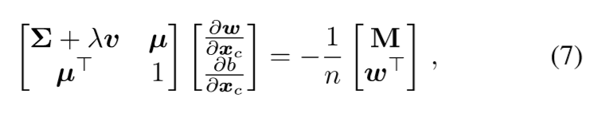
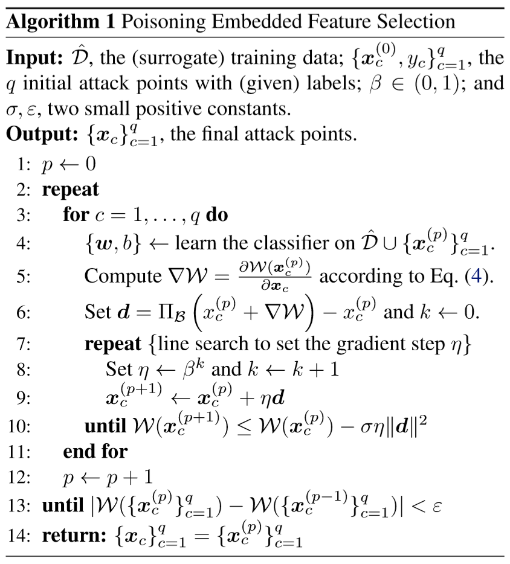

## 简介
本文主要提出了一种基于数据毒害攻击的方法和框架，该方法主要针对基于数据驱动的特征选择模型。并给出了毒害LASSO回归和ridge回归的示例，在实验方面进行毒害pdf。 

## 受到攻击的特征选择模型

### 符号说明

1. 假设数据集依赖分布 $ p: X \rightarrow Y $ ，数据集由上述分布产生，标记为 $ D =  [ x_{i}, y_{i} ] ^{n}_{i=1} $ 样例数为n  

2. 每一个样例 $ x_{i} $ 的维度是 $ d $ ，表示为 $ [x_{1}, x_{2}, ..., x_{d}]^{T} \in X $ ，并且目标变量 $ y_{i} \in Y $  

3. 设 $ \pi \in [ 0,1 ] ^{d} $ , 也即 $ \pi $ 是一个01向量，其中 $ \pi _{i} $ 为1表示第i维的特征被选择作为模型的输入，否则模型的输入不包括该维特征。那么特征选择算法可以表示为一个函数 $ h(D) $ ，并且选择特征为 $ \pi $ 的子集来最小化评价函数 $ L(D, \pi) $ (比如这个评价函数可以是分类误差)  

### 攻击者的目标

攻击者的目标可以定义为**完整性攻击**，**获得性攻击**和**隐私性攻击**。

**完整性攻击**在引不引起系统的改变条件下执行恶意活动，比如在不影响正常分类判断的情况下逃避分类检测。在特征选择模型下，可以将这种攻击视作轻微改变了feature选择的子集，比如一个攻击者想要通过反垃圾过滤器方法来避免某些词语被选择，然后将这些词语频繁地使用到他的来及邮件里。  

**可获得性攻击**将系统的功能做了改变，使系统的正常服务受到攻击。比如可以将分类或者聚类算法的分类误差最大化，这类攻击会使系统强制选择一个泛化误差最大的特征子集。  

**隐私性攻击**使攻击者能够得到系统的用户的信息。在这种情况下，需要要求攻击者能够对特征进行反向工程，也就是通过分类结果推测选择的特征、推测训练数据和系统用户的信息。

另一种分类：
**Targetd**：攻击者只需要影响一些特定的特征子集。  
**indiscriminate**：攻击者无差别地攻击所有特征。

> 注：这里的特征选择集合我的理解就是权重，因为文中后面地LASSO和ridge两个模型就是线性回归再加上不同地正则项，因为正则项的引入，导致许多权重趋近于0，所以这可以看成某些特征没有被选中。

### 攻击者所具有的信息

1. 攻击者知道所有的训练集 D 。或者可以将同一分布下的一些样例 $ \tilde{D} = [ \tilde{x_{i}}, \tilde{y_{i}}  ] ^{m}_{i=1} $ 作为替代。  

2. 知道特征的表示 $ X $ 。在执行特征选择的过程中，攻击者知道部分或者全部的特征如果计算获得的。  

3. 攻击者知道特征选择算法和评价指标 $ L(D) $  

**Perfect Knowledge**：攻击者知道1-3所有的信息。  
**Limited Knowledge**：攻击者只知道部分数据集和2,3

### 攻击者能够完成的任务

**数据毒害攻击**，攻击者能够控制一小部分的训练集，他可以向其中注入一小段精心准备的攻击样例。

**数据逃避攻击**，攻击者能够在测试阶段操作一些有害的数据来躲避检测。具体地毒害数据并不会改变系统地功能。

## 攻击策略  

假设攻击者具有上一节中1-3的信息，也就是说他具有数据集 $ D $ ，特征空间 $ F $ ，特征选择算法 $ h $ 和评价指标 $ L $ 。
注：数据集 $ D $ 可以通过采样来替代。

## 特征选择算法的毒害攻击

首先介绍LASSO, ridge和弹性网回归，他们的特征选择都是通过线性回归函数 $ f(\boldsymbol{x}) = \boldsymbol{w}^{T}\boldsymbol{x} + b  $ 表示，然后再最小化损失函数 $ l(y, f(\boldsymbol{x})) $ 和正则项 $ \Omega(\boldsymbol{x}) $ 。特征选择标准可以表示为：  

$$ \min_{\boldsymbol{w},b} L = \frac{1}{n}l(y_{i}, f(\boldsymbol{x_{i}})) + \lambda \Omega (\boldsymbol{w}) \;\;\;\;\;\;\;\; (2) $$  

这里 $ \lambda $ 是折中参数，平方损失函数 $ l(y,f(\boldsymbol{x}))=\frac{1}{2}(f(\boldsymbol{x})- y)^{2} $ 。对于正则化项，最好的想法是对 $ \boldsymbol{w} $ 使用0-norm正则去选择给定的特征，但这是一个NP难问题。
> L0正则：非零参数的个数
L1正则： $ \left\| w \right\| $  
L2正则： $ \frac{1}{2} \left\| w \right\| ^{2} $  

LASSO采用的是L1正则，Ridge采用的是L2正则，弹性网采用的是 $ \Omega (\boldsymbol{w}) = \rho \left\| \boldsymbol{w} \right \| + (1- \rho) \frac{1}{2} \left \| \boldsymbol{w} \right \|^{2}_{2} $ ，这里 $ \rho \in (0,1) $ 

这里，攻击者的目标是最大可能地通过强制选择一些错误地特征增加分类误差（改变 $ \boldsymbol{w} $ 可以看成选择特征地一个过程）。攻击者通过采样或者训练集 $ \hat{D} = D $ 。攻击者能够通过注入最大数量的毒害点到训练集中。为了估算分类误差，攻击者能够评估相同的评估函数 $ L $ .   
为了评估分类误差，在评估学习器的结果时攻击样例点不包括在攻击者的经验损失的计算中，但是学习器在学习的过程中会将攻击的样例点学习进去。假设一个单一的攻击点 $ \boldsymbol{x}_{c} $ 被加入到训练集中，学习的策略可以被公式化为：  

$$ \max_{\boldsymbol{x}_{c}} W = \frac{1}{m}\sum_{j=1}^{m}l(\hat{y_{j}}, f(\hat{\boldsymbol{x}}_{j})) + \lambda \Omega(\boldsymbol{w}) \;\;\;\;\;\;\;\;  (3)$$  

这里 $ f $ 是通过最小化 $ L(\hat{D} \cup {\boldsymbol{x_{c}}}) $（Eq. 2）中学习到的，那么 $ \boldsymbol{w} $ 和 $ b $ 取决于 $ \boldsymbol{x_{c}} $ 。那么攻击者的目标 $ W $ 因此可以迭代地改变 $ \boldsymbol{x_{c}} $ 进行优化，方法是(次)梯度上升算法。  
>次导数(subderivative)，次梯度(subgradient)。对于连续凸函数： $ f: I \rightarrow R $ ，在实数轴上不一定可导，如 $ f(x) = \| x \| $ 。但对于定义域内任何 $ x_{0} $ ，总可以作出一条直线，它通过 $ (x_{0}, f(x_{0})) $ ，要么接触f的图像要么在它的下方，这条直线的斜率称为次导数。

在每一步迭代中， $ \boldsymbol{w}, b $ 通过最小化 $ L( \hat{D} \cup \{ \boldsymbol{x}_{c}  \}) $ 被更新。

**梯度计算**。通过计算公式(3)关于 $ \boldsymbol{x}_{c} $ 的偏导数，并将 $ l(y,f(\boldsymbol{x})) $ 和 $ f $ 的表达式进行替换，可以得到：  

$$ \frac{\partial W}{\partial \boldsymbol{x}_{c}} = \frac{1}{m}\sum_{j=1}^{m} (f(\hat{\boldsymbol{x}}_{j} )- \hat{y}_{j})(\hat{\boldsymbol{x}}^{T}_{j}\frac{\partial \boldsymbol{w}}{\partial \boldsymbol{x_{c}}} + \frac{\partial b}{ \boldsymbol{x}_{c}}) + \lambda \boldsymbol{r} \frac{\partial \boldsymbol{w}}{\boldsymbol{x}_{c}} $$  

这里为了方便，令 $ \boldsymbol{r} = \frac{\partial \boldsymbol{\Omega }}{\partial \boldsymbol{x}_{c}} $ 。注意：对于LASSO，$ \boldsymbol{r} = subgradient(w) $ 对于ridge回归，$ \boldsymbol{r} = \boldsymbol{w} $ 对于弹性网回归， $ \boldsymbol{r} = \rho * subgradient(\boldsymbol{w}) + (1- \rho )\boldsymbol{w} $
  

对于L1正则的 $ subgradient(\boldsymbol{w}) $ ，可以表示为一个向量，如果这个向量的第k分 $ w^{k} > 0 (w ^{k} < 0) $ 则 其次梯度等于 $ -1 (or\;\;-1) $ 或者是-1到1的任意值（ $ w^{k} = 0 $ ）。

为了求解 $ \frac{\partial \boldsymbol{w} }{\partial \boldsymbol{x_{c} } } $ 和 $ \frac{ \partial b}{\partial \boldsymbol{x_{c}}} $ ，我们假定在每一步改变 $ \boldsymbol{x_{c}} $ 时，都会满足KKT条件，也就是说我们每次改变 $ \boldsymbol{x_{c}} $ 时都必须保持最优解。  

> 对于不等式的优化问题的KKT条件有三个：1. Fermat定理，最优解处梯度为0。 2. 最优解处的点满足约束条件。 3. 在最优点处，对于每个不等式约束必须满足 u * gi(x) = 0。

上面所说的满足KKT条件也就是满足Fermat定理，因为这是一个无约束最优化问题。

对于公式(2)的优化，最优解的KKT条件是：  

$$ \frac{\partial L ^{T}}{\boldsymbol{w}} = \frac{1}{n}\sum_{i=1}^{n}(f(\hat{\boldsymbol{x}}_{i}) -\hat{y}_{i})\hat{\boldsymbol{x}}_{i} + \lambda \boldsymbol{r}^{T} = \boldsymbol{0} \;\;\;\;\;\;\; (5) \\ \frac{\partial L}{\partial b} = \frac{1}{n} \sum_{i=1}^{n}(f(\hat{\boldsymbol{x}}_{i})-\hat{y}_{i}) = 0 \;\;\;\;\;\;\; \;\;\;\;\;\;\;\;\;\;\;\;\;\;\;\;\;  (6) $$  

这里将第一个公式转换为列向量，然后后面的导数也保持一样的。 如果 $ L $ 是凸的但是不可微的，那么可以考虑使用次梯度。在这个例子中，次梯度是由公式(5)唯一确定的， $ \boldsymbol{r} = -\frac{1}{\lambda } \frac{1}{n}\sum_{i=1}^{n} (f(\hat{\boldsymbol{x_{i}}})-\hat{y_{i}})\hat{\boldsymbol{x_{i}}}^{T} $  

通过**公式(5)和(6)两边对** $ \boldsymbol{x}_{c} $ **求导**，然后重新整理矩阵的形式，可以得到：  

这里 $ \boldsymbol{\Sigma} = \frac{1}{n} \Sigma_{i}\hat{\boldsymbol{x_{i}}} \hat{\boldsymbol{x_{j}^{T}}} , \boldsymbol{u} = \frac{1}{n}\Sigma_{i} \hat{\boldsymbol{x_{i}}} , M = \boldsymbol{x_{c}} \boldsymbol{w^{T}} + (f(\boldsymbol{x_{c}}) - y_{c}) * \boldsymbol{I} $ 。 对于LASSO，  $ \boldsymbol{v} $ 是0， 对于ridge是 $ \boldsymbol{I} $，对于弹性网回归是 $ (1- \rho) \boldsymbol{I} $ ，其中 $ \boldsymbol{I} $ 是单位矩阵。

通过求解线性方程式(7)可以得到 $ \frac{\partial \boldsymbol{w}}{\partial \boldsymbol{x_{c}}} , \frac{\partial b}{\partial \boldsymbol{x_{c}}}$ 

## 算法：

注意，算法中的 $ \Pi_{B} $ 是一种投影映射，为了防止 $ \boldsymbol{x_{c}} $ 超过给出的定义域，这是一种投影梯度下降的方法。

> 投影梯度下降(projected gradient descent)：就是将变量投影过来，使之满足定义域，一般选择max(上限, x)，或者引入其他的变量来更改目标。

对于离散的特征，则使用启发式算法求解。对于当前的样例点，先产生一系列邻居候选点，选择梯度最大的那个点的方向作为更新。

**实验结果请参考原文**
