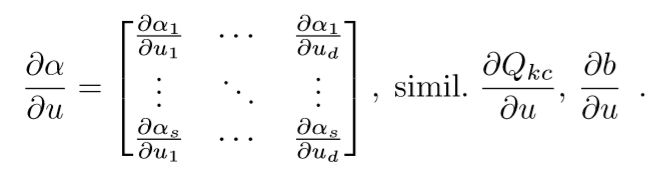
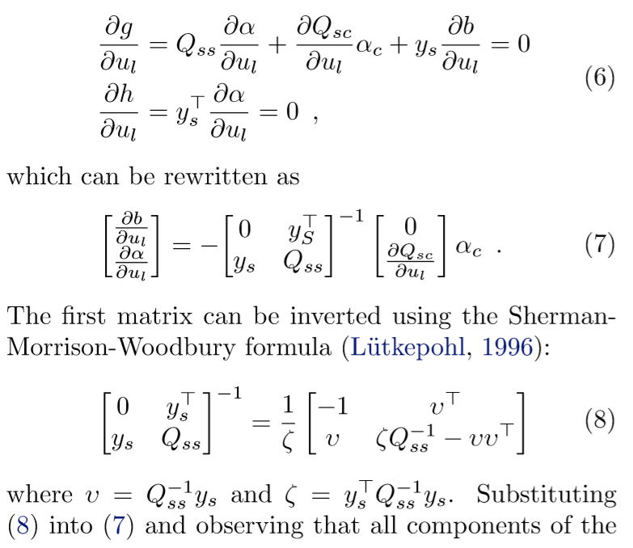
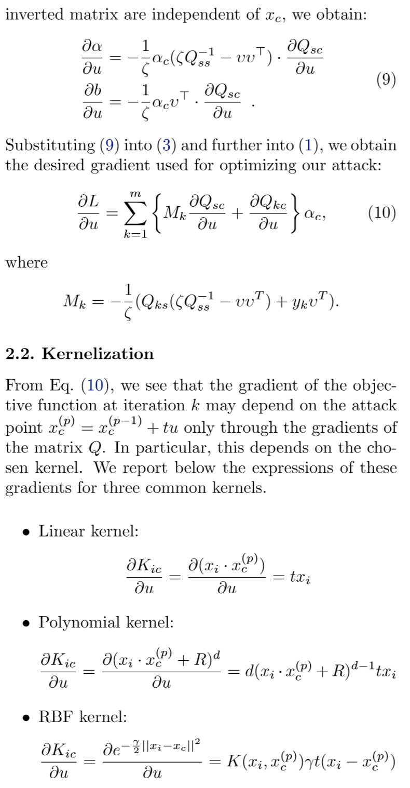
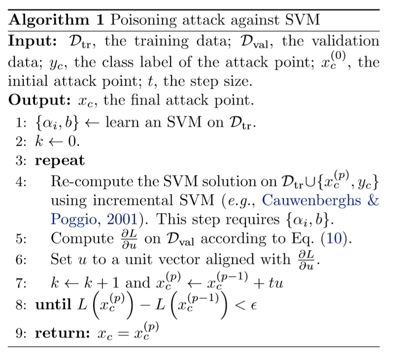

## 数据毒害攻击的基本思路

1. 找到一个点 $ \boldsymbol{x_{c}} $ 加入到训练集中，使验证集的Loss最大。  
  
2.  $ \frac{\partial L}{\partial \boldsymbol{x_{c}} } = 0 \;\;\;\;\;\;\; \Longrightarrow \boldsymbol{x^{t-1}} = \boldsymbol{x^{t}} + s * \boldsymbol{u} $，其中 $ \boldsymbol{u} $ 是关于 $ \boldsymbol{x_{c}} $ 的梯度，此步骤是梯度上升法。  
  
3. 第2步中含有 $ \frac{\partial 模型参数}{\partial \boldsymbol{x_{c}}} $ ，很难直接求解出来，所以必须假设模型在学习到 $ D_{origin} \cup [(\boldsymbol{x_{c}}, y_{i})] $ 后，KKT条件不改变。

> 对于不等式的优化问题的KKT条件有三个：1. Fermat定理，最优解处梯度为0。 2. 最优解处的点满足约束条件。 3. 在最优点处，对于每个不等式约束必须满足 u * gi(x) = 0。在SVM中使用到了Fermat定理和不等式约束满足条件这两个。

4.  根据KKT条件不变，可以获得若干个等式，然后对每个等式关于 $ \boldsymbol{x_{c}} $ 求导，得到 $ \frac{\partial 模型参数}{\partial \boldsymbol{x_{c}}} $ 的表达式，这样就可求解出来。  

## SVM的基本知识  
 $ \boldsymbol{x_{i}} \in \boldsymbol{R^{n}} $ ， $ y_{i} \in [-1,1] $  学习目标：在空间中学习一个超平面 $ \boldsymbol{w^T} * \boldsymbol{x} + b = 0 $ 

 函数间隔： $ \hat{\gamma_{i}} = y_{i}(w^{T} * x_{i} +  b) $ ，几何间隔： $ \gamma_{i} = \frac{w^{T}}{\| w \|} * x + \frac{b}{\| w \|} $ 

 最开始的定义：  

 $$ \max_{w,b} \;\;\;\;\frac{\hat{\gamma}}{\| w \|} \\ s.t. \;\;\;\; y_{i}(w*x_{i} + b) \ge \hat{\gamma} ,i=1,2,...,N $$ 

 后来直接将 $ \hat{\gamma} =1$，因为等比例增加或减少 $ w $ 和 $ b $ 就可以改变 $ \hat{\gamma} $ ，所以直接令它为1了。所以得到如下优化：  

 $$ \min_{w,b} \;\;\;\; \frac{1}{2} \|w \|^{2} \\ s.t. \;\;\;\; y_{i}(w*x_{i} + b) -1\ge 0 ,i=1,2,...,N $$  

 再后来为了处理一些点不可分，修改约束为： $ y_{i}(w*x_{i} + b) \ge 1 - \xi_{i} $ ，不等式左边代表到超平面的距离，那么因为距离不够，所以增加一个松弛变量让它距离够。则新的优化问题转化为：  

 $$ \min_{w,b} \; \; \frac{1}{2} \|w \|^{2} + C\sum_{i=1}^{N}\xi_{i} \;\;\;\;  \\ s.t. \;\;\;\; y_{i}(w*x_{i} + b) + \xi_{i} -1\ge 0 ,i=1,2,...,N \\ \xi_{i} \ge 0 $$  

 上述问题是凸函数的最优化问题，可以使用KKT条件转化为 $ \alpha $ 表示的参数。

 原始问题的对偶问题是：  

 $$ \min_{\alpha} \frac{1}{2} \sum_{i=1}^{N} \sum_{j=1}^{N} \alpha_{i} \alpha_{j} y_{i} y_{j} (x_{i} * x_{j}) - \sum_{i=1}^{N} \alpha_{i}  \\ \sum_{i=1}^{N}\alpha_{i}y_{i} = 0 \;\;\;\;\; \\ 0 \le \alpha_{i} \le C , i=1,2,..., N $$

上面的式子推导过程就是写成Lagrange函数，然后分别对每一分量求导为0即可得到。

### 重要的结论
所有支持向量要么在分类间隔边界上，要么在间隔边界与分类超平面之间，要么在分离超平面误分类一侧。
若 $ \alpha_{i}^{\star} < C , \xi_{i} = 0 $ 则支持向量恰好落在间隔边界上。  

若 $ \alpha_{i}^{\star} = C , 0 < \xi_{i} < 1 $ 则支持向量落在间隔边界和分离超平面之间。  
若 $ \alpha_{i}^{\star} = C , \xi_{i} = 1 $ 则支持向量落在分类超平面上。  
若 $ \alpha_{i}^{\star} = C , \xi_{i} > 1 $ 则支持向量落在误分类一侧。  

若 $ \alpha_{i}^{\star} = 0 $ 则该点是保留点，不是支持向量，其中lagrange函数中的不等式约束的参数 $ u=0 $ 。  

注： $ C = \alpha_{i} + u_{i} $ 求导时得到的关系。

## 算法推导

假设毒害点 $ (\boldsymbol{x_{c}}, y_{c}) $ ， $ D_{tr} $ 表示训练集，攻击者也可以采样获得。 $ D_{val} $ 表示验证集。 SVM需要学习的数据是 $ D_{tr} \cup (\boldsymbol{x_{c}}, y_{i}) $ 。

#### 损失函数  
最大化验证集中的合页损失函数：  

$$ \max_{x_{c}} \; L(x_{c}) =  \sum_{k=1}^{m} [1-y_{k}f_{xc}(x_{k})]+ = \sum_{k=1} (-g_{k})_{+} \;\;\; (1) $$  

将 $ g_{k} $  展开：  

$$  g_{k} = \sum_{j} Q_{kj}\alpha_{j} + y_{k}b -1  \\ g_{k} = \sum_{j \neq c} Q_{kj}\alpha_{j}(x_{c}) + Q_{kc}(x_{c})\alpha_{c}(x_{c}) + y_{k}b(x_{c}) - 1 \;\;\; (2) $$  

为了使用梯度提升算法，需要计算 $ \frac{\partial L}{\partial x_{c}} $ 根据公式(1)，也就是需要求 $ \frac{\partial g_{k}}{\partial x_{c}} $ 。则：  

$$ \frac{\partial g_{k}}{\partial x_{c}} = Q_{ks}\frac{\partial \alpha}{\partial x_{c}} + \frac{Q_{kc}}{\partial x_{c}} \alpha_{c} + y_{k}\frac{\partial b}{\partial x_{c}} $$  

这里：  

> 我也不清楚上面的公式中为啥省略了 $ \frac{\partial \alpha_{c}}{\partial x_{c}} $ 

根据KKT条件，对于**在分类间隔线上的支持向量**，有：  

$$ g_{i} = \sum_{j \in D_{tr}} Q_{ij}\alpha_{j} + y_{i}b - 1 = 0   \;\;\; (4)$$  

因为 $ C = \alpha_{i} + u_{i} $ ，而在分类间隔线上的点 $ 0 < \alpha_{i} < C  $ (这是因为KKT第三条件中 $ \alpha_{i} * 约束 = 0 $ ，而支持向量约束为0， $ \alpha_{i} $ 不为0)。所以分类边界的 $ u_{i} $ 不为0，那么根据KKT第三条件， $ u * \xi = 0 $ ，则 $ \xi=0 $ ，那么 $ yi(w * x_{i} + b)-1 = 0 $  

根据KKT第一条件：

$$ \sum_{j \in D_{tr}}y_{j}\alpha_{j} = 0 $$  

分别对上面两个式子(4)(5)关于 $ x_{c} $ 求导，得到：  

进一步整理。得到：

最后，算法为：  

