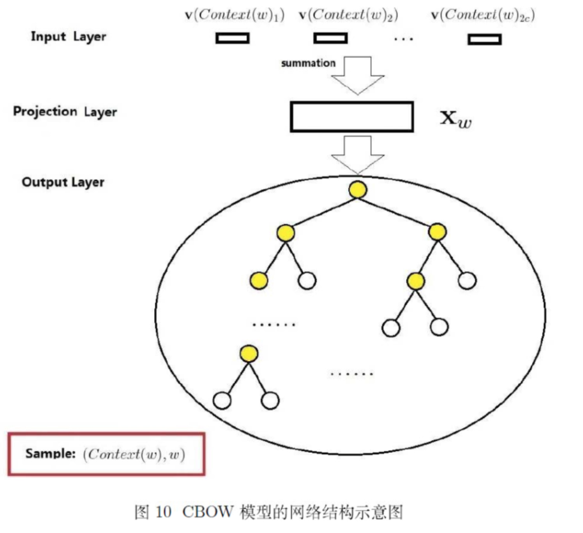

## 一、词袋模型

词袋模型能够把一个句子转化为向量表示，是比较简单直白的一种方法，它不考虑句子中单词的顺序，只考虑词表（vocabulary）中单词在这个句子中的出现次数。下面直接来看一个例子吧（例子直接用wiki上的例子）：

>"John likes to watch movies, Mary likes movies too"  
"John also likes to watch football games"  

对于这两个句子，我们要用词袋模型把它转化为向量表示，这两个句子形成的词表（不去停用词）为：

> [‘also’, ‘football’, ‘games’, ‘john’, ‘likes’, ‘mary’, ‘movies’, ‘to’, ‘too’, ‘watch’]

因此，它们的向量表示为：  

also,football,games,john,likes,mary,movies,to,too,watch  
s1 = [0,0,0,1,2,1,2,1,1,1]  
s2 = [1,1,1,1,1,0,0,1,0,1]

scikit-learn中的CountVectorizer()函数实现了BOW模型，下面来看看用法：  

```python
from sklearn.feature_extraction.text import CountVectorizer
corpus = [
    "John likes to watch movies, Mary likes movies too",
    "John also likes to watch football games",
]
vectorizer = CountVectorizer()
X = vectorizer.fit_transform(corpus)
print(vectorizer.get_feature_names())
print(X.toarray())

#输出结果：
#['also', 'football', 'games', 'john', 'likes', 'mary', 'movies', 'to', 'too', 'watch']
#[[0 0 0 1 2 1 2 1 1 1]
# [1 1 1 1 1 0 0 1 0 1]]

```

## 二、TF-IDF (Term Frequency / Inverse Document Frequency，词频-逆文档频率)  

词频公式：  

$$ TF(w) = \frac{单词w在文章中出现的次数}{文章的单词总数} $$  

逆文档频率公式：  

$$ IDF(w) = log(\frac{语料库中文档的总数}{包含词w的文档数+1}) $$  

注：上式中分母+1是为了防止分母为0.  

TF-IDF公式:  

$$ TF-IDF(w) = TF(w) * IDF(w) $$  


## 三、Skip-gram模型 与 CBOW 模型

两种模型的结构如下图：  
  

**输入层**是上下文的词语词向量  
**投影层**对其求和（向量加法）  
**输出层**输出最可能的 $ w $ ，由于语料库中词汇量是固定 \| C \| 个，所以上述过程可以看成一个多分类问题。给定特征，从 \| C \| 个分类中挑一个。  

$ 令 w_{1}, w_{2}, w_{3}..., w_{n} $ 为待训练的单词，Skip-gram模型的目标是最大化平均log概率：  

$$ \frac{1}{T} \sum_{t=1}^{T} \sum_{-c \le j \le c,j \neq 0} log \; p(w_{t+j} \| w_{t}) $$  

这里 $ c $ 是训练样例的上下文长度。在实际训练时，并没有按照平均最大化 $ log $ 概率计算整个目标函数的梯度，而是对于每个句子的每个单词及其上下文形成 $ (w_{I}, w_{O}) $ 这样的元组进行最优化训练。基础的skip-gram公式使用softmax函数定义了 $ p(w_{t+j} \| w_{t}) $ ：  

$$ p(w_{O} \| w_{I}) = \frac{exp(v^{'\;T}_{wO}\; v_{wI})}{\sum_{w=1}^{W}exp(v^{' \; T}_{wI}\; v_{wI})} $$  

这里 $ v_{w}, v^{'}_{w} $ 是单词的输入词向量和输出词向量，输入词向量是[0,0,0,1,0,0] * W 中的向量，输出词向量是softmax里的参数，位于输出层。 $ W $ 是词汇表中词语的数目。

这个公式实践中很难使用，因为 $ \nabla log \; p(w_{O} \| w_{I}) $ 的计算复杂度与 $ W $ 成比例。softmax回归需要对语料库每个词语（每个类）都计算一遍输出概率并进行归一化，在几十万词汇量的语料上无疑头疼的，此时可以用层次softmax（hierarchical softmax）。

### Hierarchical Softmax

   

与基本的skip-gram模型不同，层次softmax输出层是一个树状softmax（一般是哈夫曼树），该树的每个叶子节点代表一个word，每个内节点是一个逻辑回归，每一个叶子节点都可以表示成由路径上的内节点的概率之积。同样，每个叶子节点都被唯一得编码成二进制数，每一位对应一个内节点的孩子结点，（一般地，内节点向左下移动则该节点被编码为0，右下移动则被编码为1）。

模型形式化定义为：令 $ n(w,j) $ 表示单词w从根节点到叶子节点的第j个节点，令 $ L(w) $ 表示路径的长度，所以 $ n(w,1) = root \; , \; n(w, L(w)) = w $ 。另外，对于任意内节点n，令 $ ch(n) $ 表示n的任意孩子节点，令 $ [x] $ 表示1，如果x节点被编码为1，否则表示-1，如果x节点被编码为0. 那么层次softmax定义 $ p(w \| w_{I}) $ 如下：  

$$ p(w \| w_{I}) = \prod_{j=1}^{L(w)-1} \sigma([n(w,j+1)=ch(n(w,j))] * v_{n(w,j)}^{'\,T}v_{wI}) $$  

这里 $ \sigma (x) = \frac{1}{1+exp(-x)} $  可以被证明 $ \sum_{w=1}^{W}p(w \| w_{I}) = 1 $ 这说明计算 $ log \; p(w_{O} \| w_{I}) $ 和 $ \nabla log \; p(w_{O} \| w_{I}) $ 与 $ L(w_{O}) $ 成正比。在基本的skip-gram中， $ v_{w} $ 和 $ v_{w}^{'} $ 表示每一个单词 $ w $ ，而层次softmax模型中， $ v_{w} $ 代表每一个单词 $ w $ 的表示，而 $ v_{n}^{'} $表示每一个内节点n的向量表示。  

### 负采样  

使用负采样可以替代层次softmax模型，在模型中加入不是单词 $ w $ 的上下文相关的词作为负样例，一起优化。定义负采样模型的优化目标：  

$$ log \; \sigma (v_{wO}^{' \; T} v_{wI}) + \sum_{i=1}^{k}E_{w_{i} - P_{n}(w)}[log \; \sigma(-v_{wi}^{'\; T}v_{wI})] $$  

> 我的理解就是不使用softmax了，直接使用两个矩阵代表输入向量矩阵和输出向量矩阵，每一列是一个词向量，优化这两个矩阵使得目标函数最大。 这是一种对原始目标函数的近似，但是这种情况下不满足： $ \sum_{j \in O} p(w_{j} \| w_{I}) = 1 $ 也就是说，它不再是一个概率分布了。

直接将上式代替skip-gram的目标中的每一个 $ log \; P(w_{O} \| w_{I}) $ 对于大语料库一般采用 $ k \in [2,5] $ 对于小语料库一般采用 $ k \in [5, 20] $ 需要注意的是，负采样方法还是需要两个嵌入矩阵，一个是输入矩阵一个是输出矩阵，输入矩阵用 $ v_{wi} $ 表示，输出矩阵用 $ v^{'}_{wi} $ 表示。  

### 子采样

对于出现例如 "the", "a", "in" 等频繁的词时，在语料库中计算每个 $ w_{i} $ 时以一定概率随机丢弃删除这些词，这个概率公式为：  

$$ P(w_{i}) = 1 - \sqrt{\frac{t}{f(w_{i})}} $$  

这里 $ f(w_{i}) $ 表示单词 $ w_{i} $ 的频率，t是选择的一个阈值，典型的值为 $ 10^{-5} $ 


## 四、ELMo  


## 五、GloVe

