# 引言
**该博客转载于https://zhuanlan.zhihu.com/p/24709748**

首先琢磨下定义，标量f对矩阵X的导数，定义为： $ \frac{\partial f}{\partial X} = \left[  \frac{\partial f}{\partial X_{i,j}} \right ] $ ，即f对X逐元素求导排成与X尺寸相同的矩阵。然而，这个定义在计算中并不好用，实用上的原因是对函数较复杂的情形难以逐元素求导；哲理上的原因是逐元素求导破坏了**整体性**。试想，为何要将f看做矩阵X而不是各元素 $ X_{i,j} $ 的函数呢？答案是用矩阵运算更整洁。所以在求导时不宜拆开矩阵，而是要找一个从整体出发的算法。

为此，我们来回顾，一元微积分中的导数（标量对标量的导数）与微分有联系： $ df = f^{'}(x)dx $ ；多元微积分中的梯度（标量对向量的导数）也与微分有联系：  

$$ df = \sum_{i=1}^{n} \frac{\partial f}{\partial x_{i}}dx_{i} = (\frac{\partial f}{\partial \boldsymbol{x}})^{T}d\boldsymbol{x} $$  

这里第一个等号是全微分公式，第二个等号表达了梯度与微分的联系：全微分 $ df $ 是梯度向量 $ \frac{\partial f}{\partial \boldsymbol{x}} $ (n x 1)与微分向量 $ d \boldsymbol{x} $ (n x 1)的内积；受此启发，我们将矩阵导数与微分建立联系： 

$$ df = \sum_{i=1}^{m} \sum_{j=1}^{n}\frac{\partial f}{\partial X_{i,j}}dX_{i,j} = tr(\frac{\partial f}{\partial X} ^{T} dX) $$  

其中tr代表迹(trace)是方阵对角线元素之和，满足性质：对尺寸相同的矩阵A，B， $ tr(A^{T}B = \sum_{i,j}A_{i,j}B_{i,j}) $ 即 $ tr(A^{T}B) $ 是矩阵A，B的内积。与梯度相似，第一个等号是全微分，第二个等号表达了矩阵导数与微分的联系：全微分df是导数 $ \frac{\partial f}{\partial X} $ (m x n) 与微分矩阵 $ dX $ (m x n)的内积。

> 全微分之所以是导数和微分的内积，是因为 g(x)dy， 或者 z(y)dz 为 0，所以只有 f(x)dx才不为0.

# 建立运算法则

然后来建立运算法则。回想遇到较复杂的一元函数如 $ f=log(2+ \sin x)e^{\sqrt{x}} $ ，我们是如何求导的呢？通常不是从定义开始求极限，而是先建立了初等函数求导和四则运算、复合等法则，再来运用这些法则。故而，我们来创立常用的矩阵微分的运算法则：

1. 加减法： $ d(X \pm Y) = dX \pm dY $ ； 矩阵乘法： $ d(XY) = (dX)Y + X(dY) $ ； 转置： $ d(X^{T}) = (dX)^T $ ； 迹： $ dtr(X) = tr(dX) $ 

2. 逆： $ dX^{-1} = -X^{-1}dXX^{-1} $ 。此式可在 $ XX^{-1}=I $ 两侧求微分来证明。  

3. 行列式： $ d\|X\| = tr(X^{\star}dX) $ ，其中 $ X^{\star} $ 表示 $ X $ 的伴随矩阵，在X可逆时又可写作： $ d\|X\| = \|X\|tr(X^{-1}dX) $ 。此式可用Laplace展开来证明，详见张贤达《矩阵分析与应用》第279页。  

4. 逐元素乘法： $ d(X \odot Y) = dX \odot Y + X \odot dY $ ， $ \odot $ 表示尺寸相同的矩阵X，Y逐元素相乘。

5. 逐元素函数： $ d\sigma(X) = \sigma^{'}(X) \odot dX $ ， $ \sigma(X) = [\sigma (X_{i,j})] $ 是逐元素标量函数运算， $ \sigma^{'}=[\sigma^{'}(X_{i,j})] $ 是逐元素求导。  

# 利用迹技巧求导  

我们试图利用矩阵导数与微分的联系：  

$$ df = tr((\frac{\partial f}{\partial X})^{T}dX) $$  

，在求出微分 $ df $ 后，表达式 $ \frac{\partial f}{\partial X} $ 就是所求的 $ X $ 的导数。那么该如何写成右侧的形式并得到导数呢？这里需要使用迹技巧：  

1. 标量套上迹： $ a=tr(a) $  

2. 转置： $ tr(A^{T}) = tr(A) $  

3. 线性： $ tr(A \pm B) = tr(A) \pm tr(B) $  。  

4. 矩阵乘法交换： $ tr(AB) = tr(BA) $  ，其中 $ A $ 与  $ B^{t} $ 尺寸相同。两侧都等于 $ \sum_{i,j}A_{i,j}B_{j,i} $  。 $ tr(A \odot B) = tr(B \odot A) $ ，其中A和B的形状一样。

5. 矩阵乘法/逐元素乘法交换： $ tr(A^{T}(B \odot C)) = tr((A \odot B)^{T}C) $

观察一下可以断言，**若标量函数f是矩阵X经加减乘法、逆、行列式、逐元素函数等运算构成，则使用相应的运算法则对f求微分，再使用迹技巧给df套上迹并将其它项交换至dX左侧，对照导数与微分的联系** $ df=tr((\frac{\partial f}{\partial X})^{T}dX) $ **，即能得到导数。**

**特别地，若矩阵退化为向量，对照导数与微分的联系** $ df = \frac{\partial f}{\partial \boldsymbol{x}}^{T}d\boldsymbol{x} $ ，即能得到导数。

在建立法则的最后，来谈一谈复合：假设已求得 $ \frac{\partial f}{\partial Y} $ ，而Y是X的函数，如何求 $ \frac{\partial f}{\partial X} $ 呢？在微积分中有标量的求导的链式法则 $ \frac{\partial f}{\partial x} = \frac{\partial f}{\partial y} \frac{\partial y}{\partial x} $ 但这里我们**不能随意沿用标量的链式法则**，因为矩阵对矩阵的导数 $ \frac{\partial Y}{\partial X} $ 是未定义的。于是我们继续追本溯源，链式法则是从何而来？源头仍然是微分。我们直接从微分入手建立复合法则：先写出 $ df = tr((\frac{\partial f}{\partial Y})^{T}dY) $ ，再将 $ dY $ 用 $ dX $ 表示出来代入，并使用迹技巧将其他项交换至dX左侧，即可得到 $ \frac{\partial f}{\partial X} $

# 求导例子

1. $ Y=AXB $   
$ df = tr(\frac{\partial f}{\partial Y}^{T} dY) = tr(\frac{\partial f}{\partial Y}^{T}AdXB) = tr(B\frac{\partial f}{\partial Y}^{T}AdX) = tr((A^{T}\frac{\partial f}{\partial Y}B^{T})^{T}dX) $ ，可得到 $ \frac{\partial f}{dX} = A^{T}\frac{\partial f}{\partial Y}B^{T} $ 。注意这里： $ dY = (dA)XB + AdXB+AXdB = AdXB $ ，由于A，B是常量， $ dA=0,dB=0 $，以及使用了矩阵乘法交换的迹技巧交换了 $ \frac{\partial f}{\partial Y}^{T}AdX $ 与 $ B $ .  

2.  $ f=\boldsymbol{a}^{T}X\boldsymbol{b} $ ，求 $ \frac{\partial f}{\partial X} $ 。其中 $ \boldsymbol{a} $ 是 m x 1 列向量， X是 m x n 矩阵， $ \boldsymbol{b} $ 是 n x 1 列向量， f是标量。

解： 先使用矩阵乘法法则求微分， $ df = d \boldsymbol{a}^{T}X\boldsymbol{b} + \boldsymbol{a}^{T}dX\boldsymbol{b} + \boldsymbol{a}^{T}Xd\boldsymbol{b} = \boldsymbol{a}^{T}dX\boldsymbol{b} $ 。由于 $ df $ 是标量，它的迹等于自身， $ df=tr(df) $ ，套上迹并做矩阵乘法交换： $ df=tr(\boldsymbol{a}^{T}dX\boldsymbol{b}) = tr(\boldsymbol{b}\boldsymbol{a}^{T}dX) = tr((\boldsymbol{ab^{T}})^{T}dX) $ ，注意这里根据 $ tr(AB)=tr(BA) $ 交换了 $ \boldsymbol{a}^{T}dX $ 与 $ \boldsymbol{b} $ ，对照导数与微分的联系： $ dfg=tr(\frac{\partial f}{\partial X}^{T}dX) $ ，得到 $ \frac{\partial f}{\partial X} = \boldsymbol{ab^{T}} $ 。

> 注意这里不能用 $ \frac{\partial f}{\partial X} = \boldsymbol{a^{T}}\frac{\partial X}{\partial X} \boldsymbol{b} = ? $ ，导数与矩阵乘法的交换是不合法则的运算（而微分是合法的）。有些资料在计算矩阵导数时，会略过求微分这一步，这是逻辑上解释不通的。

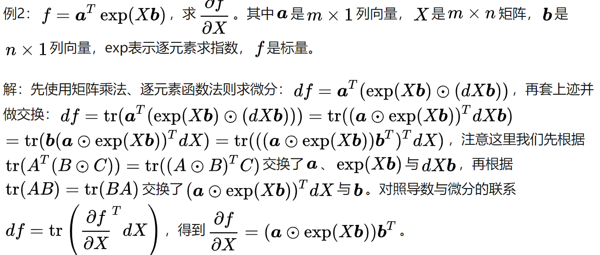

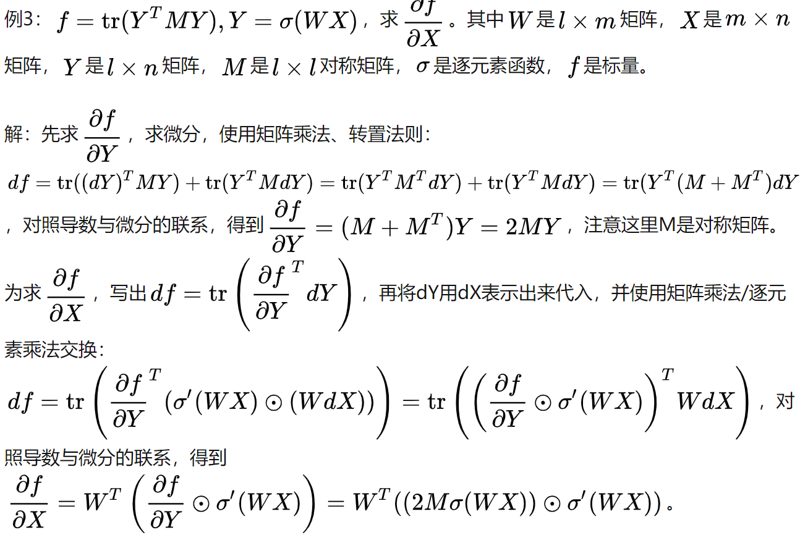

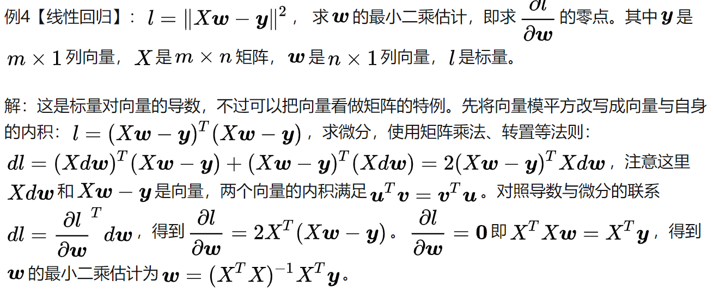

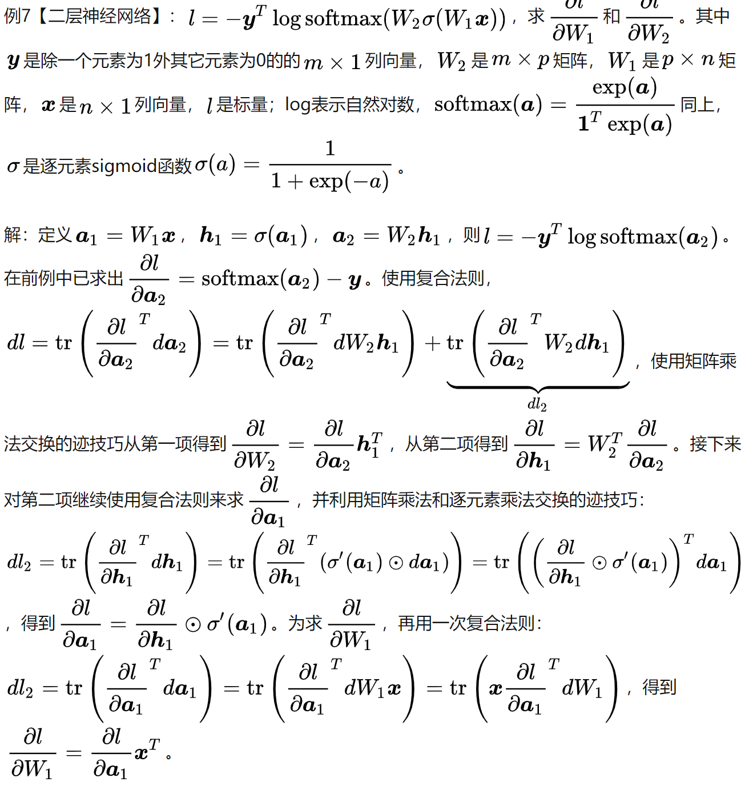

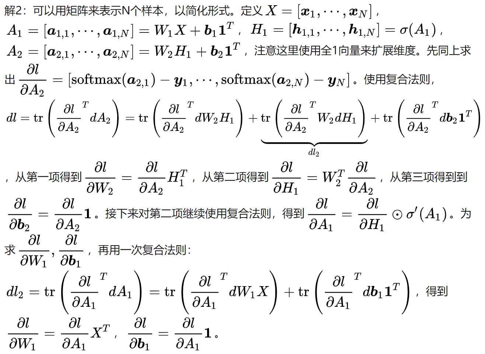

# 矩阵求导术二，矩阵对矩阵求导
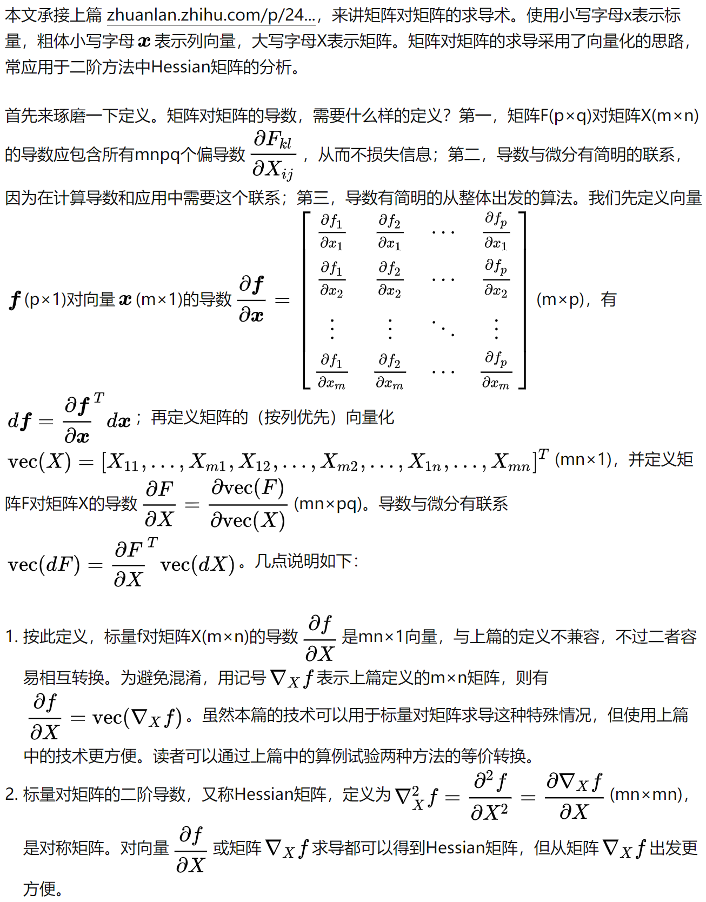
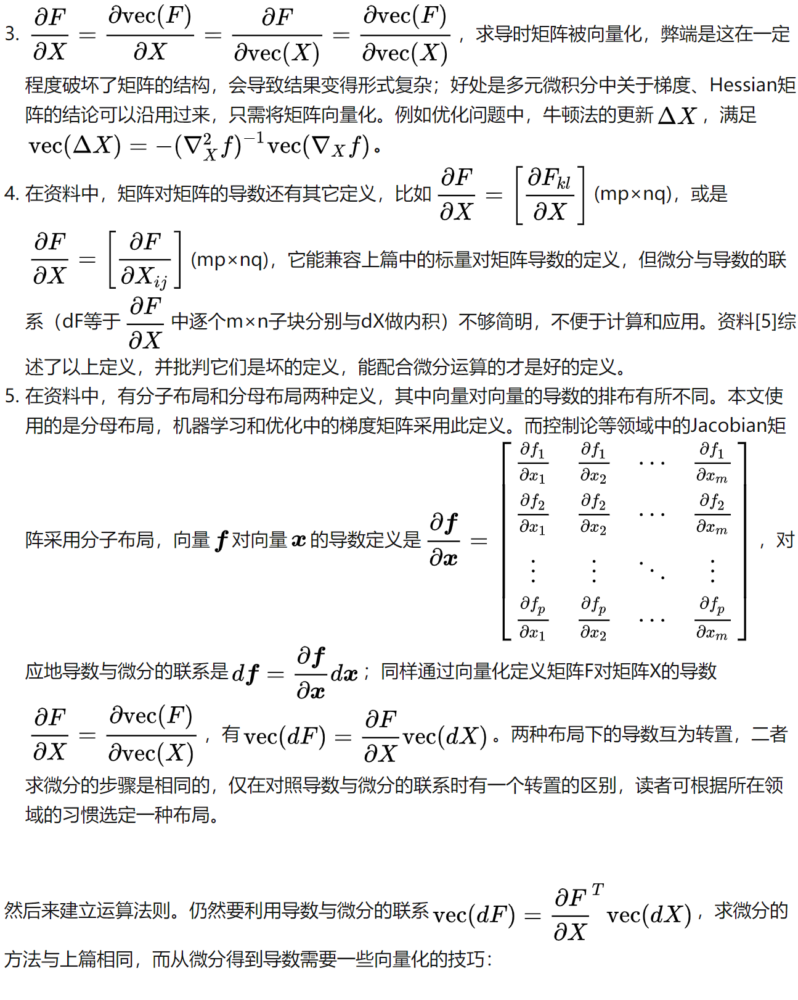
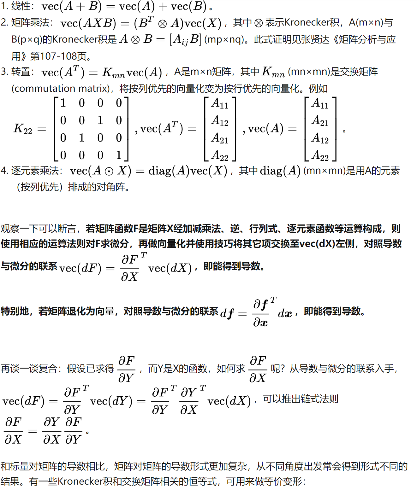
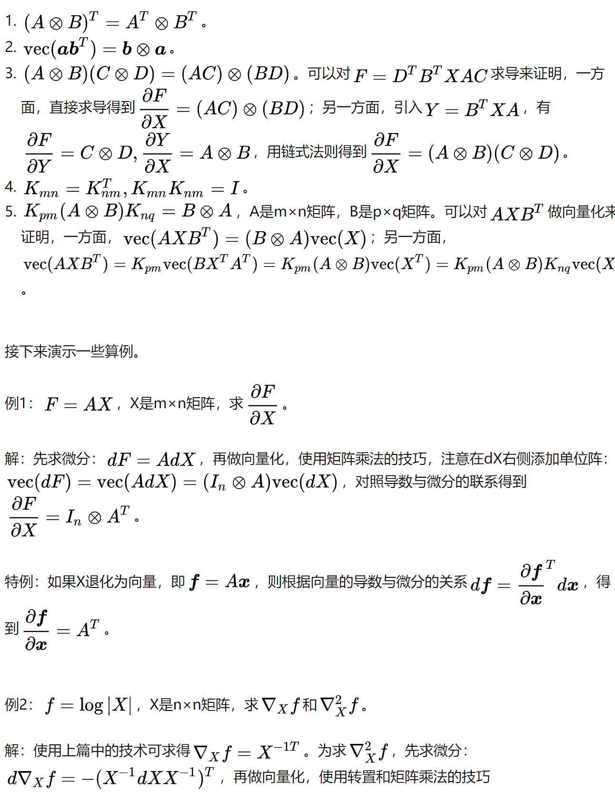
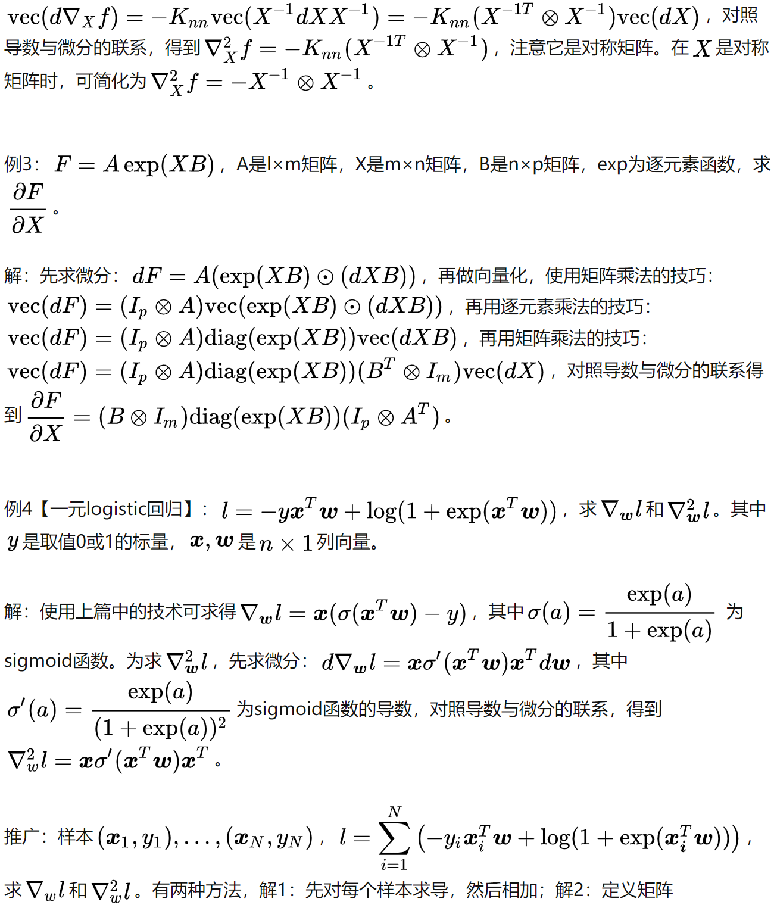
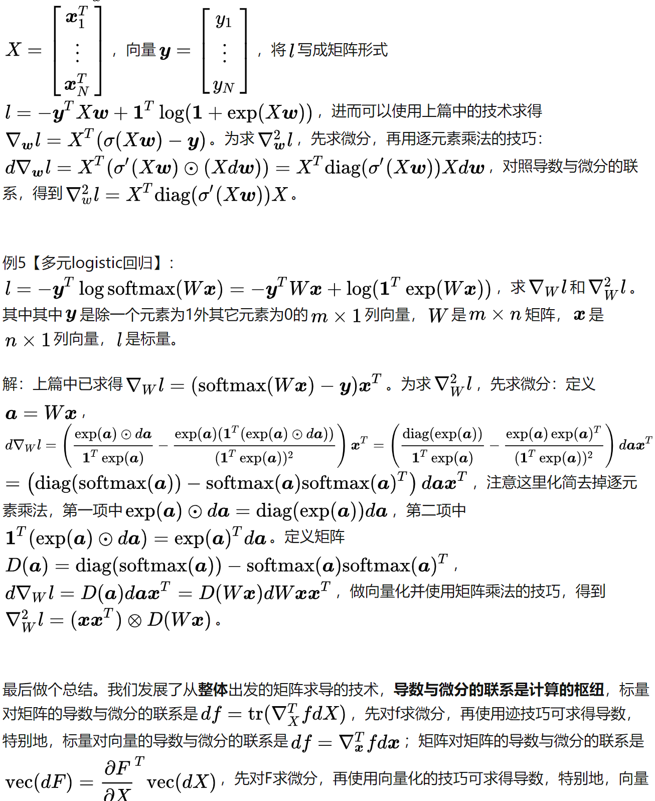
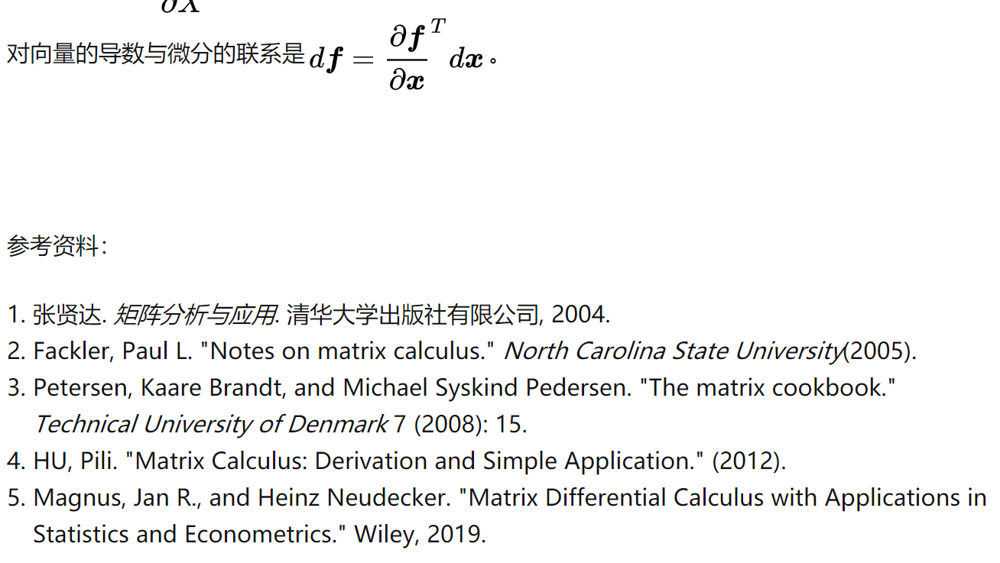

