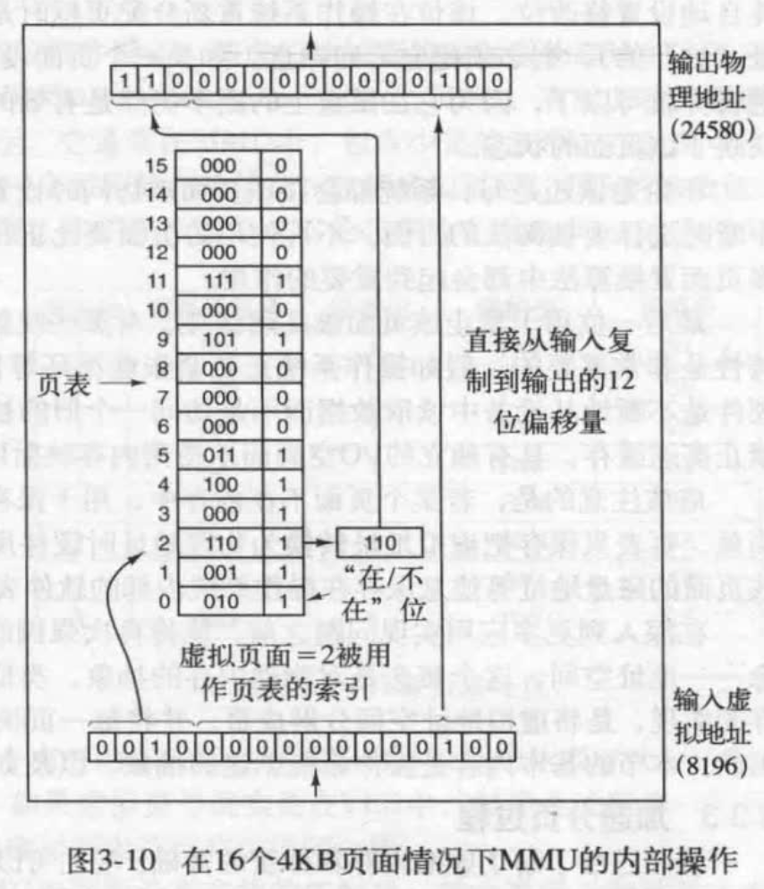
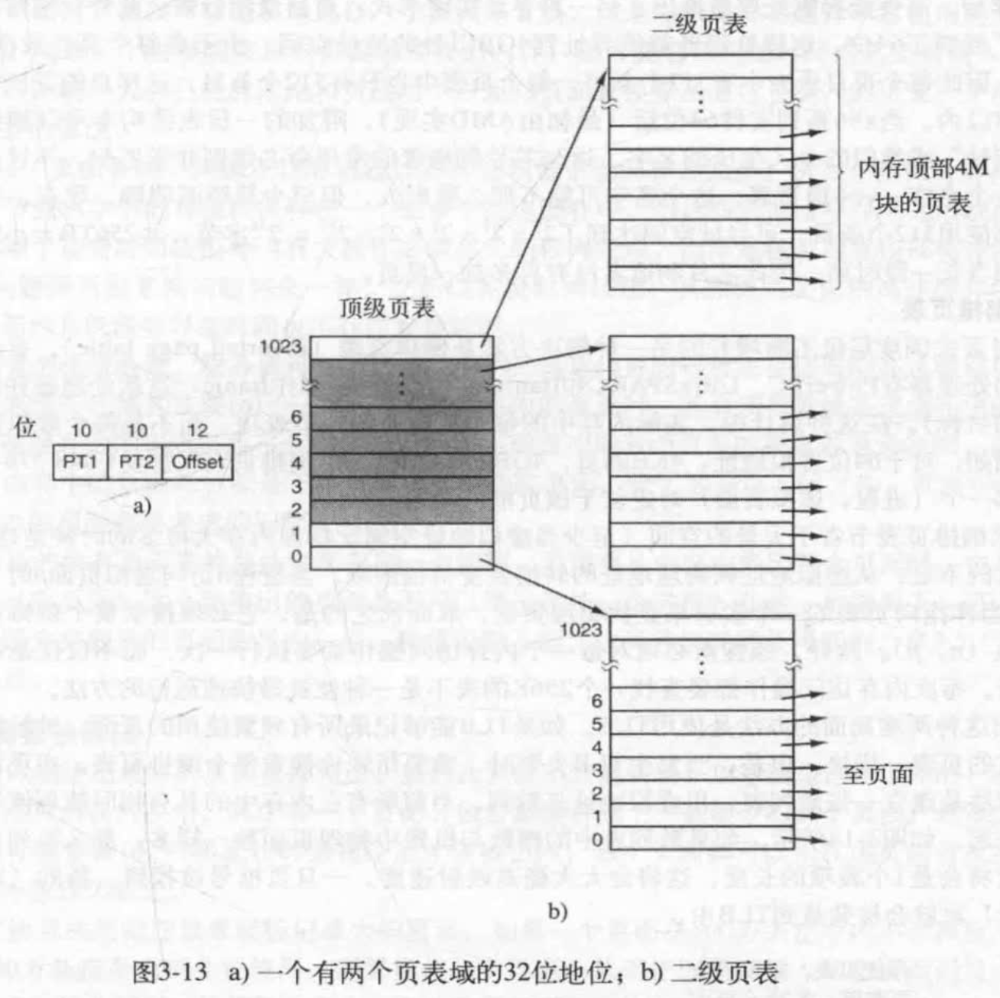
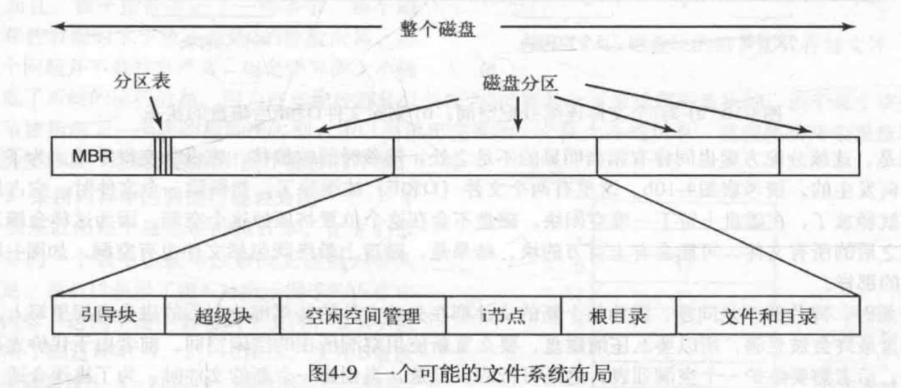
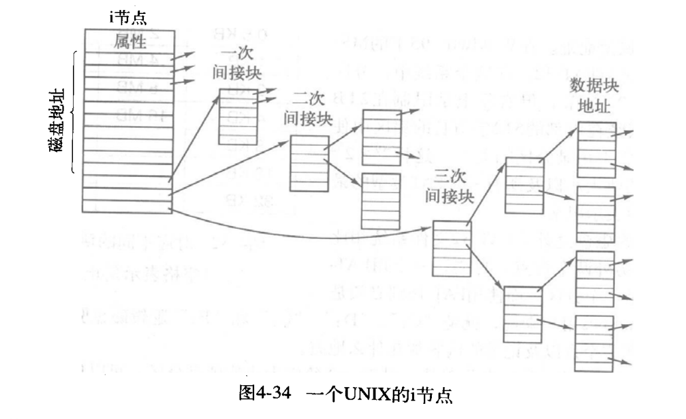

---
layout: post  
title: 2021-09-14-现代操作系统笔记（一）
date: 2021-09-14
categories: blog
tags: [操作系统,技术,笔记]
description: 现代操作系统阅读，记录一下关键的笔记内容。
---  

## 1-进程与线程  
进程：进程是资源分配的最小单位，一个进程就是一个正在执行程序的实例，包括程序计数器、寄存器、变量。也是文件和设备分配的最小单位。  

线程：是程序执行的最小单位，一个进程可以有多个线程，它们共享进程的地址空间和各种资源（线程不共享栈、PC和寄存器，共享堆、全局变量和文件等），线程的存在是为了并行计算，线程的调度是更轻量级的，更容易创建和销毁。若多个线程都是CPU密集型的，那么并行并不能获得性能上的增强，但是若存在着大量的计算和IO处理，那么多个线程允许这些活动彼此重叠进行，从而加快应用程序执行的速度。

几乎所有系统都把进程视为一个容器，用以管理相关资源，如地址空间、线程、打开的文件、权限保护等。线程是比进程更新的概念。

* 在UNIX系统中创建进程只有$fork$函数，在调用完$fork$函数后，这两个父子进程拥有相同的内存映像、同样的环境字符串(PATH等)，和同样的打开文件。子进程会接着执行$execve$类似的系统调用以修改内存映像并运行一个新程序。之所以这样安排，是为了在$fork$之后但在$execve$之前允许孩子进程处理其文件描述符，这样可以完成对标准输入输出和标准错误文件的重定向。Windows和UNIX系统进程创建后，父进程和子进程有**各自不同的地址空间**，在UNIX系统中子进程初始的地址空间是父进程的一个副本，不可写内存区域是共享的，可写的内存区域不共享或者写时复制。
* *进程的终止* 1. 正常退出; 2. 出错退出; 3. 严重错误(除0， 引用内存不存在，非法指令); 4. 被其他进程杀死(kill系统调用)

### 进程的状态  
  

### 进程的实现  
进程模型是一个进程控制快(PCB)，操作系统通过进程表进行控制，每个表项包括程序计数器，堆栈指针，内存分配状况，所打开文件的状态，账号和调度信息，以及其他进程由于运行态转换到就绪态或阻塞态时必须保存的信息，从而保证进程随后能够再次启动。下图列出需要的大致信息：  
  

### 线程实现的两种模式  
*在用户空间中实现*  
把整个线程放在用户空间，内核对线程一无所知，从内核角度将就是将进程看成单线程的来调度，在用户空间管理线程时，每个进程需要其专门的线程表。  
优点：1. 创建和调度的开销小，均在用户态下不用转换到内核态；2. 允许用户定制自己的线程调度策略，灵活，这是因为某些垃圾回收线程可能会导致不合适的时刻停止。  
缺点：1. 如何执行阻塞的系统调用，因为一点某个线程阻塞，那么该进程被阻塞，则所有线程都不能运行了。2. 缺页中断也会使所有线程无法执行，直到需要的页面被置换上来。3. 线程永久运行问题，因为线程执行在用户态，是没有时钟中断的，如果一个线程开始运行，那么在该进程中的其他线程就不能运行，除非第一个线程主动放弃CPU。  

*在内核中实现*  
用户空间没有线程表了，而内核空间记录所有线程的线程表。当某个线程希望创建或销毁时，它进行一个系统调用，这个系统调用通过对线程表的更新完成线程创建或销毁的工作。  
优点：针对用户态线程所有缺点的反面
缺点：1. 创建销毁调度代价太大

*混合实现*  
使用内核级线程，然后将用户级线程某些或全部内核线程多路复用起来。采用这种方法，内核只识别内核级线程，并对其进行调度。其中一些内核级线程会被多个用户级线程多路复用，如同在没有多线程能力操作系统中谋和进程的用户集线程一样，可以创建、撤销和调度这些用户级线程。在这种模型中，每个内核级线程有一个可以轮流使用的用户级线程集合。

### 进程间通信  
InterProcessCommunication(IPC问题)  
1 分为命名管道和无名管道。在内核中申请一块固定大小的缓冲区，程序拥有写入和读取的权利，都可以看成一种特殊的文件，**具有固定的读端和写端**，也可以使用普通的read、write 等函数。但是它不是普通的文件，并不属于其他任何文件系统，并且只存在于内存中；无名管道一般使用fork函数实现父子进程的通信，命名管道用于没有血缘关系的进程也可以进程间通信；面向字节流、自带同步互斥机制、半双工，单向通信，两个管道实现双向通信。

2 消息队列，在内核中创建一个队列，队列中每个元素是一个数据报，不同的进程可以通过句柄去访问这个队列；消息队列独立于发送与接收进程，可以通过顺序和消息类型读取，也可以fifo读取；消息队列可实现双向通信 。

3 信号量，在内核中创建一个信号量集合（本质是个数组），数组的元素（信号量）都是1，使用P操作进行-1，使用V操作+1，通过对临界资源进行保护实现多进程的同步。Mutex就是是一种信号量，kill的SIGNAL也是一种信号量。

4 共享内存，将**同**一块物理内存一块映射到**不同的进程的虚拟地址空间**中，实现不同进程间对同一资源的共享。目前**最快**的IPC形式，不用从用户态到内核态的频繁切换和拷贝数据，直接从内存中读取就可以，共享内存是临界资源，所以需要操作时必须要保证原子性。使用信号量或者互斥锁都可以。  

5 socket是应用层与TCP/IP协议族通信的中间软件抽象层，它是一组接口，把复杂的TCP/IP协议族隐藏在Socket接口后面，对用户来说，一组简单的接口就是全部，让Socket去组织数据。socket起源于UNIX，在Unix一切皆文件哲学的思想下，socket是一种”打开—读/写—关闭”模式的实现，服务器和客户端各自维护一个”文件”，在建立连接打开后，可以向自己文件写入内容供对方读取或者读取对方内容，通讯结束时关闭文件。是一种可以网间通信的方式。将SOCKET的IP设置为回环地址即可实现进程间通信。  

### 信号量  
使用一个整型变量来累计唤醒次数，供以后使用。Dijkstra建议引入一个新的变量类型叫信号量(semaphore)。一个信号量的取值可以为0（表示没有保存下来的唤醒操作）或为正值（表示有一个活多个唤醒操作）。  
&nbsp;&nbsp; down操作：检查其值是否大于0，若大于0则将其减1并继续操作；若该值为0，则进程将睡眠，而此时down操作未结束。保证一旦一个信号量操作开始，则在该操作完成或阻塞之前，其他进程均不允许访问该信号量。  
&nbsp; &nbsp;up操作：对信号量的值增1，如果一个或多个进程在该信号量上睡眠，无法完成一个先前的down操作，则系统选择其中的一个并允许该进程完成它的down操作。于是，对于一个有进程在其上睡眠的信号量执行一次up操作之后，该信号量的值仍是0，但在其上睡眠的进程却少一个。信号量的值增1和唤醒一个进程同样是不可分割的。（原论文中down是P操作，up是V操作）。  

注意：若单CPU中只需要屏蔽中断即可实现原子操作，若多CPU中，需要使用mutex来保护信号量，通过TSL或XCHG指令来防止几个CPU同时访问一个信号量。  

### 互斥量  
如果不需要信号量的计数能力，有时可以使用信号量的一个简化版本吗，成为互斥量(Mutex)。互斥量适用于管理共享资源或一小段代码。互斥量是处于两态之间的变量：解锁和加锁。互斥量分为两个过程：当一个线程或进程需要访问临界区时，它调用mutex_lock，如果该互斥量当前是解锁的，则调用成功，线程可以自由进入该临界区；如果该互斥量已经加锁，调用线程被阻塞，直到临界区中的线程完成并调用mutex_unlock。如果多个线程被阻塞在该互斥量上，将随机选择一个线程并允许它获得锁。

### 进程调度  

**进程调度切换的代价**  
首先用户态必须切换到内核态；然后要保存当前进程的状态，包括进程表中存储寄存器值以便以后重新装在。在许多系统中，内存映像（例如页表内的内存访问位）也必须保存；接着，通过运行调度算法选定一个新进程；之后将新进程的内存映像重新装入MMU；最后新进程开始运行。除此之外，进程切换还要使整个内存高速缓存失效，强迫缓存从内存中动态重新装入两次（进入内核一次，离开内核一次）。  

**何时被调度**  
1. 在创建新进程时，决定运行父进程还是子进程，随机选择  
2. 在一个进程退出时，选择就绪状态的进程，如果没有则运行系统提供的一个空闲进程
3. 当一个进程阻塞在I/O和信号量上或其他原因阻塞，必须选择另一个进程运行
4. 在一个I/O中断发生时，必须做出调度决策

**非抢占式**调度算法挑选一个进程运行到结束或者阻塞而不会主动退出；**抢占式**调度算法挑选一个进程，让该进程运行某个固定时段的最大值。如果该时间段结束时，该进程仍在运行，它就被挂起，而调度程序挑选另外的进程运行。进行抢占式调度处理，需要在时间间隔末端发生时钟中断，以便把CPU控制返回给调度程序。

**批处理系统中的调度**
先来先服务、最短作业优先、最短剩余时间优先（如果新的服务到来，若比当前进程的剩余时间还少，则先运行新进程）  

**交互式系统的调度**  
**轮转调度**：每个进程被分配一个时间片，在该时间片内运行  
**优先级调度**：每个进程赋予一个优先级，优先级高的先被运行，在时钟中断时调整优先级     
**多级队列**：设立优先级类。属于最高优先级的进程运行一个时间片，属于次高优先级类的进程运行2个时间片，再次一级的运行4个时间片，以此类推。当一个进程完成分配时间片后，它被移到下一个类。例如：一个需要连续计算100个时间片的进程，它最初被分配一个时间片并被优先调度，运行完后退出，下次它将获得两个时间片，接下来是4, 8, 16, 32和64.当然最后一次它只需要使用37个时间片就可以工作，这样只需要7次交换。  
**最短进程优先** 
**彩票调度**： 为进程提供各种系统资源（如CPU时间）的彩票。一旦需要做出一项调度决策时，就随机抽出一张彩票，拥有该彩票的进程获得该资源，这样使$n$个进程平均得到$1/n$的CPU时间。  
> 彩票调度可以解决其他调度问题：有一个视频服务器，在该视频服务器上若干进程正在向其客户提供视频流，每个视频流的帧速率都不相同。假设这些进程需要的帧速率分别是10，20，25，。如果给这些进程分配10，20，25张彩票，那么它们会自动按照大致正确的比例(即10,20,25)划分CPU的使用。  

**操作系统调度的策略与机制**  
调度算法并没有接受用户进程的调节信息，但是用户的父进程里有许多子进程，他们的重要性并不相同，所以这样父进程无法调整子进程的优先级。假设内核使用优先级调度算法，并提供一条可供进程设置(并改变)优先级的系统调用。这样尽管父进程本身并不参与调度，但它可以控制如何调度子进程的细节。这里调度机制位于内核，调度策略由用户进程决定。策略与机制分离是一种关键性思路。  

### 哲学家就餐问题  
五个人必须满足左右两边都没有人就餐时才可以就餐。  

### 进程和线程的小结  
几乎所有系统都把进程视为一个容器，用以管理相关资源，如地址空间、线程、打开的文件、权限保护等。线程是比进程更新的概念。

## 2-内存管理  
*地址空间*：地址空间是一个进程可用于寻址内存的一套地址集合。每个进程都有一个自己的地址空间，并且这个地址空间独立于其他进程的地址空间，处理在一些特殊情况下进程需要共享它们的地址空间外。  

*基址寄存器与界限寄存器*：通过基址寄存器进行重定位，界限寄存器控制程序长度防止越界。  

*交换技术*：把一个进程完整地调入内存，使该进程运行一段时间，然后把它存回磁盘。空闲进程主要存储在磁盘上，所以它=当它们不运行时就不会占用内存。  

*虚拟内存*：该策略甚至能使程序在只有一部分被调入内存的情况下运行。  

### 虚拟内存  
产生虚拟内存的原因：单个程序都已经大到内存无法容纳了，交换技术已经没办法适应这种情况。  
基本思想：每个程序拥有自己的地址空间，这个空间被分割成多个块，每一块被称为一页或页面。每一页有连续的地址范围，这些页被映射到物理内存，但并不是所有的页都必须在内存中才能运行程序。当程序引用到一部分在物理内存的地址空间时，由硬件立刻执行必要的映射。当程序引用到一部分不在物理内存中的地址空间时，由操作系统负责将缺失的部分装入物理内存并重新执行失败的指令。  

#### 分页  
由程序产生这些地址称为**虚拟地址**，它们构成了虚拟地址空间。虚拟地址不是被直接送到内存总线上，而是被送到**内存管理单元(MMU)**，MMU把虚拟地址映射为物理地址，如下图：
    
虚拟地址空间按照固定大小划分成被称为页面的若干单元，如下所示：  
  
当一个页面访问未被映射的地址时，MMU注意到该页面没有被映射，于是使CPU陷入到操作系统，这个陷阱被称为缺页中断或者缺页错误(page fault)。操作系统找到一个很少使用的块把它的内容写入磁盘（如果它不在磁盘上）。随后吧需要访问的页面读到刚才回收的块中，修改映射关系，然后重新启动陷入的指令。可用页号作为也表的索引以得出位于该虚拟页面的块号。  

### 页表  
每个进程都有一个页表，多级页表或者单级页表。页表的结构如下图：  
  
  
虚拟页号可做页表的索引，以找到该虚拟页面对应的页表项。由页表项可以找到块号（如果有的话）。然后把块号拼接到偏移量的高位端，以替换掉虚拟页号，形成送往内存的物理地址，页表的目的就是把虚拟页面映射为块。  

高速缓存禁止位：映射到设备寄存器而不是常规内存的页面很有用。  
加速分分页过程：  
硬件TLB和软件TLB。TLB项一般256个左右。  

**多级页表**  
引入多级页表的原因是避免把全部页表一直保存在内存中。  
  

另外一种是倒排页表，就是页表项和块号对应，而不是和页号对应，然后用软件管理和散列表来实现正向查找。  

### 页面置换算法  
当发生缺页中断时，操作系统必须在内存中选择一个页面将其换出内存，以便为即将调入的页面腾出空间。置换算法还用在高速缓冲Cache和Web服务器的页面放在告诉缓存里。  
* 最优页面置换算法  
* 最近最少使用(LRU)算法，最近最少未使用的页面被换出  
* 先进先出算法  

一般页面置换算法分为局部的（单个进程内最老的页面进行替换）和全局的（对所有进程多有页来替换最老的那个）。一般情况下全局的更好。  

减少竞争内存的一个好方法是将一部分进程交换到磁盘，并释放他们所占有的所有页面，这样可以减少颠簸的发生（页面被频繁置入置出）。  

一般情况下内核用大页面，用户进程用小页面。  

### 共享页面  
几个不同用户同时运行同一个程序很常见，显然为了避免在内存中使用同一个页面的两个副本，共享页面效率更高。（只读页面可以共享，数据页面不能共享）。  

如果系统支持指令和数据分离的地址空间，则可以使用页表指针来实现共享页面，使指令页面地址指针指向同一个页面即可实现共享。但是会带来一个问题：某个程序运行结束后，需要会查找所有页表，确保该页没有其他进程引用才能释放，然而这样代价很大，需要额外设计数据结构解决。  

共享数据页面实际上也可以实现：linux $fork$后父子进程指向相同的数据页面，当对某些页进行修改时，会出发只读保护，并引发操作系统陷阱。然后会生成一个该页的副本，这两个副本是可读写的，这称为写时复制。  

### 共享库  
> 静态库 任何在被目标文件.o 调用了但是没有被定义的函数(比如printf)，都被称作未定义外部函数。链接器会寻找这些未定义外部函数，如果找到了，则将他们家在到可执行二进制文件中。例如printf需要write，如果write还没有被夹在进来，则链接器就会参照write并在找到后把它加进来，当链接器完成任务后，一个可执行二进制文件被写到磁盘。
> 缺点：浪费磁盘空间和内存空间

> 共享库 当和共享库链接时，链接器没有加载被调用的函数，而是夹在一小段能够在运行时绑定被调用函数的存根例程(stub routine)。共享库在第一次被调用时装在，并且并不是一次性读入内存，而是根据需要，以页面为单位装在的，因此没有被调用的函数不会被装在到内存  
> 优点：共享库更新时，不需要重新编译整个可执行文件。

**共享库出现的问题**  
如果库的第一个指令是跳转到第16的位置，如果被唯一进程装载，那么可以通过重定向来解决（也就是跳转到base+16的位置），但是如果进行共享，两个程序对于共享库的起始位置不一样，那么跳转到第16的位置就不正确，所以可通过编译指令使共享库内的程序地址跳转只使用相对跳转，比如相对当前PC+X的位置跳转。  

### 内存映射文件  
将一个文件映射到其虚拟地址空间的一部分，可以将文件当成一个内存中的大字符数组来访问，而不用通过读写操作访问这个文件。  
如果两个或以上的进程同时影射了这个文件，它们就可以通过**共享内存**来通信。因此这个机制提供了一个进程之间的高带宽通道。  

### 虚拟内存接口  
有些情况下，向程序员提供页面映射的，这样可以实现共享内存，通过让一个进程把一片内存区域的名称通知另一个进程，而使得第二个进程可以把这篇区域映射到它的虚拟地址空间去，通过两个进程共享同一部分页面，高带宽的共享就成为可能。  

### 有关分页具体实现的内容  

**分页有关的工作**  
*进程创建时*：确定程序和数据初始时有多大，并为它们创建一个页表，为页表分配空间并初始化。当进程被换出时，页表不需要驻留在内存中，但当进程运行时，它必须在内存中。操作系统要用程序和数据对交换分区进行初始化，某些系统直接对磁盘上可执行程序进行分页，以节省磁盘空间和初始化时间，操作系统必须把有关页表和磁盘交换区的信息存储在进程表中。  

*进程执行时*：必须为新进程重置MMU，刷新TLB，以清除以前的进程遗留下的痕迹。新进程的页表必须成为当前页表，通常可以通过复制该页表活把上一个指向它的指针放进某个硬件寄存器来完成。有时可以在进程初始化时把部分或者全部页面装入内存中以减少却也中断的发生，例如PC(程序计数器)所指的页面肯定是需要的。  

*缺页中断发生时*：操作系统必须通过读硬件寄存器来确定是哪个虚拟地址造成了缺页中断。通过该信息计算需要哪个页面，并在次盘上对该页面进行定位，它必须找到合适的块来存放新页面并置换出老页面，然后把所需的页面读入页框。最后回退PC，使程序计数器指向引起缺页中断的指令，并重新执行该指令。  

*进程退出时*：操作系统必须释放进程的页表、页面和页面在硬盘上所占用的空间。如果某些页面是与其他进程共享的，当最后一个使用它们的进程终止使，才可以释放内存和磁盘上的页面。  

**缺页中断处理**  
  
  
**指令备份**  
因为缺页中断要重新执行原来的指令，那么解决方法是用一个隐藏的寄存器来记录上一个程序计数器的值。  

## 3-文件系统  

### 文件  
NTFS文件系统比FAT-16、FAT-32先进。
#### 文件结构  
文件分为字节文件，记录文件，树文件（用在大型商用应用里）。  
文件类型分为普通文件、目录，UNIX类系统还有字符特殊文件（和输入输出有关，用在串行IO设备），块特殊文件（用于磁盘类设备）。  

文件访问：可以顺序访问也可以随机访问。一种是每次read操作都给出开始读文件的位置，另一种是使用seek操作设置当前位置，UNIX和Windows都采用后一种。  

### 文件系统的实现  
文件系统放在磁盘上，多数磁盘划分一个或多个分区，每个分区中有一个独立的文件系统。磁盘的0号扇区称为主引导记录（Master Boot Record, MBR），用来引导计算机。在MBR的结尾是分区表。该表给出了每个分区的起始和结束地址。表中的一个分区被标记为活动分区。  

BIOS读入并执行MBR，MBR做的第一件事是确定活动分区，读入它的第一个块，称为引导块，并执行它。引导块中的程序将装载该分区中的操作系统。**超级块**包含文件系统的所有关键参数，在计算机启动时，或在该文件系统首次使用时，超级块会被读入内存。超级块中包含确定文件系统类型用的魔数、文件系统中块的数量以及其他重要的管理信息。**空闲块**可以是位图或者指针列表给出空闲块的信息。i节点组是一个数据结构数组，每个文件一个，i节点说明了文件的方方面面。接着可能是根目录，它存放文件系统目录树的根部。最后是磁盘的其他部分存放其他所有的目录和文件。  
 
  

#### 文件分配  
**连续分配**  
文件按照顺序分配，缺点是增加数据时难以扩展。一般用在已经知道文件大小并且不会改变的情况下，比如CD-ROM文件系统（也就是光盘）。  

**链表分配**  
为每个磁盘块链表，每个块的第一个字作为只想下一块的指针，块的其他部分存放数据。优点：顺序读文件非常快，但是随机访问相当缓慢。读取的块大小不是2的幂了。  

**采用内存中的表进行连接分配**  
如果取用每个磁盘块的指针字，把它们放入内存的一个表，就可以解决链表的两个不足，这样的表格称为文件分配表。缺点：太占内存。  

**i节点**  
记录各个文件分别包含哪些磁盘块的方法是给每个文件赋予一个i节点的数据结构，其中列出了文件属性和文件块的磁盘地址。只有在对应文件打开时，i节点才在内存中。i节点的一个问题是，如果每个i节点只能存储固定数量的磁盘地址，那么当一个文件所包含的磁盘块数超过了i节点固定的磁盘地址数量。解决办法是最后一个磁盘地址不指向数据块，而是指向一个包含额外磁盘地址的块的地址。或者是可以有两个或者更多的包含磁盘地址的块，或者指向其他存放地址的磁盘块的磁盘块。  

#### 目录的实现  
读文件前，先打开文件。打开文件时，操作系统利用用户给出的路径名找到对应的目录项。目录项提供了查找文件名所需要的信息（i节点，或者连续文件的起始位置）。对于i节点系统，可以把文件属性存放在i节点中，而不是目录项中，这样木箱会更短：只有文件名和i节点号。这种方法可以将目录项存放到内存中。  

#### 共享文件  
1. 硬链接  
目录下的某个目录项的i节点地址和共享文件的i节点地址一样  

2. 软链接  
目录下的某个文件，占用新的i节点和数据块，数据块的内容是共享文件的目录和文件名构成的路径  

#### 日志文件系统  
基本思想：保存一个用于记录系统下一步将要做什么的日志。这样当系统在完成它们即将完成的任务前崩溃时，重新启动后，可以通过查看日志，获取崩溃前计划完成的任务，并完成它们。  

例如移除文件需要做的事情：  
1. 在目录中删除文件  
2. 释放i节点到空闲i节点池
3. 将所有磁盘块归还到空闲磁盘块池

日志文件系统需要先写一个日志项，列出三个将要完成的任务。然后日志项被写入磁盘。只有当日志项已经被写入，不同的操作才可以进行，当所有操作完成后，擦除日志项。如果系统这时崩溃，系统恢复后，文件系统可以检查日志来查看是不是有未完成的操作，如果有则可以重新运行未完成的操作。  

写入日志的操作必须是**幂等的**  

### 虚拟文件系统VFS  
关键思想就是抽象出所有文件系统都共有的一部分，将这部分代码单独放在一层，该层调用底层的实际文件系统来具体管理数据。  

这样随时都可以在任意磁盘部分加入新的文件系统来。  

> 虚拟文件系统（Virtual File System，简称VFS）是Linux内核的子系统之一，它为用户程序提供文件和文件系统操作的统一接口，屏蔽不同文件系统的差异和操作细节。借助VFS可以直接使用open()、read()、write()这样的系统调用操作文件，而无须考虑具体的文件系统和实际的存储介质。  

### UNIX v7文件系统  

目录项保存文件名和inode  
inode保存文件属性  
i节点的块链接地址：  
   
查找/usr/ast/mbox示例：  
* 文件系统定位根目录，在UNIX系统中根目录的inode存放在磁盘上固定的位置  
* 根目录的数据块中得到目录项，其中包含usr目录的目录项，得到/usr的inode
* 得到/usr数据块中的目录项，其中包含ast目录的目录项，得到/usr/ast的inode
* 得到/usr/ast数据块中的目录项，其中包含文件名为mbox的文件和inode，得到mbox的inode
* 读取mbox的数据块，得到数据  

相对文件名的查找起点是从当前目录开始查找，因为当前目录，因为目录创建时，同时创建了.和..两个字目录，它们的inode是提前知道的。  

## 4-输入输出  
*块设备*：块设备把信息存储在固定大小的块中，每个块有自己的地址。通常块的大小在512字节到65536字节之间。所有传输以一个或多个完整的块为单位。块设备的基本特征是每个块都能独立于其他块而读写。例如硬盘、光盘、USB盘。  

*字符设备*：字符设备以字符为单位发送或接受一个字符流，而不考虑任何块结构。字符设备是**不可寻址**的。例如 打印机、网络接口、鼠标。

### 直接存储器存取(DMA)  
DMA控制器能够独立于CPU而访问系统总线。  

DMA在可以开始之前，**磁盘首先要将数据读入到内部缓冲区中，然后再将其复制到主存**。为什么不直接将其存储到主存？因为通过内部缓冲，磁盘控制器可以在开始传送之前检验校验和，并且一旦磁盘传送开始工作，磁盘读出的数据**以固定速率到达**，而不论控制器是否准备好接收数据。  

### 中断的物理实现  
当一个I/O设备完成交给它的工作时，它就产生一个中断，它是通过在分配给它的一条总线信号线上置起信号而产生中断的。该信号被主板上的中断控制器芯片检测到，由中断控制芯片决定做什么。  
  
设备与中断控制器之间的连接实际上使用的是总线上的中断线而不是专用连线。如果其他终端悬而未决，中断控制器立刻对中断进行处理。如果有另一个中断正在处理中，或者另一个设备在总线上具有更高优先级的一条中断请求线上同时发出中断请求，该设备将暂时不被理睬。在这种情况下，该设备将继续在总线上置起中断信号，直到得到CPU的服务。  

中断信号导致C PU停止当前正在做的工作并且开始做其他事时，地址线上的数字被用做指向一个称为**中断向量**的表格索引，该值是个程序计数器，指向了中断服务过程的开始。  

（**精确中断和不精确中断**）

### IO软件原理  
#### IO软件的目标  
**设备独立性**：应该能够编写出可以访问任意IO设备而无需事先指定设备的程序。
**统一命名**  
**错误处理**：错误应该尽可能地在接近硬件的层面得到处理，当控制器发现一个读错误时，如果它能够处理，那么就应该自己设法纠正这一错误，如果控制器处理不了，那么设备驱动程序应当予以处理，可能只需要重读一次这块的数据就正确了（因为可能是读写头的灰尘导致的）。  
**同步和异步传输**：操作系统使时机上是中断驱动的操作变为用户程序看来是阻塞式操作。  
**缓冲**：数据离开一个设备之后通常并不能直接存放到其最终的目的地，必须先放置到缓冲区中，这是因为获得数据的速度不匹配还有需要校验原因。

#### 设备驱动程序  
大多数操作系统都定义了一个块设备和字符设备需要支持的标准接口。设备驱动程序有若干功能，最明显的功能是是接受其上方与设备无关的软件所发出的抽象读写请求。驱动程序不允许进行系统调用，但是它们经常需要与内核的其一部分进行交互，所以可以调用一些内核过程。  
驱动程序属于内核空间。  
  
  

对于每一种设备类型，例如磁盘或打印机，操作系统定义一组驱动程序必须支持的函数，比如读、写、开启和关闭等。驱动程序通常包含一张表格，这张表格具有针对这些函数指向驱动程序自身的指针。当驱动程序装载时，操作系统记录下这张函数指针表的地址，所以当操作系统需要调用一个函数时，他可以通过这张表格发出间接调用。  

与设备无关的软件要负责把符号化的设备名映射到适当的驱动程序上，例如/dev/disk0这样的设备名唯一确定了一个特殊文件的i节点，这个i节点包含**主设备号**，主设备号用于定位相应的驱动程序。i节点还包含次设备号，**次设备号**作为参数传递给驱动程序，用来确定要读或写的剧透单元。

所有驱动程序都是通过使用主设备号来选择驱动程序而得到访问的。

#### 设备缓冲  
**输入缓冲**
考虑一个例子，我们从调制解调器中读取数据，有如下几种模式：  
  
第一种：每个字节(或者数据包)都会引起一个中断，导致用户进程不断被阻塞。  
第二种：直接传输到用户空间中的缓冲区，缺点是缓冲区内容过多被分页而被调出内存，导致效率降低。  
第三种：当内核空间满了，则一次性全部复制到用户空间，然而当内核空间满了用户空间页面调入时又来新的数据，此时会数据丢失。  
第四种：双缓冲，一个缓冲满了，用另一个，前一个全部复制到用户空间。  

环形缓冲：由内存去和两个指针组成，一个指针指向下一个空闲字，新的数据可以放在这里；一个指针指向环形缓冲区第一个字，该字尚未取走。  

**输出缓冲**
环形缓冲也可以用在输出缓冲中，但是放到内核空间是因为，当输出复制完毕后，需要产生一个中断，而这个中断只能在内核中产生。  
   
也就是说，一次网络传输可能要涉及多次复制一个数据包的网络，其中一个缓冲区在调制解调器硬件上（这是因为数据在链路上是匀速接受和发送的，如果出现操作系统中断，则会出现数据包丢失情况），第二个缓冲在内核（方式用户进程的缓冲区满了缺页而被调出空间，并且能够在输出完毕时产生中断告诉内核任务完成）。

#### 磁盘臂调度算法  
先来先服务、最短寻道优先、电梯算法  

## 5-死锁  
**可抢占式资源**: 可以从拥有它的进程中抢占而不会产生任何副作用。比如内存，因为进程A抢占了进程B的内存，进程B会被置换到硬盘里，不会产生副作用。  

**不可抢占式资源**: 在不引起相关计算失败的情况下，无法把它从占有它的进程处抢占过来，例如打印机、光盘刻录机。  

**死锁的四个必要条件**：
* 互斥条件，每个资源要么已经被分给进程要么是可用的。  
* 占有和等待条件，已经得到的某个资源的进程可以再请求新的资源
* 不可抢占条件，已经分配给进程的一个资源不能强制性地被抢占，只能自己释放
* 环路等待条件，死锁发生时，系统中一定有两个或两个以上的进程组成一条环路，该环路中的每个进程都在等待着下一个进程所占有的资源

**解决死锁的方法**
死锁的检测和恢复、死锁的避免(银行家算法)、死锁的预防（破坏死锁的条件）

### 银行家算法  
首先获得所有进程对资源的最大请求，然后开始处理请求，如果某个进程请求资源，则判断是否是安全状态，如果是，则分配请求，如果不是则推迟这个请求。  

安全状态：剩下的资源可以满足某一进程所需要的资源请求。  

### 两阶段锁  
第一阶段对所有需要的资源逐个加锁，第二阶段对资源进行修改然后释放锁

## 6-虚拟化和云  
虚拟化技术允许单一计算机运行多个虚拟机，各虚拟机能运行不同的操作系统。  
云：将计算和存储需求外包给一个管理良好的数据中心。专门的人运营这个数据中心，然后只需要为使用的资源付费即可。  

两类虚拟机，第一类虚拟机运行在裸机上，第二类虚拟机运行在宿主操作系统上：
  

|虚拟化方式|第一类虚拟机管理程序|第二类虚拟机管理程序|
|:----:|:----:|:----:|
|无硬件支持|ESX Server 1.0 | VMware Workstation 1|
|半虚拟化|Xen 1.0||
|有硬件支持|vSphere, Xen, Hyper-V|VMware Fusion, KVM, Parallels|
|进程虚拟化||Wine|  

### 高效虚拟化技术  
VT技术：在CPU中引入虚拟化技术  

当认为自己处于内核态的客户操作系统执行可一条只有CPU真正处于内核态才允许执行的指令时，通常在不支持VT的CPU上，这条指令执行失败并导致操作系统崩溃。在支持VT的CPU上，客户操作系统执行敏感指令时，会陷入虚拟机管理程序，虚拟机管理程序可以检查这条指令是由虚拟机中的客户操作系统执行的还是由用户程序执行的，如果是前者，虚拟机管理程序将安排这条指令功能的正确执行。否则，虚拟机管理程序将模拟真实硬件面对用户态执行敏感指令时的行为。  

## 7-多处理机系统  
### 多处理机  
两个或者更多的CPU全部共享访问一个公用的RAM。运行在任何一个CPU上的程序都看到一个普通（通常是分页）的虚拟地址空间。这个系统的唯一特别性质是，CPU可对存储器的某个字写入某个值，然后读回该字，并得到一个不同的值（因为另一个CPU改写了它）。  

#### 多处理机硬件  
**基于总线的UMA多处理机体系结构**  
UMA: Uniform Memory Access, 统一存储器访问，即每个CPU可访问全部存储器并且速度一样快  
NUMA: Nonuniform Memory Access, 非一致存储器访问，读取存储器速度不一致  

当CPU需要读取一个存储器字，它首先检查总线是否忙，如果忙则CPU等待并设置一些控制信号，否则在总线上获得存储器上的字。缺点：总线带宽称为瓶颈，多个CPU都处于等待状态。改进：对每个CPU附近或者内部增加一个告诉缓冲(cahce)，减少总线流量。  

**交叉开关的UMA多处理机**  
  

水平方向是入口，垂直方向是出口，cpu和处理器通过交叉点开关连接。优点：非阻塞网络，缺点，硬件开销大，100个CPU和100个存储器一共需要10000个开关。  

混洗交换网络  

NUMA多处理机  

