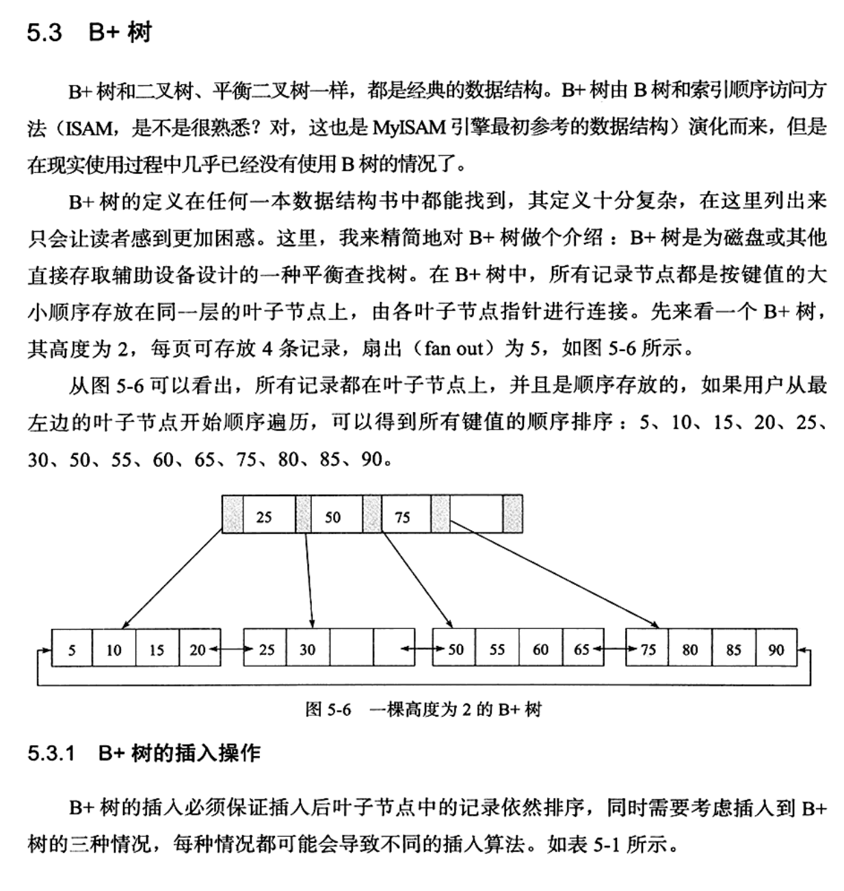
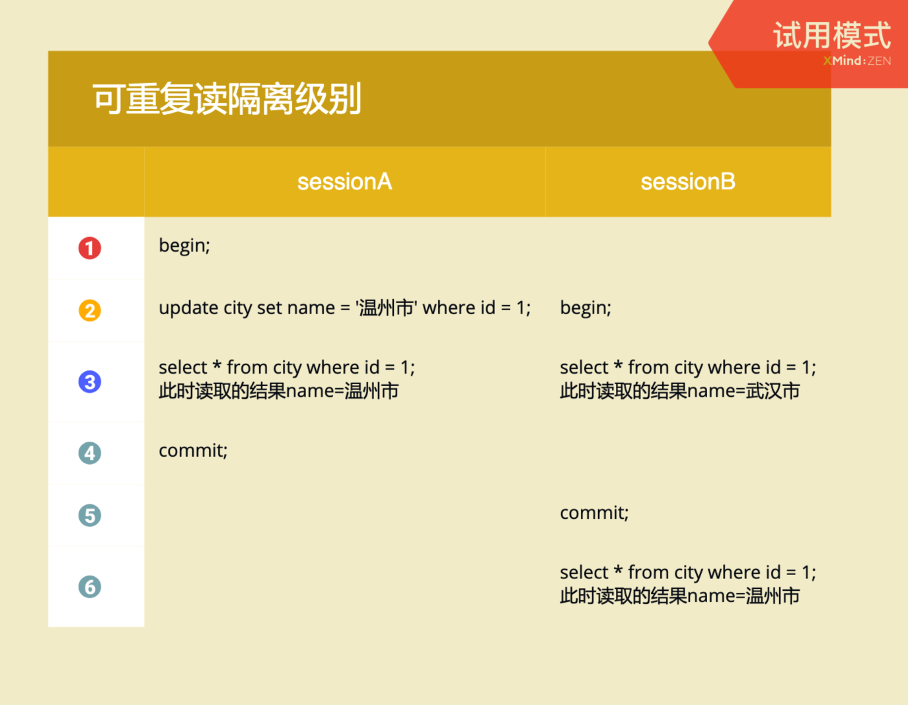

---
layout: post  
title: 2021-09-15-MySQL技术内幕InnoDB存储引擎
date: 2021-09-15
categories: blog
tags: [数据库,技术,笔记]
description: MySQL技术内幕InnoDB存储引擎，记录一下关键的笔记内容。
---  

## 1-MySQL 体系结构和存储引擎  
MySQL被设计为一个单进程多线程架构的数据库，与SQL Server类似，也就是说MySQL数据库实例在系统上的表现就是一个进程。  

查看MySQL后台进程情况：  
```shell  
ps -ef | grep mysqld
```  

MySQL由以下几部分组成：  
连接池组件、管理服务和工具组件、SQL接口组件、查询分析器组件、优化器组件、缓冲(Cache)组件、插件式存储引擎、物理文件。  
需要注意的是，存储引擎是基于表的，而不是数据库。存储引擎是MySQL区别于其他数据库的一个最重要的特性，其好处是每个存储引擎都有各自的特点，能够根据具体应用建立不同存储引擎表，MySQL的核心在于存储引擎。由于MySQL开源特性，用户可以根据MySQL预定义的存储引擎借口编写自己的存储引擎，若用户对某一种存储引擎的性能或功能不满意，可以通过修改源码来得到想要的特性。  

**InnoDB存储引擎**  
支持事务，其特点是行锁设计、支持外键，并支持非锁定读，即默认读取操作不会产生锁。InnoDB存储引擎将数据房子啊一个逻辑的表空间，由其进行管理。InnoDB引擎通过使用多版本并发控制MVCC来获得高并发性，并且实现了SQL标准的4种隔离级别，默认为REPEATABLE级别，同时，使用一种被称为next-key locking的策略来避免幻读(phantom)现象的产生。除此之外，InnoDB存储引擎还提供了插入缓冲、二次写、自适应哈希索引、预读等高性能和高可用的功能。 数据采用聚类方式，因此每张表的存储都是按主键的顺序进行存放。  

**MyISAM存储引擎**
MyISAM存储引擎不支持事务、表锁设计，支持全文索引。MyISAM只缓存索引不缓存数据。M与ISAM存储引擎表由MYD和MYI组成，MYD用来存放数据文件，MYI用来存放索引文件。  

**NDB存储引擎**  
NDB存储引擎是一个集群存储引擎，其结构使share nothing的集群架构，因此能提供更高的可用性。NDB的特点是数据全部放在内存（从MySQL5.1开始，也可以将非索引数据存放在磁盘上），因此主键查找非常快，并且通过添加NDB数据存储节点可以线性地提高数据库性能。但是NDB连接操作(JOIN)是在MySQL数据库层完成的，而不是在存储引擎层完成的。这意味着复杂的连接操作需要巨大的网络开销，因此查询速度会变慢。  

**Memory存储引擎**  
Memory存储引擎将表中的数据存放在内存中，如果数据库重启或发生故障崩溃，表中的数据则会消失。它非常适合存储临时数据的临时表，以及数据仓库中的纬度表。Memory引擎默认使用哈希索引，而不是我们熟知的B+树索引。Memory引擎只支持表锁，并发性能较差，并且不支持TEXT和BLOB数据类型。最重要的是，存储变长字段Varchar时是按照定长字段char的方式进行的，因此会浪费内存。若MySQL使用Memory引擎，则当查询的临时表的中间结果集大于Memory引擎设置的容量则MySQL数据库会把其转换到MyISAM存储引擎表而存放到磁盘中，因此性能会有损失。

**Archive存储引擎**
只支持INSERT和SELECT操作，Archive存储引擎使用zlib算法将数据行进行压缩，压缩比一般可达1:10。它一般用于归档数据，如日志信息。Archive引擎使用行锁来实现高并发插入操作，但是其本身并不是事物安全的存储引擎，其设计目标主要是提供高速的插入和压缩功能。  

查看MySQL支持的引擎：  
```shell  
SHOW ENGINES 
```  

### 连接MySQL  
连接MySQL本质上就是进程间通信，进程间通信方式有管道、TCP/IP套接字、共享内存和消息队列、UNIX域套接字。  

#### TCP/IP  
例如：  
```shell  
mysql -h192.168.0.101 -u david -p
```
当连接时，MySQL先要校验权限，也就是检查一张权限视图用来判断IP是否允许连接。查看权限视图：  
```shell  
mysql>USE mysql
Database changed
mysql>SELECT host,user,password FROM user;
```
结果显示：  
  

#### 命名管道和共享内存  
在MySQL配置文件中启用--enable-named-pipe选项可以使用命名管道连接MySQL。如果想使用共享内存方式，在连接时还必须使用--protocol=memory选项。  

#### UNIX域套接字  
Linux和UNIX环境下，还可以使用UNIX域套接字。UNIX域套接字不是一个网络协议，所以只能在MySQL客户端和数据库实例在一台服务器上的情况下使用。用户可以在配置文件中指定套接字文件的路径，如--socket=/tmp/mysql.sock。当数据库实例启动后，用户可以通过下列命令来进行UNIX域套接字文件的查找：  
```shell  
mysql>SHOW VARIABLE LIKE 'socket'
```  

在知道了UNIX域套接字文件的路径后，就可以使用该方式进行连接了，如下所示：  
```shell  
mysql -udavid -S /tmp/mysql.sock
```

## 2-InnoDB存储引擎  
### InnoDB体系架构  
InnoDB存储引擎有多个内存块，可以认为这些内存块组成了一个大的内存池。  
  
后台线程主要作用是负责刷新内存池中的数据，保证缓冲池中的内存缓存的是最近的数据。此外将已修改的数据文件刷新到磁盘文件，同时保证在数据库发生异常的情况下InnoDB能恢复到正常运行状态。  

### 后台线程  
**Master Thread**  
主要负责将缓冲池中的数据异步刷新到磁盘，保证数据一致性，包括*脏页的刷新*，*合并插入缓冲*，*UNDO页的回收*等。  

**IO Thread**  
在InnoDB存储引擎里大量使用了AIO(Aysnc IO)来处理写IO请求，这样可以极大提高数据库性能，而IO Thread的工作主要是负责这些IO请求的回调。有四种分别是：write、read、insert buffer、log。

**Purge Thread**  
事务被提交后，其所使用的undolog可能不再需要，因此需要PurgeThread来回收已经使用并分配的undo页。  

**Page Cleaner Thread**
将脏页的刷新操作独立出来处理，减轻master thread的压力，以及对用户查询线程的阻塞。  

### 内存  
**缓冲池**
InnoDB存储引擎是基于磁盘存储的，并将其中的记录按照页的方式进行管理。因为CPU速度和磁盘速度差异较大，因此使用缓冲池技术来提高数据库的整体性能。缓冲池实际上就是内存区域，在数据库中进行读取页的操作，首先讲磁盘读到的页存放在缓冲池中，这个过程称为将页FIX在缓冲池中。下一次读取相同的页时，首先判断该页是否在缓冲池中。若在缓冲池中，则称该页在缓冲池被命中，否则读取磁盘。  

对数据库中页的修改操作，则首先修改缓冲池的页，然后以一定频率刷新到磁盘上。页从缓冲池刷新回磁盘的操作并不是在每次页发生更新时出发，而是通过一种称为Checkpoint的机制刷新回磁盘。

查看缓冲池参数：  
```shell  
mysql>SHOW VARIABLES LIKE 'innodb_buffer_pool_size'
```  
缓冲池里存放索引页、数据页、undo页、插入缓冲、自适应索引、InnoDB存储的锁信息、数据字典信息，使用**LRU**(Latest Recent Used，最近最少使用)算法进行管理。即最频繁使用的页在LRU列表的前端，而最少使用的页在LRU列表的尾端，当缓冲池不能存放新的页时，首先释放LRU列表尾端的页。  

InnoDB对LRU算法做了改进，LRU列表中加入了midpoint位置。新读取到的页，虽然是最新访问的页，但并不是直接放入到LRU列表首部，而是放到LRU列表的midpoint位置。这个算法在InnoDB引擎下称为midpoint insertion strategy。在默认配置下，该位置在LRU列表长度的$\frac{5}{8}$处。midpoint位置由参数innodb_old_blocks_pct控制。在InnoDB中，把midpoint之后的位置称为old，之前的位置称为new。这么改进是因为有些操作会扫描所有页，但是他们也就只访问一次（例如索引操作或数据扫描操作）。另外一个参数innodb_old_blocks_time表示页读取到mid位置后过多久才会被加入到LRU列表的热端（前端）。   

InnoDB提供了压缩页的功能，即原本16KB的页压缩为1KB，2KB，4KB和8KB，采用unzip_LRU。对于压缩页的表，每个表的压缩比率可能各不相同，有的表页大小为8KB，有的表也大笑为2KB的情况。unzip_LRU申请4KB页大小，过程如下：  
1. 检查4KB的unzip_LRU列表，检查是否有可用的空闲页；
2. 若有则直接使用
3. 否则，检查8KB的unzip_LRU列表；
4. 若能够得到空闲页，将页分成两个4kb页，存放到4KB的unzip_LRU列表；
5. 若不能得到空闲页，从LRU列表申请一个16KB的页，将页分为1个8KB的页，2个4KB的页，分别放到对应的unzip_LRU列表中。  

**重做日志缓冲**  
InnoDB存储引擎的内存区域除了有缓冲池外，还有重做日志缓冲。InnoDB引擎首先将重做日志信息放入到缓冲区，然后按照一定频率刷新到重做日志文件。这个区域一般不需要很大，8MB即可，该值由innodb_log_buffer_size控制。一般情况下，下面三个条件会刷新重做日志缓冲：  
* Master Thread 每一秒将重做日志缓冲刷新到重做日志文件
* 每个事务提交时会刷新
* 当buffer小于1/2时会刷新  

### Checkpoint 技术  
因为数据库内部使用缓冲来平衡磁盘和CPU速度，因此当服务器宕机后，必须有恢复数据的办法。当前事务数据库采用Write Ahead Log策略，即当事务提交时，先写重做日志，再修改页。  

检查点的作用是：当数据库发生宕机，数据库不需要重做所有日志，因为Checkpoint之前的页都已经刷新回磁盘里，故数据库只需对Checkpoint后的重做日志进行恢复。当LRU溢出最少的页时，若此页为脏页，那么需要强制执行Checkpoint，将脏页刷新到磁盘。  

对于InnoDB存储引擎而言，其是通过LSN（Log Sequence Number）来标记版本的。InnoDB有两种Checkpoint，分别为：Sharp Checkpoint和Fuzzy Checkpoint。Sharp Checkpoint发生在数据库关闭时将所有的脏页都刷新回磁盘，这是默认的工作方式；InnoDB内部使用Fuzzy Checkpoint，即只刷新一部分脏页。  

**Fuzzy Checkpoint发生时机**  
Master Thread差不多每秒或者每10秒从缓冲池的脏页列表中刷新一定比例的页回磁盘，这个过程是异步的。  
FLUSH_LRU_LIST Checkpoint 是因为InnoDB存储引擎要保证LRU中需要差不多100个空闲页可供使用。如果不足100个空闲页，则需要将脏页刷新回磁盘，此时会产生检查点。  
Async/Sync Flush Checkpoint，当重做日志不可用时，也就是重做日志过时了，需要将脏页写回，此时触发检查点（重做日志是循环使用的，检查点之前的日志可以被覆盖）  
Dirty Page too much ，脏页数量太多，检查点也会强制Checkpoint，其参数由innodb_max_dirty_pages_pct控制。  

### Master Thread 工作方式  
Master Thread具有最高的线程优先级别，其内部由多个循环组成：主循环、后台循环、刷新循环、暂停循环。  

**Loop（主循环）**  
大多数操作都在这个循环，其中有两大部分的操作：每秒钟的操作和每10秒钟的操作，伪代码如下：  
```c
void master_thread() {
loop:
    for(int i = 0;i<10;i++){
        // do thing once per second
        // sleep 1 second if necessary
    }
    do things once per ten seconds
    goto loop
}
```  
可以看到loop通过sleep实现，这意味着每秒一次或者每10秒1次的操作是不精确的，在负载很大的情况下会有延迟，只能说是大概频率。  

每秒的操作包括：  
* 日志缓冲刷新到磁盘，即使这个事务还没有提交
* 合并插入缓冲
* 至多刷新100个InnoDB的缓冲池中的脏页到磁盘
* 如果当前没有用户活动，则切换到background loop

即使某个事务没有提交，InnoDB存储引擎还是会每秒将重做日志缓冲中的内容刷新到重做日志文件，因此再大的事物cimmit的时间也是很短的。  
合并插入缓冲并不是每秒都会发生，InnoDB存储引擎会判断当前一秒内发生IO次数是否小于5，如果小于5次，InnoDB认为当前的IO压力小，可以执行合并插入缓冲操作(Insert Buffer)。  

每10秒的操作：  
* 刷新100个脏页到磁盘
* 合并至多5个插入缓冲
* 将日志缓冲刷新到磁盘
* 删除无用的undo页
* 刷新100个或者10个脏页到磁盘  

**background loop**
若当前没有用户活动或者数据库关闭(shutdown)，就会切换到这个循环。background loop会执行以下操作：  
* 删除无用的Undo页
* 合并20个插入缓冲
* 跳回主循环
* 不断刷新100个页面直到符合条件（可能，跳转到flush loop中完成）  

若flush loop也没什么事儿做，则会切换到suspend_loop，将Master Thread 挂起，等待事件发生。若用户启用了InnoDB引擎，却没有使用任何InnoDB引擎的表，那么Master Thread总是处于挂起的状态。  

### InnoDB 关键特性  
* 插入缓冲(Insert Buffer)  
* 两次写(Double Write)
* 自适应哈希索引(Adaptive Hash Index)
* 异步IO(Async IO)
* 刷新邻接页  

#### 插入缓冲  
InnoDB存储引擎中，主键是行唯一索引的标识符。通常应用程序中行记录的插入顺序是按照主键递增的顺序进行插入的。因此，插入**聚集索引**（Primary Key）一般是顺序的，不需要磁盘的随机读取，因此不需要随机读取另一个页，所以插入的速度是非常快的。  

然而更多时候一个表上有很多非聚集的辅助索引(secondary index)，比如用户按照name这个字段进行查找，而name字段建立了索引，且name字段不是唯一的，这样就产生了一个非聚集索引并且不是唯一索引（就是说同一个值的所有记录不放在一起，就是不聚集）。**在插入操作时，数据页的存放还是按主键a进行顺序存放的，但是对非聚集索引叶子节点的插入不再是顺序的了**（也就是比如插入1000个点，这些点的插入顺序可能是a,b,c,a,b,c,a,b,c，就需要不断循环访问a、b、c值对应的索引页），这就需要离散地访问非聚集索引页，由于随机读取的存在而导致了插入操作的性能下降。  

*解决方法*  
对于非聚集索引的插入或更新操作，不是每一次直接插入到索引页，而是先判断插入的非聚集索引页是否在缓冲池中，如果在则直接插入，否则先放入到一个Insert Buffer对象中，好似欺骗。数据库这个非聚集的索引已经插入到叶子节点，而实际上并没有，只是存放在另一个位置。然后再以一定的频率和情况进行Insert Buffer和辅助索引页子节点的merge(合并)操作，这样通常能将多个插入合并到一个操作中（因为在一个索引页中），这就大大提高了对于非聚集索引插入的性能。

*Insert Buffer 的使用满足的条件*  
* 索引是辅助索引(secondary index)
* 索引不是唯一的

*Change Buffer*  
InnoDB 后来引入Change Buffer，可将其视为Insert Buffer的扩展，也就是可以对DML操作的INSERT、DELETE、UPDATE都进行缓冲，它们分别是Insert Buffer，Delete Buffer，Purge Buffer。当然和之前的Insert Buffer一样，Change Buffer适用对象也依然是非唯一的辅助索引。  
对一条记录进行UPDATE操作分为两个过程：  
* 将记录标记为已删除
* 真正地将记录删除  
因此Delete Buffer对应UPDATE操作的第一个过程，即将记录标记为删除。Purge Buffer对应UPDATE操作的第二个过程，即将记录真正的删除。  

InnoDB存储引擎提供了参数innodb_change_buffering，用来开启各种Buffer的选项。该参数的可选的值为inserts, deletes, purges, changes, all, none。默认值为all。  

*内部实现*  
Insert Buffer是一个B+树，以前版本是每张表有一棵B+树，现在版本全局只有一棵B+树，负责对所有的辅助索引进行Insert Buffer。而这棵B+树存放在共享表空间中，默认也就是ibdata1中。因此，试图通过独立表空间ibd文件恢复表中数据时，往往会导致CHECK TABLE失败，这是因为表的辅助索引中的数据可能还在Insert Buffer中，也就是共享表空间中，所以通过idb文件进行恢复后，还需要进行REPAIR TABLE操作来重建表上的所有辅助索引。  

非叶节点：  
|space|marker|offset|
|:----:|:----:|:----:|  

叶子节点：  
|space|marker|offset|metadata|secondary index record|
|:----:|:----:|:----:|:----:|:----:|  

search key 一共占了9个字节，前四个字节是space表示插入记录所在表的表空间id，在InnoDB引擎中，每个表有唯一的space id，可以通过space id查询得知是哪张表。marker一个字节，用来兼容老版本的Inser Buffer。offset表示页所在的偏移量，4个字节（一个表由很多个物理页构成）。  
当辅助索引要插入到页(space, offset)时，如果这个页不在缓冲池，那么InnoDB存储引擎首先根据上述规则构造一个search key，接下来查询Insert Buffer这棵B+树，然后再将这条记录插入到叶子节点中。  

叶子节点前四个字段与之前相同，metadata占用4个字节，其中由如下构成：  
|名称|字节|
|:----:|:----:|
|IBUF_REC_OFFSET_COUNT|2|
|IBUF_REC_OFFSET_TYPE|1|
|IBUF_REC_OFFSET_FLAGS|1|

IBUF_REC_OFFSET_COUNT保存两个字节的证书，用来排序每个记录进入Insert Buffer的顺序，因为Change Buffer的需要，所以在进入insert buffer时按照顺序回放这个修改过程才能得到记录的正确值。  
第五列开始，就是实际插入记录的各个字段。为了保证每次Merge成功，还需要有一个特殊的页来标记每个辅助索引页(space, page_no)的可用空间，这个页的类型为Insert Buffer Bitmap。该Bitmao 用来追踪16384个辅助索引页，也就是256个区。  
   

*Merge Insert Buffer*  
时机：  
* 辅助索引页被读取时，比如一个简单的SELECT操作，此时要检车BitMap页，然后确认该辅助索引页是否有记录存放于Insert Buffer B+树中，若有，则将B+树中的记录插入到该辅助索引页中。可以看到，对该页的多次操作通过一次操作合并到了原有的辅助索引页中，因此性能会有大幅提高。  
* Insert Buffer Bitmap 页追踪到该辅助索引页已经无可用空间时；
* Master Thread每秒和每10秒会执行一次，Master Thread中，执行merge 操作的不止一个页，而是根据srv_innodb_io_capacity的百分比来决定真正要合并多少个辅助索引页，随机选择。  

#### 两次写  
doublewrite 带给InnoDB存储引擎的是数据页的可靠性。  

> 当发生数据库宕机时，InnoDB正在写入某个页到表中，而这个页只写了一部分，比如16K的页写了前4K，之后发生宕机，这种情况被称为部分写失效。  

**原因**
然而通过重做日志进行恢复，这是一个办法，但是重做日志中记录的是对页的物理操作，如偏移量800，写'aaa'记录，如果这个页本身已经发生损坏，再对其进行重做没有意义（因为这个页上的所有数据都已经不可靠，很久以前写的数据可能会发生改变）。  

**组成**  
  
1. 先将脏页写到内存的doublewrite buffer
2. doublewrite buffer分两次，每次1MB顺序写入共享表空间的物理磁盘上（两个分区按照顺序），立刻调用fsync，同步磁盘，在这个过程中doublewrite 页是连续的，因此这个过程开销不是很大。
3. 再将doublewrite buffer中的页写入到各个表空间文件，此时写入的页是离散的。  

若上面1和2发生宕机，物理页没有损坏，此时可以redo log进行重做，若3发生宕机，则可以用共享表空间的备份表进行恢复。    
一般主服务器master开启，slave关闭，或者有些文件系统本身提供了部分写失效，如ZFS文件系统，在这种情况下也可以不用启动doublewrite。

#### 自适应哈希索引  
InnoDB存储引擎会监控对各表上各索引页的查询。如果观潮到见咯哈希索引可以带来速度提升，则建立哈希索引，称之为自适应哈希索引(Adaptive Hash Index, AHI)。AHI是通过缓冲池的B+树页构造而来的，因此建立的速度很快，而且不需要对整张表结构建立哈希索引。InnoDB存储引擎会自动根据访问的频率和模式来自动地为某些热点页建立哈希索引。  

要求：  
访问模式必须都是WHERE a=xxx，也就是访问模式是一样的。AHI是存储引擎控制的，而不是用户控制的，用户只能控制打开或者禁用。

#### 异步IO  
用户发出一条IO操作，可以立即发送其他的IO操作，当全部IO操作发送完毕后，等待所有的IO操作完成，这就是AIO。AIO的优势时可以进行IO merge操作，也就是将多个IO合并为一个IO。例如  
用户需要访问页(space, page_no)：(8,6),(8,7),(8,8)，每个页16KB，那么同步 IO需要进行3次IO操作，而AIO会判断这三个页是连续的，因此AIO底层会发送一个IO请求，从(8,6)开始，读取48KB的页。  

#### 刷新邻接页  
当刷新一个脏页时，InnoDB会检测该页所在区(extent)的所有页，如果是脏页，那么一起进行刷新。这样做的好处显而易见，通过AIO可以将多个IO写入操作合并为一个IO操作，故在机械硬盘下有着显著的优势。  

但是传统固态硬盘有着较高的IOPS性能，则可以关闭该参数，innodb_flush_neighbors为0.  


## 3-文件  
**参数文件**: 告诉MySQL实例启动时在哪里可以找到数据库文件，并且制定某些初始化参数，这些参数定义了某种内存结构的大小等设置。  

**日志文件**: 用来记录MySQL实例对某种条件做出响应时写入的文件，如错误日志文件、二进制日志文件、慢查询文件、查询日志文件等。  

**Socket**: 当用UNIX域套接字方式进行连接时需要的文件。  

**pid文件**: MySQL实例进程ID文件。  

**MySQL表结构文件**: 用来存放MySQL表结构定义文件。  

**存储引擎文件**: 因为MySQL表存储引擎的关系，每个存储引擎都会有自己的文件来保存各种数据。这些存储引擎真正存储了记录和索引等数据。  

### MySQL 日志文件  
#### 错误日志  
错误日志对MySQL启动、运行、关闭过程进行了记录。文件位置：  
```txt  
mysql> SHOW VARIABLES LIKE 'log_error';
```  
当MySQL不能启动时，需要查看错误日志才能定位问题；  
```txt  
tail -n 50 nineyou0-43.err
```  

#### 慢查询日志  
慢查询日志可以帮助DBA定位可能存在的SQL语句，从而进行SQL语句层面的优化。例如可以让慢查询日志记录查询时间超过某个阈值的SQL语句。默认情况下，MYSQL数据库并不启动慢查询日志，用户需要手工将这个参数设置为ON。  

#### 查询日志  
查询日志记录了所有对MySQL数据库请求的信息，无论这些请求是否得到了正确的执行。默认文件名：主机名.log。  

#### 二进制日志  
二进制日志记录了对MySQL数据库执行更改的所有操作，但是不包括SELECT和SHOW，即使没有正常改变的SQL语句也会记录到日志中。二进制日志主要由如下作用：  
恢复：某些数据的恢复需要二进制日志，例如在一个数据库全备文件恢复后，用户可以通过二进制日志进行point-in-time的恢复。  
复制：其原理与恢复类似，通过复制和执行二进制日志使一台远程的MySQL数据库(一般称为slave或standby)与一台MySQL数据库(master或primary)进行实时同步。  
审计: 用户可以通过二进制日志中的信息来进行审计，判断是否对数据库进行注入攻击。  

参数max_binlog_size 指定了单个二进制文件日志文件的最大值，如果超过该值，则产生新的二进制日志文件，后缀名+1，并记录到.index文件。


## 4-InnoDB 表  
### 索引组织表  
InnoDB引擎中，表都是根据主键顺序组织存放的，这种存储方式的表称为索引组织表。在InnoDB存储引擎表中，每张表都有个主键，如果在创建表时没有显示地定义主键，则InnoDB存储引擎会按照如下方式选择或者创建主键：  
1. 首先判断表中是否有非空的唯一索引(Unique NOT NULL)，如果有，则该列即为主键。（选择顺序为索引的定义顺序，而不是表列的定义顺序）
2. 如果不符合上述条件，InnoDB存储引擎自动创建一个6字节大小的指针

如果索引是单列的，_rowid列表示索引的alias别名。  

### InnoDB 逻辑存储结构  
InnoDB所有数据都被逻辑地存放在一个空间中国呢，称为表空间。表空间又由段(segment), 区(extent), 页(page)组成。  
  

**表空间**  
默认情况下InnoDB存储引擎有一个共享空间ibdata1，即所有数据都存放在这个表空间内。如果用户启用了参数innodb_file_per_table，则每张表内数据可以单独放到一个表空间内。注意，只有数据、索引和插入缓冲的Bitmap页存放在单独的表空间，其他数据，如回滚信息、插入缓冲的索引页、系统事务信息、二次写缓冲(double write)等还是存放在原来的共享表空间内。  

若在表空间里存放数据后，ibdata1文件会变大，然后rollback后，系统不会将扩大的文件缩紧成原来的，只是会标记为可用空间。（进程在磁盘中的映像应该也是这样的，堆和栈两个段(实际上是一个段的两头)会不断申请和释放，当申请后如果被置换到磁盘里，磁盘占用也会增加，但是释放空间后磁盘占用不缩紧，只标记可用。）  

**段**
常见的段有数据段、索引段、回滚段。InnoDB存储引擎是索引组织的，因此数据即索引，索引即数据。那么数据段即为B+树的叶子节点，索引段即B+树的非叶子节点。  

**区**  
区是由连续页组成的空间，在任何情况下每个区大小都为1MB。为了保证区中页的连续性，InnoDB存储引擎一次从磁盘中申请4-5个区。在默认情况下，InnoDB存储引擎的页大小为16KB，即一个区中一共有64个连续的页。  

**页**  
页的类型有如下：  
* 数据页(B-tree Node)  
* undo页(undo Log Page)
* 系统页(System Page)
* 事务数据页(Transaction system Page)
* 插入缓冲页(Insert Buffer Bitmap)
* 插入缓冲空闲列表页(Insert Buffer Free List)
* 未压缩的二进制大对象页(Uncompressed BLOB Page)
* 压缩的二进制大对象页(Compressed BLOB Page)

**行**  
InnoDB存储引擎是面向行的，也就是说数据是**按行**存放的，每个页最多存放16KB/2 - 200行记录，也就是7992行记录。这里提到row-oriented的数据库，也就是说也有按照面向列的数据库（MySQL infobright存储引擎）。  

### InnoDB 行记录格式  
分为Compact和Redundant两种，后者是为了兼容旧版本。

**Compact 行记录格式**  
|变长字段长度列表|NULL标识位|记录头信息|列1数据|列2数据|...|  
|:----:|:----:|:----:|:----:|:----:|:----:|  

变长字段长度列表按照列的逆序放置，用来说明变长字段的长度。NULL标识位长度为一字节，256的长度响亮，第i位表示第i列是否是NULL。  

记录头信息如下：  
|名称|大小(bit)|描述|  
|:----:|:----:|:----:|
| () |1|未知|
| () |1|未知|
|deleted_flag|1|改行是否已被删除|
|min_rec_flag|1|为1，如果该行是被预先定义为最小的记录|
|n_owned|4|该记录拥有的记录数|
|heap_no|13|索引堆中该条记录的排序记录|
|record_type|3|记录类型, 000为普通，001表示B+树叶节点指针...|
|next_record|16|页中下一条记录的相对位置|
|Total|40||

VARCHAR 长度最长可由65532，也就是所有列的VARCHAR加起来不能超过65532，对于GBK和UTF-8字符，长度也会相应地改变，也就是说字节长度不能超过65532.  如果长度超过这个限制，会产生一个warning然后将该列自动创建成text类型，多余的数据就存储在uncompressed blob page中，varchar的位置上是截断数据+指向blob位置的指针。  

那么VARCHAR最多存放多少字节在一行呢？答案是**要保证每一页至少应该有两条记录，否则失去了B+Tree的意义，变成链表了**。TEXT和BLOB类型是否存放在记录行中还是uncompressed blob page中，还是取决于一页是否能存放至少两条记录，如果能存放则放在记录行中，否则放在二进制未压缩页。  

在多字符集上，CHAR和VARCHAR基本没有区别，因为CHAR定长的字符长度而不是字节长度，字符长度为2的字符串，字节长度有可能大于2。  

### 约束  

#### 数据完整性  
**实体完整性**保证表中有一个主键，用户可以定义一个Primary Key 或 Unique Key约束来保证实体的完整性，或者编写一个触发器来保证数据完整性。  

**域完整性**保证数据每列的值满足特定条件，在InnoDB引擎中，可以由选择适合的数据类型确保一个数据值满足特定条件、外键约束、编写触发器、用DEFAULT约束作为强制域完整性的一个方面。  

**参照完整性**保证两张表之间的关系，InnoDB支持外键，因此允许用户定义外键以强制参照完整性，也可以通过编写触发器以强制执行。  

InnoDB提供了如下约束：  
* Primary Key
* Unique Key
* Foreign Key
* Default
* NOT NULL

#### ENUM和SET约束  
比如域规定只能是某一个特定的范围，则可以用SET ENUM约束：  
```txt  
mysql> CREATE TABLE a (
    -> a INT,
    -> set ENUM('male', 'female'));
)
```

在设置sql_mode就可以防止插入的数据不在ENUM内：  
```txt  
mysql> SET sql_mode = 'STRICT_TRANS_TABLES'
```  

### 触发器  
触发器的作用是在执行INSERT、DELETE、UPDATE命令之前或之后自动调用SQL命令或存储过程。  
```sql  
CREATE 
[DEFINER = {user|CURRENT_USER}]
TRIGGER trigger_name BEFORE | AFTER INSERT|UPDATE|DELETE 
ON table_name FOR EACH ROW triggent_stmt
```  
触发器可以实现CHECK约束、物化视图、高级复制、审计等特性。  

### 物化视图  
视图是一个虚拟表，物化视图是有存储介质的表，真实的表，目标是为了加快GROUP BY、JOIN这些耗时操作。  

### 分区表  
分区的过程是将一个表或索引分解为多个更小、更可管理的部分。就访问数据库的应用而言，从逻辑上讲，只有一个表或索引，但是在物理上这个表或索引可能由数十个物理分区组成。每个分区都是独立的对象，可以独立处理，也可以作为一个更大对象的一部分进行处理。  


MySQL只支持水平分区不支持垂直分区；水平分区：将同一表中不同行的记录分配到不同的物理文件中。垂直分区：指将同一表中不同列的记录分配到不同的物理文件中。  

MySQL只支持局部分区索引，不支持全局分区索引；局部分区索引：一个分区中既放了数据又放了索引。而全局分区是指，数据放在各个分区中，但是所有数据的索引放在一个对象中。  

查看是否启用分区功能：  
```txt  
mysql> SHOW VARIABLES LIKE '%partition%'\G;
```

分区可能会给某些SQL语句性能带来提高，但是分区主要用于数据库高可用性的管理。  

**分区的类型**  
*RANGE分区*：行数据基于给定一个区间的列值被放入到分区  
*LIST分区*：和RANGE分区类似，只是基于离散的值  
*HASH分区*数据均匀地分布到预先定义的各个分区中，保证各分区的数据量大致一样，哈希函数是用户自定义的。  
*KEY分区*，和HASH分区差不多，区别是哈希函数是MySQL设定好的。  

*子分区*：在RANGE和LIST分区上再进行HASH或KEY分区  

```sql  
CREATE TABLE ts(a INT, b DATE) engine=innodb
-> PARTITION BY RANGE(YEAR(b))
-> SUBPARTITION BY HASH (TO_DAYS(b))
-> SUBPARTITION 2 (
    PARTITION p0 VALUES LESS THAN (1990),
    PARTITION p1 VALUES LESS THAN (2000),
    PARTITION p2 VALUES LESS THAN MAXVALUE
);
```

## 5-索引和算法  

### 概述  
索引分为B+树索引、全文索引、哈希索引。InnoDB引擎会根据表的使用情况，为**活跃的页**自动生成哈希索引（自适应哈希特性），注意，是为页来生成索引。  
**B+树索引根据键值对快速找到数据，B+树索引并不能找到给定键值的具体行，而是只能找到被查找数据行所在的页，然后数据库通过把页读入到内存，再在内存中进行查找，得到最后的数据**。  

### B+ 树索引
  
<br/>
  
<br/>
  
<br/>
  
<br/>
  
<br/>

B+树索引可以分为聚集索引和辅助索引(也称非聚集索引)，其内部都是B+树，叶子节点存放着所有数据。聚集索引与辅助索引不同的是，叶子节点存放的是否是一整行的信息。  

聚集索引就是按照每张表的主键构造一棵B+树，同时叶子节点中存放的即为整张表的行记录数据，也将**聚集索引的叶子节点称为数据页**。聚集索引的这个特性决定了索引组织表中的数据也是索引的一部分。  

数据页上存放的是完整的每行记录，而数据页的索引页中，存放的仅仅是键值及指向数据页的偏移量，而不是完整的一个行记录。  

非聚集索引，叶子节点并不包含行记录，出了包含键值外，还包含了一个书签。该书签用来告诉InnoDB存储引擎哪里可以找到与索引相对应的行数据。辅助索引的书签就是相应行数据的聚集索引值。

MS SQL Server采用**堆表**而不是辅助索引，也就是行数据的存储按照**插入顺序**存放，堆表的特性决定了堆表上的索引都是非聚集的，主键和非主键的区别只有是否是唯一且非空。因此这时书签是一个行标识符，可以如文件号:页号:槽号来定位时机的行数据。  

### B+树分裂  
B+树如果是随机插入，那么在中间分裂最好，如果是顺序插入，则在最左边或者最右边分裂最好。  

MySQL增加主键索引，都是先临时创建一个表（增加了对应的主键），然后把数据导入到临时的表，最后删除原来的表。增加辅助索引，则利用FIC(Fast Index Creation)，也就是对常见索引的表加上一个S锁，然后创建索引，并且不需要重建表。

### Cardinality值  
在访问表中很少一部分时使用B+树索引才有意义。对于性别字段、地区字段、类型字段，他们的取值的范围可能很小，称为低选择性。按照性别进行查询时，可取值的范围一般只有男女两个，因此一次查询很可能是该表的50%数据，这时添加B+树索引完全没必要。通过SHOW INDEX结果的Cardinality列来观察，这个值是一个预估值，Cardinality / n_rows_in_table 应尽可能接近1。  

### 索引的一些注意事项  
**覆盖索引**：从辅助索引中就可以得到查询的记录，而不需要查询聚集索引中的记录。因为聚集索引保存的数据内容，而非聚集索引保存的是主键，所以同一个数据页能够存储更多记录值，减少IO。  

**不使用索引**：对于范围查找、JOIN连接操作，如果数据量少则使用索引，如果数据量大则不使用索引，这是因为即使找到索引，还是需要离散地在聚集索引里查找。  

**索引提示**：强制让优化器选择某一个索引来查询（INDEX HINT），语法：略。场景：1. MySQL数据库的优化器错误地选择了某个索引，导致SQL语句运行很慢。2. 某SQL语句可以选择的索引非常多，此时优化器选择执行计划时间的开销可能大于SQL语句本身。  

**Multi-Range Read优化（MRR）**  
目的：将随机访问的数据转化为顺序的数据访问。  
方法：在查询辅助索引时，首先根据得到的查询结果，按照主键排序，并按照主键的顺序进行书签查找。  

**INDEX Condition PushDown (ICP)**  
当进行索引查询时，首先根据索引记录老查找记录，然后根据WHERE条件来过滤记录。  

### 哈希算法  
 InnoDB存储引擎使用的哈希算法：  

除法散列：  
$h(k) = k mod m$  

冲突机制：   
链表方法解决冲突。  

注意：哈希索引只能搜索等值的查询，WHERE aaa=bbb，不能搜索范围的索引。  

### 全文检索  
查询内容中是否包含某个单词的文章。  

#### 倒排索引  
利用关联数组实现：  
inverted file index: 其表现形式为{单词，单词所在的文档ID}  
或  
full inverted index: {单词, (单词所在文档的ID, 具体文档中的位置)}  

InnoDB的全文索引还有一个全文检索索引缓存，FTS Index Cache，使用的是红黑树结构。  

## 6-锁  
注意：不同数据库实现锁的方式不同。  

### lock与latch  
latch一般称为门闩(shuan)，因为其要求的锁定时间非常短，可以分为mutex（互斥量）和rwlock（读写锁），其目的是用来保证线程操作临界资源的正确性，并且通常没有死锁检测的机制。  

lock的对象通常是事务，用来锁定的是数据库中的对象，如表、页、行，并且lock的对象一般仅在commit或者rollback后释放（不同事物隔离级别释放的时间可能不同）。lock是有死锁机制的。  

### InnoDB存储引擎中的锁  
* **共享锁(S Lock)**：允许事务读一行数据  
* **排他锁(X Lock)**：允许事物删除一行或更新一行  

如果事务T1已经获得行r的共享锁，那么另外事务T2可以立即获得行r的共享锁，因为读取并没有改变行r的数据，这种情况为锁兼容。但若其他的事务T3想获得行r的排他锁，则其必须等待事务T1、T2释放行r上的共享锁，这种情况称为锁不兼容。下表列出兼容性：  

||X|S|
|:----:|:----:|:----:|
|X|不兼容|不兼容|
|S|不兼容|兼容|

注意，S和X都是行锁，兼容是指对同一记录(row)锁的兼容性情况。  

InnoDB支持多粒度上锁操作，所以增加了一个意向锁。意向锁将对象分为多个层次，表级、页级、记录级。例如若想像记录r上X锁，则需分别对数据库A、表、页上意向锁IX，最后对记录r上X锁。若其中任何一个部分导致等待，那么该操作需要等待粗粒度锁的完成。InnoDB的意向锁是指表级别的锁，设计目的主要是为了在一个事务中揭示下一行将被请求的锁类型，其支持两种意向锁：  
* **意向共享锁(IS)**: 事务想要获得一张表中某几行的共享锁。  
* **意向排他锁(IX)**: 事务想要获得一张表中某几行的排他锁。  

意向锁与意向锁兼容，不论IS还是IX。

#### 一致性非锁定读  
若InnoDB事务的隔离级别为READ COMMITTED 和 REPEATABLE READ(InnoDB默认事务隔离级别)下，InnoDB存储引擎使用非锁定一致读。  

**非锁定一致读**  
这里我先给出一个最最最简单的解释：一致性非锁定读就是读快照！快照即当前行数据之前的历史版本，每行记录可能存在多个历史版本，或者说每行记录可能有不止一个快照数据，一般我们将这种技术称为行多版本技术。而由于一个行记录可能对应着多个快照（历史版本），为此不可避免地会带来一系列的并发问题，如何解决这些并发问题，就是所谓的 多版本并发控制（MVCC），当然，这不是本文的重点。在不同事务隔离级别下，读取的方式不同。只有在事务隔离级别 READ COMMITTED 和 REPEATABLE READ（默认）下，InnoDB 存储引擎才会使用非锁定的一致性读。并且，即使都是使用非锁定的一致性读，它俩对于快照数据的定义也各不相同：  

*在 READ COMMITTED 事务隔离级别下，总是读取行的最新版本；如果行被锁定了，非一致性读不会因此去等待行上锁的释放，而是去读取该行版本的最新一个快照*

*在 REPEATABLE READ 事务隔离级别下，对于快照数据，非一致性读总是读取事务开始时的行数据版本*  

举个例子：  
```sql  
id = 1, username = 'Jack', age = 20;
```  
1）第一步，我们开启一个事务，执行如下语句：  
```sql  
事务 1:
begin;
select * from user where id = 1;
```  
2）可以看到，第一个事务并没有提交，这时，我们开启第二个事务模拟并发，执行如下语句：
```sql
事务 2:
begin;
update user set id = 100 where id = 1;
```  

3）在第二个事务中，将表中 id 为 1 的记录修改为了 id=100，但是事务同样没有提交（即此时 id = 1 的行记录被事务 2 加上了行锁）。这时如果在第一个事务中再次读取 id 为 1 的记录，那显然还是 1 对吧：
```sql
事务 1:
select * from user where id = 1;
```  
4）接着，我们再来提交下第 2 个事务中所作的修改：
```sql
事务 2:
commit;
```  
由于当前 id = 1 的数据被修改成了 100，也就是说，当前 id = 100 的行记录拥有了一个 id = 1 的历史版本。  

5）这个时候，再去事务 1 中读取 id 为 1 的记录，在 READ COMMITTED 和 REPEATABLE 事务隔离级别下得到结果就不一样了：  

* 对于 READ COMMITTED 的事务隔离级别，由于事务 2 已经提交了，也就是说 id = 1 的行记录没有被事务 2 锁定，所以就会去读取该行的最新版本，即 id = 100，So， 在 READ COMMITTED 的事务隔离级别下，此时查询 id = 1 的结果是 Empty Set；

* 而在 REPEATABLE READ 事务隔离级别下，非一致性读总是读取事务开始时的行数据版本。也就是说，在事务 1 刚开始的时候，id = 1 的数据行是什么样，现在读到的就是什么样的  

**一致性锁定读**  
其实从名字上也能看出来，非一致性锁定读适用于对数据一致性要求不是很高的情况，比如在 READ COMMITTED 隔离级别下，即使行被锁定了，非一致性读也可以读到该行版本的最新一个快照。也即，非锁定读机制极大地提高了数据库的并发性。

而一致性锁定读适用于对数据一致性要求比较高的情况，这个时候我们需要对读操作进行加锁以保证数据逻辑的一致性。

InnoDB 存储引擎对读操作支持两种一致性锁定读方式，或者说对读操作支持两种加锁方式：

* SELECT ... FOR UPDATE，对于读取的行记录加一个 X 排它锁，其他事务不能对锁定的行加任何锁。
* SELECT ... LOCK IN SHARE MODE，对于读取的行记录添加一个 S 共享锁。其它事务可以向被锁定的行加 S 锁，但是不允许添加 X 锁，否则会被阻塞住。  


### 锁的算法  
InnoDB引擎有三种行锁算法，其分别是：  
* Record Lock：单个行记录上的锁  
* Gap Lock：间隙锁，锁定一个范围，单不包含记录本身
* Next-Key Lock：Gap Lock + Record Lock，锁定一个范围并且锁定记录本身

InnoDB解决Phantom Problem，所以采用Next-Key锁。  

> Phantom Problem 是指在同一事务下，连续执行两次同样的SQL语句可能导致不同的结果，第二次的SQL语句可能会返回之前不存在的行。  

例如，表t中含有1, 2, 5这些值，若事务T1读：  
```sql  
SELECT * FROM t WHERE a>2 FOR UPDATE
```  
注意，此时事物T1没有提交操作，所以应该返回5这个结果。若与此同时另一个事务T2插入4这个值，并且数据库允许该操作，则T1若再次执行上述SQL语句会得到结果4和5，这与第一次得到的结果不同，违反了事务的隔离性。  

所以引入Next-Key 锁。  

事务的隔离级别：  
* READ COMMITTED
* READ UNCOMMITTED
* READ REPEATED  

#### 死锁检测  
* 超时，则让其中某个事务回滚  
* 死锁检测图：在wait-for-graph图上检测是否有回路，如果有，则回滚事务量最小的那个事务。图中节点为各个事务。T1指向T2的边是指：T1等待T2锁占用的资源。  

InnoDB2.1以前采用深度优先的递归方法检测，2.1版本以后采用非递归的深度优先。  

## 7-事务  
事务的四个特性(ACID)：  
* A 原子性(Atomicity)：要么都做，要么都不做。
* C 一致性(Consistency)：在事务开始之前和结束之后，数据库的完整性约束没有被破坏。
* I 隔离性(Isolation)：事务的隔离性是指要求每个读写对象对其他事务的操作对象能相互分离，即改事务提交前对其他事务都不可见，通常使用锁来实现。  
* D 持久性(Durability)：事务一旦提交，其结果就是永久性的，即使发生宕机等故障，数据库也能将数据恢复。

事务的隔离性由锁实现，原子性、一致性和持久性通过redo log和undo log来完成。redo log保证原子性和持久性，undo log保证事务的一致性。redo通常是物理日志，记录的是页的物理修改操作。undo是逻辑日志，根据每行记录进行记录。

### redo  
重做日志用来实现事务的持久性。由内存中的重做日志缓冲和磁盘上的重做日志文件两部分组成，分别是易失的和持久的。  

当事务提交时，必须先将该事务的所有日志写入到重做日志文件，待事务COMMIT操作完成才算完成。这里的日志是指重做日志，在InnoDB引擎中，由两部分组成，redo log和Undo log。redo log基本上都是顺序写的，undo log需要随机读写。

我们都知道，事务的四大特性里面有一个是 持久性 ，具体来说就是只要事务提交成功，那么对数据库做的修改就被永久保存下来了，不可能因为任何原因再回到原来的状态 。那么 mysql是如何保证一致性的呢？最简单的做法是在每次事务提交的时候，将该事务涉及修改的数据页全部刷新到磁盘中。但是这么做会有严重的性能问题，主要体现在两个方面：
* 因为 Innodb 是以 页 为单位进行磁盘交互的，而一个事务很可能只修改一个数据页里面的几个字节，这个时候将完整的数据页刷到磁盘的话，太浪费资源了！
* 一个事务可能涉及修改多个数据页，并且这些数据页在物理上并不连续，使用随机IO写入性能太差！  


因此 mysql 设计了 redo log ， **具体来说就是只记录事务对数据页做了哪些修改**，这样就能完美地解决性能问题了(相对而言文件更小并且是顺序IO)。MySQL每次重启时，都需要执行一次重做日志，重做日志是幂等的，也即：f(f(x)) = f(x)。  

#### redo log 记录格式  
前面说过， redo log 实际上记录数据页的变更，而这种变更记录是没必要全部保存，因此 redo log
实现上采用了大小固定，循环写入的方式，当写到结尾时，会回到开头循环写日志。如下图：  
  

同时我们很容易得知， 在innodb中，既有 redo log 需要刷盘，还有 数据页 也需要刷盘， redo log 存在的意义主要就是降低对 数据页 刷盘的要求 。在上图中， write pos 表示 redo log 当前记录的 LSN (逻辑序列号)位置， check point 表示 数据页更改记录 刷盘后对应 redo log 所处的 LSN (逻辑序列号)位置。 write pos 到 check point 之间的部分是 redo log 空着的部分，用于记录新的记录； check point 到 write pos 之间是 redo log 待落盘的数据页更改记录。当 write pos 追上 check point 时，会先推动 check point 向前移动，空出位置再记录新的日志。

启动 innodb 的时候，不管上次是正常关闭还是异常关闭，总是会进行恢复操作。因为 redo log 记录的是数据页的物理变化，因此恢复的时候速度比逻辑日志(如 binlog )要快很多。 重启 innodb 时，首先会检查磁盘中数据页的 LSN ，如果数据页的 LSN 小于日志中的 LSN ，则会从 checkpoint 开始恢复。 还有一种情况，在宕机前正处于checkpoint 的刷盘过程，且数据页的刷盘进度超过了日志页的刷盘进度，此时会出现数据页中记录的 LSN 大于日志中的 LSN，这时超出日志进度的部分将不会重做，因为这本身就表示已经做过的事情，无需再重做。

### undo  
数据库事务四大特性中有一个是**原子性** ，具体来说就是原子性是指对数据库的一系列操作，要么全部成功，要么全部失败，不可能出现部分成功的情况。实际上，原子性底层就是通过 undo log 实现的。 undo log 主要记录了数据的逻辑变化，比如一条 INSERT 语句，对应一条 DELETE 的 undo log ，对于每个 UPDATE 语句，对应一条相反的 UPDATE 的undo log，这样在发生错误时，就能回滚到事务之前的数据状态。同时，undo log 也是 MVCC(多版本并发控制)实现的关键。

如果用户执行事务或语句由于某种原因失败了，或者是用户用ROLLBACK语句请求回滚，就可以利用这些undo信息将数据回滚到修改前的样子。 redo存放在重做日志中，undo存放在数据库的一个段(segment)，这个段称为undo段，undo段存放在共享表空间内。undo是逻辑上的，也就是之前其他事务修改某些页后，undo不能恢复原来的情况。也就是：  

对于每个INSERT，InnoDB存储引擎会完成一个DELETE；对于每个DELETE，InnoDB存储引擎会执行一个INSERT；对于每个UPDATE，InnoDB存储引擎会执行一个相反的UPDATE，将修改前的行放回去。  

注意，在undo log segment分配页并写入undo log的这个过程同样需要写入重做日志。事务提交时，InnoDB存储引擎会做以下两件事：  
* 将undo log放入列表中，以供之后的purge操作
* 判断undo log所在页是否可以重用，若可以分配给下一个事务使用。  

### 二进制日志  
MySQL的二进制日志（binary log）是一个二进制文件，主要用于记录修改数据或有可能引起数据变更的MySQL语句。二进制日志（binary log）中记录了对MySQL数据库执行更改的所有操作，并且记录了语句发生时间、执行时长、操作数据等其它额外信息，但是它不记录SELECT、SHOW等那些不修改数据的SQL语句。二进制日志（binary log）主要用于**数据库恢复**和**主从复制**，以及**审计**（audit）操作。

### purge  

delete或者update操作可能并不直接删除原有的数据。例如：  
```sql  
DELETE FROM t WHERE a=1;
```  
表t上列a有聚集索引，列b上有辅助索引。对于上述delete操作，通过前面关于undo log的介绍知道，该操作仅将主键列等于1的记录delete flag设置为1，记录并没有被删除，即记录还是存在B+树中。其次，对辅助索引上a等于1，b等于1的记录同样没有做任何处理，甚至没有产生undo log。而真正删除这行记录的操作其实被延迟了，最终在purge操作中删除。  

**原因**：因为记录不能在事务提交时立即处理，这时其他事务可能正在引用这行，所以InnoDB存储引擎需要保存记录之前的版本。而是否可以删除这条记录通过purge判断，若改行记录已不被任何其他事务引用，那么就可以进行真正的delete操作。


### 事务的隔离级别  
SQL标准定义的四个隔离级别：  
* READ UNCOMMITTEED
* READ COMMIYYEED
* REPEATABLE READ
* SERIALIZABLE

隔离级别比较：可串行化>可重复读>读已提交>读未提交  
隔离级别对性能的影响比较：可串行化>可重复读>读已提交>读未提交  
由此看出，隔离级别越高，所需要消耗的MySQL性能越大（如事务并发严重性），为了平衡二者，一般建议设置的隔离级别为可重复读，MySQL默认的隔离级别也是可重复读。  

读未提交：在读未提交隔离级别下，事务A可以读取到事务B修改过但未提交的数据。可能发生脏读、不可重复读和幻读问题，一般很少使用此隔离级别。  

读已提交：在读已提交隔离级别下，事务B只能在事务A修改过并且已提交后才能读取到事务B修改的数据。读已提交隔离级别解决了脏读的问题，但可能发生不可重复读和幻读问题，一般很少使用此隔离级别。  

可重复读：在可重复读隔离级别下，事务B只能在事务A修改过数据并提交后，自己也提交事务后，才能读取到事务B修改的数据。可重复读隔离级别解决了脏读和不可重复读的问题，但可能发生幻读问题。  
提问：为什么上了写锁（写操作），别的事务还可以读操作？  
因为InnoDB有MVCC机制（多版本并发控制），可以使用快照读，而不会被阻塞。
  

可串行化：读读操作不会被阻塞，读写操作阻塞，写读操作阻塞，写写操作阻塞。各种问题（脏读、不可重复读、幻读）都不会发生，通过加锁实现（读锁和写锁）。  

#### 事务的实现  
MVCC (MultiVersion Concurrency Control) 叫做多版本并发控制。
InnoDB的 MVCC ，是通过在每行记录的后面保存两个隐藏的列来实现的。这两个列， 一个保存了行的创建时间，一个保存了行的过期时间， 当然存储的并不是实际的时间值，而是系统版本号。以上片段摘自《高性能Mysql》这本书对MVCC的定义。他的主要实现思想是通过数据多版本来做到读写分离。从而实现不加锁读进而做到读写并行。MVCC在mysql中的实现依赖的是undo log与read view。
* undo log :undo log 中记录某行数据的多个版本的数据。
* read view :用来判断当前版本数据的可见性  


实现方法：
* 事务的原子性是通过 undo log 来实现的
* 事务的持久性性是通过 redo log 来实现的
* 事务的隔离性是通过 (读写锁+MVCC)来实现的
* 事务的终极大 boss 一致性是通过原子性，持久性，隔离性来实现的

#### 使用事务不好的习惯  
* 在循环中提交
* 使用自动提交
* 使用自动回滚


