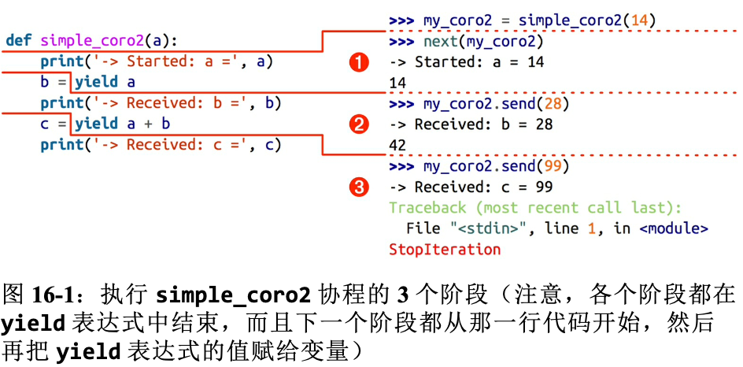
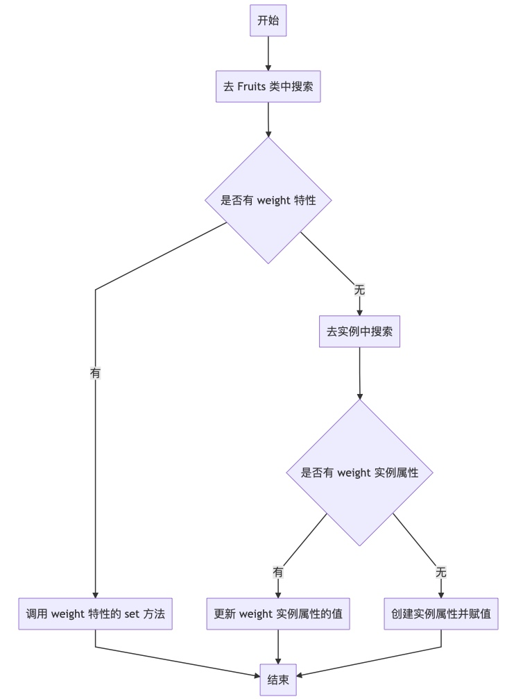

---
layout: post  
title: 2021-10-06-Python 核心
date: 2021-10-06
categories: blog
tags: [Python,编程语言]
description: 2021-10-06-Python 核心笔记
---   

# 1-Python 数据模型  
## Python 特殊方法  
Python特殊方法是为了被Python解释器所调用的，自己并不需要调用它。也就是没有MyObj.\_\_len\_\_()这种写法，而只需要调用len(MyObj)。有时候，特殊方法的调用是隐式的，比如 for i in x: 语句中，背后其实用的是iter(x)，而这个函数背后则是x.\_\_iter\_\_().  
```python  
__repr__(), __abs__(), __add__(), __mul__()
```
上面集合函数都是python特殊方法，可以理解为运算符重载。\_\_repr\_\_()表示把对象当成字符串进行输出，\_\_str\_\_()类似，但是不同的是python会先调用repr。  

如果为了判断一个值x是真还是假（例如if, while），python会调用bool(x)，也就是说需要内部实现\_\_bool\_\_()。其他的特殊方法如下：  
书P11页  

map(function, iterable): 会根据提供的函数对指定序列做映射。第一个参数 function 以参数序列中的每一个元素调用 function 函数，返回包含每次 function 函数返回值的新列表。  

filter(function, iterable): 用于过滤序列，过滤掉不符合条件的元素，返回由符合条件元素组成的新列表。该接收两个参数，第一个为函数，第二个为序列，序列的每个元素作为参数传递给函数进行判断，然后返回 True 或 False，最后将返回 True 的元素放到新列表中。  

## 不可变类型  
Python的每个对象都分为可变和不可变，主要的核心类型中，数字、字符串、元组是不可变的，列表、字典是可变的。对不可变类型的变量重新赋值，实际上是**重新创建一个不可变类型的对象，并将原来的变量重新指向新创建的对象**（如果没有其他变量引用原有对象的话（即引用计数为0），原有对象就会被回收）。

不可变类型以int类型为例:实际上 i += 1 并不是真的在原有的int对象上+1，而是重新创建一个value为6的int对象，i引用自这个新的对象。代码如下：  
```python  
>>> i = 5
>>> i += 1
>>> i
6
```

# 2-数据结构  
元组拆包作为函数参数：  
```python  
t = (20, 8)
divmod(*t)

a, b *rest = range(5)       # 只想到前两个数据
a, b, _ = (1, 2, 3)
```  

切片s[a : b : c]: 对s在a和b间以步长为c进行取值，若c为负数则反向取值。实际上是调用\_\_getitem\_\_(slice(start, stop, step))获得元素的，slice是一个获得下标序列的函数。  

## list.sort和sorted  
list.sort就地排序，会改变list，sorted会返回一个可迭代对象。
> 参数：reverse: 从大到小排序  
> key: 排序算法依照的关键字，key=func，会调用func(data)

## bisect 管理已排序的序列  
**bisect(haystack, needle)** 
在haystack里搜索needle的位置，该位置满足的条件是，把needle插入这个位置之后，haystack还能保持升序。也就是说这个函数返回的位置前面的值，都小于等于needle的值；haystack必须有序（从小到大）。

```python
import bisect
import sys

HAYSTACK = [1,4,5,6,8,12]
NEEDILES = [0, 1, 2, 5, 30]

def demo(bisect_fn):
    for needle in reversed(NEEDLES):
        position = bisect_fn(HAYSTACK, needle)
        offset = position * ' |'
        print('{0:2d} @ {1:2d}  {2}{0:<2d}'.format(needle, position, offset))

if __name__ == "__main__":
    if sys.argv[-1] = "left":
        bisect_fn = bisect.bisect_left
    else:
        bisect_fn = bisect.bisect_right     # 可以简写为bisect。bisect，别名关系
    demo(HAYSTACK)
```  

**insort(seq, item)**  
把变量item插入到seq中，并保持升序。insort也有对偶的insort_left。他们的作用是把相等的元素放在左边还是放在右边。这两个函数都有lo和hi来控制搜索的范围。  

## 数组  
数组array.array比list更高效，并且支持所有跟可变序列有关的操作，包括pop、insert和extend，另外，数组还提供从文件读取和存入文件的更快方法：frombytes和tofile。  

数组的创建需要类型码，比如'b'代表有符号字节数(-127到128)。  

## 双向队列  
collections.deque类（双向队列）是一个线程安全、可以快速从两端添加或删除元素的数据类型。
> 如果想要一种数据结构来存放“最近用到的几个元素”，deque也是一个很好的选择，这是因为在新建一个双向队列的时候可以指定这个队列的大小，如果这个队列满员了，还可以从反向端删除过期的元素，然后在尾端添加新的元素。  

常用方法：  
**rotate(num)**：向右旋转num个元素；num为负时，向左翻转。  
**append(elem)**  
**append_left(elem)**  
**extend(iter)**  
**extend_left(iter)**  

## 堆 heapq  
提供了heappush和heappop方法，让用户把可变序列当成堆队列或者优先队列。堆排序：  
```python  
def heapsort(iterable):
    h = []
    for value in iterable:
        heappush(h, value)
    return [heappop(h) for i in range(len(h))]

heapsort([1, 3, 5, 7, 9, 2, 4, 6, 8, 0])
```  

# 3-字典和集合  
只有可散列集合才能做key，值不要求是否可散列。  
> 可散列要实现__hash__()和比较函数__qe__()。原子不可变数据(str, bytes和数值类型)都是可散列类型，frozenset也是，元祖的话，只有当一个远足包含的所有元素都是可散列的，它才是可散列的。  

## 常见映射方法  
|函数|说明|
|:----:|:----:|  
|clear()|移除所有函数|
|\_\_contains__(k)|检查key是否在d中|
|copy|浅复制|  
|\_\_delitem(k)__|移除键为k的元素，相当于del d[k]|
|fromkeys(it, [initial])|将迭代器中的元素映射为key，value要么是initial要么是None|  
|get(k,[default])|返回键k的对应值，如果字典里没有键k，则返回None或者default|  
|\_\_getitem__()|同上|
|items()|返回所有键值对|
|\_\_iter__()|获取键的迭代器|
|keys()|获取所有键|
|len|长度|
|pop(k, [default])|返回键k所对应的值，然后移除这个键值对|
|popitem()|随即返回一个键值对并从字典里移除它|
|setdefault(k, [default])|若字典里有key则将值设置为default，若无，则d[k]=default|
|update(m, [**args])|m 是可叠戴器，用来更新d中的条目|
|values()|返回字典里的值|  

## collections.OrderedDict  
这个类型在添加键时会保持顺序，因此键的迭代次序总是一致的。  

## collections.Counter  
这个类型会给键准备一个整数计数器，每次更新一个键时都会增加这个计数器，或者当作多重集合来用。例如：  
```python  
import collections  

>>> ct = collections.Counter("abracadabra")
Counter({'a': 5, 'b': 2, 'r': 2, 'c': 1, 'd': 1})

>>> ct.update('aaaaazzz')
Counter({'a': 10, 'z': 3, 'b': 2, 'r': 2, 'c': 1, 'd': 1})

ct.most_common(2)
[('a', 10), ('z', 3)]
```  

## 不可变映射类型  
from type import MappingProxyType  
如果给这个类一个映射，它会返回一个只读视图，但它是动态的，这意味着如果对原映射做出改动，我们通过这个视图是可以观察到，但无法对其做出修改。  

## 集合  
Python集合分为set和frozenset，set不可散列，frozenset可以散列。集合还实现了很多孕算法，比如a | b求合集，a & b求交集，a - b 求差集。  

创建方法：  
* l = [1, 2, 3], set(l)
* l = {1, 2, 3}  
* 集合推导：{chr(i) for i in range(32, 256) if 'SIGN' in name(chr(i), '')}

# 5-一等函数  
**高阶函数**：把函数作为参数或返回值的函数，例如map, filter, reduce.  

**map**：列表中每个元素做同样的操作。  
**filter**：过滤掉不满足条件的函数。  
**reduce**:  规约，它接受两个参数，一个参数是函数fn，另一个是一个可迭代对象，fn也有两个参数。当调用reduce(fn, lst)时，fn回应用到第一对元素上，即fn(lst[0], lis[1])，生成第一个结果r1；然后fn会应用到r1和下一个元素上，即fn(r1, lst[2])，生成第二个结果r2.直到调用到最后一个元素，返回最后的结果rN。  

```python  
import functools  
# 计算5! 
functools.reduce(lambda a,b: a*b, range(1, 6))
```
 
## Lambda表达式  
Lamda表达式必须只能定义简单的表达式函数，而不能包含while, try等语句。例如：  

```python  
lambda word: word[::-1]     # 对单词进行reverse  
sorted(list, key=lambda word: word[::-1])
```  

## 可调用对象  
判断是否是可调用对象，可以使用内置函数callable()。可调用对象如下：  

* def定义或者lambda定义的函数  
* 内置函数，如len等
* 内置方法，如dict.get
* 方法，在类的定义体中定义的函数
* 类，调用类时会运行类的\_\_new__方法创建一个实例，然后运行\_\_init__方法初始化实例。
* 类的实例，如果定义了__call__方法，那么它的实例也可以调用
* 生成器函数，使用yield关键字的函数或方法，调用生成器函数返回的是生成器对象。

## 函数内省  
函数有很多属性，例如：  
|名称|类型|说明|  
|:----:|:----:|:----:|  
|\_\_annotations__|dict|参数和返回值的注解|
|\_\_call__|method-wrapper|实现()运算符；即可调用对象协议|
|\_\_closure__|tuple|函数闭包，即自由变量的绑定（通常是None）|
|\_\_code\_\_|code|编译成字节码的函数元数据和函数定义体|
|\_\_defaults__|tuple|形式参数的默认值|
|\_\_get__|method-wrapper|实现只读描述符协议|
|\_\_globals__|dict|函数所在模块的全局变量|
|\_\_kwdefaults__|dict|仅限关键字形式参数的默认值|
|\_\_name__|str|函数名称|
|\_\_qualname__|str|函数的限定名称，如Random.choice|  

## 定位参数和仅限关键字参数
一个函数可能会需要一个可变数量的参数，但同时也需要一个或多个关键字参数形式的可选项。目前，实现这一点的唯一方法是同时定义一个可变参数vargas和一个’keywords’参数（kwargs），然后手动从字典中提取出可用的关键字。

从语法上讲，本篇文章提议的更改相当简单，第一个改变是允许常规参数出现在可变参数之后（此时这个常规参数就是一个仅限关键字参数。强制性的，它只能通过关键字传参。例如下面的函数可以接受任意数量的位置参数，同时也可以接受一个关键字参数 'case_sensitive'。因为这个关键字参数选项绝对不会被位置参数填充，而是必须显式的通过名字指定填充，所以称为仅限关键字参数。
仅限关键字参数不需要有默认值， 由于Python需要将所有的参数都绑定一个值，而且将值绑定到关键字参数的唯一方法是通过这个关键字，因此这种参数是‘需要关键字的参数’。所以这些参数必须通过调用方提供，且必须通过关键字提供值。
```python  
# 传入的任意个非关键字参数都会被wordlist捕获
def sortwords(*wordlist, case_sensitive=True):
    ...
```  

第二点语法上的更改是允许省略可变参数的参数名。这意味着对于一个有仅限关键字参数的函数来说，它不会再接受一个可变参数。如下例：
```python  
def compare(a, b, *, key=None):
    ...
```  

第三个是带有关键字的，会存入成字典（变成key, value形式）：  
```python  
def compare(**param):
    ...  
```  
## 函数注解  
如下：  
```python  
def clip(text: str, max_len: 'int > 0'=80) -> str:
    return
```  

Python对注解做的唯一的事情是，把它们存储在函数__annotations__属性里。仅此而已。Python不做检查、不做强制、不做验证，什么操作都不做。  

## 抽象基类  
定义抽象基类的方法如下：  
```python  
from abc import ABC, abstractmethod

class Promotion(ABC): 
    @abstractmethod
    def discount(self, order):
        '''to be implemented'''
```

# 7-函数装饰器和闭包  
函数的装饰器用于在源码中标记函数，**以某种方式增强函数的行为**。这是一项强大的功能，但是若想掌握，必须理解闭包。  

nolocal是最新出现的保留关键字，在Python3.0引入。出了装饰器中有用处之外，闭包还是回调式异步编程和函数式编程风格的基础。  

## 装饰器的基础知识  

装饰器是**可调用的对象，其参数是另一个函数（被装饰的函数）**。装饰器可能会处理被装饰的函数，然后把它返回，或者将其替换成另一个函数或可调用对象。假如有个名为decorate的装饰器：  
```python  
@decorate
def target():
    print("running target()")
```  
上述代码的效果与下述写法一样：  
```python  
def target():
    print("running target()")

target = decorate(target)
```  

## 装饰器执行的时机  
装饰器在被装饰的函数定义之后立即运行，这通常是**导入时（也即加载模块时）**，也就是先于\_\_main__函数被调用。多数装饰器会修改被装饰的函数，通常它们会定义一个内部函数，然后将其返回，替换被装饰的函数。  

## 变量作用域规则  

1. 函数体内定义了与全局变量同名的变量，则会在函数体内将该变量视作局部变量。  

```python  
b = 6
def f2(a):
    print(a)
    print(b)
    b = 9

f2(3)
```  
输出：  
3  
Traceback (most recent call last):  
  File "\<stdin\>", line 1, in \<module\>  
  File "\<stdin\>", line 3, in f2
UnboundLocalError: local variable 'b' referenced before assignment  
原因：Python变异函数的定义体时，它判断b是局部变量，因为在函数中给它赋值了。如果在函数中赋值时想让解释器把b当成全局变量，要使用global声明：  
```python  
b = 6  
def f3(a):
    global b
    print(a)
    print(b)
    b = 9

f3(3)
```  
输出：  
3  
6  

> 可以比较字节码：  
> from dis import dis
> dis(f1)
> 0 LOAD_GLOBAL 0 (print)
> 3 LOAD_FAST   0 (a)
> 6 CALL_FUNCTION 1 (1 positional, 0 key word pair)  
> ...

## 闭包  
只有涉及嵌套函数时才有闭包问题。  

闭包指延伸了作用域的函数，指的是函数定义体中引用、但是不在定义体中定义的非全局变量。函数是不是匿名的没关系，关键是它能访问定义体之外定义的非全局变量。  

## nonlocal声明  

下面是一个问题代码：  
```python  
def make_averager():
    count = 0
    total = 0
    def averager(new_value):
        count += 1
        total += new_value
        return total / count

    return averager
```  

尝试运行如下代码：  
```shell  
>>> avg = make_averager()
>>> avg(10)  
Traceback (most recent call last):  
...  
UnboundLocalError: local variable 'count' referenced before assignment  
```  

原因：Python中数字是不可变类型，执行count += 1时，实际上是count = count + 1一样。因此我们在averager的定义体中count赋值了，这相当于产生一个新的变量，然后将count与新的变量绑定，此时count变成了局部变量。而列表是可变类型。对于不可变类型（数字、字符串、元组），只能读取，不能更新，如果尝试重新绑定则相当于创建一个局部变量count，这样count就相当于局部变量而不是自由变量，因此不会保存在闭包中。  

为了解决这个问题，Python3引入了nonlocal关键字，它的作用是把变量标记为自由变量，这样即使变量被更新也还是自由变量。    

正确的例子：  
```python  
def make_averager():
    count = 0
    total = 0
    def averager():
        nonlocal count, total
        count += 1
        total += new_value
        return total / count  
    
    return averager  
```  
闭包中的变量相当于father函数创建了一个对象返回，也就是不同返回值的闭包变量不共享。例如：  
```python  
def father():
    num = 1
    def son():
        nonlocal num
        num += 1
        return num
    return son

f1 = father()
print(f1())
print(f1())
f2 = father()
print(f2())

# 输出
2
3
2
```
## functools.wraps装饰器  
上面的装饰器掩盖了被装饰函数的\_\_doc__和\_\_name__属性，使用functools.wraps装饰器能够把相关的属性从被装饰的函数复制到返回的函数中，此外还能处理关键字参数（上面的不可以）。  

例子：  
```python  
import time  
import functools  

def clock(func):
    @functools.wraps(func)  # 这其实也是个装饰器，用来复制各个参数的
    def clocked(*args, **kwargs):
        t0 = time.time()
        result = func(*args, **kwargs)  
        elapsed = time.time() = t0  
        name = func.__name__  
        arg_lst = []
        if args:  
            arg_lst.append(', '.join(repr(arg) for arg in args))  
        
        if kwargs:  
            pairs = ['%s=%r' % (k, w) for k, w in sorted(kwargs.items())]  
            arg_lst.append(', '.join(pairs))
        arg_str = ', '.jpoin(arg_lst)
        print('[%0.8fs] %s(%s) -> %r' % (elapsed, name, arg_str, result))
        return result  
    
    return clocked
```  

一个标准例子：  
```python  
from functools import wraps
def decorator_name(f):
    @wraps(f)           # @wraps接受一个函数来进行装饰，并加入了复制函数名称、注释文档、参数列表等等的功能。
    def decorated(*args, **kwargs):
        if not can_run:
            return "Function will not run"
        return f(*args, **kwargs)
    return decorated
 
@decorator_name
def func():
    return("Function is running")
 
can_run = True
print(func())
# Output: Function is running
 
can_run = False
print(func())
# Output: Function will not run
```
装饰器类：  
```python  
from functools import wraps
 
class logit(object):
    def __init__(self, logfile='out.log'):
        self.logfile = logfile
 
    def __call__(self, func):
        @wraps(func)
        def wrapped_function(*args, **kwargs):
            log_string = func.__name__ + " was called"
            print(log_string)
            # 打开logfile并写入
            with open(self.logfile, 'a') as opened_file:
                # 现在将日志打到指定的文件
                opened_file.write(log_string + '\n')
            # 现在，发送一个通知
            self.notify()
            return func(*args, **kwargs)
        return wrapped_function
 
    def notify(self):
        # logit只打日志，不做别的
        pass
```

## 标准库中的装饰器  

### 使用functools.lru_cache记忆化搜索  
functools.lru_cache是非常实用的装饰器，它实现了备忘(memorization)功能。这是一项优化技术，它把耗时的结果保存起来，避免传入相同的参数时重复计算。LRU代表着缓存不会无限增长，一段时间不用的缓存条目会被扔掉。  

生成第n个斐波那契慢速递归可以使用lru_cache，如下：  
```python  
import functools  

# 之前自己定义的计时操作  
from clockdeco import clock

@functools.lru_cache()            # --> 1
@clock                            # --> 2
def fibonacci(n):
    if n < 2:
        return n
    return fibonacci(n-2) + fibonacci(n-1)

if __name__ == "__main__":  
    print(fibonacci(6))
```  
**1**: 这里必须带括号，因为装饰器里可以接受参数。
**2**: 这里叠放装饰器，@lru_cache()应用到@clock返回的函数上。  

lrc_cache可以使用两个可选的参数来配置。它的签名是：  
```python  
functools.lru_cache(maxsize=128, typed=False)
```  
typed参数表示把不同参数类型分开包村还是保存成一个变量(如1和1.0)。lru_cache使用字典存储结果，而且键根据传入的定位参数和关键字参数创建，所以被lru_cache装饰的函数，它的所有参数都必须是可散列的。  

### 单分派泛函数  
我们是想根据传入的参数按照不同的类型返回不同的字符串结果，因为Python不支持函数重载，所以可以使用Python的singleddispatch装饰器。示例：  
```python  
from functools import singledispatch  
from collections import abc
import numbers
import html  

@singledispatch                         # ---> 1
def htmlize(obj):
    content = html.escape(repr(obj))
    return '<pre>{}</pre>'.format(content)

@htmlize.register(str)                  # ---> 2
def _(text):                            # ---> 3
    content = html.escape(text).replace('\n', '<br/>\n')
    return '<p>{0}</p>'.format(content)

@htmlize.register(numbers.Integral)     # ---> 4
def _(n):
    return '<pre>{0} (0x{0:x})</pre>'.format(n)

@htmlize.register(tuple)                # ---> 5
@htmlize.register(abc.MutableSequence)
def _(seq):
    inner = '<li>\n</li>'.join(htmlize(item) for item in seq)
    return '<ul>\n<li> '+ inner +'<li/> \n </ul>' 
```  
**1**: @singledispatch标记处理object类型的基函数。  
**2**: 各个专门函数使用@\<\<base_function>>.register(\<\<type>>)装饰。  
**3**: 专门函数的名称无关紧要；\_是个不错的选择  
**4**: 为每个需要特殊处理的类型注册一个函数。numbers.Integral是int的虚拟超类。  
**5**: 可以叠放多个register装饰器，让同一个函数支持不同类型。  

## 参数化装饰器
如何实现参数化装饰器？答案是创建一个装饰器工厂函数，把参数传给它，返回一个装饰器，然后再把它应用到要装饰的函数上。例子：  

```python  
registry = set()
def register(activate=True):
    def decorate(func):      # 这个是真正的装饰器，输入是函数，输出是函数
        print("running register(activate=%s)->decorate(%s)"%(active, func))

        if active:
            registry.add(func)
        else:
            registry.discard(func)
        return func
    
    return decorate

@register(active=False)
def f1():
    print("running f1()")

@register()
def f2():
    print("running f2()")

def f3():
    print("runningf3()")
```  
这里的关键是register()要返回decorate，然后把它应用到被装饰的函数上。  


# 8-对象引用、可变形和垃圾回收  
Python变量不是盒子，而是存储空间的一个引用。  

## ==和is之间的选择  
\=\=运算符比较两个对象的值（对象中保存的数据），而is比较对象的标识。通常只关注值，所以\=\=出现的频率高。  
在变量和单例值之间比较时，应该使用is。比如最长使用is检查变量绑定的值是不是None，下面是推荐写法：  
```python  
x is None
```  
否定是：  
```python  
x is not None  
```  

实际上\=\=是语法糖，等同于a.\_\_eq\_\_(b)。继承自object的\_\_eq\_\_()方法，但多数内置类型使用更有意义的方式覆盖了\_\_eq\_\_()。  

## 默认做浅复制  
构造方法或者[:]做的都是浅复制（即复制了最外层容器，副本中的元素是源容器中元素的引用）。  

**为任意对象做深复制**：  
copy模块提供deepcopy()和copy()函数能为任意对象做深复制和浅复制。  
```python  
import copy  

l = ["alice", "bob"]
new_list = copy.deepcopy(l)
```  

## 函数的参数作为引用时  
* Python函数传参数传递的是引用。  
* 不要使用可变类型作为参数默认值（def aaa(l=[]))  

## del 和垃圾回收  
对象不会自行销毁；然而，无法得到对象时，可能会被当作垃圾回收。  
del语句删除名称，而不是对象。del命令可能会导致对象被当作垃圾回收，但是仅当删除的变量保存的是对象的最后一个引用，或者无法得到对象时。重新绑定也可能会导致对象的引用数量归零，导致对象被销毁。  

> 有个\_\_del\_\_特殊方法，但是它不会销毁实例，不应该在代码中调用。即将销毁实例时，Python解释器会调用\_\_del\_\_方法，给实例最后的机会释放外部资源。  

在CPython中，垃圾回收使用的主要算法是引用计数。实际上每个对象会统计有多少引用指向自己。当引用计数归零时，对象立即就被销毁。


### Python 垃圾回收机制  
python 采用的是**引用计数**机制为主，**标记 - 清除**和**分代收集**两种机制为辅的策略。  

**引用计数**：  
* Python 语言默认采用的垃圾收集机制是『引用计数法 Reference Counting』，该算法最早 George E. Collins 在 1960 的时候首次提出，50 年后的今天，该算法依然被很多编程语言使用。
* 『引用计数法』的原理是：每个对象维护一个ob_ref字段，用来记录该对象当前被引用的次数，每当新的引用指向该对象时，它的引用计数ob_ref加1，每当该对象的引用失效时计数ob_ref减1，一旦对象的引用计数为0，该对象立即被回收，对象占用的内存空间将被释放。
* 它的缺点是需要额外的空间维护引用计数，这个问题是其次的，不过最主要的问题是它不能解决对象的 “循环引用”，因此，也有很多语言比如 Java 并没有采用该算法做来垃圾的收集机制。  

**导致引用计数 +1 的情况：**
* 对象被创建，例如 a=23
* 对象被引用，例如 b=a
* 对象被作为参数，传入到一个函数中，例如func(a)
* 对象作为一个元素，存储在容器中，例如list1=[a,a]

**导致引用计数-1 的情况：**
* 对象的别名被显式销毁，例如del a
* 对象的别名被赋予新的对象，例如a = 24
* 一个对象离开它的作用域，例如 f 函数执行完毕时，func函数中的局部变量（全局变量不会）
* 对象所在的容器被销毁，或从容器中删除对象

**循环引用导致内存泄漏:**
```python  
def f2():
    '''循环引用'''
    while True:
        c1=A()
        c2=A()
        c1.t=c2
        c2.t=c1
        del c1
        del c2
```  

虽然它们两个的对象都是可以被销毁的，但是由于循环引用，导致垃圾回收器都不会回收它们，所以就会导致内存泄露。（del关键字是删除名字，这个名字不再绑定变量了）。

**标记-清除解决循环引用：**  
Python采用了“标记-清除”(Mark and Sweep)算法，解决容器对象可能产生的循环引用问题。(注意，只有容器对象才会产生循环引用的情况，比如列表、字典、用户自定义类的对象、元组等。而像数字，字符串这类简单类型不会出现循环引用。作为一种优化策略，对于只包含简单类型的元组也不在标记清除算法的考虑之列)。

跟其名称一样，该算法在进行垃圾回收时分成了两步，分别是：
* A）标记阶段，遍历所有的对象，如果是可达的（reachable），也就是还有对象引用它，那么就标记该对象为可达；
* B）清除阶段，再次遍历对象，如果发现某个对象没有标记为可达，则就将其回收。  

  

对象之间通过引用（指针）连在一起，构成一个有向图，对象构成这个有向图的节点，而引用关系构成这个有向图的边。从**根对象**（root object）出发，沿着有向边遍历对象，可达的（reachable）对象标记为活动对象，不可达的对象就是要被清除的非活动对象。根对象就是全局变量、调用栈、寄存器。 mark-sweepg 在上图中，我们把小黑圈视为全局变量，也就是把它作为 root object，从小黑圈出发，对象 1 可直达，那么它将被标记，对象 2、3 可间接到达也会被标记，而 4 和 5 不可达，那么 1、2、3 就是活动对象，4 和 5 是非活动对象会被 GC 回收。  

**分代回收：**  
在循环引用对象的回收中，整个应用程序会被暂停，为了减少应用程序暂停的时间，Python 通过“**分代回收**”(Generational Collection)以空间换时间的方法提高垃圾回收效率。

分代回收是基于这样的一个统计事实：**对于程序，存在一定比例的内存块的生存周期比较短；而剩下的内存块，生存周期会比较长，甚至会从程序开始一直持续到程序结束。生存期较短对象的比例通常在 80%～90% 之间，这种思想简单点说就是：对象存在时间越长，越可能不是垃圾，应该越少去收集。这样在执行标记-清除算法时可以有效减小遍历的对象数，从而提高垃圾回收的速度。**

python gc给对象定义了三种世代(0,1,2),每一个新生对象在generation zero中，如果它在一轮gc扫描中活了下来，那么它将被移至generation one,在那里他将较少的被扫描，如果它又活过了一轮gc,它又将被移至generation two，在那里它被扫描的次数将会更少。

gc的扫描在什么时候会被触发呢?答案是当某一世代中被分配的对象与被释放的对象之差达到某一阈值的时候，就会触发gc对某一世代的扫描。值得注意的是当某一世代的扫描被触发的时候，比该世代年轻的世代也会被扫描。也就是说如果世代2的gc扫描被触发了，那么世代0,世代1也将被扫描，如果世代1的gc扫描被触发，世代0也会被扫描。

该阈值可以通过下面两个函数查看和调整:  
```python  
gc.get_threshold() # (threshold0, threshold1, threshold2).
gc.set_threshold(threshold0[, threshold1[, threshold2]])  
```  

下面对set_threshold()中的三个参数threshold0, threshold1, threshold2进行介绍。gc会记录自从上次收集以来新分配的对象数量与释放的对象数量，当两者之差超过threshold0的值时，gc的扫描就会启动，初始的时候只有世代0被检查。如果自从世代1最近一次被检查以来，世代0被检查超过threshold1次，那么对世代1的检查将被触发。相同的，如果自从世代2最近一次被检查以来，世代1被检查超过threshold2次，那么对世代2的检查将被触发。get_threshold()是获取三者的值，默认值为(700,10,10).  

# 9-Python 风格的对象  

## classmethod 与 staticmethod装饰器  

* classmethod: 原则上，类方法是将类本身作为对象进行操作的方法。假设有个方法，且这个方法在逻辑上采用类本身作为对象来调用更合理，那么这个方法就可以定义为类方法。另外，如果需要继承，也可以定义为类方法。第一个参数必须是当前类对象，该参数名一般约定为“cls”，通过它来传递类的属性和方法（不能传实例的属性和方法）
* staticmethod: 静态方法是类中的函数，不需要实例。静态方法主要是用来存放逻辑性的代码，逻辑上属于类，但是和类本身没有关系，也就是说在静态方法中，不会涉及到类中的属性和方法的操作。可以理解为，静态方法是个独立的、单纯的函数，它仅仅托管于某个类的名称空间中，便于使用和维护。参数随意，没有“self”和“cls”参数，但是方法体中不能使用实例的属性和方法；可以调用类的属性和方法（不建议）.  

## Python私有属性和“受保护的”属性  
Python会有一个私有属性，用\_\_变量名表示，如果按照这样给实例命名，Python就会把属性名的实例存放在\_\_dict\_\_属性中，而且会在前面加上一个下划线和类名。这个语言特性被称为名称改写。  

> 例如Dog类来说，\_\_mood会变成\_Dog\_\_mood。

Python解释器不会对单个下划线的属性名做特殊处理，不过这是很多Python程序员严格遵守的约定。单个下划线的变量是受保护的变量，类似于C++的protected。  

# 10-散列和切片  
对于一个类，如果实现了\_\_len\_\_()和\\_\_getitem\_\_()，那么就可以实现切片了。例如：  

```python  
class MySeq:
    def __getitem__(self, index):
        return index  

>>> s = MySeq()
>>> s[1]
1
>>> s[1:4]
slice(1, 4, None)  
>>> s[1:4:2]  
slice(1, 4, 2)
>>> s[1:4:2, 9]  
(slice(1, 4, 2), 9)  
>>> s[1:4:2, 7:9]
(slice(1, 4, 2), slice(7, 9, None)) 
```  

## zip函数  
zip() 函数用于将可迭代的对象作为参数，将对象中对应的元素打包成一个个元组，然后返回由这些元组组成的列表。

如果各个迭代器的元素个数不一致，则返回列表长度与最短的对象相同，**利用 \* 号操作符**，可以将元组解压为列表。  

```python  
zip([iterable, ...])  

>>> a = [1,2,3]
>>> b = [4,5,6]
>>> c = [4,5,6,7,8]
>>> zipped = zip(a,b)     # 打包为元组的列表
[(1, 4), (2, 5), (3, 6)]
>>> zip(a,c)              # 元素个数与最短的列表一致
[(1, 4), (2, 5), (3, 6)]
>>> zip(*zipped)          # 与 zip 相反，*zipped 可理解为解压，返回二维矩阵式
[(1, 2, 3), (4, 5, 6)]
```  

# 11-接口和协议  
> 鸭子类型：“**当一只鸟走起来像鸭子，游泳像鸭子，叫起来像鸭子，那么这只鸟就能被称为鸭子**”,关注点在对象的行为，而不是类型；如file，StringIO，socket都支持read/write方法（file类型）;定义了__iter__就可以用for迭代假设一个可变列表的类型，

> 猴子补丁：monkey patch，就是运行时替换

猴子补丁例子：  
```python  
def set_card(deck, position, card):
    deck._cards[position] = card

>>> FrenchDeck.__setitem__ = set_card
# 此时将调用setitem时将运行set_card的方法。
```  

## 定义并使用抽象基类  
```python
import abc  

class Tombola(abc.ABC):  
    @abc.abstractmethod
    def load(self, iterable):
        '''
            文档说明
        '''  
    @abc.abstractmethod
    def pick(self):
        '''
            文档说明
        '''
    
    def loaded(self):
        return bool(self.inspect())
    
    def inspect():
        '''
        文档说明
        '''
```  
1. 自己定义的抽象基类要继承abc.ABC.
2. 抽象方法使用@abstractmethod装饰器标记。
3. 抽象基类可以包含具体方法。
4. 抽象基类中的具体方法只能依赖抽象基类定义的借口（即只能使用抽象基类中的其他具体方法、**抽象方法**或特性）。

## 虚拟子类  
**真实子类 vs 虚拟子类**  
虚拟子类，不会从父类继承任何方法或属性,所以叫做虚拟子类，真实子类的继承就会继承父类的东西，多数情况下都是用真实子类，虚拟子类的作用只是为了说明继承关系，不会用到父类的代码。

　　通过真实子类定义我们可以看到，子类继承自父类，所以拥有父类许多属性，且子类的__bases__属性保存的是父类。更进一步地，如果父类是抽象基类，且具有抽象方法，那么真实子类必须实现所有的抽象方法，否则不可以实例化。而虚拟子类是指某个类提供了一个注册方法，可以指定某个其他类为自己的子类。这样，**这个“虚拟子类”除去在issubclass判断时返回True，其他任何地方都和所谓的父类没有关系**（因为仅仅注册了一下）。在Python中，抽象基类提供了register方法，允许我们通过注册的方式指明子类的抽象类别：  

　　当我们向抽象基类注册一个虚拟子类时，ABCMeta会将该类保存于_abc_registry属性中。每当通过issubclass检查时，最后会检查该属性。WHY虚拟子类。  

　　虚拟子类是抽象基类动态性的体现，也是符合Python风格的方式。**它允许我们动态地，清晰地改变类的属别关系**。 抽象基类定义了一系列方法，并给出了方法应当实现的功能，在这一层次上，“白鹅类型”能够将类进行甄别。当一个类继承自抽象基类时，语言本身限制了该类必须完成抽象基类定义的语义；当一个类注册为虚拟子类时，限制则来自于编写者自身（成年人）。两种类都能通过“白鹅类型”的校验，不过虚拟子类提供了更好的灵活性与扩展性。例如，一个框架允许第三方插件时，采用虚拟子类即可以明晰接口，又不会影响内部的实现。

**注册虚拟子类**  
有两种方法，一种是将register当作函数调用，一种是当作装饰器。  

```python  
from random import randrange
from tombola import Tombola  

@Tombola.register                                           # --> 1
class TomboList(list):                                      # --> 2
    def pick(self):
        if self:                                            # --> 3
            position = randrange(len(self))
            return self.pop(position)                       # --> 4
        else:
            raise LookupError('pop from empty TomboList')
    
    load = list.extend                                      # --> 5

    def loaded(self):
        return bool(self)                                   # --> 6
    
    def inspect(self):
        return tuple(sorted(self))
```  
1. 把Tombolist注册为Tombola的虚拟子类。
2. Tombolist扩展list
3. Tombolist从list中继承__bool__方法，列表不为空时返回True
4. pick调用继承自list的self.pop方法，传入一个随机的元素索引。
5. Tombolist.load与list.extend一样
6. loaded方法委托bool函数

当然也可以当作函数调用注册为虚拟子类  
```python  
Sequence.register(tuple)
Sequence.register(str)
Sequence.register(range)
Sequence.register(memoryview)
```

### \_\_subclasses\_\_()  
这个方法返回类的直接子类列表，不含虚拟子类。

### \_abc\_registry  
只有抽象基类有这个数据属性，其值是一个WeakSet对象，即抽象类注册的虚拟子类的弱引用。  

## Python是动态强类型语言  
**强类型和弱类型**  
如果一门语言很少隐式转换类型，说明它是强类型语言；如果经常这么做，说明它是弱类型语言。Java、C++、Python是强类型语言，PHP、javascript和Perl是弱类型语言。  

强类型能够及早发现缺陷。

因为Python不会在字符串和数字之间强制转换，所以Python中0 == '' 是false，<符号会报错。  

**静态类型和动态类型**  

在编译时检查类型的语言是静态类型语言，在运行时检查类型的语言是动态类型语言。静态类型需要声明类型（部分现代语言使用类型推导避免部分类型声明）。  

静态类型使得一些工具（编译器或者IDE）便于分析代码、找出错误和提供其他服务（优化、重构等）。动态类型便于代码重用，代码行数更少，而且能让接口自然成为协议而不提早实行。


> GO 语言真正实现了鸭子类型，它会检查函数的名称和签名，而我们自己从不需要继承或注册抽象基类。  


# 12-继承的优缺点  

## 子类化内置类型  
* 子类化内置类型不会调用用户定义的类覆盖的**特殊方法**。  

例如\_\_getitem\_\_()不会被覆盖。  

* 内置类型的子类覆盖方法不会被隐式调用。

例如dict的子类覆盖的\_\_getitem\_\_()方法不会被内置类型的get()方法调用。  

## 多重继承和方法解析顺序  
任何实现多重继承的语言都要处理潜在的命名冲突，这种冲突由不相关的祖先类实现同名方法引起。这种冲突称为“菱形问题”。如下图所示：  
  

例子：  
```python  
class A:
    def ping(self):
        print('ping: ', self)

class B(A): 
    def pong(self):
        print('pong: ', self)

class C(A):
    def pong(self):
        print('PONG', self)

class D(B, C):
    def ping(self):
        super().ping()
        print('post-ping: ', self)

    def pingpong(self):
        self.ping()
        super().ping()
        self.pong()
        super.pong()
        C.pong(self)

```  

**重名问题：**  
若D实例调用pong()方法，C++中必须使用类名限定方法调用来避免歧义，Python也必须这么做，例如：  
```python  
>>> d = D()
>>> d.pong()                        # 默认调用第一个继承的pong方法
pong: <diamond.D>
>>> C.pong(d)                       # 显示调用第二个继承的方法
PONG: <diamond.D>
```  
超类的方法都可以直接调用，此时要把实例作为显式参数传入。  

**方法解析顺序**
Python会按照特定的顺序遍历继承图。这个顺序叫方法解析顺序(Method Resolution Order, MRO)。类都有一个名为\_\_mro\_\_的属性，它的值是一个元组，按照方法解析顺序列出各个超类，从当前类一直向上，直到object类。注意，是按照BFS顺序遍历的。  

D类的\_\_mro\_\_属性如下：  
```python
>>> D.__mro__  
(<class 'diamond D'>,<class 'diamond B'>,<class 'diamond C'>,<class 'diamond A'>,<class 'object'>)
```  

**绕过内置的super函数，直接调用超类的某个方法**：  
直接在类上调用实例方法时，必须显式传入self参数，因为这样访问的是**未绑定方法**(unbounded method).
```python  
def ping(self):
    A.ping(self)        # 而不是super().ping()
    print('post-ping: ', self)

```  

**解析过程**：  
```python  
>>> d = D()
>>> d.pingpong()  
ping                        # 调用self.ping()
post-ping                   
ping                        # 调用super().ping()，跳过D类的ping方法找到A类的ping方法
pong                        # 调用self.pong()，根据__mro__找到的是B类实现的pong方法
pong                        # 调用super().pong
PONG                        # 调用C.pong(self)，忽略__mro__，找到的是C类实现的pong方法
```  

# 14-迭代器和生成器  
yield关键字用于构建生成器，其作用与迭代器一样。  

## 序列可以迭代的原因：iter函数  
解释器需要迭代对象x时，会自动调用iter(x)。内置iter函数有以下作用：  
1. 检查对象是否实现了\_\_iter\_\_()方法，如果实现了就调用它，获取一个迭代器。
2. 如果没有实现\_\_iter\_\_方法，但是实现了\_\_getitem\_\_方法，Python会创建一个迭代器，尝试按顺序(从索引0开始)获取元素。
3. 如果尝试失败，Python抛出TypeError异常。  

使用iter内置函数可以获得迭代器的对象。如果对象实现了能返回迭代器的\_\_iter\_\_方法，那么对象就是可迭代的。实现了\_\_getitem\_\_方法并且索引从0开始的也是可迭代的。  

对于一个for循环：  
```python  
>>> s = 'ABC'
>>> for char in s: 
>>>    print(char)  
```  

等价于：  
```python  
>>> s = 'ABC'  
>>> it = iter(s)
>>> while True: 
        try:
            print(next(it))
        except StopIteration: 
            del it
            break
```  

注意区分可迭代对象和迭代器。  

生成器函数：只要Python函数的定义体里有yield关键字，该函数就是生成器函数。调用生成器函数时，会返回一个生成器对象，也就是说，生成器函数是生成器工厂。  

示例1:  
```python  
import re
import reprlib

class Sentence:
    def __init__(self, text):
        self.text = text
        self.words = RE_WORD.findall(text)
    
    def __repr__(self):
        return 'Sentence(%s)' % reprlib.repr(self.text)

    def __iter__(self):
        for word in self.words:
            yield word
        return
```

yield表示每次产出word。  

第二个例子：  
```python  
def gen_123():
    yield 1
    yield 2
    yield 3

>>> g = gen_123()
>>> for i in gen_123():
>>>    print(i)
# 输出：  
1
2
3
```  

生成器函数工作原理：生成器函数会创建一个生成器对象，包装生成器函数的定义体。把生成器传给next(...)函数时，生成器函数会向下，执行函数定义体中的下一个yield语句，返回产出的值，并在函数定义体中的位置暂停。最终函数定义体返回时，外层的生成器对象会抛出StopIteration异常。  

# 15-上下文管理器和else块  
else子句不仅能在if语句中使用，还能在for、while和try语句中使用。if/else的语义和for/else, while/else, try/else差别很大，后三个差别不大。  

for  
&nbsp; &nbsp; &nbsp; &nbsp;仅当for循环运行完毕时（即for循环没有被break语句中止）才运行else块。  

while  
&nbsp; &nbsp; &nbsp; &nbsp;仅当while循环因为条件为假值而退出时（while循环没有被break语句中止）才运行else块。 

try  
&nbsp; &nbsp; &nbsp; &nbsp;仅当try块没有异常抛出时才运行else块。else子句抛出的异常不会由前面的except子句处理。   

> else本来语句含义是要么做这个要么做那个，但是在后三种情况里确实运行这个循环，然后做那件事，语义有一些不符。

正确的try语句：  
```python  
try:  
    dangerous_call()
except OSError
    log(...)  
else: 
    after_call()
```  

## 上下文管理器和with块  
上下文管理器对象存在的目的是管理with语句，就想迭代器的存在是为了管理for语句一样。  
with语句的目的是简化try/finally模式。这种模式用于保证一段代码运行完毕后执行某项操作，即便那段代码由于异常、return或sys.exit()调用而中止，也会执行指定的操作。  

上下文管理器协议包含\_\_entre\_\_和\_\_exit\_\_两个方法。with语句开始运行时，会在上下文管理器对象上调用\_\_enter\_\_方法。with语句结束运行后，会在上下文管理器对象上调用\_\_exit\_\_方法，以此扮演finally子句的角色。  

一个例子：  
```python  
with open('mirror.py') as fp:                   -> 1
    src = fp.read(60)                           -> 2

len(src)
>>> 60
fp                                              -> 3
>>> ValueError: I/O operation on closed file
```  

1: fp 绑定到打开的文件上，因为文件的\_\_enter\_\_方法返回self
3: 变量fp仍可用，但是with块的末尾隐式调用了TextIOWrapper.\_\_exit\_\_方法关闭了。  

上面的例子中， **1**的那行代码很重要：执行with后面的表达式得到的结果是上下文管理器对象，然后上下文管理器对象调用\_\_enter\_\_方法返回的结果绑定到as子句的后面。  

也就是open()函数返回TextIOWrapper类的实例，而该实例的\_\_enter\_\_方法返回self。不过，\_\_enter\_\_方法除了返回上下文管理器外，还可能返回其他对象。不管控制流程以哪种方式退出with块，都会在上下文管理器对象上调用\_\_exit\_\_方法，而不是在\_\_enter\_\_方法返回的对象上调用。  

**一个上下文管理器类**  
```python  
class LookingGlass:
    def __enter__(self):
        import sys
        self.original_write = sys.stdout.write
        sys.stdout.write = self.reverse_write
        return 'JABBERWOCKY'
    
    def reverse_write(self, text):
        self.original_write(text[::-1])

    def __exit__(self, exc_type, exc_value, traceback):
        import sys
        sys.stdout.write = self.original_write
        if exc_type is ZeroDivisionError:  
            print("Please DO NOT divid by zero")
            return true  

# 使用  
>>> with LookingGlass() as what:
>>>    print('Alice, Kitty and Snowdrop')
>>>    print(what)
pordwonS dna yttiK ,ecilA
YKCOWEBBAJ
>>> what  
'JABBERWOCKY'
>>> print('Back to normal.')
Back to normal


```  

* Python 调用\_\_enter\_\_方法时不传入其他参数。
* 上面把sys.stdout.write方法保存在一个实例属性中，供后面使用。并且为sys.stdout.write打了猴子补丁，替换成自己编写的方法。
* \_\_enter\_\_返回'JABBERWOCKY'字符串，这样才能在as语句中绑定给变量
* with 结束后返回到原始的输出流。
* 如果一切正常，Python调用\_\_exit\_\_方法时传入的参数是None, None, None；如果抛出异常，这三个参数是异常数据  

## 使用@contextmanager装饰器  
@contextlib.contextmanager 装饰器是将函数包装成一个上下文管理器，这样就不用额外创建一个类来进行上下文管理。  

在使用contextlib.contextmanager装饰器的生成器中，yield语句的作用是把函数的定义体分割为两部分，yield语句前面的所有代码在with块开始时（即解释器调用\_\_enter\_\_方法时执行，yield语句后面的代码在with块结束时（即调用\_\_exit\_\_方法时执行。yield产生的数值被返回给as语句的变量）。  

例子：  
```python  
import contextlib  

@contextlib.contextmanager  
def looking_glass():
    import sys
    original_write = sys.stdout.write

    def reverse_write(text):
        original_write(text[::-1])
    
    sys.stdout.write = reverse_write
    yield 'JABBERWOCK'
    sys.stdout.write = original_write
```  

## 协程  
协程与生成器类似，都是定义体中包含yield关键字的函数，可是在协程中yield通常在表达式的右侧，可以产出值也可以不产出值。如果yield关键字后面没有表达式，则生成器产出None。协程可能会从调用方接受数据，调用房传递数据的方式是.send(data)，而不是next(...).  

根本上讲，yield关键字是一种控制流程。  

例子：  
```python  
def simple_coroutine():
    print('-> coroutine started')
    x = yield
    print('-> coroutine received:', x)

>>> my_coro = simple_coroutine()
>>> my_coro
<generator object simple_coroutine at 0x100c2de10>

>>> next(my_coro)
-> coroutine started
>>> my_coro.send(42)
-> coroutine received: 42
Traceback (most recent call last): 
...
StopIteration
```  
* 协程使用生成器函数定义，定义体中有yield关键字。
* yield在表达式中使用，如果协程只需从客户那里接受数据，那么产出的值是None，这个值是隐式指定的，因为yield关键字右边没有表达式。
* 与创建生成器的方式一样，调用函数得到生成器对象。
* 首先调用next()函数，因为生成器还没启动，没在yield语句处暂停，所以一开始无法发送数据。
* 调用.send方法后，协程定义体yield表达式会计算出42，现在协程会恢复，一直运行到下一个yield表达式，或者终止。这里控制权流动到协程定义体末尾，导致生成器像往常一样抛出StopIteration异常。  

协程可以身处四个状态中的一个。当前状态可以使用inspect.getgeneratorstate(...)函数确定，该函数会返回下述四个字符串中的一个：    

'GEN_CREATED': 等待开始执行  
'GEN_RUNNING': 解释器正在执行（只有多线程才可以看到）  
'GEN_SUSPEND': 在yield表达式处暂停
'GEN_CLOSED': 执行结束  

一个例子：  
  

注意：=运算符右边先运算，那么也就是b = yield a意味着先暂停程序，然后等再次激活时才进行赋值。  


## 预激协程的装饰器  
调用协程之前一定要next(my_coro)，所以为了简化写成的用法，有时会使用一个预激装饰器。例子：  
```python  
from functools import wraps

def coroutine(func):
    """
        装饰器：向前直行到第一个'yield'表达式，预激'func'
    """  
    @wraps(func)
    def primer(*args, **kwargs):
        gen = func(*args, **kwargs)
        next(gen)
        return gen
    return primer
```  

## 终止协程和异常处理  
协程中未处理的异常会向上冒泡，传给next函数或send方法的调用方：  
```python  
>>> coro_avr = average()
>>> coro_avr.send(40)
40.0
>>> coro_avg.semd(50)
45.0
>>> coro_avg.send('spam')
Traceback (most recent call last):
    ...
TypeError: unsupported operand type(s) for +=: 'float' and 'str'

>>> coro_avg.send(60)
Traceback (most recent call last):
  File "<stdin>", line 1, in<module>
StopIteration  
```  
出错的原因是'spam'值不能和浮点数相加。  
上面的例子暗示了一个事实：发送某个哨符值，让协程退出。内置的None和Ellipsis等常量经常用做哨符值。当然，Python也可以在生成器对象上调用个下面两个方法，显式把异常发给协程，分别是throw和close。  

* generator.throw(exc_type[, exc_value[, traceback]]): 致使生成器在暂停的yield表达式处抛出指定的异常。如果生成器处理了抛出的异常，代码会向前执行到下一个yield表达式，产出的值会返回给throw。如果没有处理抛出的异常，异常会向上冒泡，直到被调用方处理。  

* generator.close(): 致使生成器在暂停的yield表达式处抛出GeneratorExit异常。如果生成器没有处理这个异常，或者抛出了StopIteration异常（通常是指运行到结尾），调用方不会报错，如果收到GeneratorExit异常，生成器一定不能产出值，否则解释器会抛出RunTimeError异常。


## 使用 yield from  
yield from是新的关键字。yield from x表达式第一件事是调用iter(x)，从中获取迭代器，所以x可以是任何可迭代对象。  

例子：  
```python  
def gen():
    for c in 'AB':
        yield c
    for i in range(1, 3):
        yield i
>>> list(gen())
['A', 'B', 1, 2]  

# 上面等价于下面：  
def gen():
    yield from 'AB'
    yield from range(1, 3)
>>> list(gen())
['A', 'B', 1, 2]
```  

实际上，在asyncio里，yield from 是一个阻塞操作，yield from x表示阻塞，等到x过程send回来返回值后才继续向下进行。x过程是一个序列，也就是一系列的动作。
# 16-Python 并发  
Python（特指 CPython）的多线程的代码并不能利用多核的优势，而是通过著名的全局解释锁（GIL）来进行处理的。如果是一个计算型的任务，使用多线程 GIL 就会让多线程变慢。  

GIL 是必须的，这是 Python 设计的问题：**Python 解释器是非线程安全的。这意味着当从线程内尝试安全的访问 Python 对象的时候将有一个全局的强制锁。 在任何时候，仅仅一个单一的线程能够获取 Python 对象或者 C API**。每 100 个字节的 Python 指令解释器将重新获取锁，这（潜在的）阻塞了 I/O 操作。因为锁，CPU 密集型的代码使用线程库时，不会获得性能的提高（但是当它使用之后介绍的多进程库时，性能可以获得提高）。

那是不是由于 GIL 的存在，多线程库就是个「鸡肋」呢？当然不是。事实上我们平时会接触非常多的和网络通信或者数据输入 / 输出相关的程序，比如网络爬虫、文本处理等等。这时候由于网络情况和 I/O 的性能的限制，Python 解释器会等待读写数据的函数调用返回，这个时候就可以利用多线程库提高并发效率了。

* threading -- 基于线程的并行
* multiprocessing -- 基于进程的并行  


## threading  
在 CPython 中，由于存在 全局解释器锁，同一时刻只有一个线程可以执行 Python 代码（虽然某些性能导向的库可能会去除此限制）。 如果你想让你的应用更好地利用多核心计算机的计算资源，推荐你使用 multiprocessing 或 concurrent.futures.ProcessPoolExecutor。 但是，如果你想要同时运行多个 I/O 密集型任务，则多线程仍然是一个合适的模型。  

```python  
import threading
import time

def task(input=1):
    '''
    你需要执行的代码
    '''
    pass

'''
这个类需要提供：
target参数用来输入你要执行的的函数。注意不是调用，所以函数后面不加括号
args输入前面task需要输入的实参
name参量输入名称，可以不提供，threading自动命名
返回一个my_thread的实例
'''
my_thread = threading.Thread(target=task, args=(1), name='task')

my_thread.start() # 执行刚刚定义类时候输入的target
time.sleep() # 上一行指令开始执行后，不需要等待它结束就可以直接执行这一行命令

my_thread.start()
my_thread.join() # 等待my_thread执行完才进行下面一句
time.sleep()
```  

### 通过继承使用threading  
```python  
import threading
import time

class my_thread_class(threading.Thread):
    def __init__(self):
        threading.Thread.__init__(self)

    def run(self):
        '''
        重写Thread类里面的run方法 
        里面写入你需要执行的代码
        之后使用start()方法就可以调用run
        '''
        pass

my_thread = my_thread_class()
my_thread.start() # 执行线程  

```  

## multiprocessing  

**fork**:
```python
import os

print 'Process (%s) start...' % os.getpid()
pid = os.fork()
if pid==0:
    print 'I am child process (%s) and my parent is %s.' % (os.getpid(), os.getppid())
else:
    print 'I (%s) just created a child process (%s).' % (os.getpid(), pid)

# 运行结果：  
Process (876) start...
I (876) just created a child process (877).
I am child process (877) and my parent is 876.
```  

例子2:  
```python  
from multiprocessing import Process
import os

# 子进程要执行的代码
def run_proc(name):
    print 'Run child process %s (%s)...' % (name, os.getpid())

if __name__=='__main__':
    print 'Parent process %s.' % os.getpid()
    p = Process(target=run_proc, args=('test',))
    print 'Process will start.'
    p.start()
    p.join()
    print 'Process end.'

# 执行结果  
Parent process 928.
Process will start.
Run child process test (929)...
Process end.
```

**pool**：  
```python  
from multiprocessing import Pool
import os, time, random

def long_time_task(name):
    print 'Run task %s (%s)...' % (name, os.getpid())
    start = time.time()
    time.sleep(random.random() * 3)
    end = time.time()
    print 'Task %s runs %0.2f seconds.' % (name, (end - start))

if __name__=='__main__':
    print 'Parent process %s.' % os.getpid()
    p = Pool()
    for i in range(5):
        p.apply_async(long_time_task, args=(i,))
    print 'Waiting for all subprocesses done...'
    p.close()
    p.join()
    print 'All subprocesses done.'

# 运行结果：  
Parent process 669.
Waiting for all subprocesses done...
Run task 0 (671)...
Run task 1 (672)...
Run task 2 (673)...
Run task 3 (674)...
Task 2 runs 0.14 seconds.
Run task 4 (673)...
Task 1 runs 0.27 seconds.
Task 3 runs 0.86 seconds.
Task 0 runs 1.41 seconds.
Task 4 runs 1.91 seconds.
All subprocesses done.
```  

### 进程间通信  
Process之间肯定是需要通信的，操作系统提供了很多机制来实现进程间的通信。Python的multiprocessing模块包装了底层的机制，提供了Queue、Pipes等多种方式来交换数据。

我们以Queue为例，在父进程中创建两个子进程，一个往Queue里写数据，一个从Queue里读数据：  

```python  
from multiprocessing import Process, Queue
import os, time, random

# 写数据进程执行的代码:
def write(q):
    for value in ['A', 'B', 'C']:
        print 'Put %s to queue...' % value
        q.put(value)
        time.sleep(random.random())

# 读数据进程执行的代码:
def read(q):
    while True:
        value = q.get(True)
        print 'Get %s from queue.' % value

if __name__=='__main__':
    # 父进程创建Queue，并传给各个子进程：
    q = Queue()
    pw = Process(target=write, args=(q,))
    pr = Process(target=read, args=(q,))
    # 启动子进程pw，写入:
    pw.start()
    # 启动子进程pr，读取:
    pr.start()
    # 等待pw结束:
    pw.join()
    # pr进程里是死循环，无法等待其结束，只能强行终止:
    pr.terminate()

# 运行结果
Put A to queue...
Get A from queue.
Put B to queue...
Get B from queue.
Put C to queue...
Get C from queue.
```  


# 元编程
元编程就是关于创建操作源代码(比如修改、生成或包装原来的代码)的函数和类。 主要技术是使用装饰器、类装饰器和元类。不过还有一些其他技术， 包括签名对象、使用 exec() 执行代码以及对内部函数和类的反射技术等。 本章的主要目的是向大家介绍这些元编程技术，并且给出实例来演示它们是怎样定制化你的源代码行为的。

# 19-动态属性和特性  
在Python中，方法只是可调用的属性。我们可以在运行时动态创建属性，用户自己定义的类可以通过\_\_getattr\_\_方法实现“虚拟属性”，当访问不存在的属性时，即时计算属性的值。

例子：  
```python  
from collections import abc  

class FrozenJSON:
    '''
    一个只读接口
    '''  
    def __init__(self, mapping):
        self.__data = dict(mapping)
    
    def __getattr__(self, name):
        if hasattr(self.__data, name)
            return getattr(self.__data, name)
        else:
            return FrozenJSON.build(self.__data[name])
    
    @classmethod  
    def build(cls, obj):
        if isinstance(obj, abc.Mapping):
            return cls(obj)
        elif isinstance(obj, abc.MutableSequence):
            return [cls.build(item) for item in obj]
        else:
            return obj
```  
上面的例子中，仅当没有指定name 属性时才调用\_\_getattr\_\_方法，如果name属性是实例属性\_\_data的属性，返回那个属性。调用keys等方法就是通过这种方式处理的。  

**处理无效属性名：**
如果属性名称包含class等Python关键字的属性，则需要进行额外处理。  

```python  
import keyword

方法一：不使用点运算符.，而改成getattr(grad, 'class')
方法二：对属性名进行简单的修改  
def __init__(self, mapping):
    self.__data = {}
    for key, value in mapping.items():
        if keyword.iskeyword(key):
            key += '_'
        self.__data[key] = value  

    ## 然后再将.__data数据的key写入到__getattr__里
    ...
```  

## 使用\_\_new\_\_方法创建对象  
通常\_\_init\_\_是初始化方法，而真正的构造方法是\_\_new\_\_方法。我们通常不需要自己编写\_\_new\_\_方法，因为从object类继承的实现已经足够了。

## 使用元类控制实例创建的个数  
Python程序员都知道，如果你定义了一个类，就能像函数一样的调用它来创建实例，例如：
```python  
class Spam:
    def __init__(self, name):
        self.name = name

a = Spam('Guido')
b = Spam('Diana')
```  
如果你想自定义这个步骤，你可以定义一个元类并自己实现 \_\_call\_\_() 方法。

为了演示，假设你不想任何人创建这个类的实例：
```python  
class NoInstances(type):
    def __call__(self, *args, **kwargs):
        raise TypeError("Can't instantiate directly")

# Example
class Spam(metaclass=NoInstances):
    @staticmethod
    def grok(x):
        print('Spam.grok')
```  
这样的话，用户只能调用这个类的静态方法，而不能使用通常的方法来创建它的实例。现在，假如你想实现单例模式（只能创建唯一实例的类），实现起来也很简单：  
```python  
class Singleton(type):
    def __init__(self, *args, **kwargs):
        self.__instance = None
        super().__init__(*args, **kwargs)

    def __call__(self, *args, **kwargs):
        if self.__instance is None:
            self.__instance = super().__call__(*args, **kwargs)
            return self.__instance
        else:
            return self.__instance

# Example
class Spam(metaclass=Singleton):
    def __init__(self):
        print('Creating Spam')
```  

那么Spam类就只能创建唯一的实例了，演示如下：
```python  
>>> a = Spam()
Creating Spam
>>> b = Spam()
>>> a is b
True
>>> c = Spam()
>>> a is c
True
>>>
```  

利用元类实现多种实例创建模式通常要比不使用元类的方式优雅得多。假设你不使用元类，你可能需要将类隐藏在某些工厂函数后面。 比如为了实现一个单例，你你可能会像下面这样写：  
```python  
class _Spam:
    def __init__(self):
        print('Creating Spam')

_spam_instance = None

def Spam():
    global _spam_instance

    if _spam_instance is not None:
        return _spam_instance
    else:
        _spam_instance = _Spam()
        return _spam_instance
```  

## Property 装饰器  
使用 property 装饰器管理属性，不仅能够使用 “ . ” 方便的访问属性，还能在存取值时加上自己需要的规则。
下面这段代码是在最初的 Fruits 类改善而来的：  
```python  
>>> class Fruits:

    def __init__(self, price, weight, description):
        # 水果的描述
        self.description = description
        # 水果的价格
        self.price = price
        # 水果的重量
        self.weight = weight

    @property  # ①
    def weight(self):
        print("get:苹果的重量")
        return self.__weight

    @weight.setter # ②
    def weight(self, value):
        print("set:苹果的重量")
        if value >= 0:
            self.__weight = value
        else:
            raise ValueError("想干嘛呢？") # ③

    def subtotal(self):
        # 小记
        return self.price * self.weight

>>> apple = Fruits(10, 2, "apple") # ④
set:苹果的重量
>>> apple.weight # ⑤
get:苹果的重量
2
>>> apple.subtotal()
20
>>> apple.weight = -1 # ⑥
set:苹果的重量
Traceback (most recent call last):
...
ValueError: 想干嘛呢？ # ⑦
```  
在上面的代码中：

①: 使用 @property 装饰器装饰 weight 函数，注意:该函数返回的不是 self.weight 而是 self.__weight。

②: 函数在使用@property 装饰器装饰后，会变成类属性（特性），而且会有一个 setter 方法，该方法也是一个装饰器，作用是装饰同属性(特性)的 set 函数。被装饰的函数必须与属性（被@property 装饰器装饰的函数）同名。

③: 当 value 小于零时，不能设值，应当抛出异常。

④: 创建一个 Fruits 对象 apple 用于测试特性的行为是否符合预期。注意：在构造 apple 实例时 init 特殊方法会调用由 @weight.setter 装饰的方法，输出“set:苹果的重量”字符串。

⑤: 可以使用 “ . ” 访问 weight，并且访问是通过 @property 装饰的函数访问的。

⑥: 尝试为 apple 实例设置 weight 为 -1。

⑦: apple.weight = -1 语句访问的是由 @weight.setter 装饰的方法，并且因为 value 不满足预期，程序抛出异常。  

由上面这个例子，可以得到使用 @property 的方法：
* 使用 @property 装饰器装饰的函数会变成该类的特性，特性名就是函数名。
* 之后使用 @特性名.setter 装饰器装饰该特性的 “set 方法”，此方法名必须与特性名一致。  

当类函数被 @property 装饰时，实际上，这个函数已经成为了该类的特性，也就是该类的类属性了，这个过程在解释器导入该模块时就已经确定了。这可以通过观察上例中的 ④ 得到。

因为我们注意到，在实例初始化时，self.weight = weight 会调用 weight 特性的 set 方法。

**实际上，在实例初始化前，weight 就已经是 Fruits 类的特性了**。使用 self.weight ，解释器会调用 weight 特性的 get 方法。使用 self.weight = 某个值 ，解释器会调用 weight 特性的 set 方法。

**那么 python 要怎么知道 weight 是否是 Fruits 类的特性呢**？换句话说，python 怎么知道 self.weight = 2 语句该访问 weight 特性的 set 方法，还是该新建实例属性 weight 呢？

通常，python 按照以下流程图来执行 self.weight = 2 语句：
  

### 特性是用于管理实例属性的
所有的特性都是**类属性**、但特性管理的是**实例属性**的存取。必须要注意到，上例中、无论是 get 方法还是 set 方法，最终操作的对象都是实例属性__weight。  

* 可以看出，我们已经使用 python 特性解决了古老的 set()/get() 方法所不能解决的两个弊端，最直观的好处是、我们可以用 “.” 来方便的访问属性了。

* 其次，在使用了 @property 和 @特性名.setter 装饰器以后，我们可以很清楚的看出哪些方法是用于处理存储逻辑的，哪些是处理业务逻辑的。

> 换句话说、特性解决了统一访问的问题，即无需通过访问方法的方式来访问属性，通过直接访问属性也能够实现存储逻辑的控制。

* 但是、在上述代码中，我只是重写了 weight 属性的特性，若我再将 price 属性相关的特性也写出，那么代码依旧会变得冗长。并且、weight 属性与 price 属性的存储逻辑是一致的，即不能存小于零的数，如果只使用特性，那么我们就不得不为 price 再写一遍几乎同样的代码，这让人心烦。好在，python 的 @property 装饰器，是由类来实现的，该类实现了全部的属性描述符的接口，也可以说，property 装饰器本身就是一种属性描述符。


## 使用属性描述符进行高效管理  

下面这段代码是基于上一篇博文的 Fruit 类进行的重构：
```python  
class Quantity:
    def __init__(self, attrname):
        self.attrname = attrname

    def __get__(self, instance, owner):
        print("get:"+str(instance.description)+"的" + str(self.attrname))
        return instance.__dict__[self.attrname]

    def __set__(self, instance, value):
        print("set:"+str(instance.description)+"的" + str(self.attrname))
        if value >0:
            instance.__dict__[self.attrname] = value
        else:
            raise ValueError("想干嘛呢？")
class Fruits:

    weight = Quantity("weight")
    price = Quantity("price")

    def __init__(self, price, weight, description):
        # 水果的描述
        self.description = description
        # 水果的价格
        self.price = price
        # 水果的重量
        self.weight = weight

    def subtotal(self):
        # 小记
        return self.price * self.weight
        
>>> apple = Fruits(10, 2, "apple") # 1
set:apple的price
set:apple的weight
>>> pear = Fruits(11, 3, "pear")
set:pear的price
set:pear的weight
>>> vars(apple) # 2
{'description': 'apple', 'price': 10, 'weight': 2}
>>> vars(pear)
{'description': 'pear', 'price': 11, 'weight': 3}
>>> apple.weight # 3
get:apple的weight
2
>>> apple.price 
get:apple的price
10
>>> apple.weight = 10 # 4
set:apple的weight
>>> apple.weight # 5
get:apple的weight
10
>>> vars(pear) # 6
{'description': 'pear', 'price': 11, 'weight': 3}
>>> apple.price = -1 # 7
Traceback (most recent call last):
...
ValueError: 想干嘛呢？
```  
上例使用属性描述符类 Quantity 类对 Fruits 类进行了重构，使用了 Quantity 实例作为 Fruits 类的 weight 和 price 的类属性值。

可以看到、重构后的 Fruits 类实例有如下行为：

* 在初始化 Fruits 类实例时，会调用描述符实例的 __set__ magic 方法。
* 查看实例 apple 的全部属性、发现其有 price 和 weight 实例属性。这是由于 __set__ magic 方法使用 instance.__dict__[self.attrname] = value 语句为实例属性设了值
* 可以通过 apple.weight 访问实例属性，但是其是通过描述符实例的 __get__ magic 方法来访问的。
* 可以通过 apple.weight = 10 这种方式为实例属性设置值，但是其实通过描述符实例的 __set__ magic 方法来访问的。
* 能够访问到刚刚为 apple 实例设置的值。
* 查看 pear 实例的全部属性、发现刚才对 apple 实例的所有操作对 pear 实例毫无影响。
* 若设置 value 为负值，那么会抛出异常。

## 属性描述符原理  

**描述符类**  
**实现了描述符协议的类**、比如上例中的 Quantity 类、它实现了描述符类的一些协议(\_\_get\_\_、\_\_set\_\_)。实现了\_\_get\_\_、\_\_set\_\_、\_\_delete\_\_ 方法的类是描述符，只要实现了其中一个就是。  

**托管类**  
**将描述符实例作为类属性的类**，比如上例中的 Fruits 类，他有 weight、price 两个类属性，且都被赋予了描述符类的实例。  

托管实例: 托管类的实例、比如上例中的 apple 、 pear。
托管属性: 托管类中由描述符实例处理的公开属性、比如上例中 Fruits 类的类属性 weight、price
存储属性: 可以粗略的理解为、托管实例的属性、在上例中使用 vars(apple) 得到的结果中 price 和 weight 实例属性就是存储属性，它们实际存储着**实例的**属性值。  

# 20-Python 导入  
Python 导入时和运行时的概念不像 Java 语言一样易于区分。Java 的 import 只是告诉 Java 编译器需要特定的包，而 Python 则不同，Python 的首次 import 会 “**执行所有的顶层代码**” 甚至可以做所有运行时能够做到的事。这篇文章是为了说明白 Python 导入时与运行时的行为差异，并总结出一些经验准则。将这篇文章纳入元编程系列文章的原因是：了解了这一部分概念以后能够帮助我们理解元编程的相关概念。  

## 导入时与运行时的概念  
Python 有两种执行代码的方式：  
1. 通过命令行方式执行 Python 脚本。(运行时)
2. 将代码从一个文件首次导入到另一个文件/解释器中。(导入时/import)

这两种方式分别对应着导入时(python xx.py)与运行时(import xxx)。下面是一个测试代码：  
```python  
from evalsupport import deco_alpha

print('<[1]> evaltime module start')

class ClassOne():
    print('<[2]> ClassOne body')

    def __init__(self):
        print('<[3]> ClassOne.__init__')

    def __del__(self):
        print('<[4]> ClassOne.__del__')

    def method_x(self):
        print('<[5]> ClassOne.method_x')

    class ClassTwo(object):
        print('<[6]> ClassTwo body')

@deco_alpha
class ClassThree():
    print('<[7]> ClassThree body')

    def method_y(self):
        print('<[8]> ClassThree.method_y')

class ClassFour(ClassThree):
    print('<[9]> ClassFour body')

    def method_y(self):
        print('<[10]> ClassFour.method_y')

if __name__ == '__main__':
    print('<[11]> ClassOne tests', 30 * '.')
    one = ClassOne()
    one.method_x()
    print('<[12]> ClassThree tests', 30 * '.')
    three = ClassThree()
    three.method_y()
    print('<[13]> ClassFour tests', 30 * '.')
    four = ClassFour()
    four.method_y()

print('<[14]> evaltime module end')
```  

`evalsupport.py`代码如下：  
```python  
print('<[100]> evalsupport module start')

def deco_alpha(cls):
    print('<[200]> deco_alpha')

    def inner_1(self):
        print('<[300]> deco_alpha:inner_1')

    cls.method_y = inner_1
    return cls


class MetaAleph(type):
    print('<[400]> MetaAleph body')

    def __init__(cls, name, bases, dic):
        print('<[500]> MetaAleph.__init__')

        def inner_2(self):
            print('<[600]> MetaAleph.__init__:inner_2')

        cls.method_z = inner_2


print('<[700]> evalsupport module end')
```  
**导入时的执行结果执行结果**：  
```python  
<[100]> evalsupport module start
<[400]> MetaAleph body 
<[700]> evalsupport module end 
<[1]> evaltime module start 
<[2]> ClassOne body 
<[6]> ClassTwo body 
<[7]> ClassThree body 
<[200]> deco_alpha 
<[9]> ClassFour body 
<[14]> evaltime module end
```  

下面对上面的 10 行代码做出解释：

1. 导入时，python 会执行 evaltime.py 所导入的 evalsupport.py 模块中的所有顶层代码。
2. evalsupport.py 中的 deco_alpha 方法体没有执行，实际上 python 编译了 deco_alpha 函数，但是不会执行定义体。MetaAleph 类的定义体运行了，但是其中的 __init__ magic 方法没有执行。
3. 原因见 1
4. python 会执行 evaltime.py 的所有顶层代码。
5. ClassOne 的类定义体也执行了、但是类方法没有执行。
6. 嵌套于 ClassOne 的 ClassTwo 类的定义体也执行了。
7. ClassThree 的类定义体先于它的类装饰器方法体执行了。
8. 类装饰器 deco_alpha 在被其装饰的 ClassThree 后执行了方法体，但是嵌套其中的函数 inner_1 没有执行。
9. ClassFour 类执行了类方法体，但是貌似与其父类 ClassThree 没有关联。
10. 原因见 4

值得注意的是：**这些输出只会在首次 import 时看见**，之后再次 import 就不会有任何输出了。

原因是：在首次导入时，解释器会从上到下一次性解析完 .py 模块的源码，然后生成用于执行的字节码，并将其存入 \_\_pycache\_\_ 的 .pyc 文件中。如果有句法错误，则会在此时报告。

当本地的 \_\_pycache\_\_ 文件中有最新的 .pyc 文件，那么解释器则会跳过上述步骤，因为已经有运行所需的字节码了。

总结来说、首次导入时，所有的顶层代码都会执行，包括在此模块中导入的其他模块的顶层代码；此外，类的定义体也会被执行；除了装饰器函数的定义体会在被装饰的类/函数执行过后执行，其他的所有函数只会被解释器编译，不会执行函数定义体。  
> if __name__ == ‘__main__’ 属于顶层代码，只是此时这个语句的结果为 False，原因后面会提到。

> 被编译器编译的意思是：将其解析成可执行的字节码，换言之就是做了全局名称绑定，以便以后要使用时找到它。

> 对于类而言，被编译器编译后，定义了类的属性和方法，并构建了类对象。

**运行时解析**：  
我们直接来看在系统命令行运行 python evaltim.py 会发生什么：  
```python  
<[100]> evalsupport module start
<[400]> MetaAleph body
<[700]> evalsupport module end
<[1]> evaltime module start
<[2]> ClassOne body
<[6]> ClassTwo body
<[7]> ClassThree body
<[200]> deco_alpha
<[9]> ClassFour body
<[11]> ClassOne tests ..............................
<[3]> ClassOne.__init__
<[5]> ClassOne.method_x
<[12]> ClassThree tests ..............................
<[300]> deco_alpha:inner_1
<[13]> ClassFour tests ..............................
<[10]> ClassFour.method_y
<[14]> evaltime module end
<[4]> ClassOne.__del__
```  
下面对上面的代码作出解释：

* 第 9 行及之前的输出与首次导入时的输出一致。
* 第 10 行开始运行 if \_\_name\_\_ == '\_\_main\_\_': 之后的代码
* 11 行是类初始化的标准行为 —— 调用 \_\_init\_\_
* 第 14 行值得注意，其 method_y 没有输出类定义体中的 method_y ,而是执行了被类装饰器使用猴子补丁替换掉的方法 -> inner_1 的。
* 第 16 行也值得注意，装饰器对 ClassThree 子类 ClassFour 好像没有影响。
* 第 18 行，只有在程序结束以后，ClassOne 类的实例才会被垃圾回收程序垃圾回收。
* 值得注意的是，不管调用多少次 python evaltim.py 输出的结果都一致。

### 运行时总结  
运行时的执行规则与导入时基本一致：

1. 在系统命令行调用 python evaltim.py 与在 python 命令行调用 import evaltime 的执行顺序和执行规则一致。
2. 不同的是，运行时会执行 if \_\_name\_\_ == '\_\_main\_\_': 代码块的代码。

值得一提的是，如果你将 if \_\_name\_\_ == '\_\_main\_\_': 代码块的代码全部都变成顶层代码，也就是去掉 if \_\_name\_\_ == '\_\_main\_\_': 这一行，那么运行时的输出与首次导入时的输出几乎一致，只是最后一行销毁 ClassOne 实例的代码不会输出。

这是因为导入时发生在 python 命令行中，在这里 python 程序在 import 完 evaltime 后还没有结束，不会触发垃圾回收机制。

那么实际上，python 导入时与运行时的重大差别在于 if \_\_name\_\_ == '\_\_main\_\_': 代码块的代码是否执行。

接下来我们来探究导入时与运行时特殊变量 \_\_name\_\_ 的情况。  
运行时与导入时最大的不同在于 \_\_name\_\_ 变量的值，在导入时 python 解释器会为 \_\_name\_\_ 赋值为模块名（evaltime）。在运行时 python 解释器会为 \_\_name\_\_ 赋值为 \_\_main\_\_。  

其次、在系统命令行运行 python evaltime.py 不管多少次输出结果都是一致、而在 python 命令行中运行 import evaltime 只会在第一次输出结果、后面的重复调用只会检查 \_\_pycache\_\_ 是否有最新的 .pyc 文件，如果有，则什么也不做。

也就是说、python 导入时与运行时的动作几乎一致，都会按照相同的规则执行模块文件中的所有顶层代码。但是由于在导入时与运行时 python 解释器为 \_\_name_\_ 变量赋值不同，所以我们能够为运行时添加一些导入时所不能做到的操作，比如定义 Python 的 “Main 函数”。

### Python main函数  
C 语言有一个特殊函数的 main 函数、当操作系统运行 C 程序时会自动执行该函数。

像 C 语言一样有 main 函数的语言不在少数、但是 python 不在其列，python 解释只会想上面的小节描述的一样从头到尾开始执行顶层代码，没有自动执行的特殊函数。

所以、根据执行方式的不同，是否有着不同行为就相当重要了。好在，python 解释器在导入时与运行时为特殊变量 __name__ 赋值不同，这提供了 python 拥有 Main 函数的方法。

首先，我们必须意识到，if __name__ == '__main__': 下的代码块只会在运行时执行。 其次，我们需要像其他语言使用 Main 函数一样使用它，即：

1. 将大部分的代码放入模块的函数或者类中。
2. 创建名为 main() 的函数来包含运行时想要执行的代码，包括调用函数和生成类对象。
3. 在 if \_\_name\_\_ == '\_\_main\_\_': 代码块下调用 main()。

使用上面的准则来定义 Python 的 Main 函数能够极大程度的解决 python 导入时和运行时动作基本一致的弊端。（例如:导入时可能执行耗时操作、扰乱终端信息等）


# 21-类元编程  
所谓类元编程，与属性元编程对应，其实就是在运行时动态创建/修改类的技术。

## 生产类的工厂  
因为我们创建的类工厂的功能要与 nametuple 类似、即生产的类能够迭代、并且能够以友好的方式输出描述字符串，所以，生产出的类需要实现 \_\_repr\_\_ 和 \_\_iter\_\_ magic 方法。

当然，因为需要接受以空格分割的类属性字符串，所以需要实现 \_\_init\_\_ magic 方法，用以初始化实例。实现的类工厂函数 —— class_factory 如下：  
```python  
>>> def class_factory(cls_name, field_names):

        field_names = field_names.replace(',', ' ').split()  # 1
        field_names = tuple(field_names)  # 2
    
        def __init__(self, *args, **kwargs):  # 3
            attrs = dict(zip(self.__slots__, args))
            for name, value in attrs.items():
                setattr(self, name, value)
    
        def __iter__(self):  # 4
            for name in self.__slots__:
                yield getattr(self, name)
    
        def __repr__(self):  # 5
            values = ', '.join('{}={!r}'.format(*i) for i
                               in zip(self.__slots__, self))
            return '{}({})'.format(self.__class__.__name__, values)
    
        cls_attrs = dict(__slots__ = field_names,  # 6
                         __init__  = __init__,
                         __iter__  = __iter__,
                         __repr__  = __repr__)
    
        return type(cls_name, (object,), cls_attrs)  # 7

Fruits = class_factory("Fruits","description weight price") # 8
>>> apple
Fruits(description='apple', weight=10, price=2)
>>> _, weight, price = apple
10 2
```  
解释：  
1. 根据传入的以空格分割的类属性进行拆分，拆分后放在 field_names 列表中。
2. 将之转化为 tuple 类型，这里在为 \_\_slots\_\_ 属性赋值做准备。
3. 这个函数即是新类的 \_\_init\_\_ 函数，这里只设置了若干个定位参数，需要注意的是，若果传入的参数的数量超过 \_\_slots\_\_中的参数数量，那么此函数只会按照传入参数的顺序为实例设置属性。
4. 实现了可迭代对象的接口，这里返回生成器，用于按顺序遍历实例属性。
5. 实现 \_\_repr\_\_ 接口，使得实例能够以友好的方式输出描述字符串。
6. 创建类属性字典。
7. 使用 type 元类构造方法，构建新类，并返回类对象。
8. 使用 class_factory 创建类对象并赋给 Fruits ，下面的行为和使用 nametuple 一样。

通常，我们把 type 当做函数使用，例如 type(obj) 可以获取该 obj 所属的类。然而 type 是一个元类，当我们传入三个参数时可以构建一个类对象。  

这三个参数分别是：  
1. name: 新类的名字。
2. bases: 一个元组，是多重继承的父类集合。
3. dict: 一个字典，呈放着指定的新类的属性和值。  

> 类函数可以视为特殊的类属性，所以上例中的 \_\_init\_\_、\_\_iter\_\_、\_\_repr\_\_ 也算作属性。

所以，使用标准库提供的 type 元类可以很容易的实现运行时动态创建属性，实际上大部分标准库类、用户自己实现的类都是 type 类的实例，包括 object 类。除了动态创建类以外，python 还可以使用类装饰器动态定制类。  

## 使用类装饰器动态定制类  
类装饰器正是在 Fruits 类构建完之后起作用的，它是一个接受类对象作为参数，返回原来的类/修改后的类的函数。  

> 与函数装饰器类似，不过函数装饰器接收的是函数对象。

这样，我们可以写一个类装饰器来达成目的：
```python  
def entity(cls):  # <1>
    for key, attr in cls.__dict__.items():  # <2>
        if isinstance(attr, Validated):  # <3>
            attr.attrname = key  
    return cls  # <4>
```
1. 类装饰器函数的参数是一个类对象。
2. 迭代该类的属性字典，拿到各个属性及其值，对于 Fruits 类来说，这个字典有三个键：description、weight、price，值分别是对应的属性描述符实例。
3. 如果该属性的值是 Validatad 的实例，那么将该描述符实例的 attrname 属性重新赋值为字符串形式的键。
4. 返回修改后的类。

将这个类描述符放在 models 模块后，Fruits 类这样使用它：
```python  
import de_model as model
@model.entity
class Fruits:
    description = model.NonBlank()
    weight = model.Quantity()
    price = model.Quantity()
    ... 省略 ...
```
可以看出，重构以后的 Fruits 仅多了一行 @model.entity ，等式右边烦人的参数可以不写了，就算以后为它添加其他属性也一样。

**类装饰器能够以比较简单的方式做到以前需要使用元类去做的事情 - 创建类时定制类。**

然而装饰器有一个缺点，无论是类装饰器还是函数装饰器，**其只对直接依附的类有效，其子类无法继承这个装饰器所作出的改动**。

然而，**使用元类能够弥补这个 “缺点”**。

## 理解元类  
元类的实例是类；其次，元类的子类还是元类。

元类可以当做类装饰器使用，因为，除了使用元类的构造方法直接构造类对象以外、还可以使用如下方法声明某类是某元类的实例：  
```python  
class A(metaclass = MetaAleph):
    ... 省略 ...
```  

上面的代码中，A 类使用了 `metaclass = MetaAleph` 声明了自己是元类 MetaAleph 的实例，注意，是实例！

这样一来，解释器在执行完 A 类的定义体以后，得到 A 类的类对象、类名、父类集合、参数字典数据，**并将之传递给 MetaAleph 类的构造方法** `__init__` ，**真实的 A 类对象其实是经过** `__init__` **修改过的类**。

这样的行为和类装饰器没什么不同，只不过，使用元类有一个好处 —— **A 类的子类也会是元类 MetaAleph 的实例。即、元类的实例的子类也是该元类的实例**。  

元类有四个非常重要的性质：
1. 元类的实例是类。
2. 元类的子类还是元类。
3. 元类可以当做类装饰器来使用。
4. 元类的实例的子类也是该元类的实例。


