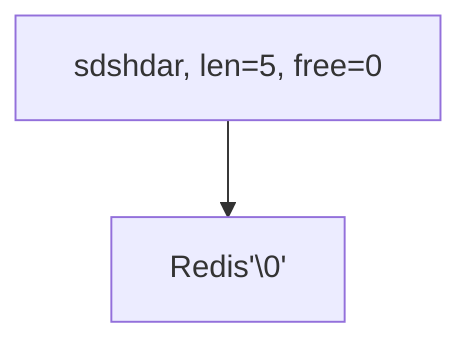

---
layout: post  
title: 2021-10-25-Redis设计与实现
date: 2021-10-25
categories: blog
tags: [Redis]
description: Redis设计与实现
---  


# 2-简单动态字符串  

Redis不使用C语言的字符串对象，而使用自己定义的Simply Dynamic String(SDS，简单动态字符串)。  

## 2.1 SDS 定义  
```c
struct sdshdr {
    // 记录数组中已经使用的字节数量
    // 等于SDS所保存字符串的长度
    int len;

    // 记录buf数组中未使用字节的数量
    int free;

    // 字节数组  
    char buf[];
};
```  

Redis还是遵守了C字符串以空字符结尾的管理，但是并不计算在len中。这样做是可以重用C语言函数。
优势：  
* 常数复杂度获取字符串长度
* 杜绝缓冲区溢出
* 减少修改字符串时带来的内存重分配次数（空间预分配、惰性空间释放）  
* 保证二进制安全，比如一些用户会使用字符串保存二进制数据，那么数据中间含有大量'\0'，使用SDS而不是使用C可以保证保存的数据是完整的。  

# 3-链表  
每个链表的节点都是使用listNode结构来表示：  
```C  
typedef struct listNode {
    // 前驱节点
    struct listNode * prev;
    //后继节点  
    struct listNode * next;
    // 节点的值
    void * value;
} listNode;
```  

多个listNode可以通过prev和next指针组成双端列表。list结构：  
```C  
typedef struct list {
    // 表头  
    listNode * head;

    // 表尾  
    listNode * tail;

    // 链表节点数  
    unsigned long len;

    // 节点值复制函数  
    // dup是一个指针，指向一个函数，函数的返回值是void *
    void * (*dup)(void * ptr);

    // 节点值释放函数  
    void (*free)(void *ptr);

    // 节点值对比函数
    int (*match)(void * ptr, void * key);
} list;
```  
* dup函数用于复制链表节点所保存的值；  
* free函数用于释放链表节点所保存的值；
* match函数则用于对比链表节点所保存的值和另一个输入值是否相等。

# 4-字典  
字典又称为符号表、映射(map)，是用来保存键值对的抽象数据结构。Redis的数据库就是使用字典来作为底层实现的，对数据库的增删改查操作也是构建在对字典的操作之上的。  

字典使用的哈希函数是MurmurHash算法，并使用链地址法来解决冲突，多个哈希节点用next字段指向下一个节点。  

当哈希表保存的键值对数量太多或太少时，程序就要对哈希表的大小进行相应的扩展或收缩。这个操作叫rehash，步骤如下：  
1. 字典的ht[1]哈希表分配空间，这个哈希表的空间大小取决于要执行的操作，以及ht[0]当前包含的键值对数量。如果执行的扩展操作，那么ht[1]的大小为第一个大于等于ht[0].used\*2的$2^n$。如果执行的是收缩操作，那么ht[1]的大小为第一个大于等于ht[0].used的$2^n$  
2. 将保存在ht[0]中的所有键值对rehash到ht[1]上，rehash是指重新计算哈希值和索引值，然后将兼职对放置到ht[1]哈希表的指定位置上。
3. 当ht[0]包含的所有键值对都迁移到ht[1]之后，释放ht[0]，将ht[1]设置为ht[0]，并在ht[1]新创建一个空白哈希表，为下一次rehash作准备。  

事实上redis采用的是渐进式rehash，也就是多次rehash而不是一次全部迁移。渐进式rehash详细步骤如下：  
1. 为ht[1]分配空间，让字典同时持有ht[0]和ht[1]两个哈希表。
2. 在字典中维持一个索引计数器变量rehashidx，并将它的值设置为0，表示rehash工作正式开始。
3. 在rehash进行期间，每次对字典执行添加、删除、查找或者更新操作时，程序出了执行指定的操作外，还会顺带将ht[0]哈希表在rehashidx索引上的所有键值对rehash到ht[1]，当rehash工作完成之后，程序将rehashindex属性的值增1。
4. 随着字典操作的不断执行，最终在某个时间点上，ht[0]的所有键值对都会被rehash至ht[1]，这时程序将rehashidx属性值设置为-1，表示rehash操作完毕。  


