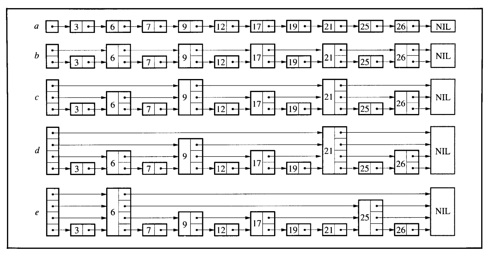
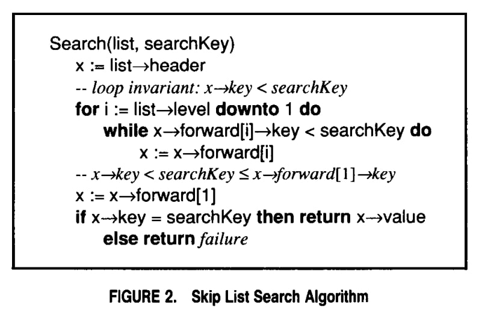
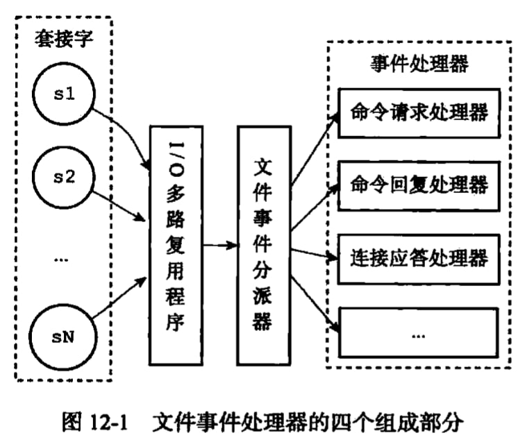
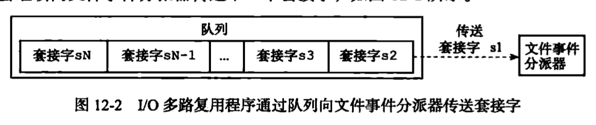
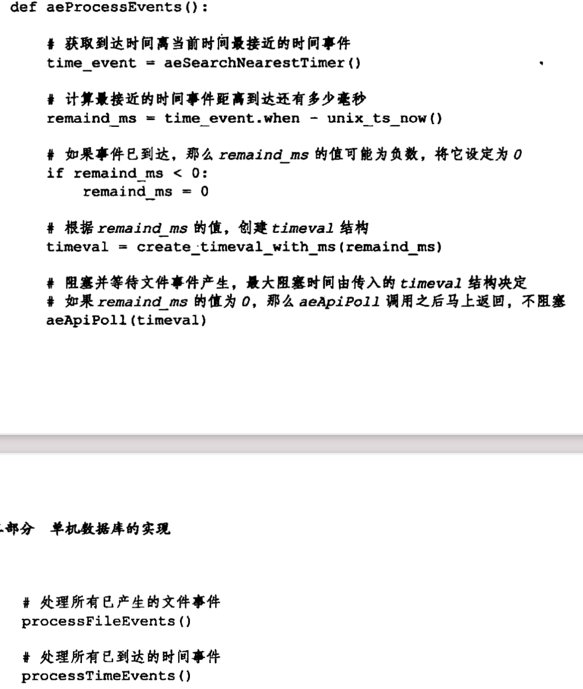
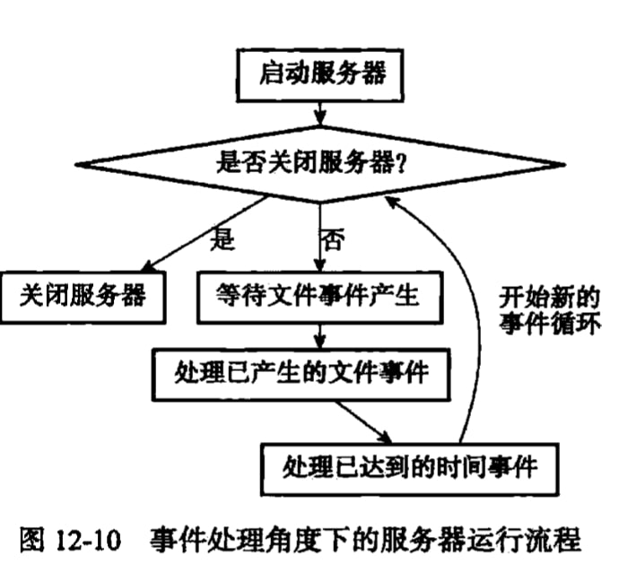

---
layout: post  
title: 2021-10-25-Redis设计与实现
date: 2021-10-25
categories: blog
tags: [Redis,数据库,技术,笔记]
description: Redis设计与实现
---  


# 2-简单动态字符串  

Redis不使用C语言的字符串对象，而使用自己定义的Simply Dynamic String(SDS，简单动态字符串)。  

## 2.1 SDS 定义  
```c
struct sdshdr {
    // 记录数组中已经使用的字节数量
    // 等于SDS所保存字符串的长度
    int len;

    // 记录buf数组中未使用字节的数量
    int free;

    // 字节数组  
    char buf[];
};
```  

Redis还是遵守了C字符串以空字符结尾的管理，但是并不计算在len中。这样做是可以重用C语言函数。
优势：  
* 常数复杂度获取字符串长度
* 杜绝缓冲区溢出
* 减少修改字符串时带来的内存重分配次数（空间预分配、惰性空间释放）  
* 保证二进制安全，比如一些用户会使用字符串保存二进制数据，那么数据中间含有大量'\0'，使用SDS而不是使用C可以保证保存的数据是完整的。  

# 3-链表  
每个链表的节点都是使用listNode结构来表示：  
```C  
typedef struct listNode {
    // 前驱节点
    struct listNode * prev;
    //后继节点  
    struct listNode * next;
    // 节点的值
    void * value;
} listNode;
```  

多个listNode可以通过prev和next指针组成双端列表。list结构：  
```C  
typedef struct list {
    // 表头  
    listNode * head;

    // 表尾  
    listNode * tail;

    // 链表节点数  
    unsigned long len;

    // 节点值复制函数  
    // dup是一个指针，指向一个函数，函数的返回值是void *
    void * (*dup)(void * ptr);

    // 节点值释放函数  
    void (*free)(void *ptr);

    // 节点值对比函数
    int (*match)(void * ptr, void * key);
} list;
```  
* dup函数用于复制链表节点所保存的值；  
* free函数用于释放链表节点所保存的值；
* match函数则用于对比链表节点所保存的值和另一个输入值是否相等。

# 4-字典  
字典又称为符号表、映射(map)，是用来保存键值对的抽象数据结构。Redis的数据库就是使用字典来作为底层实现的，对数据库的增删改查操作也是构建在对字典的操作之上的。  

字典使用的哈希函数是MurmurHash算法，并使用链地址法来解决冲突，多个哈希节点用next字段指向下一个节点。  

当哈希表保存的键值对数量太多或太少时，程序就要对哈希表的大小进行相应的扩展或收缩。这个操作叫rehash，步骤如下：  
1. 字典的ht[1]哈希表分配空间，这个哈希表的空间大小取决于要执行的操作，以及ht[0]当前包含的键值对数量。如果执行的扩展操作，那么ht[1]的大小为第一个大于等于ht[0].used\*2的$2^n$。如果执行的是收缩操作，那么ht[1]的大小为第一个大于等于ht[0].used的$2^n$  
2. 将保存在ht[0]中的所有键值对rehash到ht[1]上，rehash是指重新计算哈希值和索引值，然后将兼职对放置到ht[1]哈希表的指定位置上。
3. 当ht[0]包含的所有键值对都迁移到ht[1]之后，释放ht[0]，将ht[1]设置为ht[0]，并在ht[1]新创建一个空白哈希表，为下一次rehash作准备。  

事实上redis采用的是渐进式rehash，也就是多次rehash而不是一次全部迁移。渐进式rehash详细步骤如下：  
1. 为ht[1]分配空间，让字典同时持有ht[0]和ht[1]两个哈希表。
2. 在字典中维持一个索引计数器变量rehashidx，并将它的值设置为0，表示rehash工作正式开始。
3. 在rehash进行期间，每次对字典执行添加、删除、查找或者更新操作时，程序出了执行指定的操作外，还会顺带将ht[0]哈希表在rehashidx索引上的所有键值对rehash到ht[1]，当rehash工作完成之后，程序将rehashindex属性的值增1。
4. 随着字典操作的不断执行，最终在某个时间点上，ht[0]的所有键值对都会被rehash至ht[1]，这时程序将rehashidx属性值设置为-1，表示rehash操作完毕。  

# 5-跳跃表  
跳表支持平均O(logN)、最坏O(N)复杂度的节点查找，还可以通过顺序性操作来批量处理节点。大部分情况下跳表可以和平衡二叉树相媲美，并且因为跳跃表的实现比平衡树要来的更为简单。  

Redis使用跳跃表作为有序集合键的底层实现之一。Redis只有在实现**有序集合键**和**集群节点**中用作内部数据结构，除此之外跳表在Redis内没有其他用途。  


跳跃表的实现，参考原论文"Skip Lists: A Probabilistic Alternative to Balanced Trees"，[链接](https://homepage.divms.uiowa.edu/~ghosh/skip.pdf).  

## 跳跃表  


如果每2个节点都有一个指针指向距离为2的下一个节点，那么只需要检查不多于ceil(n/2)+1的节点；如果每4个节点都有一个指针指向距离为4的下一个节点，那么只需要检查不多余ceil(n/4)+1的节点；如果每第 $2^i$个节点都有一个指针指向距离为$2^i$的下一个节点，那么检查的节点数可以被降低到ceil($\log_2n$)。这个数据结构可以用来加快查找。  

有k个前向指针的节点被称为k级节点。如果每$2^i$个节点有一个节点，这个节点拥有$2^i$个前向指针，那么节点的等级分布可以如下：50%的概率1级节点，25%的概率是2级节点，12.5%的概率是3级节点，以此类推。  

但是如果严格这样执行，将会产生一个问题，插入和删除的时候需要修改大量的前向指针，尤其是高等级节点需要修改的节点指针会更多，显然这样是不能够接受的。

**跳跃表的做法是转化为概率方法，节点的级别是随机选择的，但是节点等级的概率分布与严格执行时节点等级的概率分布一致。** 这样做的好处是可以就地修改更高级别的指针，而不用对每一等级的节点都进行修改。所以我们需要对严格执行的条件进行修改：**一个节点的第i个前向指针指向下一个同等级或更高级别的节点，而不是下一个距离为$2^{i-1}$的节点。**节点的等级在创建的时候按照严格执行时的概率分布随机指定（也就是50%概率是1级节点，25%概率是2级节点，12.5的概率是3级节点...）。  

## 跳跃表的各种操作算法
每一个元素被表示为一个节点，节点的等级是插入时随机选择的并且与节点的数量无关。一个等级为i的节点有i个前向指针，被索引为1到i。对于每一个节点，我们不需要存储节点的等级，而是使用一个全局的MaxLevel标识。列表的等级是由当前列表中最大节点的等级所表示(如果是空表则为1)。表头节点拥有MaxLevel个节点，并且表头节点中大于列表等级的指针全部设置为NIL。  

### 初始化  
一个NIL节点被分配并且拥有一个大于所有合法key数值的key。所有列表中level的指针全部指向NIL，列表的等级设置为1.  

### 搜索算法  
从头节点的最高级别的前向指针开始遍历，如果当前级别的下一个节点小于目标值，则将指针移动到下一个级别。当在前向指针的当前级别无法取得更多进展时，搜索将向下移动到下一个级别。 当我们无法在第 1 级取得更多进展时，我们必须立即位于包含所需元素（如果它在列表中）的节点前面。算法如下：  

  

### 插入和删除算法  
  

我们需要首先搜索出需要插入节点在列表的位置，一个向量 update 在搜索中被维护，update[i]包含一个指针，这个指针指向了当前搜索中最右侧的等级为i或者更高的节点，当搜索结束时，这个指针指向着插入点左侧的节点。  

当一个新节点的等级大于从头节点到该节点的最大等级时，需要修改头节点对应最大等级的指针，将其指向本节点。（因为头节点较大的指针可能指向新插入节点的后侧，也可能指向NIL）。如果删除元素后，我们判断是否删除了列表中最大等级的节点，如果是，则需要将列表等级-1.算法如下：  

  

### 节点的等级选择  
节点等级是随机选择的，并且要符合严格执行跳表时的等级分布，算法如下：  
```c
int randomLevel(){
    int newLevel = 1;

    // random range in (0, 1)
    while (random() < p){
        newLevel = newLevel + 1
    }

    return min(newLevel, MaxLevel);
}
```  
(注意，级别的生成不依赖于元素数量)。  

### 处理过大等级的搜索  
如果新节点生成的等级远高于当前列表的等级，那么将从头节点中最大等级开始的指针进行搜索，但这将导致很多无用的操作，例如头节点的指针是(1, 2, 4, 8, NIL, NIL, NIL, 128)，那么搜索将从128开始，并且搜索失败时将额外遍历三个无用的NIL，这将导致一些不必要的开销。解决方法：  
* 不管，就这么执行
* 产生的等级如果大于当前列表等级，那么就让产生的等级等于当前列表等级+1. 

其余复杂度分析及概率分析详见原始论文。  

# 8-对象  
Redis并没有直接使用数据结构来实现键值对数据库，而是基于这些数据结构创建了一个对象系统，这个系统包含字符串对象、列表对象、哈希对象、集合对象和有序集合对象这五种类型的对象。没中对象都用到了至少一种数据结构。  

* Redis的对象系统还实现了基于引用计数技术的内存回收机制，当程序不再使用某个对象的时候，这个对象所占用的内存就会被自动释放；
* Redis还通过引用计数技术实现了对象共享机制，这一机制可以在适当条件下，通过让多个数据库键共享同一个对象来节约内存。
* Redis的对象带有访问时间记录信息，该信息可以用于计算数据库键的空转时长，在服务器启用maxmemory功能的情况下，空转时长较大的那些键可能会优先被服务器删除。

## 字符串实现原理  
字符串底层使用SDS，优势是：  
* 获取字符串长度的复杂度为 O(1)；直接可通过 len 属性获得字符串的长度。
* 防止 buf 存储内容溢出的问题；每次增加字符串的长度的时候先检查 free 属性是否能存下要增加的字符串的长度，如果不够，则先对 buf 数组扩容，然后在将内容存入 buf 数组中。
* 空间预分配和空间惰性释放；SDS 会预先分配一部分空闲空间，当字符串内容添加时不需要做空间申请的工作，当字符串从 buf 数组中移除时，空闲出来的空间不会立马被内存回收，防止新增字符串的内容写入时空间不够而临时申请空间。  

|编号|命令|解释|
|:----:|:----:|:----:|
|1|SET key value|设置指定 key 的值|
|2|GET key|获取指定 key 的值。|
|3|GETRANGE key start end|返回 key 中字符串值的子字符|
|4|GETSET key value|将给定 key 的值设为 value ，并返回 key 的旧值(old value)。|
|5|GETBIT key offset|对 key 所储存的字符串值，获取指定偏移量上的位(bit)。|
|6|MGET key1 [key2..]|获取所有(一个或多个)给定 key 的值。|
|7|SETBIT key offset value|对 key 所储存的字符串值，设置或清除指定偏移量上的位(bit)。|
|8|SETEX key seconds value|将值 value 关联到 key ，并将 key 的过期时间设为 seconds (以秒为单位)。|
|9|SETNX key value|只有在 key 不存在时设置 key 的值。|
|10|SETRANGE key offset value|用 value 参数覆写给定 key 所储存的字符串值，从偏移量 offset 开始。|
|11|STRLEN key|返回 key 所储存的字符串值的长度。|
|12|MSET key value [key value ...]|同时设置一个或多个 key-value 对。|
|13|MSETNX key value [key value ...]|同时设置一个或多个 key-value 对，当且仅当所有给定 key 都不存在。|
|14|PSETEX key milliseconds value|这个命令和 SETEX 命令相似，但它以毫秒为单位设置 key 的生存时间，而不是像 SETEX 命令那样，以秒为单位。|
|15|INCR key|将 key 中储存的数字值增一。|
|16|INCRBY key increment|将 key 所储存的值加上给定的增量值（increment） 。|
|17|INCRBYFLOAT key increment|将 key 所储存的值加上给定的浮点增量值（increment） 。|
|18|DECR key|将 key 中储存的数字值减一。|
|19|DECRBY key decrement|key 所储存的值减去给定的减量值（decrement） 。|
|20|APPEND key value|如果 key 已经存在并且是一个字符串， APPEND 命令将指定的 value 追加到该 key 原来值（value）的末尾。|

## List实现原理 
ZipList(压缩列表)和LinkedList，初始化的List使用ZipList，当不满足下列条件之一时会被转位LinkedList：  
* List 中存储的每个元素的长度小于64Byte
* 元素个数小于512

ZipList 的优缺点比较
优点：内存地址连续，省去了每个元素的头尾节点指针占用的内存。  
缺点：对于删除和插入操作比较可能会触发连锁更新反应，比如在 list 中间插入删除一个元素时，在插入或删除位置后面的元素可能都需要发生相应的移动操作。
|编号|命令|解释|
|:----:|:----:|:----:|
|1|BLPOP key1 [key2 ] |timeout| 移出并获取列表的第一个元素， 如果列表没有元素会阻塞列表直到等待超时或发现可弹出元素为止。|
|2|BRPOP key1 [key2 ] timeout|移出并获取列表的最后一个元素， 如果列表没有元素会阻塞列表直到等待超时或发现可弹出元素为止。|
|3|BRPOPLPUSH source destination timeout|从列表中弹出一个值，将弹出的元素插入到另外一个列表中并返回它； 如果列表没有元素会阻塞列表直到等待超时或发现可弹出元素为止。|
|4|LINDEX key index|通过索引获取列表中的元素|
|5|LINSERT key BEFORE|AFTER pivot value|在列表的元素前或者后插入元素|
|6|LLEN key|获取列表长度|
|7|LPOP key|移出并获取列表的第一个元素|
|8|LPUSH key value1 [value2]|将一个或多个值插入到列表头部|
|9|LPUSHX key value|将一个值插入到已存在的列表头部|
|10|LRANGE key start stop|获取列表指定范围内的元素|
|11|LREM key count value|移除列表元素|
|12|LSET key index value|通过索引设置列表元素的值|
|13|LTRIM key start stop|对一个列表进行修剪(trim)，就是说，让列表只保留指定区间内的元素，不在指定区间之内的元素都将被删除。|
|14|RPOP key|移除列表的最后一个元素，返回值为移除的元素。|
|15|RPOPLPUSH source destination|移除列表的最后一个元素，并将该元素添加到另一个列表并返回|
|16|RPUSH key value1 [value2]|在列表中添加一个或多个值|
|17|RPUSHX key value|为已存在的列表添加值|

**压缩列表ZipList**  
压缩列表是 Redis 为了节约内存而开发的， 由一系列特殊编码的连续内存块组成的顺序型（sequential）数据结构。一个压缩列表可以包含任意多个节点（entry）， 每个节点可以保存一个字节数组或者一个整数值。下图展示了压缩列表的各个组成部分， 记录了各个组成部分的类型、长度、以及用途。  

|属性|类型|长度|用途|
|:----:|:----:|:----:|:----:|
|zlbytes|uint32_t|4字节|记录整个压缩列表占用的内存字节数：在对压缩列表进行内存重分配， 或者计算 zlend 的位置时使用。|
|zltail|uint32_t|4字节|记录压缩列表表尾节点距离压缩列表的起始地址有多少字节： 通过这个偏移量，程序无须遍历整个压缩列表就可以确定表尾节点的地址。|
|zllen|uint16_t|2字节|记录了压缩列表包含的节点数量：当这个属性的值小于 UINT16_MAX （65535）时，这个属性的值就是压缩列表包含节点的数量；当这个值等于 UINT16_MAX 时，节点的真实数量需要遍历整个压缩列表才能计算得出。|
|entryX|列表节点|不定|压缩列表包含的各个节点，节点的长度由节点保存的内容决定。|
|zlend|uint8_t|1字节|特殊值0xFF（十进制 255 ），用于标记压缩列表的末端。|

压缩列表的节点构成：  

|previous_entry_length|encoding|content|
|:----:|:----:|:----:|  

encoding包含了数据项的类型和长度。因为从前向后是顺序能够计算出来的，所以才真正增加了previous_entry_length。previous_entry_length占用1-5字节，所以当插入新数据或者修改新数据时，previous_entry_length长度改变，可能会引发连锁更新，但是zipList一般存放的数据量少，不影响。


## Set实现原理  
Set 集合采用了intset整数集合和字典两种方式来实现的，当满足如下两个条件的时候，采用整数集合实现；一旦有一个条件不满足时则采用字典来实现。
* Set 集合中的所有元素都为整数
* Set 集合中的元素个数不大于 512（默认 512，可以通过修改 set-max-intset-entries 配置调整集合大小）  

|编号|命令|解释|
|:----:|:----:|:----:|
|1|SADD key member1 [member2]|向集合添加一个或多个成员|
|2|SCARD key|获取集合的成员数|
|3|SDIFF key1 [key2]|返回第一个集合与其他集合之间的差异。|
|4|SDIFFSTORE destination key1 [key2]|返回给定所有集合的差集并存储在 destination 中|
|5|SINTER key1 [key2]|返回给定所有集合的交集|
|6|SINTERSTORE destination key1 [key2]|返回给定所有集合的交集并存储在 destination 中|
|7|SISMEMBER key member|判断 member 元素是否是集合 key 的成员|
|8|SMEMBERS key|返回集合中的所有成员|
|9|SMOVE source destination member|将 member 元素从 source 集合移动到 destination 集合|
|10|SPOP key|移除并返回集合中的一个随机元素|
|11|SRANDMEMBER key [count]|返回集合中一个或多个随机数|
|12|SREM key member1 [member2]|移除集合中一个或多个成员|
|13|SUNION key1 [key2]|返回所有给定集合的并集|
|14|SUNIONSTORE destination key1 [key2]|所有给定集合的并集存储在 destination 集合中|
|15|SSCAN key cursor [MATCH pattern] [COUNT count]|迭代集合中的元素|


## Zset（有序集合）的实现原理  
Zset 底层同样采用了两种方式来实现，分别是 ZipList 和 SkipList。当同时满足以下两个条件时，采用 ZipList 实现；反之采用 SkipList 实现。
* Zset 中保存的元素个数小于 128。（通过修改 zset-max-ziplist-entries 配置来修改）
* Zset 中保存的所有元素长度小于 64byte。（通过修改 zset-max-ziplist-values 配置来修改）

|编号|命令|解释|
|:----:|:----:|:----:|
|1|ZADD key score1 member1 [score2 member2]|向有序集合添加一个或多个成员，或者更新已存在成员的分数|
|2|ZCARD key|获取有序集合的成员数|
|3|ZCOUNT key min max|计算在有序集合中指定区间分数的成员数|
|4|ZINCRBY key increment member|有序集合中对指定成员的分数加上增量 increment|
|5|ZINTERSTORE destination numkeys key [key ...]|计算给定的一个或多个有序集的交集并将结果集存储在新的有序集合 destination 中|
|6|ZLEXCOUNT key min max|在有序集合中计算指定字典区间内成员数量|
|7|ZRANGE key start stop [WITHSCORES]|通过索引区间返回有序集合指定区间内的成员|
|8|ZRANGEBYLEX key min max [LIMIT offset count]|通过字典区间返回有序集合的成员|
|9|ZRANGEBYSCORE key min max [WITHSCORES] [LIMIT]|通过分数返回有序集合指定区间内的成员|
|10|ZRANK key member|返回有序集合中指定成员的索引|
|11|ZREM key member [member ...]|移除有序集合中的一个或多个成员|
|12|ZREMRANGEBYLEX key min max|移除有序集合中给定的字典区间的所有成员|
|13|ZREMRANGEBYRANK key start stop|移除有序集合中给定的排名区间的所有成员|
|14|ZREMRANGEBYSCORE key min max|移除有序集合中给定的分数区间的所有成员|
|15|ZREVRANGE key start stop [WITHSCORES]|返回有序集中指定区间内的成员，通过索引，分数从高到低|
|16|ZREVRANGEBYSCORE key max min [WITHSCORES]|返回有序集中指定分数区间内的成员，分数从高到低排序|
|17|ZREVRANK key member|返回有序集合中指定成员的排名，有序集成员按分数值递减(从大到小)排序|
|18|ZSCORE key member|返回有序集中，成员的分数值|
|19|ZUNIONSTORE destination numkeys key [key ...]|计算给定的一个或多个有序集的并集，并存储在新的 key 中|
|20|ZSCAN key cursor [MATCH pattern] [COUNT count]|迭代有序集合中的元素（包括元素成员和元素分值）|

## Hash的实现原理  
Hash 底层实现采用了 ZipList 和 HashTable 两种实现方式，相信看到这里大家都比较轻车熟路了，下面来看看。Hash 结构当同时满足如下两个条件时底层采用了 ZipList 实现，一旦有一个条件不满足时，就会被转码为 HashTable 进行存储。

* Hash 中存储的所有元素的 key 和 value 的长度都小于 64byte。（通过修改 hash-max-ziplist-value 配置调节大小）
* Hash 中存储的元素个数小于 512。（通过修改 hash-max-ziplist-entries 配置调节大小）


|编号|命令|解释|
|:----:|:----:|:----:|
|1|HDEL key field1 [field2]|删除一个或多个哈希表字段|
|2|HEXISTS key field|查看哈希表 key 中，指定的字段是否存在。|
|3|HGET key field|获取存储在哈希表中指定字段的值。|
|4|HGETALL key|获取在哈希表中指定 key 的所有字段和值|
|5|HINCRBY key field increment|为哈希表 key 中的指定字段的整数值加上增量 increment 。|
|6|HINCRBYFLOAT key field increment|为哈希表 key 中的指定字段的浮点数值加上增量 increment 。|
|7|HKEYS key|获取所有哈希表中的字段|
|8|HLEN key|获取哈希表中字段的数量|
|9|HMGET key field1 [field2]|获取所有给定字段的值|
|10|HMSET key field1 value1 [field2 value2 ]|同时将多个 field-value (域-值)对设置到哈希表 key 中。|
|11|HSET key field value|将哈希表 key 中的字段 field 的值设为 value 。|
|12|HSETNX key field value|只有在字段 field 不存在时，设置哈希表字段的值。|
|13|HVALS key|获取哈希表中所有值。|
|14|HSCAN key cursor [MATCH pattern] [COUNT count]|迭代哈希表中的键值对。|

## 内存回收  
因为C语言并不具备自动内存回收功能，所以Redis在自己的对象系统中构建了一个**引用计数**技术实现的内存回收机制，通过这一机制，程序可以通过对象的引用计数信息，在适当的时候自动释放对象并进行内存回收。  
每个对象的引用信息由RedisPbject结构的refcount属性记录：  
```c  
typedef struct redisObject {
    // ...
    // 引用计数  
    int refCount;
    // ...
} robj;
```  

对象的整个生命周期操作部分如下：  
```c
// 创建一个字符串对象 s, 对象的引用计数为1
robj * s = createStringObject(...)

// 对象 s 执行各种操作 ...

// 将对象s的引用计数减一，使得对象的引用计数变为0
// 导致对象s被释放
decrRefCount(s)
```  

## 对象共享  

除了用于实现引用计数内存回收机制外，对象的引用计数属性还带有对象共享的作用。相同值的对象共享同一个引用，引用计数+1.  

## 过期键删除策略  
数据库的键都保存到过期字典中，那么一个键过期了，理论上有三种删除策略：  

* 定时删除：设置过期时间的同时设置一个定时任务到点自动删除。
* 惰性删除：放任键过期不管，但是每次从键空间中获取键时，都检查取得的键是否过期，如果过期的话，就删除键；如果没有过期，就返回该键。  
* 定期删除：每隔一段时间，程序就对数据库进行一次检查，删除里面的过期键。  

Redis实际上使用的是**定期删除**和**惰性删除**两种结合。  

# 10-Redis 持久化  
Redis是一个内存数据库，它将数据库保存到内存里面，所以如果不想办法将存储在内存的数据库状态保存到磁盘，则当数据库进程崩溃有可能导致数据都是。  

RDB持久化既可以手动执行，也可以配置服务器定期执行，该功能可以将某个时间点上的数据库状态保存到一个RDB文件中。  

`SAVE`命令阻塞Redis进程来进行保存，`BGSAVE`命令会派生一个子进程来创建RDB文件，而服务器进程继续处理其他命令请求。  
伪代码表示二者区别：  
```python  
def SAVE():
    rdbSAVE()

def BGSAVE():
    pid = fork()
    if pid == 0:
        rdbSave()
        signal_parient()
    elif pid > 0:
        # 父进程继续处理命令请求，并通过轮询等待子进程的信号
        handle_request_and_wait_signal()  
    else:
        handle_fork_error()
```

> 因为AOF持久化更新频率比RDB高，所以服务器若开启了AOF持久化，则优先读取AOF文件来还愿状态。只有AOF持久化功能处于关闭状态，服务器才会使用RDB文件还原。  

`BGSAVE`执行期间，`SAVE`，`BGSAVE`，`BGREWRITEAOF`命令被禁止。

## 周期性保存  
Redis可以设置保存条件：`save 900 1`，每900毫秒内发生1次修改就保存。Redis检查保存条件是否满足方法：  

Redis服务器有一个周期性操作函数serverCron默认每隔100毫秒就会执行一次，该函数用于对正在运行的服务器进行维护，它的其中一项工作就是检查`save`选项所设置的保存条件是否满足。  

# 11-AOF持久化  
RDB持久化保存的的是内存数据映像（也就是各个真实数据），AOF是保存数据执行的写命令来记录数据库状态的。  

实际上AOF文件就是纯文本文件，里面记录了各个命令。AOF分为命令追加、文件写入、文件同步三个步骤。

## 命令追加  
```C  
struct redisServer{
    // ...
    // AOF 缓冲区  
    sds aof_buf;
    // ...
}
```  
当写命令执行完毕后，写命令按照某种格式追加到aof_buf的末尾  

## AOF 文件还原  
服务器只需要读入AOF文件并再执行一边就可以还原。步骤如下：  

1. 创建一个不带网络连接的伪客户端
2. 从AOF文件分析并读取一条写命令
3. 使用伪客户端执行被读出的写命令
4. 一直执行2和3直到读取完毕

## AOF 重写  
随着时间的流失，AOF文件会越来越大，比如写了又删反反复复。那么Redis提供了重写功能，直接制造写入命令使之与当前数据库状态一致，新的AOF文件体积要小得多。  

AOF重写使用子进程完成，但是写的过程中可能会继续产生命令，所以Redis是用来AOF重写缓冲区。Redis在执行完一个写命令后，会分别将这条命令写入到AOF缓冲区和AOF重写缓冲区（AOF重写缓冲区是调用重写命令后才启用）。   

# 12-事件  
Redis事件分为两类：  
* 文件事件：Redis服务器通过套接字和客户端链接，而文件事件就是服务器对套接字操作的抽象。服务器与客户端的通信会产生相应的文件事件，而服务器则通过监听并处理这些事件来完成一系列玩过通信操作。  
* 时间时间：redis服务器中的一些操作（比如serverCron函数）需要在给定的时间点执行，而时间事件就是服务器对这类定时操作的抽象。  

## 12.1 文件事件  
* 文件事件处理器使用**I/O多路复用**程序来同时监听多个套接字，并根据套接字目前执行的任务来为套接字关联不同的事件处理器。
* 当被监听的套接字准备好执行连接应答(accept)，读取(read)、写入(write)、关闭(close)等操作时，与操作相对应的文件事件就会产生，这时文件事件处理器就会调用套接字之前关联好的事件处理器来处理这些事件。  

虽然文件事件处理器使用单线程，但是通过I/O多路复用程序来监听多个套接字，文件事件处理器实现了高性能的网络通信模型，又能够很好地与Redis服务器中其他同样以单线程方式运行的模块对接，这保持了Redis内部单线程设计的简单性。  

  
尽管多个文件事件可能并发地出现，但是I/O多路复用程序总是会将所有产生事件的套接字都放到一个队列，然后这个队列有序地、同步地、每次一个套接字的方式向文件事件分配器传送套接字。当上一个套接字产生的事件被处理完毕之后，I/O多路复用程序才会继续向文件事件分派器传送下一个套接字，如下图：  

  

Redis 的I/O多路复用程序的所有功能都是包装select、epoll、evport和kqueue这些函数库实现的。  

## 12.2 时间事件  
时间事件分为定时事件和周期性事件。  

服务器将所有时间事件都放在一个无序链表中，每当时间事件执行器运行时，他就遍历整个时间事件，并调用相应的事件处理器。事件的when属性表示下次执行时的时间戳，如果是周期性事件，执行完毕后when属性会更新为下一次执行的时间，如果是定时事件，则执行完毕后被移除链表。  

**serverCron函数就是一个周期性事件**，它的主要工作包括：  
* 更新服务器的各类统计信息，比如时间、内存占用、数据库占用等
* 清理数据库中过期的键
* 关闭和清理连接失效的客户端
* 尝试进行AOF和RDB持久化操作
* 如果服务器是master服务器，需要对从服务器进行定期同步
* 如果处于集群模式，集群定期同步和连接测试

Redis2.6版本默认规定serverCron每秒运行10次，平均间隔100毫秒

## 事件的调度和执行  
```Python  
def main():
    # 初始化服务器  
    init_server()

    # 一直处理事件，直到服务器关闭为止
    while server_is_not_shutdown():
        aeProcessEvents()
    
    # 服务器关闭，执行清理操作
    clean_server()
```  

aeProcessEvents的执行，首先计算最接近的时间事件到来的时间差val，然后等待文件事件的产生，最多等待val如果文件事件产生，则执行。执行完毕后判断时间事件是否到来，如果到来则执行。过程如下：  

  

事件处理角度下的服务器运行流程：  

  


 # 13-客户端  
通过I/O多路复用技术实现的文件事件处理器，Redis服务器使用单线程单进程的方式来处理命令请求，并与多个客户端进行网络通信。服务器为客户端建立了 `redisClient`结构保存客户端当前状态信息，Redis服务器的clients属性是一个链表，这个链表保存了所有与服务器连接的客户端的状态结构。  

## 13.1 客户端属性  
**套接字描述符**  
客户端状态的fd属性记录了客户端正在使用的套接字描述符：  
```C++  
typedef struct redisClient {
    // ...
    int fd;
    // ...
}
```  
fd的属性值可以是-1或者大于-1的整数。伪客户端的fd属性值为-1（伪客户端用在AOF恢复上和Lua脚本中包含的Redis命令）。使用`redis> CLIENT list` 可以查看客户端所使用的套接字描述符。  

**标志**  
比如认定是主服务器还是从服务器，或者说正在使用UNIX域套接字。  

**输入缓冲区querybuf**  
客户端状态的输入缓冲区用于保存客户端发送的命令请求。输入缓冲区的大小会随着输入内容动态缩小或扩大，但它的最大大小不能超过1GB，否则服务器将关闭这个客户端。  

**命令与命令参数**  
当服务器将客户端的发送的请求存放到querybuf后，服务器将对命令请求的内容进行分析，并将得到的命令参数存放在argv属性个argc属性。  

**命令的实现函数**  
命令由redisCommand构成，当参数解析完毕，redis找到argv[0]所对应的函数，将argv和argc传入到对应的函数进行执行。  

**输出缓冲区**  
执行命令所得到的回复被保存在输出缓冲区中，每个客户端都有两个输出缓冲区可用，一个大小是固定的，另一个缓冲区的大小是可变的。
* 固定大小的缓冲区用于保存长度比较小的回复，比如OK, 简短的字符串值、整数、错误回复等。
* 可变大小的缓冲区用于保存哪些长度比较大的回复，比如一个非常长的字符串值，列表或者包含很多元素的集合等等。

固定缓冲区分配在结构体内，可变缓冲区由链表构成，每个节点是一个字符串。

**身份验证**  
authenticated属性判断是否被认证，仅在服务器启用了身份验证功能时使用。

**伪客户端**  
为了执行Lua的命令，Redis服务器存活期间会一直存在Lua伪客户端，而AOF伪客户端在服务器载入时存在，当执行完毕后会关闭这个伪客户端。  

# 14-服务器  
命令请求的完成过程：  
1. 发送命令请求：用户发送命令请求，客户端将命令发送到服务器
2. 当客户端与服务器之间的连接套接字因为客户端的写入而变得可读时，服务器将调用命令请求处理器来执行以下操作：读取命令将其放到输入缓冲中，分析命令设置argv和argc，调用命令执行器，执行客户端指定的命令。  
3. 命令执行器：查找命令的实现。根据客户端发送来的argv[0]参数在命令表中查找参数所指定的命令，并将找到的命令保存到客户端状态的cmd属性。命令表是一个字典，键是命令name，值是redisCommand结构体，里面的proc属性是执行的具体函数。
4. 执行预备操作：当调用proc函数前，还需要一系列检查：检查cmd指针是否为NULL、检查是否身份验证、如果服务器打开maxmemory功能，那么在执行之前先检查服务器内存占用，并在需要的时候进行垃圾回收，如果内存回收失败则不再执行后续操作，向客户端返回一个错误、如果服务器上一次执行BGSAVE命令出错，并且打开了一个stop-writes-on-bgsave-error功能，而且服务器即将执行一个写命令，那么服务器将拒绝执行这个命令，并返回一个错误、如果服务器正在订阅频道，或者正字啊用XXSUBSCRIBE类似的命令，其他命令都会被拒绝、如果数据正在载入，则部分命令才可以执行、。。。and so on  
5. 调用命令实现函数：`client->cmd->proc(client)`
6. 执行后续工作：如果服务器开启了慢查询日志功能，那么慢查询日志模块会检查是否需要为刚刚执行完毕的命令添加一条慢查询日志、根据执行命令的时长，更新milliseconds属性并将命令的redisCommand结构的calls计数器增1、如果服务器开启了AOF持久化功能，那么AOF持久化模块将会刚刚执行的命令请求写入到AOF缓冲区里面、如果有其他从服务器正在复制当前这个服务器，那么服务器会将刚刚执行的命令传播给所有从服务器。
7. 将命令执行结果回复发送到客户端

下面列举sercerCron的操作：  

## 14.2 serverCron函数
Redis服务器中有不少功能需要获取系统的当前时间，为了减少系统调用执行次数，服务器状态中的unixtime属性和mstime属性被当作当前时间的缓存。serverCron函数会默认以100毫秒一次的频率更新unixtime属性和mstime属性，所以这两个属性记录的事件的精确度并不高：
* 服务器只会在打印日志、更新服务器的LRU时钟、决定是否执行持久化任务、计算服务器上线时间等堆事件精确度要求不高的功能上使用unixtime和mstime属性.
* 对于为键设置过期时间、添加慢查询日志这种需要高精度时间的功能来说，服务器还是会再次执行系统调用，从而获得最准确的系统当前时间。

## 更新LRU时钟
服务器状态中的lruclock属性保存了服务器的LRU时钟，这个属性和unixtime、mstime属性一样，都是服务器时间缓存的一种。  

每个Redis对象都会有一个lru属性，这个lru属性保存了对象最后一次被命令访问的时间：  
```C++  
typedef struct redisObject {
    // ...
    unsigned lru:22;
    // ...
}
```  
服务器通过用lruclock - lru得到空转时间。

## 更新服务器每秒执行的命令次数

## 更新服务器内存峰值记录

## 14.3 初始化服务器
**A. 初始化服务器状态结构**  
创建 `struct redisServer`类的实例变量server作为服务器状态，并设置默认值。

**B. 载入配置选项**

**C. 初始化服务器数据结构**  
比如server.clients, server.db数组，用于执行Lua脚本的server.lua，用于保存慢查询日志的server.slowlog。  

**D. 还原数据库状态**  
若数据库启用了AOF持久化功能，那么服务器优先使用AOF持久化，否则服务器启用RDB恢复数据库状态。

**E. 执行事件循环**  

# 多机数据库的实现  

# 15-复制  

在Redis中，用户可以通过执行SLAVEOF或者设置slaveof选项，让服务器去复制另一个服务器。例如：  
```shell  
127.0.0.1:12345> SLAVEOF 127.0.0.1 6379
```  
那么12345将成为6379的从服务器。  

在主服务器上set 新数据，在主和从服务器上均可以获取，在主服务器上删除键，在从服务器上也自动被删除。  

## 15.1 旧版本复制功能的实现(redis 2.8之前)  
分为**同步**和**命令传播**两个操作。  
### 15.1.1 同步  
当客户端发送SLAVEOF后：  
* 从服务器向主服务器发送SYNC命令
* 主服务器执行BGSAVE命令生成RDB文件
* 在BGSAVE执行期间，主服务器用缓冲区记录执行时接收到的所有写命令
* 主服务器将RDB文件发送到从服务器，从服务器接受 RDB文件并载入
* 主服务器发送记录在缓冲区中的写命令，从服务器执行这些写命令

### 15.1.2 命令传播
主服务器会将自己执行的写命令发送给从服务器再执行一遍。  

### 15.1.3 旧版复制的缺陷  
从服务器断线后重连，需要让主服务器从新执行BGSAVE生成RDB，然后重新载入。然而断线前后的修改可能只是少量的。

## 15.2 新版本复制的实现  
新版本使用PSYNC代替SYNC，PSYNC分为**完整重同步**和**部分重同步**。  

完整重同步和旧版本初次复制一样，通过BGSAVE和RDB文件来同步。  

部分重同步：短线后重连，从服务器会执行断开期间的写命令，而不用复制整个RDB数据库状态。  

### 15.2.1 部分重同步的实现  
由以下三个部分构成：  
* 主服务器的复制积压缓冲区
* 主服务器的复制偏移量
* 服务器的运行ID(run id)

**复制积压缓冲区**  
复制积压缓冲区是一个先进先出的队列（默认大小1M），主服务器每次执行一条写命令，就将该命令保存到这个队列中。

**复制偏移量**  
主从二者服务器都保存一个复制偏移量，当主服务器执行写命令时，假设该命令长30个字节，则主服务器的offset变量增加30字节，复制偏移量的offset变量同样增加30字节。

当从服务器断线重连后，汇报自己的run id和offset，若run id和主服务器相同（代表主服务器没有宕机过），主服务器将自己的offset与从服务器对应的offset的差值，所对应的复制积压缓冲区的位置的所有命令发送给从服务器，从服务器对其进行执行。

若从服务器的run id和主服务器不一致，说明主服务器改变过，此时需要执行完整重同步。  

# 16-Sentinel 哨兵系统  
由一个或多个Sentinel实例组成的Sentinel系统可以监视任意多个主服务器，以及这些主服务器属下的所有从服务器，并在被监视的主服务器进入下线状态时，自动将下线主服务器属下的某个从服务器升级为新的主服务器，然后由心的主服务器代替已下线的主服务器继续处理命令请求。  

启动并初始化sentinel：  
```shell  
$ redis-sentinel /path/to/your/sentinel.conf
```  

它会执行初始化服务器、将普通Redis服务器使用的代码替换成Sentinel专用代码、初始化Sentinel状态、根据给定的配置文件，初始化Sentinel的监视主服务器列表、创建连向主服务器的网络连接。  

Sentinel本质上就是一个运行在特殊模式的Redis服务器，但是并不使用数据库。  

Sentinel初始化的最后一步是创建连向被监视主服务器的网络连接，Sentinel将成为主服务器的客户端，它可以向主服务器发送命令，并从命令回复中获取相关信息。  

**获取主服务器的信息**  
Sentinel默认会以每十秒一次的频率，通过命令连接向被监视的主服务器发送INFO命令，并通过分析INFO命令的回复来获取主服务器的当前信息。  

# 17-集群  
Redis集群是Redis提供的分布式数据库方案，集群通过**分片***来进行数据共享，并提供复制和故障转移功能。  

初始时，节点都是相互独立的，通过执行`CLUSTER MEET <ip> <port>`将各个独立的节点连接起来，构成一个包含多个节点的集群。  

执行`CLUSTER NODES`可以查看当前节点集群的节点数量。  

**启动节点**  
Redis会根据cluster-enabled配置选项是否为yes来决定服务器是否开启集群模式。  

**集群数据结构**  
节点会为自己和其他集群创建clusterNode数据结构记录集群信息。其中clusterNode结构的link属性是一个clusterLink结构，保存连接节点所需要的有关信息，比如socket描述符，输入输出缓冲区等等。  

**CLUSTER MEET 命令实现**  

  

之后节点A会将节点B的信息通过Gossip协议传播给集群中的其他节点，让其他节点也与B握手，最终经过一段时间之后，节点B会被集群中的所有节点认识。  

**槽指派**  
`CLUSTER ADDSLOTS <slot> [slot ...]`命令接受一个或多个槽作为参数，并将所有输入的槽指派给接受该命令的节点负责。在对数据库中的16384个槽都进行指派之后，集群就会进入上线状态，这时客户端就可以向集群中的节点发送数据命令了。  

## 17.3 在集群中执行命令  
  
当MOVED错误后，客户端自动转向正确的节点发送数据。节点通过clusterState.slots[i]是否等于clusterState.myself判断是否是当前节点处理。  

* 节点只能使用0号数据库，而单机没有这一限制。  

# 18-发布与订阅  
Redis 发布订阅 (pub/sub) 是一种消息通信模式：发送者 (pub) 发送消息，订阅者 (sub) 接收消息。Redis 客户端可以订阅任意数量的频道。下图展示了频道 channel1 ， 以及订阅这个频道的三个客户端 —— client2 、 client5 和 client1 之间的关系：  
  
当有新消息通过 PUBLISH 命令发送给频道 channel1 时， 这个消息就会被发送给订阅它的三个客户端：
  

每个 Redis 服务器进程都维持着一个表示服务器状态的`redis.h/redisServer`结构， 结构的`pubsub_channels`属性是一个字典， 这个字典就用于保存订阅频道的信息：
```C++  
struct redisServer {
    // ...
    dict *pubsub_channels;
    // ...
};
```  
其中，字典的键为正在被订阅的频道， 而字典的值则是一个链表， 链表中保存了所有订阅这个频道的客户端。

通过 PUBLISH 命令向订阅者发送消息，redis-server 会使用给定的频道作为键，在它所维护的 channel 字典中查找记录了订阅这个频道的所有客户端的链表，遍历这个链表，将消息发布给所有订阅者。  

# 19-事务  
Redis通过 MULTI，EXEC,WATCH等命令来实现事务(Transaction)功能。事务将多个命令请求打包，然后一次性地、顺序地执行多个命令。在事务执行期间，服务器不会中断事务而去执行其他客户端的命令请求，它会将事务中的所有命令都执行完毕，然后才去处理其他客户端的命令请求。  

Redis事务以MULTI命令开始，接着多个命令放入事务，最后由EXEC命令将这个事务提交给服务器执行。  

`WATCH key`在MULTI之前执行，用来判断在事务执行的过程中是否key是否被修改，如果被修改则服务器拒绝执行事务，并向客户端返回代表事务执行失败的空回复。  


