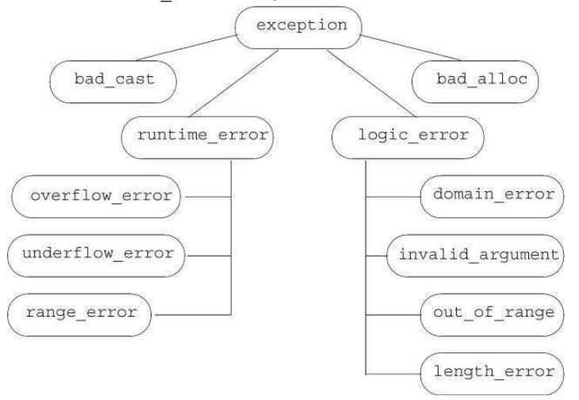
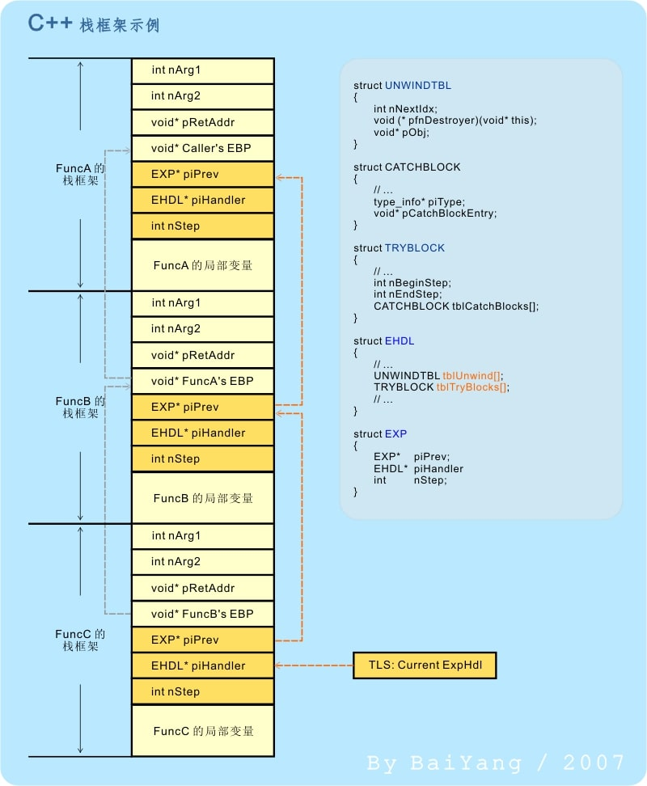
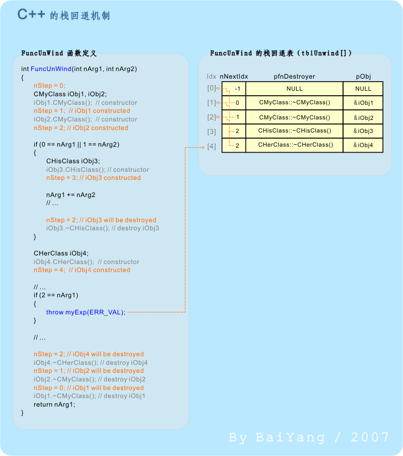
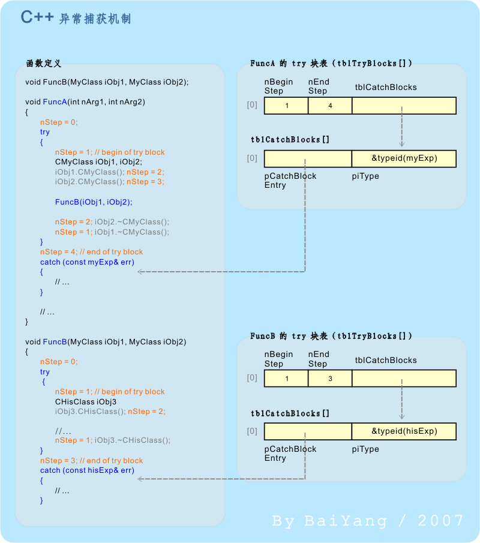
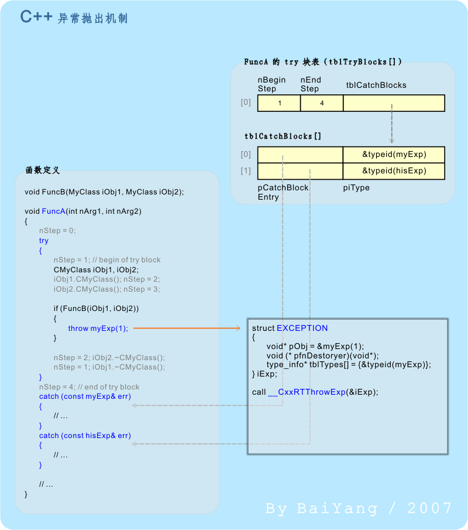

---
layout: post  
title: 2021-11-16-C++复习
date: 2021-11-16
categories: blog
tags: [C++,编程语言,笔记]
description: C++复习的知识点
---  

# 2-变量和基本类型

## 2.1 const 关键字  
1. 在全局变量里定义 const 关键字，默认的作用域是本文件；在全局变量里定义非const变量，默认的作用域是整个程序。如果要让const常量作用在整个程序，则需要额外指定extern，例如 `extern const bufSize = 512;`  

2. 如果没有对常量的内存进行引用、指针操作，则它在编译前的预处理阶段就会替换原来的常量为字面量。如果进行了引用、地址操作，则会强行让编译器为其分配内存。

**顶层const**：表示指针本身是个常量。  
**底层const**：指针所指的对象是一个常量。  

```C++  
int * const p1 = &i;        // 这是一个顶层const，不能改变p1的值  
const int ci = 42;          // 这是个顶层const，不能改变ci的值
const int * p2 = &c1;       // 允许改变p2的值，这是一个底层const
const int *  const p3 = p2; // 右边的const是顶层const，左边const是底层const
const & r = ci;             // 用于声明引用的const都是底层const，因为引用本身就不能更改，天然带有顶层const属性
```  

auto会忽略顶层const，而只会保留底层const。  

**decltype**标识符：获得数值的类型。例子：  

```C++
decltype(f()) sum = x;  // 定义sum变量，类型是f的返回值类型，decltype并不调用f，编译期间就能够知道
const int ci = 0;
decltype(ci) x = 0;
decltype((ci)) x = 0;       // 获得的是引用类型，而不是原来的值类型，int&，而不是int
```

## 2.2 引用  
引用也就是变量的别名，主要用作函数的形式参数。

* const 引用是指向const对象的引用。

## 2.3 头文件  
头文件一般包含类的定义、extern变量的声明和函数声明，头文件的内容会被预处理器复制到程序对应的位置。一般要设置头文件保护符，目的是防止多次引用时同一文件下有多重定义：  
```C++  
#ifndef XXX
#define XXX
// 头文件内容  
#endif
```

头文件一般用作声明而不是定义：  
```C++  
extern int ival = 10;           // 有初始化，所以是定义。默认情况下extern可以省略
double fica_rate;               // 没有extern关键字，所以是定义
```

## 2.4 using 声明  
1. using 声明 (using declaration) 是将命名空间中单个名字注入到**当前作用域**的机制，使得在当前作用域下访问另一个作用域下的成员时无需使用限定符 ::  
```C++  
// OK
{
    using std::map
    map<int, std::string> the_map;
}
// ERROR
map<int, std::string> the_map2;
```
using 声明每次只能作用于一个命名空间成员，使用using声明后就不需要在名称前加std::这样的名称空间来。 
当然为了使用所有std或者其他名称空间的内容，你也可以直接using namespace std;

2. using 声明，可以改变派生类对父类成员的访问控制  

```C++  
class Base{
protected:
    int bn1;
    int bn2;
};
 
class Derived: private Base{
public:
    using Base::bn1;
};
 
class DerivedAgain: public Derived{
};
 
int main(){
    Derived d;
    DerivedAgain da; 
    d.bn1 = 1;
    d.bn2 = 2; //error, 'bn2' is a private member of 'Base'
    da.bn1 = 3;  //ok
    std::cout<<d.bn1<<std::endl;
 
    return 0;
}
```  
尽管 Derived 对 base 是私有继承，但通过 using 声明，我们还是可以在 Derived 中访问其成员，且后续的继承同样不受 private 限定的影响。  

3. 使一个命名空间中的 **所有** 名字都在该作用域中可见的机制。这是最常用的方式了。需要注意的是命名冲突问题。  
```C++
#include <iostream>
namespace n1{ 
    int n1_member = 10; 
    int m = 11; 
}
 
int m = 12; 
 
int main(){
    using namespace n1; 
    std::cout<<n1_member<<std::endl;
    //std::cout<<m<<std::endl;  //error 命名冲突
    std::cout<<::m<<std::endl;
 
    int m = 13; //ok, 局部变量屏蔽命名空间变量
    std::cout<<m<<std::endl;
 
    return 0;
}
```
尽管 using指示很方便，但在实际工作中应该尽量避免：它一下子将另一个 namespace 中的成员全部引入了，一不小心就会出现命名空间污染问题。  

4. 类型重定义，取代 typedef `using alias = typename`
```C++
using fun = void (*)(int, int);
//typedef void (*fun)(int, int); //与上一句等价
using int16 = short;
//typedef short int16; //与上一句等价
 
int main(){
    std::cout<<sizeof(int16)<<std::endl;
}
```  
为什么要类型重定义呢？原因是：  
在 C++98/03 中 ，typedef 重定义有一些限制，比如，模板。我们想实现这样一个模板：将一个 int 映射到任意类型，类似于我们想表达这种效果：  
```C++  
typedef std::map<int, int> map_int_t;
typedef std::map<int, std::string> map_str_t;
typedef std::map<int, bool> map_b_t;
//... Others
```  
但是在C++ 98中使用模板必须要这样写：  
```C++
template<typename Val>
struct int_map{
    typedef std::map<int, Val> type;
};
 
int main(){
    int_map<int>::type imap;
 
    return 0;
}
```  
在C++11 中，我们可以使用 using 重定义模板：  
```C++  
template<typename Val>
using int_map_t = std::map<int, Val>;
 
int main(){
    int_map_t<int> imap;
 
    return 0;
}
```  

## 2.5 运算符优先级  

1. `[]` `()` `.` `->`
2. `-` `(type)` `++` `--` `*` `&` `!` `~` `sizeof`
3. `/` `*` `%`
4. `+` `-`
5. `<<` `>>`
6. `>` `>=` `<` `<=`
7. `==` `!=` 
8. `&`
9. `^`
10. `|`
11. `&&`
12. `||`
13. `?:`
14. `=` `/=` `+=` ... `|=`
15. `,`  

## 2.6 指针+1
```C++  
int a;
int * p = &a;
int * q = p + 1;
```  
上面的代码如果p和q转换成int类型，那么可能q比p小4，这是因为栈空间是高地址向低地址增长，p是高地址，p+1代表地址增加一个最小单元，那么p+1一定在低地址，32位系统则可能差四个字节。  

```C++  
int a[3][4];
int (* p)[4] = a;
p = p+1;
```  
上面代码指针+1，地址加（或减，取决于栈空间还是堆）了sizeof(int) * 4。  

## 2.7 类型转换  
C++有隐式类型转换和或提升，也有显式类型转换。 一般int 

自动隐式转换，C在以下四种情况下会进行隐式转换:    
1、算术运算式中，低类型能够转换为高类型。
2、赋值表达式中，右边表达式的值自动隐式转换为左边变量的类型，并赋值给他。
3、函数调用中参数传递时，系统隐式地将实参转换为形参的类型后，赋给形参。
4、函数有返回值时，系统将隐式地将返回表达式类型转换为返回值类型，赋值给调用函数。  

优先级：  
char, short -> int -> unsigned -> long -> double;  
float -> double;  

所以当表达式中无符号数和有符号数都被转换为无符号数。

**显示转换**：  
`cast-name<type>(expression)`  

一共有四种类型 ：`static_cast`、`const_cast`、`const_cast`、`reinterpret_cast`  

`static_cast`：任何具有明确定义的类型转换，只要不包含底层const，都可以使用。  

`const_cast`：只能改变const变量的类型：  
```C++  
const char * pc;
char * p = const_cast<char *>(pc)
```  

`reinterpret_cast`：改变指针类型。  
```C++  
int * ip;
char * pc = reinterpret_cast<char *>(ip);
```  

## 2.8 else的就近原则  
if-else 嵌套，else对应的就近原则。  

## 2.9 switch-case内部定义变量  

switch-case中，case内部定义变量不能放在同一层，必须用{}括起来： 
```C++  
case true: {
    string filename;
    int ival = 10;
    int jval;
}
```  
下面的是错误代码，会导致隐式跳过变量的初始化。
```C++  
// 错误代码
case true: 
    string filename;
    int ival = 0;
    int jval;
case false;
    jval = 10;
```  

## 2.10 try-catch异常 
```C++ 
try {
    // 执行添加两个Sales_item  
    // 如果添加失败，代码抛出一个runtime_error异常
}catch(runtime_error err){
    cout<<err.what() <<"Try again Enter y or n"<<endl;
    char c;
    cin >> c;
    if(!cin || c== 'n'){
        break;
    }
}

```
注意：C++没有try-catch-finally，只有try-catch。当有异常发生时，中断当前程序，然后搜索当前是否有error，没有则沿着函数调用链反方向抛出。当都没有找到对应的error，则程序被转为terminate的标准库函数，该函数的行为与系统有关，一般情况下，执行该函数将导致程序非正常退出。  

```C++  
int main(){
    int a = 0;
    try{
        int b = 1;
        throw exception();
    }catch(exception & e){
        cout<<"b: "<<b<<endl;       // error, b undefined
    }
    cout<<"a: "<<a<<" b: "<<b<<endl;    // error, b undefined
}
```

标准库函数提供的部分异常：  
|异常名称|描述|  
|:----:|:----:|  
|exception|最常见问题|
|runtime_error|只有运行时才能检测出问题|
|range_error|运行时的值超出范围|
|overflow_error|计算上溢|
|underflow_error|计算下溢|
|...|...|  

异常类型只返回一个what()的成员函数，该函数没有任何参数，返回一个C风格字符串。  

# 3-函数  

## 3.1 函数传参  
* 当const实参传递给形参时，顶层const被忽略。
* 当不改变参数时，尽量用常量引用，const string &  

**含有可变参数的函数**  
参数一样的时候，可以使用initializer_list：  
```C++  
void error_msg(initializer_list<string> li){
    for(auto beg = li.begin();beg != li.end();beg++){
        cout<<*beg<<endl;
    }
}  

// 调用：  
error_msg({"hello", "world", "!"});  
```  

为了兼容C，则可以用`...`作为省略形参，然后再通过C库varargs变量获得。  

## 3.2 函数返回值和引用  
返回值时，比如string。那么意味着返回值会被拷贝到调用点，因此函数会返回一个副本或者未命名的临时变量。  

如果返回引用，则不会拷贝，例如：  
```C++  
const string & shorterStr(const string & s1, const string & s2){
    return s1.size() <= s2.size()?s1:s2;
}
```

**注意：不要返回局部对象的引用**  
```C++  
// 错误的例子
const string & manip(){
    string ret;
    ...
    return ret;
}
```

## 3.3 函数重载  
函数名相同，形参不同的函数。  
> 形参会忽略顶层const，所以有无顶层const不能区分不同函数。  

```C++  
Record lookup(Phone *);
Record lookup(Phone * const);       // 重复声明！  

Record lookup(Account &);
Record lookup(const Account &);     // 新函数

Record lookup(Account *);
Record lookup(const Account *);     // 新函数
```  

重载函数的匹配：首先选择候选函数，然后选择不需要强制类型转换的最佳匹配，如果都是最佳匹配则报二义性错误。

类的成员函数按照是否是const也可以重载：  
```C++  
Screen & display(std::ostream & os){xxx};
Screen & display(std::ostream & os) const {xxx};    // 正确，可以重载，函数选择会根据调用对象是否是const来选择。
```

**重载与作用域**  
作用域内的函数声明会屏蔽掉作用域外的的重载函数，比如：  
```C++  
void print(const string &);
void print(double);

void fooBar(int val){
    void print(int);        // 新作用域屏蔽了前面两个print

    print("hello");         // ERROR
    print(3);               // 正确  
    print(3.14)；           // 正确，实际调用的是print(int)
}
```  


## 3.4 默认实参  
`string screen(int name, size_type ht=24, size_type wid=80);`  

## 3.5 内联函数  
内联函数就是将它在调用点内联地展开。在函数的返回值前面加上inline即可声明。当然，编译器也可以忽略这个内联的请求。  

## 3.6 调试帮助  
`assert`宏使用：`assert(expr)`，首先对表达式expr进行求值，如果表达式为假则assert输出信息并终止程序执行，如果表达式为真，assert什么都不做。预处理assert宏在cassert头文件中。  

assert行为依赖于NDBUG预处理变量，若定义了NDEBUG，则assert什么也不做。  

NDEBUG还可以用于自己定义变量：  
```C++  
void print(const int ia[], size_t, size){
    #ifndef NDBUG
        // __func__是编译器定义的一个局部静态变量，用于存放函数的名字  
        cerr<< __func__<<": array size is "<<size<<endl;
    #endif
}
```
当然，C++预处理器还定义了以下几个字符串字面值：  
\_\_FILE\_\_: 存放文件名的字符串字面值  
\_\_LINE\_\_: 存放当前行号的整型字面值  
\_\_TIME\_\_: 存放文件编译的时间的字符串字面值
\_\_DATE\_\_: 存放文件编译日期的字符串字面值

## 3.7 函数指针  
指向函数的指针:  
```C++  
bool (*pf)(const string &, const string &);
pf = lengthCompare;
pf = &lengthCompare;        // 上面两者等价，取地址符是可选的
```  

调用函数也可以不用解引用，直接调用`pf(xxx,xxx);`  

当pf=nullptr或者pf=0时，表示该指针没有指向任何一个函数。  

**函数指针作为形参和返回值**  
使用using或者typedef起别名。  

```C++  
typedef decltype(lengthCompare) Func2;

using PF = int(*)(int *, int *);
PF f1(int){
    .....
}

// 等价于  
int (*f1(int))(int *, int *);  

// 使用尾置返回值类型：  
auto f1(int) -> int(*)(int *, int);
```  

# 4-类  
## 4.1 this  
成员函数通过一个名为this的额外的隐式参数来访问调用它的那个对象，当我们调用一个成员函数时，用请求该函数的对象地址初始化this。例如，如果调用`total.isbn()`，则编译器负责把total的地址给isbn的隐式形参this，可以等价地认为编译器将调用重写成`Sales_data::isbn(&total);`。在成员函数内部，我们可以直接使用调用该函数的对象的成员，而无需通过成员访问运算符做到这一点，比如this->bookNo简化成bookNo  

**成员函数参数列表后面的const**：修改隐式this的类型为底层const  

## 4.2 成员函数  
我们定义成员函数是在类的外部定义：  
```C++  
double Sale_data::avg_price() const {
    ...
}
```  

**定义一个返回this对象的函数**：注意，返回值必须是左值，所以是返回引用。  
```C++  
Sales_data & Sales_data::combine(const Sales_data & rhs){
    units_sold += rhs.units_sold;
    revenue += rhs.revenue;
    return *this;
}
```  

## 4.3 构造函数  
如果没有构造函数，则编译器创建一个默认构造函数。初始化成员：  
* 如果存在类内的初始值，用它来初始化成员
* 否则默认初始化该成员，对象成员没初始化，其值由类决定（栈空间则随机，堆空间则为0）

如果我们定义了构造函数，则编译器不会定义默认构造函数，就需要自己再定义默认构造函数了。  

自动定义默认构造函数：  
```C++  
struct Sales_data{
    Sales_data() = default;
    Sales_data(const std::string &s):bookNo(s){...}  
    Sales_data(std::istream &);         // 定义在类外面，不包含函数体
}
```  

**委托构造函数：** 受委托的函数执行完毕后，接着执行自己的构造函数  
```C++  
class Sales_data {
public: 
// 非委托构造函数使用对应的实参初始化成员
Sales_data(std::string s, unsigned cnt, double price):bookNo(s), units_sold(cnt), revenue(cnt * price){};

// 其余构造函数全部委托给另一个构造函数
Sales_data():Sales_data("", 0, 0){}
Sales_data(std::string s): Sales_data(s, 0, 0){}
Sales_data(stdingLListream & is):Sales_data(){read(is, *this)};
}
```

## 4.4 访问控制与封装  

`private`: 类成员只能由成员函数和友元 (private 类或类) 的友元使用。
`protected`: 类成员可以由成员函数和友元 (protected 类或) 类或函数使用。 此外，它们还可由派生自该类的类使用。
`public`: 声明为 的 public 类成员可用于任何函数。


struct默认访问权限是public，class默认访问权限是private。  

## 4.5 友元  
类可以允许其他类或函数访问它的非公有成员，方法是令其他类或函数成为它的友元(friend)。友元不是函数成员。

如果类想把一个函数作为它的友元，只需增加一条以friend关键字开始的函数声明语句即可。**友元声明只能出现在类定义的内部，但是位置可以不限** (private/public)。  

* 友元的声明仅指定了访问权限，而非通常意义的函数声明，所以在使用某个友元函数时还需要额外进行函数声明，所以友元的声明和类本身放置在同一个头文件中。
* 重载函数声明为友元必须每个都声明一遍。

定义友元类和函数：  
```C++  
class A{
    friend int getTotal(){xxx}; // 函数可以访问该类的私有属性
    friend class Window_mgr;        // 类可以访问该类的私有属性 

    // 下面是将成员函数声明为友元
    friend void ::Window_mgr::clear(ScreenIndex){..}
}
```  

友元声明仅代表权限，调用时还需要在函数外声明友元函数（不加friend）。


## 4.6 mutable 关键字  
mutable声明的成员变量可以在被const修饰的成员函数内修改，也可以在声明为const对象上被修改，例如：  
```C++  
class Screen{
public:
    public void sime_member() const;

private: mutable size_t access_ctr;     // 即使是在const对象上也能被修改  
};

void Screen::some_member() const {
    ++access_ctr;
}

const Screen s;
s.access_ctr++;
```  

## 4.7 变量名查找过程  
* 首先在成员函数内查找该名字
* 在类内继续查找该相同名字的成员变量
* 在成员函数定义之前和类定义之前距的作用域内查找变量名

## 4.8 隐式类型转换  
能通过一个实参调用的构造函数定义了一条从构造函数的参数类型向类类型隐式转换的规则。  

只允许一步类类型转换，也就是说c_str -> string -> other_class中，允许other_class c = string，而不允许other_class c = "xxx";  

关键字explicit能够阻止隐式转换，例如：  
```C++  
class Sales_data{

    explicit Sales_data(std::istream &);        // 不允许隐式转换
}
```  

## 4.8 静态成员  
加上`static`关键字。类名::静态成员名。


# 5-泛型编程  
标准库提供了algorithm库和neumeric库，比如find、count，只接受迭代器而不接受具体类型，因此泛型不调用任何容器，而只调用迭代器。

## 5.1 消除重复的单词，sort+unique+erase
```C++  
void elimDups(vector<string> & words) {
    // 按字典排序，以便查找重复单词
    sort(words.begin(), words.end());
    // unique 重排输入范围，使得每个单词只出现一次
    // 排列在范围的前部，返回指向不重复区域之后的一个位置的迭代器
    // 之后的位置存放什么是未知的
    auto end_unique = unique(words.begin(), words.end());

    // 使用向量操作erase删除重复单词
    words.erase(end_unique, words.end());
}
```

## 5.2 sort中定制比较函数  
sort 默认使用`<`运算符，但是sort还接受一个比较函数：  
```C++  
bool isShorter(const string & s1, const string & s2) {
    return s1.size() < s2.size();
}
```  
sort也可以使用stable_sort。  

## 5.3 Lambda表达式  
可调用对象包括函数和函数指针，还包括重载了函数调用运算符的类和Lambda表达式。  
格式：  
```C++  
[capture_list](parameter_list) -> return type {function body}
```  
* capture_list是一个lambda所在函数中定义的局部变量的列表，通常为空。
* parameter_list表示参数列表
* return type表示返回类型，lambda函数必须使用尾置返回值
* function body表示函数体。  
例如：  
```C++
auto f = []{return 42;}
```  

稳定排序自定义关键字：  
```C++  
stable_sort(words.begin(), words.end(),
    [](const string & a, const string & b){return a.size() < b.size();});
```  

虽然一个lambda可以出现在某一个函数中并且可以使用这个函数的局部变量，但是它只能使用那些明确指明的变量，在捕获列表中指出来。  
```C++  
[sz](const string & a){return a.size() >= sz;}
```  

**forEach算法**： 算法标准库提供了forEach算法，`for_each(words.begin(), words.begin(), [](const string &){cout<<s<<" ";})`  

lambda实际上是一个函数对象，也就是说当定义一个lambda时，编译器生成一个与lambda对应的新的（未命名的）类类型。当向一个函数传递一个lambda时，同时定义了一个新类型和该类型的一个对象：传递的参数就是此编译器生成的类类型的未命名对象。  

值捕获：变量的捕获方式也可以分为值或引用。例如：  
```C++  
void fcn1(){
    size_t v1 = 42; 
    auto f = [v1]{return v1};       // 值捕获
    auto f2 = [&v1]{return v1};     // 引用捕获
}
```  
引用捕获应当捕获一个存在的对象，所以返回一个lambda表达式时必须保证捕获列表中不存在局部变量。  

**隐式捕获**：可以让编译器自动推断捕获的变量，\=表示值捕获，&表示引用捕获，例如：  
```C++  
// 值捕获
wc = find_if(words.begin(), words.end(), 
        [=](const string & s){return s.size() >= sz});
```  

**lambda表达式指定返回值**：如果只有一个return，则编译器能够推断出返回值类型，如果有超过一个返回值并且没有指定返回值类型，则默认返回值为void。  

**标准库bind函数**：
bind函数传入一个Callable，返回一个Callable，相当于Python装饰器，语法格式：  
```C++  
auto newCallable = bind(callable, arg_list);
```  
arg_list中的参数可能包含形如\_n的名字，其中n是一个整数。这些参数是“占位符”，表示newCallable的参数，它们占据了传递给newCallable的参数的“位置”。数值n表示生成的可调用对象中参数的位置：\_1为newCallable的第一个参数，\_2为第二个参数，以此类推。  

首先将参数传递给newCallable中，newCallable将传进来的参数按照_n和arg_list传递到callable中。

假设check_size函数需要两个参数string 和 int才能调用，我们向包装一下生成一个check6函数，让int参数固定为6，这样直接调用check6(string)就可以，那么实现如下：  
```C++  
auto check6 = bind(check_size, _1, 6);

// 相当于
check_size(string, 6)，其中_1表示string s参数被保留
```   
例二：  
假设f接受5个参数，g接受两个参数，则：
```C++  
auto g = bind(f, a, b, _2, c, _1);
```  
调用g(x, y)相当于调用f(a, b, y, c, x);
> _n参数定义在std::placeholders空间中，需要声明才可以使用，例如using namespace std::placeholders或者using std::placeholders::_1  

**绑定引用参数**：  
```C++
forEach(words.begin(), words.end(), bind(print, ref(os), _1, ' '));  
```  
注意：ref是functional标准库定义的引用绑定方法，还有一个cref是常量引用。  

# 6-动态内存  
## 6.1 智能指针  
原来管理动态内存需要new 和 delete。  
```C++  
double * d = new double;
delete d;

char * ch = new char[20];
delete[] ch;

Class * c = new Class();
delete c;
```  

memory标准库提供了智能指针，shared_ptr允许多个指针指向同一个对象；unique_ptr独占所指的对象，weak_ptr是弱引用，指向shared_ptr所管理的对象。  

**shared_ptr类**  

```C++
shared_ptr<string> p1;
shared_ptr<list<int> > p2;

// 如果p1不为空指针并且p1指向的字符串不为空，则改变这个字符串
if(p1 != nullptr && p1->empty()){
    *p1 = "hi";
}
```  
shared_ptr和unique_ptr支持的操作：  
|函数方法|说明|
|:----:|:----:|
|shared_ptr\<T\>|空智能指针|
|p|将p用作一个条件判断，若p指向一个对象，则为true|
|*p|解引用p，获得它所指向的对象|
|p->mem|等价于(*p).mem|
|p.get()|返回p中所保存的指针，但是如果智能指针释放了该对象，则其返回的可能是野指针|
|p.swap(q)|交换p和q中的指针|

share_ptr独有的操作
|函数方法|说明|
|:---:|:----:|
|make_shared\<T\>(args)|返回一个shared_ptr，指向一个动态分配类型为T的对象|
|p = q|p和q都是shared_ptr，所保存的指针必须能相互转换。此操作会递减p的引用计数，递增q的引用计数；若p的引用计数变为0，则将其管理的原内存释放|
|p.unique()|若p.use_count()为1，则返回true，否则返回false|
|p.use_count()|返回与p共享对象的智能指针数量；可能很慢，用于调试|

最安全的创建智能指针的方式是make_shared函数，例如：  
```C++  
shared_ptr<int> p3 = make_shared<int>(3);
// 生成一个字符串为"9999999999"的字符串并指向它的指针
shared_ptr<string> p4 = make_shared<string>(10, '9');
```  
和emplace类似，make_shared函数的参数也是构造函数相应的参数，实现方法可以是bind函数（参见之前）。  

**引用递增**：  
无论何时，当进行拷贝和赋值操作时，都有一个计数器会递增引用，或者函数传参时，引用数都会递增。当shared_ptr被赋予一个新值或者shared_ptr被销毁时，例如局部shared_ptr离开作用域，计数器就会递减。一旦shared_prt计数器变为0，他就会自动释放自己所管理的对象。  

## 自动释放内存的实现  
首先，当对象离开作用域之前，也就是在`}`处，C++编译器会自动补上析构函数（可能是一段汇编跳转指令，也可能是预处理时就补上了）。

那么当调用shared_ptr\<T\>时，智能指针自动析构，引用计数减一，如果此时引用计数为0，则自动释放其内存。  

## new 和 delete
new会调用构造函数，delete会调用析构函数。所以使用智能指针的方法管理对象，能够自动析构。典型的两个例子：  
1. 函数分配空间之后的代码里，抛出异常且没有捕获，如果没有智能指针则内存永远无法被释放。而智能指针能够在函数出口处让引用计数-1，此时有可能会自动 delete
2. 智能指针会自动析构，那么可以在析构函数里调用close等关闭连接的函数


**shared_ptr与new结合使用**  
```C++  
shared_ptr<double> p1(new int(42));     // 正确
shared_ptr<double> p2 = new int(42);    // 错误，不能使用赋值初始化
```  
* 不能混合使用普通指针和智能指针。
* 不能使用get为指针进行赋值
* 不使用相同的内置指针初始化多个智能指针

shared_ptr还能够使用reset方法将一个新的指针赋予一个shared_ptr；

如果智能指针传递进去的不是new出来的指针，那么结束后应当传入一个delete函数，智能指针会自动调用delete函数而不是delete关键字，这用于网络/文件的连接关闭操作：  
```C++  
void f(destination & d){
    connection c = connect(&d);
    shared_ptr<connection> p(&c, end_connection);
    // 使用连接

    // 当f退出时（即使是异常退出），connection会被正确关闭，因为他调用end_connection，而不是delete p；
}
```  

## unique_ptr  
某一时刻unique_ptr只能指向一个给定的对象。构造方法没有make_shared库函数，只能用**直接**初始化方法，将其绑定到一个new返回的指针：`unique_ptr<double> p2(new int(42))`，unique_ptr不支持赋值。

|操作名称|说明|
|:----:|:----:|
|unique_ptr\<T\> u1|空unique_ptr，可以指向类型为T的对象|
|unique_ptr\<T\, D> u2(d)|u2会使用一个类型为D的可调用对象来释放它的空指针|
|u = nullptr|释放u指向的对象，将u置为空|
|u.release()|u放弃对指向的控制权，返回指针，将u置空|
|u.reset()|释放u指向的对象|
|u.reset(q)|如果提供了内置指针q，令u指向这个对象；否则将u置空|

* 不能拷贝unique_ptr\<int\>
* 但是有一个例外就是可以作为函数返回一个unique_ptr  

unique_ptr在声明时就要确定删除器，而shared_ptr可以在运行时更换删除器。通过在编译时绑定删除器，unique_ptr能够有较快的运行效率；通过在运行时绑定删除器，shared_ptr使用户重载删除器更为方便。

## weak_ptr  
weak_ptr是一种不控制所指对象生存期的智能指针，它指向一个由shared_ptr管理的对象。将一个weak_ptr绑定到一个shared_ptr不会改变**引用计数**。一旦最后一个指向对象的shared_ptr被销毁，对象就会被释放。即使weak_ptr还有指向，也依旧会被释放。
```C++  
weak_ptr<T>
weak_ptr<T> w(shared_ptr)   // 用shared_ptr初始化
w = p
w.reset()
w.use_count()       // 与w共享对象的shared_weak_ptr数量
w.expired()         // 若use_count()为0，返回true()
w.lock()            // 如果expired为true，返回一个空的shared_ptr，否则返回一个指向w的对象的shared_ptr
```  

访问对象前必须要先判断：  
```C++  
if(shared_ptr<int> np = wp.lock()){
    // 在if中，np与p共享对象
}
```  

## allocator 类  
new 会将内存分配和对象构造合并在一起，delete会将内存释放和对象析构合并在一起。allocator类定义在头文件memory，它帮助我们将内存分配和对象构造分离开来。  

allocator分配的内存是原始的、未构造的。allocator需要传入一个模板，例如：  

```C++  
allocator<string> alloc;            // 可以分配string的allocator对象
auto const p = alloc.allocatr(n);   // 分配n和未初始化的string  
```  
方法：  
|方法|说明|
|:----:|:----:|
|allocator\<T\> a| 定义名为a的allocator对象，它可以为类型T的对象分配内存|
|a.allocator(n)|分配一段原始的、未构造的内存，保存n个类型为T的对象|
|a.deallocate(p, n)|释放从T *指针p中地址开始的内存，这块内存保存了n个类型为T的对象；p必须是一个先前由allocator返回的指针，n必须是p创建时所要求的大小。在调用deallocate之前，用户必须对每个在这块内存中创建的对象调用destroy|
|a.construct(p, args)|p必须是一个类型为T*的指针，指向一块原始内存；args被传递给类型为T的构造函数，用来在p指向的内存中构造一个对象|
|a.destroy(p)|p为T*类型的指针，此算法对p指向的对象执行析构函数|  
用完对象必须销毁，例如：  
```C++  
while(q!= p)
    alloc.destroy(--q);
```  


# 7-拷贝控制  

## 7.1 拷贝构造函数  
构造函数的第一个参数是**自身引用类型**并且任何额外参数都有默认值，则为拷贝构造函数。例如：  
```C++  
class Foo {
    public:
    Foo();                  // 默认构造函数
    Foo(const Foo & );      // 拷贝构造函数
}
```
编译器默认会为我们提供一个拷贝构造函数，不管有没有定义其他构造函数都会提供。  

**拷贝初始化**：  
```C++
// 拷贝初始化
string s2 = dots;
string null_book = "9-999-999";  
string nines = string(100, '9');  

// 直接初始化：  
string s(dots);
string dots(10, '.');
```  
强行让编译器定义一个拷贝运算符：  
```C++  
class Sales_data {
public: 
    Sales_data() = default;
    Sales_data(const Sales_data & ) = default;
}
```

**拷贝运算符**：  
如果类没有定义拷贝运算符，编译器会合成一个拷贝运算符。合成的拷贝运算符就是将右边成员通过'='运算赋值过左边去。  

**析构函数**
成员初始化按照函数执行体前完成并按照它们在类中出现的顺序进行初始化；在析构函数中，首先执行函数体，然后销毁成员。成员的初始化顺序的逆序**销毁**。  

调用析构函数时机：  
* 变量离开作用域
* 当一个对象被销毁时，其成员被销毁
* 容器被销毁时，其元素被销毁
* delete运算时被销毁
* 对于临时对象，当创建完它的完整表达式结束时被销毁

## 7.2 三/五法则  

1. **需要析构函数的类也需要拷贝和赋值操作**  
解释：因为析构函数要释放一些资源，这些资源是类独占的（比如new 出来的成员），那么在拷贝和赋值过程中可能也要赋值一份新的资源来给新对象。如果不需要赋值新资源，理论上也不需要析构，因为资源并不是独占的。  

2. **需要拷贝操作的类也需要赋值**  
因为拷贝构造和赋值操作某种意义上也差不多。  


**阻止拷贝**  
```C++  
struct NoCopy {
    NoCopy() = default;
    NoCopy(const NoCopy & ) = delete;           // 阻止拷贝
    NoCopy &operator=(const NoCopy &) = delete; // 阻止赋值
}
```  
**析构函数不能是删除的成员，也就是不能被阻止**  

**合成的拷贝控制成员可能是删除的**  


Private定义的拷贝函数用户无法使用，但是友元却可以使用。所以需要private声明拷贝函数但不定义，这样友元和外部用户均无法使用，起到了阻止的作用。  

> 试图拷贝对象的用户代码将在编译阶段被标记为错误；成员函数或友元函数中的拷贝操作将会导致链接时错误。

## 7.3 reallocate 的使用，移动而不是拷贝  
```C++  
void StrVec::reallocate() {
    // 我们将分配当前大小两倍的内存空间  
    auto newcapacity = size() ? 2 * size():1;
    auto newdata = alloc.allocate(newcapacity);

    // 移动数据  
    auto dest = newdata;        // 指向数组中下一个空闲位置
    auto elem elements;         // 指向旧数组中下一个元素
    for(size_t i = 0;i<size();++i){
        alloc.construct(dest++, std::move(*elem++));
    }

    free();

    elements = new data;
    first_free = dest;
    cap = elements + newcapacity;
}
```  
注意，上面的std::move表示希望使用string的移动构造函数，如果漏掉了move则会使用拷贝构造函数。移动构造函数的效率高于拷贝构造函数。  

## 7.4 对象移动  
为了支持移动操作，新标准(C++11)引入了一种新的引用类型：**右值引用**。也就是绑定到右值的引用，使用&&表示而不是&。右值引用只能绑定到一个将要销毁的对象，因此可以自由的将一个右值引用资源移动到另一个对象中。  

```C++  
int i = 42;
int & i;            // 正确，r引用i
int && rr = i;      // 错误，不能将一个右值引用绑定到一个左值上
int & r2 = i * 42;  // 错误，i* 42是一个右值
const int & r3 = i * 42;    // 正确，可以将一个const的引用绑定到一个右值上
int && rr = i * 42; // 正确，将rr2绑定到乘法结果 
```  

```C++  
#include<iostream>
#include<vector>

using namespace std;

int fun(int && a){
    cout<<"right_reference: "<<a<<endl;
    return 0;
}

int fun(int & b){
    cout<<"left_reference: "<<b<<endl;
    return 0;
}

int fun2(vector<int> && a){
    cout<<"vec right_reference"<<endl;
    return 0;
}

int fun2(vector<int> & b){
    cout<<"vec left_reference"<<endl;
    return 0;
}

int main(){
    int a = 5;
    fun(a);                 // 左值
    fun(5);                 // 右值
    fun(*new int(3));       // 左值
    fun(std::move(a));      // 右值
    cout<<"-------------------------------------------"<<endl;
    vector<int> vec;
    vector<int> & vec2 = * new vector<int>();
    fun2(vec);
    fun2(vec2);
    fun2(vector<int>());
    fun2(* new vector<int>());
    return 0;
}

// left_reference: 5
// right_reference: 5
// left_reference: 3
// right_reference: 5
// -------------------------------------------
// vec left_reference
// vec left_reference
// vec right_reference
// vec left_reference
```

左值有持久状态，右值只能绑定到临时对象（引用对象将要销毁、该对象没有其他用户）。**使用右值引用的代码可以自由接管所引用的对象的资源**。  

std::move函数将左值转化为右值。  

**移动构造函数**  
```C++  
StrVec::StrVec(StrVec && s) noexcept        // 移动操作不应抛出任何异常 
// 成员初始化器接管s中的资源
:elements(s.elements), first)free(s.first_free), cap(s.cap)
{
    // 令s 进入这样的状态，对其运行析构函数是安全的
    s.elements = s.fist_free = s.cap = nullptr;
}
```  
拷贝构造函数分配新内存，移动构造函数不分配新内存。  

**移动赋值运算符**  
```C++
StrVec & StrVec::operator=(StrVec && rhs) noexcept {
    // 直接检测自赋值  
    if(this != &rhs) {      
        free();                         // 释放已有元素
        elements = rhs.element;  
        first_free = rhs.first_free;    // rhs 接管资源  
        cap = rhs.cap;
        // 将rhs置于可析构状态
        rhs.elements = rhs.first_free = rhs.cap = nullptr;
    }

    return * this
}
```  
注意：**移动完毕后的源对象必须处于可析构状态，也就是将指针置为nullptr**。

* 当一个类没有任何自己版本的拷贝控制成员，且类的非static数据成员都可移动时，才会为它**合成移动构造函数或移动赋值运算符**。 
* 平凡的默认构造什么也不做；平凡的拷贝构造和平凡的移动构造操作是相同的，进行按位拷贝。 

移动构造函数被定义删除的条件：  
* 有类成员**定义了自己的拷贝构造函数**且**未定义移动构造函数**
* 移动构造函数或移动赋值运算符被显式定义删除的
* 类的析构函数被定义为删除的或不可访问的
* 有类成员是const的，或是有类成员是引用

既有移动构造函数也有拷贝构造函数，则看传入的是左值还是右值。
没有定义移动构造函数但定义了拷贝构造函数，则出右值也会被拷贝。  

一个例子：  
```C++  
#include<iostream>

using namespace std;

class Base{
public: 
    Base(){cout<<"default constructor"<<endl;}
    Base(const Base & base){
        cout<<"copy constructor"<<endl;
    }
    Base(Base && base){
        cout<<"move constructor"<<endl;
    }
};

Base b_gen(){
    Base b;
    return b;
}

int main(){
    Base b = b_gen();
    Base c(b);
    Base d(std::move(b));
}
/*
输出：
default constructor
// 此处默认构造起的结果已经被编译优化
copy constructor
move constructor
*/
```

**移动迭代器**  
一个移动迭代器能够改变给定迭代器的解引用运算符(*)的行为来适配此迭代器。也就是说移动迭代器的解引用运算返回一个指向元素的右值引用。  

标准库的make_move_iterator将普通迭代器转换为一个移动迭代器，此函数接受一个迭代器参数，返回一个移动迭代器。  

例子：  
```C++  
void StrVec::reallocate() {
    // 分配大小两倍于当前规模的内存空间  
    auto newcapacity = size()?2*size():1;
    auto first = alloc.allocate(newcapacity);

    // 移动元素(不初始化)  
    auto last = uninitialized_copy(make_move_iterator(begin()), 
                            make_move_iterator(end()), first);
    free();
    elements = fisrt;
    first_free = last;
}
```  
uninitialized_copy对输入序列中的每个元素调用construct来将元素“拷贝”到目的位置。此算法使用迭代器的**解引用运算符从输入序列中提取元素**。由于我们传递给它的是移动迭代器，因此解引用运算符生成的是一个右值引用，这意味着construct将使用移动构造函数来构造元素。  

## 普通成员函数的const &和右值引用  
普通成员函数的形参可以是const 的左值引用，也可以是&&的右值引用，通过二者的使用含义不同完成不同的函数体。const的左值引用一般要复制形参的内容（也就是开辟新内存保存内容），而右值引用参数的成员函数一般要“窃取”形参内容（也就是交换指针）。  

**向右值引用赋值**  
有时会出现`s1 + s2 = "wow!"`这样的代码，为了兼容性，编译器没有禁止这一行为，所以为了避免出现这种情况，在定义赋值函数时需要加一个引用限定符来确保只能向可修改的左值赋值：  
```C++  
class Foo {
public: 
    Foo & operator=(const Foo &) &;     // 只能向可修改的左值赋值
};

Foo & Foo::operator=(const Foo & rhs) & {
    // 执行将rhs赋予本对象所需的工作
    return *this;
}
```  
引用限定符可以是&或&&，分别**指出this可以指向一个左值或右值**。类似const限定符，引用限定符只能用于非static成员函数。  

**重载和引用函数**  
引用限定符也可以区分重载版本。（const）限定符也可以区分重载版本。


# 14-运算符重载  
重载的运算符是具有特殊名字的函数。二元运算符重载，第一个元素是左操作数，第二个元素是右操作数。出了重载的函数调用运算符operator()外，其他重载运算符不能还有默认实参。  

如果运算符的函数是成员函数，则它的第一个左侧运算对象绑定到隐式参数的this指针上。

可以直接调用或者间接调用：  
```C++  
data1 + data2;
operator+(data1, data2);  

data1 += data2;
data1.operator+(data1, data2);
```  

* 通常情况下，不应重载逗号，取地址，逻辑与，逻辑或 运算符。 

## 赋值运算符重载  
除了拷贝赋值运算符和移动赋值运算符，还可以把类的一个对象的值赋值给另一个对象，还可以把其他对象定义为赋值运算符的右侧：  

vector使用初始化列表进行赋值：  
```C++  
// 目标：  
vector<string> v;
v = {"a", "b", "c"};  

// 方法：  
class StrVec {
public: 
    StrVec & operator=(std::initializer_list<std::string> il){
        auto data = alloc_n_copy(il.begin(), il.end());
        free();
        elements = data.first;
        first_free = cap = data.second;
        return *this;
    }
}
```  

## 下标运算符
* 必须是成员函数。
* 下标运算符一般需要定义两个，一个返回常量引用，一个返回普通引用  

```C++  
class StrVec {
public:
    std::string & operator[](std::size_t n) {return elements[n];}

    const std::string & operator[](std::size_t n) const {
        return elements[n];
    }
private: 
    std::string * elements;
}
```  
当StrVec是常量时，调用第二个，否则调用第一个。  

## 递增递减运算符  
前置版本：  
```C++  
class StrBlobPtr{
public: 
    StrBlobPtr & operator++(){
        // check if end
        ++curr;
        return *this;
    };    
}
```  
后置版本，后置版本额外接受一个不被使用的int类型的实参：  
```C++  
class StrBlobPtr {
public: 
    StrBlobPtr operator++(int){     // 后置运算符 
        StrBlobPtr ret = *this;
        ++*this;
        return ret;
    };        
}
```  

## 函数调用运算符  
如果类重载了函数调用运算符，我们就可以像函数调用一样对对象实例进行调用。  
* 函数调用运算符只能是类的成员函数。  

```C++  
struct absInt {
    int operator()(int val) const {
        return val < 0?-val:val;
    }
};  

int i = -42;
absInt absObj;
int ui = absObj(i);
```  

lambda表达式实际上是一个函数对象。当我们编写一个lambda后，编译器将该表达式翻译成一个未命名类的未命名对象。在lambda表达式产生的类中，含有一个重载的函数调用运算符，其形参和函数体与lambda表达式完全一样。  

**变量捕获**  
当lambda表达式通过**引用捕获**变量时，将由程序负责确保lambda执行时引用所引对象确实存在，因此编译器可以直接使用该引用而无须在lambda产生的类中将其存储为数据成员。  

当lambda表达式通过**值捕获时**变量时，其产生的类必须为每个值捕获的变量建立对应的数据成员，同时创建构造函数，令其使用捕获的变量的值来初始化数据成员。  

**标准库定义的函数对象**  
|算术|关系|逻辑|
|:----:|:----:|:----:|
|plus\<Type\>|equal_to\<Type\>|logical_and\<Type\>|
|minus\<Type\>|not_equal_to\<Type\>|logical_or\<Type\>|
|multiplies\<Type\>|**greater\<Type\>**|logical_not\<Type\>|
|divides\<Type\>|greater_equal\<Type\>||
|modules\<Type\>|**less\<Type\>**||
|negate\<Type\>|less_equal\<Type\>||


## 可调用函数与function  
C++中可调用对像包括：**函数、函数指针、lambda表达式、bind创建的对象、重载了函数调用运算符的类**。  

function类型：可调用对象的类型。例如：  

```C++  
function<int(int,int)> f1 = add;
function<int(int,int)> f2 = Divid();
function<int(int,int)> f3 = [](int i, int j){return i+j;};

// 那么可以构建一个map  
map<string, function<int(int, int)> > binops = {
    {"+", add},                                 // 函数指针
    {"-", std::minus<int>()},                   // 标准库对象
    {"/", divid()},                             // 用户自定义的函数对象
    {"*", [](int i, int j){return i*j;}},       // 未命名的lambda
    {"%", mod}                                  // 未命名的lambda对象
}

// 使用：  
binops["+"](10, 5);
```    

* function里面不能传入重载函数，必须使用函数指针或者lambda表达式包装下。

## 类型转换运算符  
```C++  
operator type() const;
```  
上面的类型转换允许隐式转换，为了避免这种情况，下面这种是显式转换：  
```C++  
class SmallInt{
public:
    explicit operator int() const{ return val;}
}
```  

显式转换在if, while, do、for, 逻辑运算符、条件运算符里还是会被隐式转换，所以在转换为bool时可以大胆用explicit关键字。

# 15-面向对象程序设计  

面向对象的三个特点：封装、继承、多态。

**动态绑定**：当我们使用基类的引用（或指针）调用一个**虚函数**时将发生动态绑定，能够通过运行时版本选择改执行哪个函数。

子类和父类有同一个成员函数不同函数体，称之为覆盖(override)。    

基类通过在其成员函数上增加`virtual`关键字使得该函数执行**动态绑定**。任何构造函数之外的非静态函数都可以是虚函数。派生类继承的函数如果基类有virtual，则派生类隐式的也是虚函数。没有virtual关键字的则不会动态绑定，会根据指针类别调用父类或者子类的函数。

> 基类的析构函数一般声明为虚函数。

```C++  
class Quote {
public: 
    Quote() = default;
    Quote(const std::string & book, double sales_price):
            bookNo(book), price(sales_price){}
    std::string isbn() const {return bookNo;}

    //派生类负责改写并使用不同的折扣计算算法  
    virtual double net_price(std::size_t n) const {
        return n * price;
    }
    virtual ~Quote() = default;         // virtual 以后，析构函数也会动态绑定

private: 
    std::string bookNo;
protected: 
    double price = 0.0;             // 普通状态下不打折的价格
}
```

## 15.1 派生类和基类  
* 如果派生类没有覆盖基类的某个虚函数，则该虚函数的行为类似其他的普通成员，派生类会直接继承其在基类中的版本。  
* 派生类的初始化，需要在初始化表中将基类初始化（调用构造函数），首先初始化基类成员，然后按照顺序依次初始化派生类的成员。
* 派生类可以访问基类的公有成员(public)和受保护成员(protected)。
* 如果想把某个类作为基类，则该类必须已经定义而非仅仅声明：  
```C++  
class Quote;                //  声明但未定义
// 错误，Quote必须定义才能作为基类
class Bulk_quote: public Quote {...} 
```  
* 防止继承的发生：定义时加一个final，例如`class NoDerived final {...}`.
* 智能指针也可以将一个派生类对象的指针存储在一个基类的智能指针内，也就是支持派生类向基类转换。
* 不存在基类向派生类转换，反过来可以。`Bulk_quote & bulkRef = base; // 错误！`
* 只有指针和引用类型之间进行转换，对象之间的转化可能会带来各种问题，因为基类的构造函数和成员函数不是虚函数，因此转换时运行的是基类的函数而不是派生类的函数。
* 通过作用域运算符::能够实现对基类的成员访问，即使有重名。


```C++  
#include<iostream>

using namespace std;

class A{
protected: 
    int price = 3;

public: 
    int getPrice() const {
        return this->price;
    }

    virtual int getDoublePrice() const {
        return this->price * 2;
    }
};

class B: public A {
    int price = 8;
public:
    int getPrice() const {              // 普通函数，调用取决于指针类型
        return this->price + 1;
    }

    int getDoublePrice() const {        // 虚函数，会动态绑定（基类指针也会调用该函数）
        return this->price * 4;
    }
};

int main(){
    A a;
    B b;

    A * a_ptr = &b;
    B * b_ptr = &b;

    cout<<a_ptr->getPrice()<<"  "<<a_ptr->getDoublePrice()<<endl;
    cout<<b_ptr->getPrice()<<"  "<<b_ptr->getDoublePrice()<<endl;
    cout<<a_ptr->A::getDoublePrice()<<endl;             // 强行调用父类的虚函数
    return 0;
}
```  

## 15.2 虚函数  
1. 所有虚函数都必须有定义，因为对虚函数的调用可能在运行时才会被解析。  
2. 派生类的虚函数必须形参列表和基类一样才能够覆盖。如果形参列表不同，则编译器认为新定义的这个函数与基类中原有的函数是相互独立的。  

为了避免上述2的发生，可以使用override显式说明需要覆盖的虚函数（只能是虚函数），例如：  
```C++  
struct B {
    virtual void f1(int) const;
    virtual void f2();
    void f3();
};

struct D1: B{
    void f1(int) const override;        // 正确，f1与基类中的f1匹配
    void f2(int) override;          // 错误，B没有f2(int)的函数
    void f3() override;             // 错误，f3不是虚函数
}
```  

3. final定义的函数不能够被覆盖: `virtual void f1(int) const final;`，final只能修饰纯虚函数。  
4. 回避虚函数：`double uc = baseP->Quote::net_price(42);`，显式调用某个版本。  

## 15.3 抽象基类  
纯虚函数：没有定义体，直接=0，例如：  
```C++  
class Disc_quote: public Quote{
public:
    Disc_quote() = default;
    Disc_quote(const std::string & book, double price, std::size_t qty, double disc):
    Quote(book, price), quantity(qty), discount(disc) {}


    // 将继承来的net_price变为纯虚函数
    double net_price(std::size_t) const = 0;    
}  
```  

含有纯虚函数的类是**抽象基类**，抽象基类负责定义接口，而后续的其他类可以覆盖该接口。**不能直接创建一个抽象基类**，但可以定义其派生类，使之将纯虚函数覆盖。  

## 15.4 访问控制和继承  

### 成员权限  
public: 成员函数和外部均可以访问。
protected: 成员函数可以访问，派生类可以访问基类的protected成员，外部函数无法访问。
private: 只有成员函数可以访问。  

### 继承权限  

|继承方式/基类成员|public成员|protected成员|private成员|
|:----:|:----:|:----:|:----:|
|public继承|public|protected|不可见|
|protected继承|protected|protected|不可见|
|private继承|private|private|不可见|  

struct默认继承权限是public，class默认继承权限是private。

### 友元与继承  
友元关系不能够传递（A是B的友元，B是C的友元，A不是C的友元），也不能继承。  

1. 使用using能够改变类的可访问性，例如：  
```C++  
class Base {
public:
    std::size_t size() const {return n;}
protected:
    std::size_t n;
};

class Derived: private Base {
public:
    using Base::size;       // 因为私有继承，所以需要重新public

protected: 
    using Base::n;
}
```  

2. 声明在内层作用域的函数不会重载声明在外层作用域的函数。因此派生类的函数不会重载基类中的成员。如果派生类和基类的成员同名，则派生类将在其作用于内隐藏该基类成员。**即使派生类成员和基类成员的形参列表不一致，基类成员也仍然会被隐藏掉**。
3. 即使形参列表不一样，派生类也会覆盖基类相同的名字。可以使用using来取消对基类的覆盖。
4. 如果基类的默认构造函数、拷贝构造函数、拷贝赋值运算符或析构函数是被删除的函数或者不可访问的(因为权限)，则派生类的对应的成员将是被**删除的**，原因是不能使用基类成员来执行派生类对象基类部分的构造、赋值或者销毁操作。
5. 编译器不会合成一个删除掉的移动操作和拷贝操作。

定义一个派生类的拷贝或移动构造函数：  
```C++  
class Base{};
class D: public Base{
public:
    // 拷贝构造函数
    D(const D & d): Base(d){

    }    
    // 移动构造函数
    D(D && d): Base(std::move(d)){

    }

    //注意：下面的是错误的，因为基类被默认初始化了
    D(const D &d){

    }
}
```

### 派生类的析构  
对象的基类和派生类部分都是隐式销毁的，因此派生类析构函数只需要负责销毁由派生类自己分配的资源。  

在构造函数和析构函数中调用虚函数，调用的函数会根据当前的已经构造/析构的类别自动选择。例如：  
```C++  
class Base{
public: 
    Base(){cout<<"Base constructor"<<endl; this->fun();}
    virtual void fun(){cout<<"Base_fun"<<endl;}
    ~Base(){cout<<"Base deconstructor"<<endl;this->fun();}
};

class Derived: public Base{
public:
    Derived(){cout<<"Derived constructor"<<endl;this->fun();}
    void fun() {cout<<"Derived_fun"<<endl;}
    ~Derived(){cout<<"Derived deconstructor"<<endl;this->fun();}
};
int main(){
    Derived * d = new Derived();
    delete d;
}
输出：  
Base constructor
Base_fun
Derived constructor
Derived_fun
Derived deconstructor
Derived_fun
Base deconstructor
Base_fun
```  

# 16-模板  
模板是泛型编程的一部分。  

## 16.1 函数模板
模板定义以关键字template开始，后跟一个模板参数列表，这个是一个以逗号分隔的一个或多个模板参数的列表，用\<和\>包围起来。  

**实例化函数模板**  
当我们调用一个函数模板时，编译器用函数实参来为我们推断模板实参，编译器会实例化一个特定版本的函数。  

template的参数可以是类型/类(typename, calss)，也可以是一个特定的值，例如：  
```C++  
template<unsigned N, unsigned M>
int compare(const char (&p)[N], const char (&q)[M]){
    return strcmp(p1, p2);
}
```  
所以当调用`compare("hi", "mem");`时，实际上会生成如下版本的函数：`int compare(const char (&p1)[3], const char (&p2)[4])`，注意，"hi"长度是3.  

> 非类型模板的实参必须是常量表达式。

当编译器遇到一个模板定义时，并不会生成代码，只有实例化出模板的一个特定版本时，编译器才会生成代码。

与类定义不同，模板的头文件通常要包含定义和声明。  

## 16.2 类模板  
编译器不能为类模板推断模板参数类型。  

### 定义类模板  
```C++
template<typename T> class Blob{

}
```
当编译器从我们的Blob模版实例化出一个类时，它会重写Blob模板，将模板参数T的每个实例替换为给定的模板实参，本例中是int。  

下面两个定义会实例化出两个类：  
```C++  
Blob<string> names;
Blob<int> prices;
```  

### 类模板的成员函数  
可以在类模板外部定义成员函数，且定义在类模板内的成员函数被隐式声明为内联函数。**定义在类模板之外的成员函数必须以关键字template开头，后接类模板参数列表**。  
例如：  
```C++  
template <typename T>
void Blob<T>::check(size_type i, const std::string &msg) const {
    if(i >= data->size())
        throw std::out_of_range(msg);
}
```  

类模板的构造成员函数：  
```C++
template< typename T>
Blob<T>::Blob():data(std::make_shared<std::vector<T> >()) {}
```  

默认情况下，类模板的成员函数只有当程序用到它时才进行实例化，**如果一个成员函数没有被使用，则它不会被实例化**。  

类模板内可以简化模板类名的使用：  
```C++  
template<typename T> class BlobPtr{
public:
    BlobPtr():curr(0) {}
    BlobPtr & operator++();   //前置运算符    
}
```  
注意，那么返回值`BlobPtr &`没有使用`BlobPrt<T> &`。但是如果在类模板外使用，也就是定义和声明分开时，定义部分必须要带上`BlobPrt<T> &`。  

**友元和模板**：  

特定模板成为友元：  
```C++  
template <typename> class BlobPtr;
template <typename> class Blob;
template <typename T>
bool operator==(const Blob<T> &, const Blob<T>&);

template <typename T> class Blob{
    friend class BlobPtr<T>;
    friend bool operator==<T>(const Blob<T>&, const Blob<T>&); 
}
```  
上面的代码，对于`Blob<char> ca; `和`Blob<int> ia;`，ca不能访问ia的类，因为友元只和特定类别有关。  

通用模板友元：  
```C++  
template<typename T> class C2{
    friend class Pal<T>;        // 特定类型

    // 通用模板，Pal的任何模板类都是其友元
    template <typename X> friend class Pal2;
}
```  

模板参数自己成为友元：  
```C++  
template <typename T> class Bar{
    friend T;       // 模板类型自己成为友元
}
```  

模板类型别名：  
```C++  
template <typename T> using twin = pair<T, unsigned>;
```
则使用的时候可以`twin<string> author;`。

默认模板实参：  
```C++  
template <typename T, typename F=less<T> >
int compare(const T & v1, const T & v2, F f = F()){
    if(f(v1, v2)) return -1;
    if(f(v2, v1)) return 1;
    return 0;
}  

template<class T=int> class Numbers {
    // T 默认为int
public:
    Numbers(T v=0):val(v){}

private:
    T val;
}

// 使用时：  
Numbers<> average_precision;
Number<long double> lots_of_precision;
```    
### 成员模板  
普通类是可以包含模板的成员函数：  
```C++  
class A{
public:
    template<typename T>
    void operator()(T * p) const{
        cout<<"ok"<<endl;
    }    
}  

// 另一个例子：  
template <typename T>
class A{
    template <typename IT> B_fun(It a, It b){};
}
```  

### 控制实例化  
模板被使用时才会进行实例化，那么相同的实例可能会出现在多个对象文件中。**当两个或多个独立编译的源文件使用了相同的模板，并提供了相同的模板参数时，每个文件都会有该模板的一个实例。**（合并时会删去多余的实例，但是在编译时依然会造成较大的空间开销）。  

为了解决这样的矛盾，可以**显式实例化**。形式如下：  
```C++  
extern template declaration;    // 实例化声明
template declaration;           // 实例化定义
```  
例如：  
```C++  
// 实例化声明与定义
extern template class Blob<string>;
template int compare(const int &, const int &){}
```  
当编译器遇到extern模板声明时，它不会在本文件中生成实例代码。将一个实例化声明为extern就表示承诺程序其他位置有该实例化的一个非extern声明(定义)。

一个使用的例子：  
```C++  
// 在 A.cpp 中：
extern template class Blob<string>;
extern template int compare(const int &, const int &);
Blob<string> sa1, sa2;
int i = compare(3, 4); 


// 在 B.cpp 中必须有实例化声明(定义)
template int compare(const int&, const int &);
template class Blob<string>;
```
文件B中将包含compare和Blob\<string\>的定义代码。


### 进行类型转换的标准模板类  
在头文件type_traits中，定义了**类型转换模板**，比如可以使用remove_reference，其中获得的type表示被引用的类型。`remove_reference<int &>`，则type将表示成`int`。`remove_reference<string&>`则type会被表示成`string`。  

比如我们为了获取一个迭代器所指代的元素，因为迭代器的`*`运算符得到的是**引用**，所以我们需要remove_reference获得原始类型，例如：`remove_reference<decltype(*beg)>::type`；  

返回元素拷贝值：  
```C++  
template<typename It>
auto fcn2(It beg, It end) ->
    typename remove_reference<decltype(*beg)>::type
    {
        return *beg;
    }
```  
typename告知编译器，type表示一个类型。其他方法如下表：  
|Mod\<T\>，其中Mod为|若T为|则Mod\<T\>::type为|
|:----:|:----:|:----:|
|remove_reference|x&或x&&|x|
|add_const|X&、const X or否则|T or const T|
|add_lvalue_reference|X& or X&&  or 否则|T or X& or T &|
|add_rvalue_reference|X& 、X&&  or 否则|T or T &&|
|remove_pointer|X* or 否则|X* or T*|
|add_pointer|X&、X&& 否则|X * or T *|
|remove_extent|X[n] or 否则|X or T|
|remove_all_extent|X[n][m]... or 否则|X or T|

### 引用折叠和右值引用参数  
`template<typename T> void f3(T &&);`

* 当我们将一个左值（例如i）传递给函数的右值引用参数，且此右值引用指向模板类型参数(如T &&)时，编译器推断模板类型参数为实参的左值引用类型，因此当我们调用f3(i)时，编译器推断T的类型为int &，而非int。
* 当间接创建一个引用的引用，则这些引用形成了“折叠”。在所有情况下，引用会折叠成一个普通左值引用类型。只在一种特殊情况下会折叠成右值：右值引用的右值引用。即：  
1. X&， X& &&和 X&& &都折叠成X &。
2. X && &&被折叠成X &&

```C++
template<typename T>
void func(T &&t){}

int a = 1;
func(a);
/***************** 注意 *****************/
/* 如果func是普通函数而非函数模板，则这段代码会报错 */
/* 因为左值不能绑定到右值引用上 */
/* void func(int && t){} －－－func(a) --- ERROR!!! */

/* 函数模板是个特例，此处会触发引用折叠 */
```

### std::move工作原理  
```C++  
template<typename T>
typename remove_reference<T>::type && move(T && t){
    return static_cast<typename remove_reference<T>::type &&>(t);
}
```  

对于remove_reference是通过类模板的部分特例化进行实现的，其实现代码如下：  
```C++  
//原始的，最通用的版本
template <typename T> struct remove_reference{
    typedef T type;  //定义T的类型别名为type
};
 
//部分版本特例化，将用于左值引用和右值引用
template <class T> struct remove_reference<T&> //左值引用
{ typedef T type; }
 
template <class T> struct remove_reference<T&&> //右值引用
{ typedef T type; }   
  
//举例如下,下列定义的a、b、c三个变量都是int类型
int i;
remove_refrence<decltype(42)>::type a;             //使用原版本，
remove_refrence<decltype(i)>::type  b;             //左值引用特例版本
remove_refrence<decltype(std::move(i))>::type  b;  //右值引用特例版本 
```  

**虽然不能隐式地将左值转换到右值，但是可以使用static_cast显式类型转换。**  

### 转发  
问题出现：看下面的代码：  
```C++  
#include<iostream>

using namespace std;

template<typename F, typename T1, typename T2>
void flip(F f, T1 t1, T2 t2){
    f(t1, t2);
}

void fun(int &v1, int v2){
    v1++;
    cout<<"i: "<<v1<<" j: "<<v2<<endl;
}

int main(){
    int i=0, j=0;
    flip<decltype(fun), int &, int>(fun, i, j);     // change i
    cout<<"i: "<<i<<" j: "<<j<<endl;

    i = 0; j = 0;
    flip<decltype(fun), int, int>(fun, i, j);       // unchange i
    cout<<"i: "<<i<<" j: "<<j<<endl;

    i = 0; j = 0;
    flip(fun, i, j);                                // 默认类型推断T1被识别为int，而不是int&。unchange i
    cout<<"i: "<<i<<" j: "<<j<<endl;

    return 0;
/* 
输出：
    i: 1 j: 0
    i: 1 j: 0
    i: 1 j: 0
    i: 0 j: 0
    i: 1 j: 0
    i: 0 j: 0
*/
}
``` 
问题在于默认推断里，i被传递给flip1的参数t1了，而t1是一个非普通的、非引用类型的int，而非int &。因此，i的值不会被改变。 

为了能够定义保持类型信息的函数参数，使参数能保持给实参的“左值性”，并且保持参数的const属性，那么：  
**为了通过flip函数传递一个引用，我们可以将函数参数定义为一个指向模板类型参数的右值引用，这样能够保持实参的所有类型信息**。而使用引用参数（无论左值还是右值），使得我们可以保持const属性，因为引用类型中的const是底层的。因为**函数参数定义为T&&，经过引用折叠就可以保持翻转实参的左值/右值属性**。  

改编为：  
```C++  
template <typename F, typename T1, typename T2>
void flip2(F f, T && t1, T && t2){
    f(t1, t2);
}
```  
解析，默认传入int &时，因为右值引用T & &&，被折叠成T &，此时传入的是引用类型，自然保持了const（底层）和引用类型不改变。  

**使用forward函数**  
std::forward通常是用于完美转发的，**它会将输入的参数原封不动地传递到下一个函数中**，这个“原封不动”指的是，如果输入的参数是左值，那么传递给下一个函数的参数的也是左值；如果输入的参数是右值，那么传递给下一个函数的参数的也是右值。  

应用：  
```C++  
template <class... Args>
void fun (Args&&... args) {
    f(std::forward<Args>(args)...);
}
```

### 重载与模板

* 如果同样好的函数只有一个是非模板函数，则选择此函数。
* 如果同样好的函数没有非模板函数，而有多个函数模板，且其中一个模板比其他模板更特例化，则选择此模板。
* 否则此调用有歧义。

### 可变参数模板
可变数目的参数被称为**参数包**。存在两种参数包：模板参数包，表示零个或多个模板参数；函数参数包，表示零个或多个函数参数。可变参数的类型必须是一样的。  
例如：  
```C++  
template <typename T, typename... Args>
void foo(const T & t, const Args & ...reset){...}
```  
> sizeof(Args)可以得到参数的数目

编写可变参数的模板函数，可变参数函数通常是递归的：  
```C++  

// 用来终止递归，最后一个元素的打印
template<typename T>    
ostream & print(ostream & os, const T & t){
    return os<<t;
}

template <typename T, typename ... Args>
ostream & print(ostream & os, const T & t, const Args & ... rest){
    os<<t<<", ";
    return print(os, rest...);  // 递归调用
}
```  

### 模板特例化  
一个特例化版本就是模板的一个独立定义，在其中一个或多个模板参数被指定为特定的类型。  

当我们特例化一个函数模板时，必须为原模板都提供实参。为了指出我们正在实例化一个模板，应使用关键字`template`后跟一个`<>`当我们定义一个特例化版本时，函数参数类型必须与一个先前声明的模板中对应的类型匹配。本例中我们特例化：  
```C++  
template <typename T> int compare(const T &, const T &);

// 
template<>
int compare(const char * const &p1, const char * const &p2){
    return strcmp(p1, p2);
}
```  

### 类模板特例化  
```C++  
template <> struct hash<Sales_data> {
    size_t operator()(const Sales_data & s) const {
        return hash<string>()(s.bookNo) ^ hash<unsigned>()(s.units_sold) ^
        hash<double>()(s.revenue);
    }
}
```
### 类模板部分特例化  

### 特例化成员而不是整个类
```C++  
template <typename T> struct Foo {
    Foo(const T & t = T()):mem(t){}
    void Bar(){}
    T mem;
    // Foo 其他成员  
};

template<>              // 我们正在特例化一个模板
void Foo<int>::Bar(){   // 我们正特例化Foo<int>的成员Bar
}

Foo<string> fs
fs.Bar();   // 实例化的Foo<string>
Foo<int> fs
fs.Bar();   // 特例化的Foo<int>
```

# 18-用于大型程序的工具  

## 1. 异常  

当执行一个throw时，后面语句不再执行，并转到catch的位置，catch可能在上层函数中，所以这意味着：沿着调用链的函数可能会提早退出、**一旦程序开始执行异常处理代码，沿着调用链创建的对象将被销毁**。

例子：  
```C++  
class A{
    int val;
public:
    A(int v):val(v){cout<<"A "<<val<<" constructor"<<endl;}
    ~A(){cout<<"A "<<val<<" deconstructor"<<endl;}
};

int fun(){
    A a(1);
    try{
        A b(2);
        throw exception();
    }catch (exception &e){
        cout<<"exception"<<endl;
    }
    A c(3);
    return 0;
}

int fun2_in(){
    A a(999);
    throw exception();
}

int fun2_out(){
    A a(1);
    try{
        fun2_in();
    }catch(exception & e){
        cout<<"process exception"<<endl;
    }
    A b(2);
}

int main(){
    fun();
    cout<<endl<<endl;
    fun2_out();
}

// 输出：
A 1 constructor
A 2 constructor
A 2 deconstructor
exception
A 3 constructor
A 3 deconstructor
A 1 deconstructor


A 1 constructor
A 999 constructor
A 999 deconstructor
process exception
A 2 constructor
A 2 deconstructor
A 1 deconstructor
```  

### 异常 栈展开  
当抛出一个异常时，程序暂停当前函数的执行过程并立即寻找与异常匹配的catch子句。如果找到则就使用该catch处理异常。如果没找到匹配的catch子句，则退出当前函数，在调用当前函数的外层函数继续寻找。如果还没有找到，则程序被终止。  

* 当某个catch处理完异常后，可以继续抛出让上层函数继续处理该异常，只需要在catch后面继续跟一个`throw`。
* 不抛出异常说明：`void recoup(int) noexcept;`，用于编译器优化。如果还是遇见异常则会直接调用terminate函数。
* 判断是否时noexcept：`noexcept(fun())`.
* 函数指针必须和其函数具有一样的noexcept说明类型。
* 如果虚函数承诺了不会抛出异常，后续派生出来的虚函数必须也同样承诺；如果虚函数允许抛出异常，则派生类对应的函数既可以允许抛出也可以不允许抛出异常。
* 对于合成的拷贝控制成员，如果对所有成员和基类的所有操作都是noexcept，则合成的成员也是noexcept，否则合成的是noexcept(false) 的成员。  

### 异常类的层次  


exception仅仅定义了拷贝构造函数、拷贝赋值运算符、虚析构函数、what()虚成员，what返回const char * 。

### 异常的底层实现  

对于含有异常的函数，具有如下定义：  
* 该函数可能会直接或间接地抛出一个异常：即该函数的定义存放在一个 C++ 编译（而不是传统 C）单元内，并且该函数没有使用“throw()”异常过滤器。
* 或者该函数的定义内使用了 try 块。

以上两者满足其一即可。为了能够成功地捕获异常和正确地完成栈回退（stack unwind），编译器必须要引入一些额外的数据结构和相应的处理机制。我们首先来看看引入了异常处理机制的栈框架大概是什么样子：  


上图可知，在每个 C++ 函数的栈框架中都多了一些东西。仔细观察的话，发现多出来的东西正好是一个 EXP 类型的结构体。进一步分析就会发现，这是一个典型的单向链表式结构：

* piPrev 成员指向链表的上一个节点，它主要用于在函数调用栈中逐级向上寻找匹配的 catch 块，并完成栈回退工作。

* piHandler 成员指向完成异常捕获和栈回退所必须的数据结构（主要是两张记载着关键数据的表：“try”块表：tblTryBlocks 及“栈回退表”：tblUnwind）。

* nStep 成员用来定位 try 块，以及在栈回退表中寻找正确的入口。

**编译器会为每一个“C++ 函数”定义一个 EHDL 结构，不过只会为包含了“try”块的函数定义 tblTryBlocks 成员**。此外，异常处理器还会为每个线程维护一个指向当前异常处理框架的指针。该指针指向异常处理器链表的链尾，通常存放在某个 TLS 槽或能起到类似作用的地方。

**栈回退**  
“栈回退”是伴随异常处理机制引入 C++ 中的一个新概念，主要用来确保在异常被抛出、捕获并处理后，所有生命期已结束的对象都会被正确地析构，它们所占用的空间会被正确地回收。如下：



nStep 变量用于跟踪函数内局部对象的构造、析构阶段。再配合编译器为每个函数生成的 tblUnwind 表，就可以完成退栈机制。表中的 pfnDestroyer 字段记录了对应阶段应当执行的析构操作（析构函数指针）；pObj 字段则记录了与之相对应的对象 this 指针偏移。将 pObj 所指的偏移值加上当前栈框架基址（EBP），就是要代入 pfnDestroyer 所指析构函数的 this 指针，这样即可完成对该对象的析构工作。而 nNextIdx 字段则指向下一个需要析构对象所在的行（下标）。

在发生异常时，异常处理器首先检查当前函数栈框架内的 **nStep** 值，并通过 **piHandler** 取得 **tblUnwind[]** 表。**然后将 nStep 作为下标带入表中，执行该行定义的析构操作，然后转向由 nNextIdx 指向的下一行，直到 nNextIdx 为 -1 为止。**在当前函数的栈回退工作结束后，异常处理器可沿当前函数栈框架内 piPrev 的值回溯到异常处理链中的上一节点重复上述操作，直到所有回退工作完成为止。

值得一提的是，**nStep 的值完全在编译时决定**，运行时仅需执行若干次简单的整形立即数赋值（通常是直接赋值给CPU里的某个寄存器）。此外，对于所有内部类型以及使用了默认构造、析构方法（并且它的所有成员和基类也使用了默认方法）的类型，其创建和销毁均不影响 nStep 的值。

**注意**：如果在栈回退的过程中，由于析构函数的调用而再次引发了异常（异常中的异常），则被认为是一次异常处理机制的严重失败。此时进程将被强行禁止。为防止出现这种情况，应在所有可能抛出异常的析构函数中使用“std::uncaught_exception()”**方法判断当前是否正在进行栈回退（即：存在一个未捕获或未完全处理完毕的异常）。如是，则应抑制异常的再次抛出。**


在上一小节中，我们已经看到了 nStep 变量在跟踪对象构造、析构方面的作用。实际上 nStep 除了能够跟踪对象创建、销毁阶段以外，还能够标识当前执行点是否在 try 块中，以及（如果当前函数有多个 try 块的话）究竟在哪个 try 块中。这是通过在每一个 try 块的入口和出口各为 nStep 赋予一个唯一 ID 值，并确保 nStep 在对应 try 块内的变化恰在此范围之内来实现的。

在具体实现异常捕获时，首先，C++ 异常处理器检查发生异常的位置是否在当前函数的某个 try 块之内。这项工作可以通过将当前函数的 nStep 值依次在 piHandler 指向 tblTryBlocks[] 表的条目中进行范围为 [nBeginStep, nEndStep) 的比对来完成。

例如：若图4 中的 FuncB 在 nStep == 2 时发生了异常，则通过比对 FuncB 的 tblTryBlocks[] 表发现 2∈[1, 3)，故该异常发生在 FuncB 内的第一个 try 块中。

其次，如果异常发生的位置在当前函数中的某个 try 块内，则尝试匹配该 tblTryBlocks[] 相应条目中的 tblCatchBlocks[] 表。tblCatchBlocks[] 表中记录了与指定 try 块配套出现的所有 catch 块相关信息，包括这个 catch 块所能捕获的异常类型及其起始地址等信息。

若找到了一个匹配的 catch 块，则复制当前异常对象到此 catch 块，然后跳转到其入口地址执行块内代码。

否则，则说明异常发生位置不在当前函数的 try 块内，或者这个 try 块中没有与当前异常相匹配的 catch 块，此时则沿着函数栈框架中 piPrev 所指地址（即：异常处理链中的上一个节点）逐级重复以上过程，直至找到一个匹配的 catch 块或到达异常处理链的首节点。对于后者，我们称为发生了未捕获的异常，对于 C++ 异常处理器而言，未捕获的异常是一个严重错误，将导致当前进程被强制结束。

注意：虽然在图4示例中的 tblTryBlocks[] 只有一个条目，这个条目中的 tblCatchBlocks[] 也只有一行。但是在实际情况中，这两个表中都允许有多条记录。意即：一个函数中可以有多个 try 块，每个 try 块后均可跟随多个与之配套的 catch 块。

注意：按照标准意义上的理解，异常时的栈回退是伴随着异常捕获过程沿着异常处理链逐层向上进行的。但是有些编译器是在先完成异常捕获后再一次性进行栈回退的。无论具体实现使用了哪种方式，除非正在开发一个内存严格受限的嵌入式应用，通常我们按照标准语意来理解都不会产生什么问题。

备注：实际上 tblCatchBlocks 中还有一些较为关键但被故意省略的字段。比如指明该 catch 块异常对象复制方式（传值（拷贝构造）或传址（引用或指针））的字段，以及在何处存放被复制的异常对象（相对于入口地址的偏移位置）等信息。


在编译一段 C++ 代码时，编译器会将所有 throw 语句替换为其 C++ 运行时库中的某一指定函数，这里我们叫它 __CxxRTThrowExp（与本文提到的所有其它数据结构和属性名一样，在实际应用中它可以是任意名称）。该函数接收一个编译器认可的内部结构（我们叫它 EXCEPTION 结构）。这个结构中包含了待抛出异常对象的起始地址、用于销毁它的析构函数，以及它的 type_info 信息。对于没有启用 RTTI 机制（编译器禁用了 RTTI 机制或没有在类层次结构中使用虚表）的异常类层次结构，可能还要包含其所有基类的 type_info 信息，以便与相应的 catch 块进行匹配。

在图5中的深灰色框图内，我们使用 C++ 伪代码展示了函数 FuncA 中的 “throw myExp(1);” 语句将被编译器最终翻译成的样子。实际上在多数情况下，__CxxRTThrowExp 函数即我们前面曾多次提到的“异常处理器”，异常捕获和栈回退等各项重要工作都由它来完成。

__CxxRTThrowExp 首先接收（并保存）EXCEPTION 对象；然后从 TLS：Current ExpHdl 处找到与当前函数对应的 piHandler、nStep 等异常处理相关数据；并按照前文所述的机制完成异常捕获和栈回退。由此完成了包括“抛出”->“捕获”->“回退”等步骤的整套异常处理机制。

## 2. 名称空间
可以声明名称空间防止全局变量名称冲突。  
```C++  
namespace cplusplus {
    class Sales_data{/*....*/};
    Sales_data operator+(const Sales_data &, const Sales_data &);
}
```  

命名空间可以嵌套，但是不能定义到函数或类内部。  

**命名空间可以不连续**：  
```C++  
namespace np1{...}
namespace np2{...}
namespace np1{...} // 接上第一个np1继续
```

可以在命名空间定义的外部定义成员：  
```C++  
namespace cpp{
    std::istream & operator>>(std::istream & in, Sales_data & s){/*...*/}
}

// 这个定义在namespace cpp的外部
cpp::Sales_data cpp::operator+(const Sales_data lhs, const Sales_data rhs){
    Sales_data ret(lhs);
}
```

全局变量是隐式的，所以其形式`::member_name`或者`member_name`。  

### 内联名称空间  
内联名称空间中的名字可以被外层命名空间直接使用。  
作用：可以将file1内容命名为内联，file2也命名为内联，然后在头文件中:  
```C++  
namespace cpp{
    #include "file1.h"
    #include "file2.h"
}
```  
这样当`using namespace cpp`时，各自的内联名都能够默认放在cpp内。  

### 未命名的命名空间  
用来代替C语言的`static`关键字，命名在未命名空间的函数和变量只能在本文件中使用。  

### 空间别名  
* `namespace primer = cplusplus_primer`
* using语句引入一个成员，using声明的是名字而不是一个特定的函数，因此重载时会引入所有同名函数
* using namespace xxx;  引入整个命名空间

## 3. 多重继承  
```C++  
class Bear: public ZooAnimal{};
class Panda: public Bear, public Endangered{};
```  
多重继承的构造函数将构造并初始化它的所有基类子对象，其职能初始化它的**直接基类**。**其初始化顺序只与继承顺序保持一致**，而与派生类构造函数初始值列表的顺序无关。  

### 虚继承  
当多重继承出现base A, C -> A, B ->(C, A)时，A被继承两次，因此初始化时也被初始化两次，内存中也保存了两份相同的A的成员。  

通过虚继承可以解决。虚继承的目的是令某个类做出声明，承诺愿意共享它的基类，其中，共享基类子对象称为虚基类，在这种情况下，不论虚基类被继承多少次，派生类中都只包含一个共享的虚基类子对象。  

定义虚基类：  
```C++  
// vietual 和 public 位置随意
class Raccon: public virtual ZooAnimal{};
class Bear: virtual public ZooAnimal{};

// Panda 通过Raccon和Bear继承ZooAnimal，因为Raccon和Bear都是虚继承，
// 所以Panda中只有一个ZooAnimal基类部分
class Panda: public Bear, public Raccon, public Endangered{}
```  
在虚派生中，虚基类是由**最底层的派生类**初始化的，也就是最新继承的那个类初始化，即使它没有直接继承虚基类也可以进行初始化。

派生类先初始化所有虚基类，然后再初始化其他一般继承。  

# 19-特殊工具与技术  
## 1. 运行时类型识别(RTTI)  
其功能由两个运算符实现：  
* tyopeid运算符，用于返回表达式的类型
* dynamic_cast运算符，用于将基类的指针或引用安全地转换成派生类的指针或引用

### dynamic_cast  
`dynamic_cast<type*>(e)`, `dynamic_cast<type&>(e)`, `dynamic_cast<type&&>(e)`，如果指针类型转换失败了则结果为0，如果目标类型是引用类型失败了，则抛出一个bad_cast异常。  
```C++  
if(Derived * dp = dynamic_case<Derived *>(bp)){

}  

try{
    const Derived & d = dynamic_cast<const Derived>(b);
}catch (bad_cast){}
```  

### typeid  
typeid运行时检查实际运行的类
```C++  
Derived * dp = new Derived();   // 不含虚函数
Base * bp = dp;

typeid(*bp) == typeid(*dp)  // false
typeid(*bp) == typeid(Derived)  // false
typeid(bp) == typeid(Derived)   // false, bp是指针

Derived * dp = new Derived();   // 含虚函数
Base * bp = dp;

typeid(*bp) == typeid(*dp)  // true
typeid(*bp) == typeid(Derived)  // true
typeid(bp) == typeid(Derived)   // false, bp是指针
```
`typeid`返回值是type_info对象，该对象还有name(), before方法，before方法返回t1是否位于t2之前，编译时决定。

## 2. 成员指针  
`const string Screen::*pdata;`  
指向Screen对象的pdata域的指针。  

```C++  
pdata = &Screen::contents;      

const string Screen::*pdata;    // 指向的是Screen的pData
Screen myScreen, *pScreen=&myScreen;

auto s = myScreen.*pdata;    // 获取这个域的数据
s = pScreen->*pdata;
```  

### 成员函数指针  
```C++  
char (Screen::*pmf2)(Screen::pos, Screen::pos) const;

pmf2 = &Screen::get;        // 对类获取

Screen myScreen, *pScreen=&myScreen;

char c = (myScreen.*pmf2)(0, 0);    // 调用
```

## 3. 位域  
```C++
class File{
    unsigned int mode: 2;           // 占2位
    unsigned int modified: 1;       // 占1bit
}
```

## volatile限定符  

有些变量是由程序控制之外而进行改变的，此时应当声明为volatile，比如时钟。  

## 链接指示器extern "C"  
声明和链接C语言的函数需要。  
```C++  
extern "C" char* strcpy(char*,const char*);

// 或者
extern "C" {
    #include<cstring>

    int max(int, int);
}
```  

参见[Qt调用C语言函数](https://artong.site/post/html/2019-4-6-Qt%E8%B0%83%E7%94%A8C%E5%87%BD%E6%95%B0.html)


