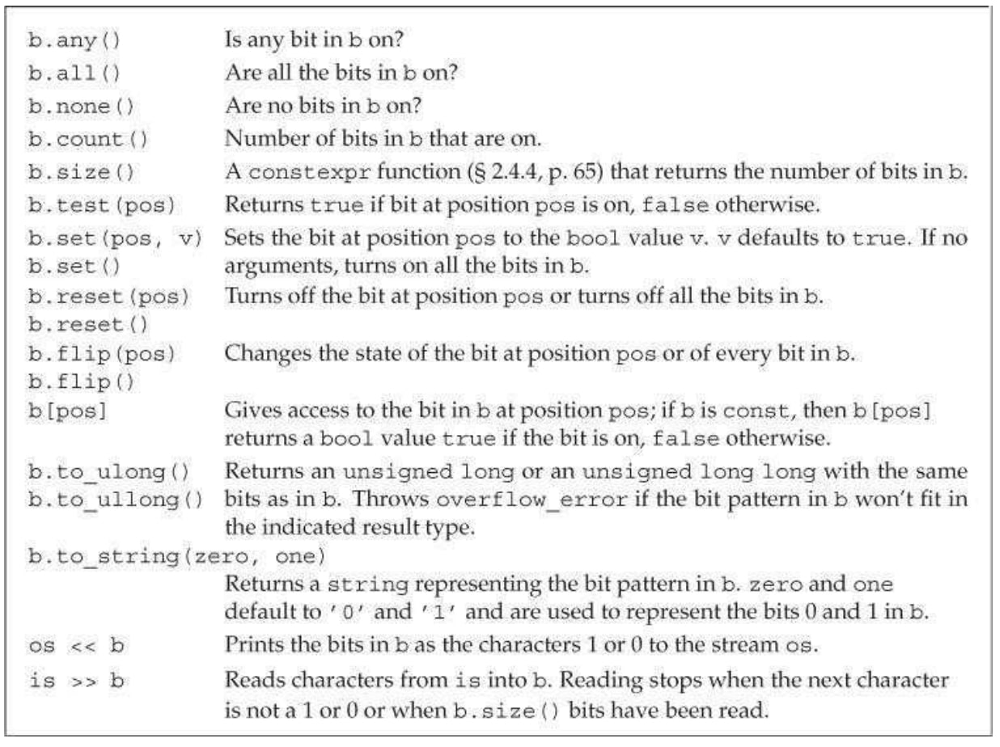

---
layout: post  
title: 2021-11-20-C++常用的STL
date: 2021-11-20
categories: blog
tags: [C++,编程语言]
description: C++常用的STL
---  

# 1. string  
## 读写函数  
`getline(inputstream, s)`  
```C++  
while(getline(inputstream, s)){
  
}
```
`cin>>s`
## 构造函数  
|构造函数|作用|
|:----:|:----:|
|string s1|默认构造函数，为空串|
|string s2(s1)|将s2初始化为一个s1的一个副本|
|string s2("value")|将s3初始化为一个字符串字面值的副本|
|string s4(100, 'c')|s4初始化为字符'c'的n个副本|
|string s4("12345", 1, 3)| s4 = "234"，即"12345"的从下标1开始，长度为3的子串|

## 赋值  
可以用 char* 类型的变量、常量，以及 char 类型的变量、常量对 string 对象进行赋值。例如：
```C++
string s1;
s1 = "Hello";  // s1 = "Hello"
s2 = 'K';  // s2 = "K”
```  
string 类还有 assign 成员函数，可以用来对 string 对象赋值。assign 成员函数返回对象自身的引用。例如：  
```C++  
string s1("12345"), s2;
s3.assign(s1);  // s3 = s1
s2.assign(s1, 1, 2);  // s2 = "23"，即 s1 的子串(1, 2)
s2.assign(4, 'K');  // s2 = "KKKK"
s2.assign("abcde", 2, 3);  // s2 = "cde"，即 "abcde" 的子串(2, 3)
```  

## 字符串长度  
length 成员函数返回字符串的长度。size 成员函数可以实现同样的功能。

## 字符串的连接
除了可以使用`+`和`+=`运算符对 string 对象执行字符串的连接操作外，string 类还有 `append` 成员函数，可以用来向字符串后面添加内容。`append` 成员函数返回对象自身的引用。例如：
```C++  
string s1("123"), s2("abc");
s1.append(s2);  // s1 = "123abc"
s1.append(s2, 1, 2);  // s1 = "123abcbc"
s1.append(3, 'K');  // s1 = "123abcbcKKK"
s1.append("ABCDE", 2, 3);  // s1 = "123abcbcKKKCDE"，添加 "ABCDE" 的子串(2, 3)
```  

## 字符串比较  
除了可以用 <、<=、==、!=、>=、> 运算符比较 string 对象外，string 类还有 compare 成员函数，可用于比较字符串。compare 成员函数有以下返回值：
* 小于 0 表示当前的字符串小；
* 等于 0 表示两个字符串相等；
* 大于 0 表示另一个字符串小。

```C++  
string s1("hello"), s2("hello, world");
int n = s1.compare(s2);
n = s1.compare(1, 2, s2, 0, 3);  //比较s1的子串 (1,2) 和s2的子串 (0,3)
n = s1.compare(0, 2, s2);  // 比较s1的子串 (0,2) 和 s2
n = s1.compare("Hello");
n = s1.compare(1, 2, "Hello");  //比较 s1 的子串(1,2)和"Hello”
n = s1.compare(1, 2, "Hello", 1, 2);  //比较 s1 的子串(1,2)和 "Hello" 的子串(1,2)
```  

## 求 string 对象的子串
substr 成员函数可以用于求子串 (n, m)，原型如下：  
```C++
string substr(int n = 0, int m = string::npos) const;
```  
调用时，如果省略 m 或 m 超过了字符串的长度，则求出来的子串就是从下标 n 开始一直到字符串结束的部分。例如：
```C++
string s1 = "this is ok";
string s2 = s1.substr(2, 4);  // s2 = "is i"
s2 = s1.substr(2);  // s2 = "is is ok"
```  

## 交换两个string对象的内容
swap 成员函数可以交换两个 string 对象的内容。例如：  
```C++
string s1("West”), s2("East");
s1.swap(s2);  // s1 = "East"，s2 = "West"
```

## 查找子串和字符  
string 类有一些查找子串和字符的成员函数，它们的返回值都是子串或字符在 string 对象字符串中的位置（即下标）。如果查不到，则返回 string::npos。string: :npos 是在 string 类中定义的一个静态常量。这些函数如下：  
* find：从前往后查找子串或字符出现的位置。
* rfind：从后往前查找子串或字符出现的位置。
* find_first_of：从前往后查找何处出现另一个字符串中包含的字符。例如：
* s1.find_first_of("abc", pos);  //查找s1中从pos开始第一次出现"abc"中任一字符的位置
* find_last_of：从后往前查找何处出现另一个字符串中包含的字符。
* find_first_not_of：从前往后查找何处出现另一个字符串中没有包含的字符。
* find_last_not_of：从后往前查找何处出现另一个字符串中没有包含的字符。  

下面是 string 类的查找成员函数的示例程序:  
```C++
#include <iostream>
#include <string>
using namespace std;
int main()
{
    string s1("Source Code");
    int n;
    if ((n = s1.find('u')) != string::npos) //查找 u 出现的位置
        cout << "1) " << n << "," << s1.substr(n) << endl;
    //输出 l)2,urce Code
    if ((n = s1.find("Source", 3)) == string::npos)
        //从下标3开始查找"Source"，找不到
        cout << "2) " << "Not Found" << endl;  //输出 2) Not Found
    if ((n = s1.find("Co")) != string::npos)
        //查找子串"Co"。能找到，返回"Co"的位置
        cout << "3) " << n << ", " << s1.substr(n) << endl;
    //输出 3) 7, Code
    if ((n = s1.find_first_of("ceo")) != string::npos)
        //查找第一次出现或 'c'、'e'或'o'的位置
        cout << "4) " << n << ", " << s1.substr(n) << endl;
    //输出 4) l, ource Code
    if ((n = s1.find_last_of('e')) != string::npos)
        //查找最后一个 'e' 的位置
        cout << "5) " << n << ", " << s1.substr(n) << endl;  //输出 5) 10, e
    if ((n = s1.find_first_not_of("eou", 1)) != string::npos)
        //从下标1开始查找第一次出现非 'e'、'o' 或 'u' 字符的位置
        cout << "6) " << n << ", " << s1.substr(n) << endl;
    //输出 6) 3, rce Code
    return 0;
}
```  

## 替换子串
replace 成员函数可以对 string 对象中的子串进行替换，返回值为对象自身的引用。例如：  
```C++  
string s1("Real Steel");
s1.replace(1, 3, "123456", 2, 4);  //用 "123456" 的子串(2,4) 替换 s1 的子串(1,3)
cout << s1 << endl;  //输出 R3456 Steel
string s2("Harry Potter");
s2.replace(2, 3, 5, '0');  //用 5 个 '0' 替换子串(2,3)
cout << s2 << endl;  //输出 HaOOOOO Potter
int n = s2.find("OOOOO");  //查找子串 "00000" 的位置，n=2
s2.replace(n, 5, "XXX");  //将子串(n,5)替换为"XXX"
cout << s2 < < endl;  //输出 HaXXX Potter
```  

## 删除子串  
erase 成员函数可以删除 string 对象中的子串，返回值为对象自身的引用。例如：  
```C++  
string s1("Real Steel");
s1.erase(1, 3);  //删除子串(1, 3)，此后 s1 = "R Steel"
s1.erase(5);  //删除下标5及其后面的所有字符，此后 s1 = "R Ste"
```  

## 插入子串  
insert 成员函数可以在 string 对象中插入另一个字符串，返回值为对象自身的引用。例如：  
```C++  
string s1("Limitless"), s2("00");
s1.insert(2, "123");  //在下标 2 处插入字符串"123"，s1 = "Li123mitless"
s1.insert(3, s2);  //在下标 2 处插入 s2 , s1 = "Li10023mitless"
s1.insert(3, 5, 'X');  //在下标 3 处插入 5 个 'X'，s1 = "Li1XXXXX0023mitless"
```  

## 字符串和数字互相转换  
```C++  
int i = 42;
string s = std::to_string(i);
double d = stod(s);
// stoi, stol, soul, stoll, stoull, stof, stold(long double 类)
```

## 将string对象作为流处理  
使用流对象 istringstream 和 ostringstream，可以将 string 对象当作一个流进行输入输出。使用这两个类需要包含头文件 sstream。  
```C++
#include <iostream>
#include <sstream>
#include <string>
using namespace std;
int main()
{
    string src("Avatar 123 5.2 Titanic K");
    istringstream istrStream(src); //建立src到istrStream的联系
    string s1, s2;
    int n;  double d;  char c;
    istrStream >> s1 >> n >> d >> s2 >> c; //把src的内容当做输入流进行读取
    ostringstream ostrStream;
    ostrStream << s1 << endl << s2 << endl << n << endl << d << endl << c <<endl;
    cout << ostrStream.str();
    return 0;
}
```  
判断流结尾： `fin.eof();`  

## split函数  
```C++  
vector<string> split(string & org_s, string & del){
    string s(org_s);
    size_t pos_start = 0, pos_end, delim_len = delimiter.length();
    string token;
    vector<string> res;

    while ((pos_end = s.find (delimiter, pos_start)) != string::npos) {
        token = s.substr (pos_start, pos_end - pos_start);
        pos_start = pos_end + delim_len;
        res.push_back (token);
    }
    res.push_back (s.substr (pos_start));
    return res;
}
```

# 2. vector
## 构造函数  
vector<int> a ; //声明一个int型向量a

vector<int> a(10) ; //声明一个初始大小为10的向量

vector<int> a(10, 1) ; //声明一个初始大小为10且初始值都为1的向量

vector<int> b(a) ; //声明并用向量a初始化向量b  

## 元素访问  
1. 可以想像数组一样下标遍历
2. 迭代：

```C++
vector<int>::iterator t ;
for(t=a.begin(); t!=a.end(); t++){
    cout<<*t<<" " ;  
}
```  

|基本操作|说明|
|:----:|:----:
|a.size()|获取向量中的元素个数|
|a.empty()|判断向量是否为空|
|a.clear()|清空向量中的元素|
|a = b|将b向量复制到a向量中|
|==、!=、>、>=、<、<= 的惯有含义 | a == b,a向量与b向量比较, 相等则返回1|

## 插入  
a.push_back(xxx);           // 插入到结尾 O(1)
a.insert(a.begin(), 1000);  //将1000插入到向量a的起始位置前 O(n)

a.insert(a.begin(), 3, 1000) ; //将1000分别插入到向量元素位置的0-2处(共3个元素)

b.insert(b.begin(), a.begin(), a.end()); // 将a.begin(), a.end()之间的全部元素插入到b.begin()前

## 查找  


## 删除  
a.pop_back();               // 删除一个元素O(1)

b.erase(b.begin()) ; //将起始位置的元素删除 O(n)

b.erase(b.begin(), b.begin()+3); //将(b.begin(), b.begin()+3)之间的元素删除

# 3. unordered_map/map
map的元素类型是pair，所以插入map元素需要用pair
## 初始化  
```C++  
set<string> sset = {"the", "but", "and", "or", " an"};

map<string, string> authors = {
    {"Joyce", "James"},
    {"Austin", "Jane"},
    {"Dickens", "Charles"}
}
```
## 自定义类型作为关键字  
如果是map或者set，则需要实现`<`运算符。并且满足：  
* 两个关键字不能同时小于等于对方
* 传递性
* 满足`(!(a < b)) && (!(b < a))`的则说明a == b  

 

## 判断是否有key  
if(map.find(key) == map.end()) cout<<"Not Exist"\<\<endl  

if(map.count(key) == 0) cout<<"Not Exist"\<\<endl  

## 增加键值对  
`map[key] = value`  

`mymap.insert ( std::pair<char,int>('a',100) );`

## 删除  
`map.erase(key)`
`map.erase(it)`

## 清除  
`map.clear()`  

## 判断个数  
`map.size()`  


## 遍历  
```C++  
for(map<int, int>::iterator iter = mmap.begin(); iter != mmap.end(); iter++){
    cout<< iter->first << " " << iter->second <<endl;
}
```  

# 4. unordered set/ Set  
无序容器使用桶进行管理，哈希函数将元素映射到桶中，映射到同一个桶的元素顺序查找。以下是桶的一些接口：  \
|接口|操作内容|
|:----:|:----:|
|c.bucket_count()|桶数量|
|c.max_bucket_count()|容器能容纳的最多的桶数量|
|c.bucket_size(n)|第n个桶有多少元素|
|c.bucket(k)|关键字k在哪个桶|
|local_iterator|可以用来访问桶中的元素的迭代器|
|c.begin(n), c.end(n)|桶n的首元素迭代器和尾后迭代器|
|c.load_factor()|每个桶平均元素数量|
|c.max_load_factor()|c试图维护的平均桶大小，返回float|
|c.rehash(n)|重组存储，使得bucket_count>=n且bucket_count>size/max_load_factor|
|c.reverse(n)|重组存储，使得c可以保存n个元素且不必rehash|
## 自定义类型作为关键字
关键字不是使用比较符号`<`，而是使用**哈希函数**和`==`组织的，元素之间没有序关系。内置类型提供了`hash<key_type>`类型的对象生成每个元素的哈希值。  

例如：  
```C++  
size_t hasher(const Sdales_data & d){
    return hash<string>()(sd.isbn());
}

bool eqOp(const Sales_data & lhs, const Sales_data & rhs) {
    return lhs.isbn() == rhs.isbn();
}

unordered_set<Sales_data, decltype(hasher)*, decltype(eqOp)*> bookstore(42, hasher, eqOp);
```  


## 插入
insert(xxx);

## 判断是否存在  
sset.find(xxx) != sset.end()

## 删除  
sset.erase(xxx);

## 迭代  
```C++  
int main ()
{
  int myints[] = {75,23,65,42,13};
  std::set<int> myset (myints,myints+5);

  std::cout << "myset contains:";
  for (std::set<int>::iterator it=myset.begin(); it!=myset.end(); ++it)
    std::cout << ' ' << *it;

  std::cout << '\n';

  return 0;
}
```  

# 5. deque/queue/stack  

stack: push, pop, top, empty, size

queue: push, pop, front, empty, size

deque: push_back, push_front, pop_back, pop_front, insert, erase, iterator  

**deque**  
底层结构如下：

map是一个链表，deque底层是一段一段连续的数组，之所以不用循环vector，是因为deque要保证任何时候非头部的节点的地址都不改变。
# 6. list  
底层是双向链表，当知道了位置的iterator，插入速度是O(1)，同理，删除速度也是O(1)，只支持顺序遍历不支持随机访问。
similar to deque  。

# 7. priority_queue  
一种优先级队列，其允许用户以任何次序将元素压入容器内，与 queue 不同的是，从其中取出元素时是根据优先级顺序的。底层是heap（默认是大顶堆）。  
priority_queueq底层是使用vector实现的。  
如果要小顶堆则需要传入一个仿函数`greater<int>`. 
例如：  
```C++  
// 中间的需要传入底层容器
priority_queue<int, vector<int>, greater<int> > q;

```
用法：
|名称|时间复杂度|说明|  
|:----:|:----:|:----:|
|bool empty(); |O(1)|判断是否非空|
|size_type size();|O(1)|返回容器大小|  
|const_reference top();|O(1)|得到顶部元素的引用|  
|void push();|O(log n)|插入末端，按优先级重排 heap，底层使用 push_heap 算法|  
|void pop();|O(log n)|弹出优先级最高的元素，底层使用 pop_heap 算法|  


# 8. sort   
sort 默认使用`<`运算符，但是sort还接受一个比较函数：  
```C++  
bool isShorter(const string & s1, const string & s2) {
    return s1.size() < s2.size();
}
```  
当然也可以使用lambda表达式：  
```C++
[](const string & s1, const string & s2) -> bool{return s1.size() < s2.size()}
```
**sort也可以使用stable_sort不改变相等元素的位置**。
* stable_sort 底层使用归并排序算法，可保证相等元素的原本相对次序在排序后保持不变。
* sort 不稳定排序，底层使用快速排序，会改变相等元素的原本相对次序。  

因为algorithm里的sort只支持随机访问的迭代器，比如vector，而list金额forward_list只有双向迭代器和正向迭代器，因此不能用于list。所以list和forward_list定义了独有的sort, merge, remove, reverse和unique  

这些函数都返回void，调用方法如下：  
lst.merge(lst2);        // 将lst2元素合并入lst2。lst1和Lst2都必须是有序的。  
lst.merge(lst2, comp)；     // comp实现\<函数  

lst.remove(val);  
lst.remove(pred);       // 删除 ==的条件的元素  

lst.reverse();           // 翻转lst中的元素

lst.sort();  
lst.sort(comp);

lst.unique();  
lst.unique(pred);       // 使用二元谓词判断==  

注意，与库函数algorithm不同的是，remove、merge、unique均会删除参数和多余的数据，而库函数不会（比如unique不会删除，len不改变）。  

# 9. bitset类型  
定义bitset需要声明包含多少二进制位：  
```C++  
bitset<32> bitvec(1U);          // 32位；低位为1，其他位为0
bitset<32> vitvec4("1100");   // 低位为0，高位为1
```
  

# 10. 正则表达式  

**regex**: 表示有一个正则表达式的类。
**regex_match**: 将一个字符序列与一个正则表达式匹配。
**regex_search**: 寻找第一个与正则表达式匹配的子序列。
**regex_replace**: 使用给定格式替换一个正则表达式。
**sregex_iterator**: 迭代适配器，调用regex_search来遍历一个string中所有匹配的子串。
**smatch**: 容器类，保存在string中搜索的结果。
**ssub_match**: string匹配的子表达式的结果。

例子：  
```C++  
string pattern("[^c]ei");
pattern = "[[:alpha:]]*" + pattern + "[[:alpha:]]*";

regex r(pattern);
smatch results;

string test_str = "receipt friend theif receive";
if(regex_search(test_str, results, r))
    cout<<results.str()<<endl;

// 输出：friend
```  

另外一个例子：  
```C++  
string pattern("[^c]ei");
pattern = "[[:alpha:]]*" + pattern + "[[:alpha:]]*";
string test_str = "receipt friend theif receive";

regex r(pattern);

for(sregex_iterator it(test_str.begin(), test_str.end(), r), end_it; it!=end_it; ++it){
    cout<<it->str()<<endl;      // 匹配的单词
}
```

匹配时设置标志：`(seq, m, r, mft);`mft是匹配时的标志，其中：  
icase: 忽略大小写, 
nosubs: 不保存匹配的子表达式, 
optimize: 执行速度优先于构造速度, 
ECMAScript: 使用ECMA-262指定的语法, 
basic: 使用POSIX基本的正则表达式语法,
extended: 使用POSIX扩展的正则表达式语法,
awk: 使用POSIX版本的awk语言的语法,
grep: 使用POSIX版本的grep语法,
eprep: 使用POSIX的egrep的语法,  

正则表达式会出现语法错误时，抛出**regex_error**异常，因此需要try_catch捕获。

> 避免创建不必要的正则表达式，因为整个表达式是在运行时编译的，编译速度非常慢，因此尽量避免使用，如果使用则避免在循环内创建。


