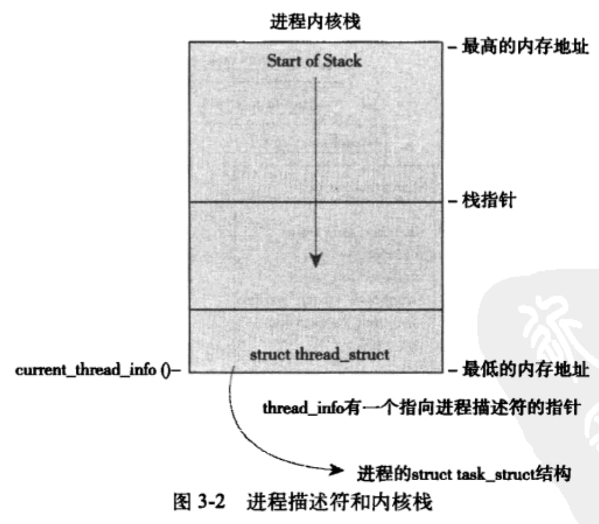

---
layout: post  
title: 2021-12-11-Linux内核设计与实现
date: 2021-12-11
categories: blog
tags: [Linux,操作系统,笔记]
description: 2021-12-11-Linux内核设计与实现
---  

# 1. Linux内核简介  
**内核**：内核由负责响应中断的**中断服务程序**、负责管理多个进程从而分享处理器事件的**调度程序**、负责管理进程地址空间的**内存管理程序**、网络、进程间通信等**系统服务程序**共同组成。  

**内核空间**：对于保护机制的现代系统来说，内核独立于普通应用程序，它一般处于系统态，拥有受保护空间和访问硬件设备的所有权限。  


**中断**：中断通常对应一个中断向量号，内核通过这个中断号查找相应的中断服务程序，并调用这个程序响应和处理中断。**许多操作系统的中断服务程序(包括Linux)，都不在进程上下文中执行，它们在一个与所有进程无关的、专门的中断上下文中运行**。  

**内核运行环境**：  
* 运行于用户空间，执行用户进程。
* 运行于内核空间，处于进程上下文，代表某个特定的进程执行。
* 运行于内核空间，处于中断上下文，与任何进程无关，处理某个特定的中断。

# 2. 从内核出发  
http://www.kernel.org 有最新的源代码，也可以用git获取：  
```shell  
git clone git://git.kernel.org/pub/scm/linux/kernel/git/torvalds/linux-2.6.git  
```  

**安装源代码**：内核源码一般安装在/usr/src/linux/目录下，但是不要把这个源码树用于开发，因为编译C库所用的内核版本就链接到这棵树。应当建立自己的主目录，仅以root身份去安装新内核，即使在安装新内核时，/usr/src/linux目录都应当原封不动。  

**应用增量补丁**：  
```shell  
patch -p1 < ../patch.x.y.z
```  

**内核中的文件**  
|目录|描述|
|:----:|:----:|
|arch|特定体系结构的源码|
|block|块设备IO层|
|crypto|加密API|
|Documentation|文档|
|drivers|设备驱动程序|
|firmware|使用某些驱动程序而需要的设备**固件**|
|fs|VFS和各种文件系统|
|include|内核头文件|
|init|内核引导和初始化|
|ipc|进程间通信|
|kernel|像调度程序这样的**核心子系统**|
|lib|通用内核函数|
|mm|内存管理子系统和VM|
|net|网络子系统|
|samples|示例、示范代码|
|scripts|编译内核所使用的脚本|
|security|Linux安全模块|
|sound|语音子系统|
|usr|早期用户空间代码|
|tools|在Linux开发中有用的工具|
|virt|虚拟化基础结构|

COPYING是内核许可证，Makefile是基本内核的make文件。  

## 2.3 编译内核
* 将源码解压到/home/username/子目录下，然后进入该目录，执行命令： `make config`；或者使用图形界面工具：`make menuconfig`；或者使用基于gtk+的图形工具：`make gconfig`。

* 下面这条命令会基于默认的配置为计算机的体系结构创建一个配置：`make defconfig`。

* 这些配置会在代码树的根目录下生成.config文件。配置选项CONFIG_IKCONFIG_PROC则会把完整的压缩过的内核配置文件存放在/proc/config.gz下，这样当想要编译新的内核时可以直接把配置文件拿出来：  
```C++  
$> zcat /proc/config.gz > .config
$> make oldconfig
```  

一旦内核配置好就可以执行编译：`make`。  

Makefiles 把编译过程定义成多个并行的作业。其中每个作业独立并发地运行，这有助于极大加快编译时间。命令为：`make -jn > /dev/null`，n为32则用32个并行作业，然后输出全部丢弃。  

### 安装内核  
不同安装方法和体系结构以及启动引导工具(boot loader)有关，例如：  
* 使用grub引导的x86系统，需要把/arch/i386/boot/bzImage拷贝到/boot目录下，像vmlinuz-version这样命名它，并且编辑/etc/grub/grub.conf文件，为新内核建立一个新的启动项。  

模块的安装是自动的，也是独立于体系结构的，以root身份运行：`make modules_install`就可以把所有已编译的模块安装到正确的主目录/lib/modules下。  

编译时也会在内核代码树的根目录下创建一个System.map文件。这是一份符号对照表，用以将内核富豪和它们的起始地址对应起来，调试的时候，如果需要把内存地址翻译成容易理解的函数名以及变量名，这就回很有用。  

## 2.4 内核开发的特点
* 内核编程时既不能访问C库也不能访问标准的C头文件
* 内核编程时必须使用GNU C
* 内核编程时缺乏像用户空间那样的内存保护机制
* 内核编程时**难以执行浮点运算**
* 内核给每个进程只有一个**小的定长堆栈**
* 由于内核支持异步中断、抢占和SMP(对称多处理器)，**因此必须时刻注意同步和并发**
* 要考虑可移植性

### 无libc和标准头文件
内核链接不使用标准C库，所以只能使用内核特有的函数。  

* 基本的头文件在源代码的include目录中，例如`<linux/inotify.h>` 对应内核源代码树的`include/linux/inotify.h`，体系结构的头文件在arch/\<architecture\>/include/asm目录下，include时例如：\<asm/ioctl.h\> 。  
* printk函数用来代替printf，并且可以使用优先级标志位，syslogd会根据这个优先级标志来决定在什么地方显示这条系统消息，例如：  
```C  
printk(KERN_ERR "this is an error %d \n", 100);
```  

### GNU C  
Linux内核编译需要使用GNU C编译器而不是ANSI C标准。  

**inline**：将函数从调用点处展开，不需要压栈。缺点：可能需要用到更多的内存，占用更多的指令缓存。用法：将那些对时间要求比较高，而本身长度比较短的函数定义成内联函数。定义内联函数：`static inline void wolf(xxx);`，需要static关键字。内联函数必须在使用前就定义好，所以一般放在头文件或者文件开始的地方。因为static，所以其只能对本文件使用。  

### 没有内存保护机制  
内核编程没有内存保护机制，一旦访问越界直接挂掉。内核中的内存都不分页，也就是说，每用掉一个字节，物理内存就减少一个字节，所以在想往内核中加入什么新功能时，要记住这一点。  

### 内核栈容积小而固定  
用户空间的程序可以从栈上分配大量的空间来存放变量，并且栈还会增长，但是内核栈大小是固定的，在x86上，栈的大小在编译时配置，可以是4KB也可以是8KB，一般情况下大小是两页，这意味着32位机器的内核栈大小是8KB

### 同步和并发  
内核很容易产生竞争条件，因为它是抢占多任务操作系统，并且支持对称多处理器系统，所以如果没有适当保护，同时在两个或囖昂哥以上的处理器执行内核代码可能会同时访问共享的同一个资源。另外，中断是异步到来的，完全不顾及正在执行的代码，所以如果不保护，中断处理程序就有可能访问同一资源。

# 3. 进程管理  
## 3.1 进程
> 进程是资源管理的最小单位，一个进程可能包含多个线程，并且还有打开的文件、挂起的信号、内核内部数据、处理器状态、页表等资源。

> 线程是程序执行的最小单位，它们有各自的程序计数器、栈和寄存器，但是堆内存和地址空间，共享各类进程的资源。

Linux对进程和线程不特别区分，对Linux而言，线程只不过是一种特殊的进程。

* 创建进程通常调用`fork()`系统调用，父进程直接返回子进程的pid，子进程产生同父进程一模一样的进程并返回0。通常创建新的进程都是为了立即执行新的、不同的程序，而接着调用`exec()`    这组函数就可以创建新的地址空间，并把新的程序载入其中。在现代linux系统中，fork()实际上是由clone()系统调用实现的。
* 进程通常通过`exit()`系统调用结束执行并释放资源，父进程可以通过waitpid()，wait()等系统调用查询子进程是否中介，这让进程拥有了等待特定进程执行完毕的能力。进程退出执行后被设置为僵死状态，直到它的父进程调用wait()或waitpid()为止。

## 3.2 进程描述符和任务结构  
内核把进程的列表存放到任务队列(task list)的**双向循环链表**中。链表中的每一项类型为task struct、称为进程描述符的结构，该结构定义在\<linux/sched.h\>中，进程描述符包含一个具体进程的所有信息。  

task_struct存放在**进程内核栈**的最顶端(对于向上增长的栈来说)，大小约1.7KB。

> 内核空间也是同样通过「页表」访问的，因为现代 CPU 的寻址不能绕过 MMU。不过内核空间和用户空间不同，**它一般不做 swap**，也就没有 page fault，而且它一般不会把连续的虚拟地址空间映射成不连续的物理空间，一般只是做一个 offset。所以所有进程的用于访问内核空间的页表都是这么设定的。另外，**所有进程共享内核空间**，但是需要先把内核空间分割成不同的栈，**每个进程有各自的内核栈**。

内核中访问任务通常需要获得task_struct指针，实际上内核中大部分处理进程代码通过task_struct直接进行的，通过current宏查找到当前正在运行进程的进程描述符。current宏实际上由硬件实现。  



### 进程状态
TASK_RUNNING, TASK_INTERRUPTIBLE, TASK_UNINTERRUPTIBLE, __TASK_TRACED, TASK_STOPPED.

__TASK_TRACED: 被其他进程跟踪的进程没例如ptrace对调试程序进行跟踪。  

### 进程上下文  
一般程序在用户空间执行。当一个程序执行了系统调用或者触发了某个异常，它就陷入了内核空间。此时，我们称内核代表进程执行，并处于进程上下文中。在此上下文中current宏是有效的。（在中断上下文中，系统不代表进程执行，而是执行一个中断处理程序。不会有进程去干扰中断处理程序，所以此时不存在进程上下文）。

进程只能通过系统调用和异常处理程序才能陷入到内核态执行（也就是一个标志位，有了这个标志位能够访问内核空间）。  

### 进程家族树  
所有进程都是PID为1的init进程的后代。内核在i痛启动的最后阶段启动init进程，该进程读取初始化脚本并执行其他的相关程序，完成系统启动的整个过程。  

系统中每个进程必定有父进程，也可以有零或多个子进程。task_struct有一个parent指针，还有一个children子进程链表指针。  
获得父进程的task: `struct task_struct * my_parent = current->parent;`

## 3.3 进程创建  

Linux先通过fork()创建一个与父进程一模一样的进程，出了PID和PPID不同，也不包含一些资源（比如挂起的信号）。exec()函数负责读取可执行文件并将其载入到地址空间开始运行。  

fork实际上采用的是**写时复制**，也就是说只有execv或者其他更改时，对应的物理页才会变换。  

### fork函数  
Linux通过clone()系统调用实现fork()。clone()调用do_fork()，该函数完成了创建中的大部分工作，其定义在kernel/fork.c文件中。该函数调用copy_process()函数让进程开始运行。  

copy_process()工作：
1. 为进程创建一个内核栈、thread_info结构、task_struct结构，这些值于父进程的相同（参照图1）。
2. 检查新的进程没有超过给它分配的资源限制。
3. 进程描述符内的许多成员都要被清0，使其与父进程区别开。
4. 子进程状态被设置成TASK_UNINTERRUPTIBLE，以防止被直接运行
5. 更新flags成员，表明进程是否拥有超级用户权限的PE_SUPERPRIV标志被清0.表明还没有调用exec()函数的PF_FORKNOEXEC标志被设置。
6. 调用alloc_pid()为新进程分配一个有效的PID
7. 根据clone()的标志，copy_process()拷贝或共享打开的文件、文件系统信息、信号处理函数、进程地址空间和命名空间等。
8. 最后进行扫尾工作返回一个指向子进程的指针

### Linux线程实现  
Linux将线程看成一组资源共享的进程，底层也是task_struct，它们共享地址空间、文件、页表。Linux并没有专门的机制去处理线程调度一类的。  

例如Linux创建线程：  
```C  
clone(CLONE_VM | CLONE_FS | CLONE_FILES | CLONE_SIGHAND, 0);
```  
线程的创建和进程的创建类似，只不过在调用clone()的时候需要传递一些参数标志来指明需要共享的资源。上述代码共享地址空间、文件系统资源、文件描述符和信号处理程序。  

### 内核线程  
内核线程与普通的进程区别在于，**内核线程没有独立的地址空间**(实际上指向地址空间的mm指针被设置为NULL)，它们只在内核空间运行，从不切换到用户空间去。  

运行`ps -ef` 命令可以查看所有内核线程，这些线程由系统启动时被另一些内核线程启动。

创建一个内核线程：`struct task_struct * kthread_create(xxx)`，创建完毕必须执行`wake_up_preocess`才能被运行。  

内核线程启动后就一直运行，直到调用do_exit()退出，或者内核的其他部分调用kthread_stop()推车，传递给kthread_stop()的参数时需要结束运行的内核线程的task_struct地址。

## 3.5 进程终结  
绝大部分进程终结都需要调用do_exit()。  
1. 将task_struct中的标志位成员设置为PF_EXITING
2. 调用del_timer_sync()删除任一内核定时器，它保证没有定时器在排队，也没有定时器处理程序在运行。
3. 调用exit_mm()函数释放进程占用的mm_struct，如果没有别的进程使用它们（也就是说这个地址空间没有被共享），就彻底释放它们。
4. 调用sem__exit()函数。如果进程排队等候IPC信号，它则离开队列
5. 调用exit_fs, exit_files，分别递减文件描述符、文件系统数据的引用计数，如果某个引用计数数值降为0，这个文件资源则可以被释放。
6. 把存放在task_struct的exit_code成员中的任务退出码置为exit()提供的退出代码，供父进程检索。
7. 调用exit_notify()向进程发送信号，给子进程重新找养父，养父为线程组中的其他线程或者init进程，并把进程状态设置为EXIT_ZOMBIE。
8. do_exit()调用schedule()切换到新的进程，因为处于EXIT_ZOMBIE状态的进程不会再被调度，所以这时进程所执行的最后一段代码。do_exit用不返回。  

当我们只fork()一次后，存在父进程和子进程。这时有两种方法来避免产生僵尸进程：
1.父进程调用waitpid()等函数来接收子进程退出状态。
2.父进程先结束，子进程则自动托管到Init进程（pid = 1）。  

### 删除进程描述符
进程终结的清理工作和删除进程描述符的工作是分开的，wait的工作就是删除进程描述符。wait()函数族就都是通过调用wait4()这个系统调用实现的。它的标准动作是**挂起调用它的进程直到其中的一个子进程退出**。此时函数会返回该子进程的PID，此外，如果传入一个指针，则还会返回子进程退出时的代码。
waitpid/wait有阻塞和不阻塞两种模式，不阻塞的可能还是会产生僵尸进程。一次wait调用，只能回收一个子进程。wait/waitpid就是用来回收子进程的。  

最终释放进程描述符时，会调用release_task，完成以下工作：  
1. 从pid上删除该进程，同时从任务列表中删除该进程。
2. 释放该僵死进程的所有资源
3. 吐过该进程是线程组的最后一个进程，并且领头进程已经死掉，那么release_task通知僵死的领头进程的父进程。
4. release_task()调用put_task_struct()释放进程内核栈和thread_info结构所占的页，并释放task_struct所占用的slab高速缓存。

父进程在子进程退出前退出，则需要给其子进程找继父，，方法是给子进程在当前线程组内找一个线程作为父亲，如果不行，就让init做它们的父亲。

# 4. 进程调度  

Linux采用优先级+时间片调度


优先级：Linux采用两种优先级，第一个是nice值，它的范围从-19到20，默认为0，nice值越高优先级越低。nice值低的进程可以获得更多的处理器时间。另一种是实时优先级，变化范围是0到99，其值越高代表实时优先级数值意味着进程的优先级越高。任何实时进程的优先级都高于普通进程。linux将处理器运行时间的比例分配给进程，这个比例受到nice值的影响，称为时间片。  

CFS为了实现公平，必须惩罚当前正在运行的进程，以使那些正在等待的进程下次被调度。**具体实现时，CFS通过每个进程的虚拟运行时间（vruntime）来衡量哪个进程最值得被调度**。CFS中的就绪队列是一棵以vruntime为键值的红黑树，虚拟时间越小的进程越靠近整个红黑树的最左端。因此，调度器每次选择位于红黑树最左端的那个进程，该进程的vruntime最小虚拟运行时间是通过进程的实际运行时间和进程的权重（weight）计算出来的。在CFS调度器中，将进程优先级这个概念弱化，而是强调进程的权重。一个进程的权重越大，则说明这个进程更需要运行，因此它的虚拟运行时间就越小，这样被调度的机会就越大。


# 4.1 Linux进程调度的实现

主要关注四个部分：
* 时间记账
* 进程选择
* 调度器入口
* 睡眠和唤醒

### 时间记账

调度器实体结构`struct sched_entity` 被作为名为se的变量保存在`task_struct`中。  
下面是CFS调度器（公平调度器）：  
```C++  
struct sched_entity
{
    struct load_weight      load;           /* for load-balancing负荷权重，这个决定了进程在CPU上的运行时间和被调度次数 */
    struct rb_node          run_node;
    unsigned int            on_rq;          /*  是否在就绪队列上  */

    u64                     exec_start;         /*  上次启动的时间*/

    u64                     sum_exec_runtime;
    u64                     vruntime;
    u64                     prev_sum_exec_runtime;
    /* rq on which this entity is (to be) queued: */
    struct cfs_rq           *cfs_rq;
    ...
};
```

update_curr计算出进程已经运行的时间vruntime，是由系统定时器周期性调用的，无论进程是否处于可运行状态或者阻塞状态，vruntime变量都可以准确测量进程运行时间。vruntime的计算是根据权重和已经运行的时间计算的，权重代表使用CPU时间的比例。  

CFS调度算法就是选择最小的一个vruntime进程进行调度。update_curr的流程如下:

* 首先计算进程当前时间与上次启动时间的差值
* 通过负荷权重和当前时间模拟出进程的虚拟运行时钟
* 重新设置cfs的min_vruntime保持其单调性 

CFS调度器使用红黑树来组织可运行进程队列，并利用其迅速找到一个最小vruntime值的进程。Linux中称红黑树为rbtree，它是一个自平衡二搜索树。  

**挑选下一个任务**：
红黑树的键就是vruntime时间，那么直接挑选最左下角的结点就是最小的结点。实际上已经缓存了最左下角的结点。挑选出来的结点继续运行。

**向树中加入进程**：  
函数更新运行时间，然后执行插入一个新结点的操作。  

**删除结点**：  
删除结点发生在进程变为不可运行状态或者终止。  

### 调度器的入口函数  
调度器的入口函数是schedule()，定义在sched.c文件中，它是内核其他部分用于调用进程调度器的入口：选择哪个进程可以运行，何时将其投入运行。schedule调用pick_next_task()函数，以优先级为序在可运行队列里找一个任务运行。  

它以优先级为序，从最高优先级类开始，遍历每一个调度类，每一个类都实现了pick_next_task函数，它会返回指向下一个可运行进程的指针，或者是NULL。

### 睡眠和唤醒  

睡眠是一种特殊的不可执行状态，进程休眠由多种原因，比如文件IO。  

进程把自己标记为休眠状态，从可执行红黑树中移除，放入等待队列，然后调用schedule()选择和执行一个其他进程。唤醒过程刚好相反，进程被标记为可执行状态，然后从等待队列移到可执行红黑树中。  

休眠有两种状态：TASK_INTERRUPTIBLE和TASK_UNINTERRUPTIBLE，它们唯一区别是后者会忽略信号，而前者如果接受到一个信号，会被提前唤醒并响应该信号。两种状态的进程位于同一队列，等待某些事件，不能运行。

### 抢占和上下文切换  
上下文切换，也就是从一个可执行进程切换到另一个可执行进程，由定义在kernel/sched.c中的context_switch()函数负责处理。它完成两个基本工作：  
* switch_mm()，该函数负责把虚拟内存从上一个进程映射切换到新进程中。  
* switch_to()，把函数负责从上一个进程的处理器状态切换到新进程的处理器状态，包括保存、恢复栈信息和寄存器信息，还有其他与体系结构相关的信息。

周期调度器scheduler_tick通过linux定时器周期性的被激活, 进行程序调度；进程主动放弃CPU或者发生阻塞时, 则会调用主调度器schedule进行程序调度。

<font color="red" size=5>注意：Linux进程根据优先级不同分为普通进程和**实时进程**</font>

在Linux内核中，实时进程总是比普通进程的优先级要高，实时进程的调度是由**Real Time Scheduler** (**RT调度器**)来管理，而普通进程由**CFS调度器**来管理。实时进程支持的调度策略为：SCHED_FIFO和SCHED_RR。

**用户抢占**
内核即将返回用户空间时，如果need_resched标志被设置，会导致schedule()被调用，此时会发生用户抢占。用户抢占发生在以下阶段：1. 从系统调用返回用户空间时，2.从中断处理程序返回用户空间。

**内核抢占**  
抢占式内核的内核进程也会被其他内核进程抢占，其发生时机是：1. 中断处理程序正在执行，且返回内核空间之前，2.内核代码再一次具有可抢占的时候，3. 内核中的人物显式调用schedule()，4. 内核中的任务阻塞。

实时进程调度策略分为SCHED_FIFO和SCHED_RR。非实时的进程策略是SCHED_NORMAL。
* FIFO不使用时间片，先到先得，可以一直运行下去，直到阻塞或者自己主动调用schedule()。
* RR使用时间片，当时间片被耗尽，会调度同一优先级的其他进程，也就是说它只在同优先级进程之间切换。

与调度相关的系统调用：  
nice():设置nice值。
sched_setscheduler(): 设置进程的调度策略。
sched_getscheduler(): 获得进程的调度策略。
sched_setparam(): 设置进程的实时优先级。
...
sched_rr_get_interval(): 获得进程的时间分片。
sched_yield(): 暂时让出处理器。  

# 5. 系统调用  

## 5.1 与内核通信  
异常、陷入、系统调用是唯三的与内核通信的方法。 

异常：异常是由当前正在执行的进程产生。异常包括很多方面，**有出错（fault）**，**有陷入（trap）**，也有可编程异常（programmable exception）。出错（fault）和陷入（trap）最重要的一点区别是他们发生时所保存的EIP值的不同。出错（fault）保存的EIP指向触发异常的那条指令；而陷入（trap）保存的EIP指向触发异常的那条指令的下一条指令。因此，当从异常返回时，出错（fault）会重新执行那条指令；

陷入（trap）就不会重新执行。这一点实际上也是相当重要的，比如我们熟悉的缺页异常（page fault），由于是fault，所以当缺页异常处理完成之后，还会去尝试重新执行那条触发异常的指令（那时多半情况是不再缺页）。陷入也称为仿管指令，计算机操作系统的中断处理机制，计算机的陷阱指令**一般不提供给用户使用**，而作为隐指令（即指令系统不提供的指令），在出现意外故障时，由CPU自动产生并执行。 应用在调试程序的断点也使用的是陷入。  

**机制与策略：** 
* 机制：需要提供什么样的功能
* 策略：如何实现这样的功能

## 5.2 系统调用  
**系统调用号**：内核不按照名字调用系统调用，而按照系统调用号指明到底是要执行哪个系统调用。系统调用号表是编译时就确定的，存储在sys_call_table中，定义在arch/i386/kernel/syscall_64.c 文件中，这个表为每一个有效的系统调用指定来唯一的系统调用号。  

## 系统调用处理程序  
用户额空间的程序无法直接执行内核代码，它们不能直接调用内核空间中的函数，因为内核驻留在受保护的地址空间上。因此需要通过软中断促使系统切换到内核态去执行异常处理程序。  

x86系统上的软中断是128，通过`int $0x80`指令触发该中断，这条指令会触发一个异常导致系统切换到内核态并执行128号异常处理程序，而该程序就是系统调用处理程序。  

**指定系统调用号**  
x86系统上通过eax给内核和系统调用处理程序传递系统调用号，在陷入内核之前就应当把系统调用号放置在eax里。系统调用表的一个表项是8字节，所以需要再eax*8得到系统调用的起点。  

**传递参数**  
参数一般放置在寄存器里，ebx, ecx, edx, esi, edi按照顺序存放前五个参数。需要六个以上的参数情况不多见，**此时应该用一个单独的寄存器存放指向所有这些参数在用户空间地址的指针**。  
给用户空间的返回值也通过寄存器传递，x86系统里返回值放置在eax。  

## 5.5 系统调用的实现  
Linux不提倡多用途系统调用（一个系统调用号根据参数不同实现不同功能）。  

**参数验证**：  
系统调用必须检查验证参数是否合法。内核必须保证：  
* 指针指向的内存区域属于用户空间，进程不能让内核去读区内核空间的数据。
* 指针指向额内存区域在进程的地址空间，不能访问其他进程的地址空间
* 如果是读，该内存应被标记为可读，写则是可写，可执行同理。  

内核提供了`copy_to_user()`和`copy()_from user()`检查和内核空间与用户空间之间数据的来回拷贝。内核绝不能轻率地接受来自用户空间的指针，这两个方法中必须经常有一个被使用。  

## 5.6 系统调用上下文  
内核在执行系统调用的时候处于进程上下文。current指针指向当前任务，即引发系统调用的那个进程。  

在进程上下文中，内核可以**休眠**(比如系统调用阻塞或显式schedule())并且可以被**抢占**。因此必须要保证系统调用是可重入的。当系统调用返回时候，控制权仍然在system_call()中，它最终会负责切换到用户空间，并让用户进程继续执行下去。  
中断处理程序不能休眠，这使得中断处理程序所能进行的操作较之运行在进程上下文中的系统调用所能进行的操作受到极大的限制

**绑定一个系统调用**  
1. 在系统调用表的最后加入一个表项
2. 系统调用号必须定义在\<asm/unistd.h中\>
3. 系统调用必须被编译进内核，只要把它放进kernel/下的一个相关文件就可以了，比如sys.c，它包含了各种各样的系统调用。

**C语言调用系统调用**：  
glibc必须要通过Linux提供的一组宏实现系统调用：  
例如open()系统调用的定义：  
```C  
long open(const char * filename, int flags, int mode);
```  

不考库支持直接调用： 
```C 
#define NR_open 3
_syscall3(long, open, const char *, filename, int, flags, int, mode)
```  

这样应用程序就可以直接使用open了。  
_syscalln宏n代表参数范围0到6，第一个是返回值类型，第二哥是系统调用名称，后面2 * n个表示类型和返回值，_NR_open是系统调用号。_syscalln 宏会被扩展为内嵌汇编的C函数；由汇编语言执行前面的步骤，将系统调用号和参数压入寄存器并触发软中断来陷入内核。  

调用open系统调用直接把上面的宏放置在应用程序就可以了。  

**不推荐使用系统调用**  
好处：系统调用容易创建且使用方便，系统调用性能高

坏处：需要系统调用号、难以修改因为要编译到内核、主内核树之外难以维护和使用系统调用

替代方法：实现一个设备节点并实现read()和write()函数，使用ioctl对特定的设置进行操作或对特定信息进行检索，把增加的信息作为一个文件放在sysfs的合适位置。  

# 6. 内核数据结构  
## 6.1 链表
链表/双向链表/带头节点的双向链表

环形链表  

Linux内核的标准链表就是采用**环形双向链表**。  

Linux链表定义在\<linux/list.h\>中，并提供了list_add()方法加一个节点，或者container_of()可以找到任何变量。  

Linux链表不包含数据，而数据结构包含Linux链表，也就是：  
```C++  
struct class_A {
    /* ... */
    struct list_head list;
}
```
然后通过offset_of 宏计算出该结构的首地址从而得到该结构。  
offset_of宏：  
((size_t) & ((type *)0)->member)  
将0进行类型转换，得到对齐后的member的偏移。

## 6.2 队列kfifo  
kfifo是内核的队列，有如下API:  
kfifo_alloc, kfifo_init, kfifo_out, kfifo_out_peek, kfifo_size, kfifo_len, kfifo_avail, kfifo_empty, kfifo_full, kfifo_reset, kfifo_free  

## 6.3 映射IDR  
映射，也称为关联数组，map。  
idr在linux内核中指的就是**整数ID管理机制**，从本质上来说，这就是一种将整数ID号和特定指针关联在一起的机制。  

> 如果我们的PC是一个I2C总线上的主节点，那么要访问总线上的其他设备，首先要知道他们的ID号，同时要在pc的驱动程序中建立一个用于描述该设备的结构体。此时，问题来了，我们怎么才能将这个设备的ID号和他的设备结构体联系起来呢？最简单的方法当然是通过数组进行索引，但如果ID号的范围很大(比如32位的ID号)，则用数组索引显然不可能；第二种方法是用链表，但如果网络中实际存在的设备较多，则链表的查询效率会很低。遇到这种清况，我们就可以采用idr机制，该机制内部采用radix树实现，可以很方便地将整数和指针关联起来，并且具有很高的搜索效率。

## 6.4 二叉树  
**二叉搜索树**：左分支值都小于根节点，右分支值都大于根节点。  

**自平衡二叉树**：**所有叶子结点深度**差不超过1。  

### 红黑树  
Linux主要的平衡二叉树数据结构就是红黑树，红黑树具有特殊的着色属性，或共色或黑色，红黑树遵循以下六个属性，所以能保证最长分支长度小于最短分支的两倍。  
* 所有结点要么是红色要么是黑色
* 跟结点是黑色
* 所有叶子结点是黑色
* 所有非叶结点都有两个子结点
* 如果一个结点是红色，则它的两个子结点都是黑色
* **任意一结点到每个叶子结点的路径都包含数量相同的黑结点。**

上述黑色的性质还能继续推出：如果一个结点存在黑子结点，那么该结点肯定有两个子结点。  红黑树讲解：[链接](https://www.jianshu.com/p/e136ec79235c)。  

Linux的红黑树定义在lib/rbtree.c中  

# 7. 中断和中断处理  
不同的设备对应的中断不同，而每个中断都通过唯一的数字标志。  

异常：处理器本身产生的同步中断。内核对中断和异常的处理非常类似。  

在响应一个特定的中断的时候，内核会执行一个函数，该函数叫做中断处理程序或中断服务例程。产生中断的每个设备都有一个中断处理程序，他们是设备驱动程序的一部分。  中断处理程序实际上就是一个普通的C语言函数，只不过必须按照特定的类型声明，中断处理程序在中断上下文中执行，该上下文中的代码不可被阻塞，并且其他所有中断被禁止。中断处理程序尽可能快而短。  

## 中断上下部  
中断处理程序是上部，接受中断，它就立即开始执行，但是只做有严格时限的工作，比如应答或复位硬件。能够被允许稍后完成的工作会推迟到下半部去，伺候，在合适的时机，下半部会被开中断执行，Linux会提供实现下半部的各种机制（第8章）。  

> 实例：网卡。当网卡接受来自网络的数据包时，需要通知内核数据包到了。网卡需要立即完成这件事，从而优化网络的吞吐量和传输周期以避免超时。因此网卡发出中断，同志硬件拷贝最新的网络数据包到内存，然后读区网卡更多的数据包，这些都是重要、紧迫而的工作。内核通常需要快速拷贝网络数据包到系统内存，因为网卡接受网络数据包的缓存大小固定，相比系统内存也要小得多，所以上述拷贝动作一旦被延迟，必然造成缓存溢出。当网络包被拷贝到系统内存后，中断的人物就完成了，这时它降控制权交还给系统被中断前原先运行的程序。处理和操作数据包的其他工作在随后的下半部进行。

## 7.4 注册中断处理程序  
中断处理程序是管理硬件的驱动程序的组成部分。每一个设备都有相关的驱动程序，如果设备使用中断（大部分都需要使用），那么响应的驱动程序就注册一个中断处理程序。**注册中断处理程序是驱动程序来注册的**。

驱动程序可以通过request_irq()函数注册一个中断处理程序（它被声明到\<linux/interrupt.h\>中），并激活给定的中断线，以处理中断。  
```C  
int request_irq(unsigned int irq, irq_handler_t handler, 
        unsigned long flags,const char * name, void * dev);
```  
第二个参数handler是一个指针，指向处理这个中断的实际中断处理程序，只要操作系统一接收到中断，该函数就被调用：  
```C  
typedef irqreturn_t (*irq_handler_t)(int, void *);
```  

释放中断处理程序：  
```C  
void free_irq(unsigned int irq, void * dev);
```  
如果指定的中断线不是共享的，那么该函数删除处理程序的同时将禁用这条中断线。如果中断线时共享的，则仅删除dev所对应的处理程序，而这条中断线本身只有在删除了最后一个处理程序才会被禁用。  

编写一个中断处理程序：  
```C  
static irqreturn_t intr_handler(int irq, void * dev);
```  

## 7.5 中断上下文  
当执行一个中断处理程序时，处于中断上下文；当进行系统调用或者运行内核线程时，处于进程上下文。中断上下文和进程没有什么瓜葛，与current宏爷不想干（但是会指向被中断的进程）。因为没有后备进程，所以中断上下文不可以睡眠，否则又怎能再对它重新调度呢。因此不能在中断上下文中调用某些函数（例如能够睡眠的函数）。  

中断处理程序应当迅速，它是打断了其他进程甚至与其他中断线上的另一中断处理程序。  

**中断处理程序栈**的设置是一个配置选项，曾经中断处理程序并不具有自己的栈，他们共享所中断进程的内核栈。每个进程的内核栈的大小是两页（32位8KB，64位16KB），因此中断处理程序在栈中获取内核内存必须非常节约。内核栈不可被换出到磁盘。  

当然也可以配置中断栈，每个处理器一个中断栈，大小为一页。  

## 7.6 /proc/interrupts  
procfs是一个虚拟文件系统，它只存在于内核内存，一般安装在/proc目录。在procfs中读写文件都要调用内核函数，这些函数模拟从真实文件中的读或写。  

/proc/interrupts文件存放的是系统中与中断相关的统计信息  

## 7.7 中断控制  
Linux内核提供了一组接口用于操作机器上的中断状态，这些接口提供了能够禁止当前处理器的中断系统，或屏蔽掉整个机器的一条中断线的能力。  

一般来说，控制中断系统还是因为要同步，因为多处理器系统可能会对某根中断线并发访问。单处理器上，同一根中断线不能被中断，但是可能会被多处理器系统其他处理器所中断。  

用于禁止**当前处理器**上的本地中断，随后又激活它们的语句为：  
```C  
local_irq_disable();
local_irq_enable();
```  
这两个函数通常通过耽搁汇编指令完成（X86上是cli指令和sti指令。）  

但是上面两个函数仅仅是改变状态，它不考虑现场，因此在使用上面两个函数时，必须保存：  
```C  
unsigned long flags;
local_irq_save(flags);
local_irq_disable();
/** 禁止中断 **/
local_irq_enable();
local_irq_restore(flags);
```  

注意，local_irq_save 和 local_irq_restore必须在同一个函数中调用！

> cli()函数是全局的，禁止所有处理器上的中断，但是内核2.5版本以后，该函数被取消了，让中断例程编写者自己用本地中断控制和自旋锁手动控制，细粒度禁止中断。  

获得中断系统的状态：  
irqs_disable()：如果本地处理器上的中断系统被禁止，则返回非0，否则返回0.  
in_interrupt(): 如果内核处于任何类型的中断处理中，它返回非0，说明内核此刻正在执行中断处理程序，或者正在执行下半部处理程序。
宏in_irq(): 只有在内核确实正在执行中断处理程序时才返回非0.  

通常情况下，你要检查自己是否处于进程上下文中，也就是说，希望确保自己不子啊中断上下文中。这种情况很常见，因为代码要做一些像睡眠这样职能从进程上下文中做的事。

# 8. 下半部和推后执行的任务  

* 如果一个任务时间非常敏感，将其放在中断处理程序中执行
* 如果一个任务和硬件相关，将其放在中断处理程序中执行
* 如果一个任务要保证不被其他中断（特别是相同的中断）打断，将其放在中断处理程序
* 其他所有的任务，考虑放置在下半部执行。  

中断处理程序在运行时，**当前**的中断线在**所有**处理器上都会被屏蔽。  

实现下半部可以有**多种机制实现**，而实现上半部中断处理程序只有第7章讲过的一种机制。  

任务队列、软中断和tasklet。  

注意区分**软中断机制**和**下半部软中断**实现。

另外，**软中断和软件中断（系统调用）不是一个东西**，系统调用的中断是软件触发的中断，所以称为软中断，而对于中断下半部的软中断，虽然也是软件触发，但是并不经过中断向量表。**作为系统调用而言，对于X86，软中断是通过int80实现**，对于其它的软中断，则是在硬件中断之后触发的软中断，是中断下半部的一种实现机制。

**int是软件中断指令**。中断向量表是中断号和中断处理函数地址的对应表。int n - 触发软中断n。相应的中断处理函数的地址为：中断向量表地址 + 4 * n。 当int 80 后就会转到软件中断的**上半部**执行中断处理程序。

## 8.2 下半部软中断实现  

> Linux中的软中断机制用于系统中对时间要求最严格以及最重要的中断下半部进行使用。在系统设计过程中，大家都清楚中断上下文不能处理太多的事情，需要快速的返回，否则很容易导致中断事件的丢失，所以这就产生了一个问题：中断发生之后的事务处理由谁来完成？在前后台程序中，由于只有中断上下文和一个任务上下文，所以中断上下文触发事件，设置标记位，任务上下文循环扫描标记位，执行相应的动作，也就是中断发生之后的事情由任务来完成了，只不过任务上下文采用扫描的方式，实时性不能得到保证。在Linux系统和Windows系统中，这个不断循环的任务就是本文所要讲述的软中断daemon。在Windows中处理耗时的中断事务称之为中断延迟处理，在Linux中称之为中断下半部，显然中断上半部处理清中断之类十分清闲的动作，然后在退出中断服务程序时触发中断下半部，完成具体的功能。
**在Linux中，中断下半部的实现基于软中断机制。**所以理清楚软中断机制的原理，那么中断下半部的实现也就非常简单了。通过上述的描述，大家也应该清楚为什么要定义软中断机制了，一句话就是为了要处理对时间要求不那么苛刻的任务，恰好中断下半部就有这样的需求，所以其实现采用了软中断机制。

软中断是编译期间静态分配的。他不像tasklet那样能被动态地注册或注销。软中断由sofeiqr_action 结构表示，它定义在\<linux/interrupt.h\>中。kernel/sofeirq.c 中定义了一个包含32个该结构体的数组：  
```C++  
static struct softirq_action softirq_vec[NR_SOFTIRQSD];
```  
一个软中断不会抢占另一个软中断，唯一可以抢占软中断的是中断处理程序。不过，其他软中断（甚至是相同类型的软中断）可以在其他处理器上同时执行。  


一个被注册的软中断必须在被标记后才会执行，这被称作**触发软中断**。通常中断处理程序会在返回前标记它的软中断，使其在稍后被执行。于是在合适的时刻，该软中断就会运行。在下列地方，待处理的软中断会被检查和执行：  
* 从一个硬件中断代码处返回时
* 在ksoftirqd内核线程中
* 在那些显式检查和执行待处理的软中断的代码中，如网络子系统

软中断并不会直接的中断CPU。也只有当前正在运行的代码(或者是进程)才会产生软中断。这种中断是一种需要内核为正在运行的进程去做一些事情(通常是I/O)的请求。有一个特殊的软中断是Yield调用，他的作用是请求内核调度器去查看是否有其他的进程可以运行。

**执行软中断**  
不管从哪个地方唤起，软中断都要在do_softirq()中执行。首先获得local_softirq_pending宏的返回值，该表待处理的软中断的32位位图，如果第i位置1，则第i位对应类型的软中断等待处理。  
然后将位图清零，对每个需要处理的软中断执行`h = softirq[pending>>i]`,调用action`h->action(h)`处理。  

**使用软中断**
软中断是为了保留给系统对时间要求最严格及最重要的下半部使用，目前只有网络和SCSI两个子系统使用软中断，此外，**内核定时器和tasklet都是建立在软中断上的**。

1. **分配索引**
编译期间，通过\<linux/interrupt.h\>中定义的一个枚举类型来静态地声明软中断。内核从这些0开始的索引来表示一种相对优先级。索引号小的软中断在索引号大的软中断之前执行。
《Linux内核设计与实现》 P113的表格列举了已有的类型。  

2. **注册处理程序**
运行时通过调用open_softirq()注册软中断处理程序，该函数有两个参数：软中断的索引号和处理函数。例如：  
```C  
open_softirq(NET_TX_SOFTIRQ, net_tx_action);
```  

软中断处理程序执行时，允许响应中断，但它自己不能休眠。在一个处理程序运行的时候，当前处理器上的软中断被禁止，**但是其他的处理器仍可以执行别的软中断**。实际上，同一个软中断在它被执行的时候再次被触发，那么另一个处理器可以同时运行同样的处理程序，这意味着任何共享数据包括程序内使用到的全局变量都需要严格的锁保护。因此大部分软中断只使用但处理器数据（只属于某一个处理器的数据，因此不需要加锁）或一些其他技巧来避免显式加锁。  

3. **触发软中断**  
使用函数raise_softirq(xxx)可以触发软中断，该函数在触发一个软中断时，先要禁用中断，触发后再恢复。  

## 8.3 tasklet  
tasklet是一种利用软中断实现的一种下半部机制，通常tasklet使用的多，而软中断使用的少，因为它对锁的要求低，接口更简单。  

**1.tasklet结构体**
```C  
struct tasklet_struct{
    struct tasklet_struct * next;
    unsigned long state;
    atomic_t count;
    void (*func)(unsigned long);
    unsigned long data;
}
```  
func是tasklet处理程序，类似于软中断的action，data是它唯一参数。count成员是tasklet的引用计数器。如果它不是0，则tasklet被禁止，不允许执行；只有当它为0时，tasklet才被激活，并且被设置为挂起状态时，该tasklet才能够执行。  

**2.调度tasklet**  
已调度的tasklet（等同于被触发的软中断）存放在两个单处理器数据结构：tasklet_vec和tasklet_hi_vec(高优先级)。这两个tasklet_struct构成链表。tasklet由tasklet_schedule()和tasklet_hi_schedule()函数进行调度，它们接受一个指向tasklet_struct结构的指针作为参数。  

tasklet_schedule()执行步骤：检查tasklet状态是否为TASKLET_STATE_SCHED，如果是则返回，tasklet已经被调度过。否则调度_tasklet_schedule()。保存中断状态，禁止本地中断。把需要调度的tasklet加到每一个处理器的tasklet_vec链表或tasklet_hi_vec链表，唤起TASKLET_SOFTIRQ软中断，这样在下一次调用do_softirq()时会执行该tasklet，最后恢复中断到原状态并返回。  

## 8.4 工作队列
工作队列时另外一种形式，它可以把工作推后，交由一个内核线程去执行，这个下半部分总是会在进程上下文中执行，这样工作队列执行的代码能占尽进程上下文的所有优势。，最重要的就是工作队列允许重新调度甚至睡眠。  

如果推后的工作需要睡眠，那么就用工作队列，如果不需要则选择tasklet。  

工作队列子系统是一个用于创建内核线程的借口，**通过它创建的进程负责执行由内核其他部分排到队列里的任务**。它创建的这些内核线程称为工作者线程。可以使用缺省的工作线程执行下半部任务。  


## 8.5 上下部选择机制  
软中断：速度快，但是需要手动保障共享数据的安全。tasklet：能够自己负责执行的序列化保障（两个相同的tasklet不能同时执行），不能有睡眠操作所以IO工作不适合，性能适中。工作队列：易于使用，处于进程上下文。  

## 8.6 禁止下半部  
为了保证共享数据的安全，有时候会要看的到锁，然后禁止下半部处理。如果要禁用所有下半部处理（禁用软中断和所有tasklet），可以调用local_bh_disable()函数。

# 9. 内核同步介绍
支持多处理器的Linux意味着多个处理器可以同时运行两个或更多的内核代码，因此如果不加以保护，运行在不同处理器的内核代码完全可能同一时刻里并发访问共享数据。  

Linux自身提供了几种不同的锁机制，它们的主要区别是当锁不可用时的表现：一些锁被争用时会简单执行忙等待(反复处于一个循环，不断检测锁的状态，等待锁变为可用)，而另外一些锁会使当前任务睡眠直到锁可用为止。

锁是原子操作，也就是单一的指令。所有处理器都实现了测试和设置指令，这一指令测试整数的值，如果其值为0，就设置一新值。0意味着开锁。在x86体系结构只能够，锁的指令是compare和exchange。  

**造成并发执行的原因**：  
* 中断，中断几乎可以在任何时刻异步发生，随时打断正在执行的代码
* 软中断和tasklet，内核能够在任何时刻唤醒或调度软中断和tasklet，打断当前正在执行的代码。
* 内核抢占，因为内核具有抢占行（内核线程可以被抢占），所以内核中的人物可能就被另一任务抢占。
* 睡眠及与用户空间同步，在内核执行的进程可能会睡眠，此时就会唤醒调度程序，从而导致调度一个新的用户进程执行。
* 对称多处理器：两个或多个处理器可以同时执行代码。

**需要保护的内容**：  
大多数内核数据结构、其他线程能够看到的东西都要加锁。记住：给数据加锁而不是给代码加锁。另外，要按顺序加锁。

# 10. 内核同步方法  
## 10.1 原子操作  
### 原子整数操作  
针对整数的原子操作只能对atomic_t类型的数据进行处理。定义在\<linux/types.h\>:  
```C  
typedef struct {
    volatile int counter;
} atomic_t;
```
> volatile 关键字和const 一样是一种类型修饰符，用它修饰的变量表示可以被某些编译器未知的因素更改，比如操作系统、硬件或者其它线程等。遇到这个关键字声明的变量，**编译器对访问该变量的代码就不再进行优化**，从而可以提供对特殊地址的稳定访问。  

原子整数操作的声明都在\<asm/atomic.h\>文件中，使用方法如下：  
```C  
atomic_t v;                         // 定义 v
atomic_t u = ATMOIC_INIT(0);        // 定义 u 并初始化为0

// 操作非常简单：
atomic_set(&v, 4);          // v = 4, 原子地
atomic_add(2, &v);          // v = v + 2, 原子地
atomic_inc(&v);             // v = v+1, 原子地
```
atmoic_t转成int: `atomic_read(&v);`  
原子整数操作最常见的就是**实现计数器**，另外还有原子减操作并检查。  

int atomic_dec_and_test(atomic_t * v);  
上面函数将原子整数变量减一然后判断结果是否为0，如果是返回true，否则返回false。  

* 原子操作通常是内联函数，往往通过内嵌汇编指令来实现的。  

> 原子性与顺序性比较：原子性是要么执行，要么都不执行，顺序性则确保两条或多条指令出现在独立的执行线程中，它们的顺序依然保持。顺序性通过屏障指令实现。编写代码时，能用原子操作时，就尽量不要使用复杂的加锁机制。  

原子性还体现在读一个数，写一个数是分隔开的，不会出现读的数字错乱。  
比如：初始时v = 0，线程A执行v = v+1，先读原始的v然后加1，但是此时另一个进程写入v = 100，那么原子性保证要么先执行v = 100再执行v+1，要么执行v = v+1，再执行v = 100，而不会线程A先读出v = 0，线程B写入v = 100，线程A写会1这种错乱执行的情况。  

### 原子位操作  
除了原子整数操作外，内核页提供了一组针对位bit这一级数据进行操作的函数。定义在\<asm/bitops.h\>中。  

位操作是对普通地址操作的，它的参数是一个指针和一个位号，第0位时给定地址的最低有效位。由于原子位操作是对普通指针进行操作，所以不像原子整数atomic_t，这里没有特殊的数据类型。相反，只要指针指向了任何你希望的数据，你就可以对它进行操作。例如：  
```C  
unsigned long word = 0;
set_bit(0, &word);
set_bit(1, &word);

printk("%ul\n", word);
clear_bit(1, &word);
change_bit(0, &word);

/*原子地设置第0位并且返回设置前的值(0)*/
if(test_and_set_bit(0, &word)){
    // 永远不为真
}

// 下面的语句是合法的：你可以把原子位指令与一般C语句混合在一起  
word = 7;
```  

## 10.2 自旋锁  
Linux最常见的锁是**自旋锁**，自旋锁最多只能被一个可执行线程拥有。如果一个执行线程试图获得一个已经被持有的自旋锁，那么**该线程就会一直忙循环-旋转-等待锁重新可用**。若锁未征用则该线程就会立即得到它，继续执行。  

同一个锁可以用在多个位置，对于给定数据的所有访问都可以得到保护和同步。 

一个正在请求已经被征用了锁的线程会一直自旋，这特别浪费处理器时间，所**以自旋锁不应该被长时间持有**。

**自旋锁的方法**：  
自旋锁的实现和体系结构密切相关，代码通过汇编实现，定义在\<asm/spinlock.h\>中，实际需要用到的接口定义在\<linux/spinlock.h\>中，自旋锁的基本使用形式：  
```C
DEFINE_SPINLOCK(mr_lock);
spin_lock(&mr_lock);
...
spin_unlock(&mr_lock)
```  
自旋锁在同一时刻只有一个线程拥有，如果是单处理器并且禁止内核抢占，那么自旋锁会在编译期间自动剔除。  

自旋锁可以使用在中断处理程序中（信号量不可以，因为它们会导致睡眠）。**在中断处理程序中使用自旋锁时，一定要在获取锁之前禁止本地中断**（所有中断），否则中断处理程序就会打断正持有锁的内核代码，然后试图争取这个已经被持有的自旋锁。内核提供了禁止中断同时请求锁的接口：  
```C  
DEFINE_SPINLOCK(mr_lock);
unsigned long flags;
spin_lock_irqsave(&mr_lock, flags);
...
spin_lock_irqrestore(&mr_lock, flags);
```  
flag变量看起来是数值传递，实际上是通过宏方式实现的。  
> 注意，加锁是保护数据，而不是保护代码。  

**针对锁的其他操作**：  
可以使用spin_lock_init()方法初始化动态创建的自旋锁；spin_try_lock()方法试图获得某个特定的自旋锁，如果该锁已经被争用，那该方法会立即返回一个非0值，而不会等待自旋锁被释放；如果成功获得这个自旋锁则会返回0.  

## 10.3 读写自旋锁  
有时锁的用途可以分为读取和写入两个场景，读操作不互斥，写操作互斥。Linux提供了读写自旋锁，多个任务可以并发地拥有读者锁，写的锁最多只能被一个写任务特有，而且此时不能有并发的读操作。  
用法：  
```C  
DEFINE_RWLOCK(mr_wrlock);

读者的代码分支：
read_lock(&mr_wrlock);
/* 临界区 */
read_unlock(&mr_wrlock);

写者的代码分支：
write_lock(&mr_rwlock);
write_unlock(&mr_rwlock);
```  
通常情况下，读锁和写锁会处于完全分割开的代码分支中，注意，不能把一个读锁升级为一个写锁：  
```C  
// ERROR
read_lock(&mr_rwlock);
write_lock(&mr_rwlock);
```  
read_unlock_irqrestore(): 释放指定的读锁并将本地中断恢复到指定的前状态。  
read_lock_irqsave(): 存储本地的中断的当前状态，禁止本地中断并获得指定读锁。  
write同理。  

## 10.4 信号量  
Linux信号量是一种睡眠锁，如果有一个任务试图获得一个已经被占用的信号量时，信号量会将其推进一个等待队列，然后让其睡眠，这时处理器能重获自由，从而去执行其他代码。当持有信号量可用后，处于等待队列的那个任务将被唤醒，并获得该信号量。  

* 信号量适用于锁会被长时间持有的情况，因为睡眠、维护等待队列以及唤醒所话费的开销比锁占用的全部时间还要长。
* 由于执行线程在锁被争用时会睡眠，所以只能在**进程上下文中才能获取信号量锁**，因为在中断上下文中是不能进行调度的。
* 占用信号量的同时**不能**占有自旋锁，因为在等待信号量时会睡眠，而在持有自旋锁时是不允许睡眠的。  

使用信号量的选择余地并不大，往往需要和用户空间同步时，代码才需要睡眠。在自旋锁和信号量的选择上，应该**根据锁的被持有的时间长短做判断**。理想情况下所有锁定操作都应该越短越好，，但是如果使用信号量，那么锁定的时间长一点也能够接受。  

信号量不同于自旋锁，它不会禁止内核抢占，所以持有信号量的代码可以被抢占。

**计数信号量和二值信号量**
信号量可以同时允许任意数量的锁持有者，而自旋锁在一个时刻最多允许有一个任务持有它。在声明信号量的时候指定持有者数量，若为1则是二值信号量，若大于1则是计数信号量。  

信号量支持两个原子操作P()和V()，前者叫做测试操作，后者叫做增加操作，后来的系统把它们称作down()和up()，Linux也遵从这种叫法。down()操作通过对信号量计数减1来请求获得一个信号量，如果结果大于等于0，获得信号量锁，任务就可以进入临界区。如果结果是负数，任务会放入等待队列，处理器执行其他任务。  

创建信号量：  
信号量的实现是与体系结构相关的，具体定义在\<asm/semaphore.h\>中，struct semaphore类型用来表示信号量。可以通过如下声明：
```C
struct semaphore name;
sema_init(&name, count);

// 初始化一个动态创建的信号量：  
init_MUTEX(sem);        // sem是指向信号量的指针
```  

**使用信号量**：  
函数down_somaphore()试图获取指定的信号量，如果信号量不可用，它将把调用进程置为TASK_INTERRUPTIBLE状态进入睡眠。如果进程在等待获取信号量的时候接受到了信号，那么该进程就会被唤醒，而函数会返回-EINTR。另外一个函数down()会让进程在 TASK_UNINTERRUPTIBLE状态下睡眠，因此down_interruptible()函数比使用down()更为普遍（也更正确）。  
使用down_trylock()函数测试信号量，在信号量已被占用时，它立即返回非0值；否则成功持有信号量锁。  
up()操作释放指定的信号量，如果睡眠队列不空，则唤醒其中的一个任务。  

## 10.5 读写信号量  
信号量也可以区分读-写访问的可能。读-写信号量在内核中是由rw_semaphore结构表示，定义在文件\<linux/rwsem.h\>中，通过以下语句静态创建读 - 写信号量：  
```C++  
static DECLARE_RWSEM(name);
```

动态创建的读-写信号量可以通过以下函数初始化：`init_rwsemp(struct rw_semaphore * sem)`。  

所有的读-写信号量都是互斥信号量，也就是说它们的引用计数等于1，虽然它们只对写者互斥，不对读者。只要没有写者，兵法持有读锁的读者数不限。所有读写的睡眠都不会被信号打断，所以它只有一个版本的down()操作。例如：  
```C  
static  DECLARE(mr_rwsem);

down_read(&mr_rwsem);
/* 临界区 */
up_read(&mr_rwsem);

down_write(&mr_rwsem);
/* 临界区 */
up_write(&mr_rwsem);
```
与标准信号量一样，读写信号量也提供了down_read_trylock()和down_write_trylock()。如果信号量被征用，则返回0（这与其他的情形正好相反）。  

* 读写信号量相比读写自旋锁多一种特有操作，downgrade_write()，这个函数能够动态地获取的**写锁转换为读锁**。  

## 10.6 互斥体  
因为多数情况下用户使用信号量只使用计数为1，说白了就是把其作为一个互斥的排他锁使用，好比允许睡眠的自旋锁。所以为了更简便实用，内核开发者引入了互斥体(mutex)。mutex就是可以睡眠的强制互斥锁，比如使用计数为1的信号量。  

mutex在内核中对应的是mutex结构体，其行为和使用计数为1的信号量类似，单操作借口更简单，实现也更高效，而且使用限制更强。静态定义为：`DEFINE_MUTEX(name)`，动态初始化mutex需要：  
```C  
mutex_init(&mutex);

锁定：  
mutex_lock(&mutex);
解锁：  
mutex_unlock(&mutex);
```  
其他的还有 `mutex_trylock(struct mutex *);`，`mutex_is_locked(struct mutex *);`

mutex几点建议：  
1. 任何时候只有一个任务持有mutex
2. mutex上锁者必须给其再解锁，不能在一个上下文中锁定mutex，再另一个上下文中解锁。所以这个限制使得mutex不适合内核同用户空间复杂的同步场景。
3. 递归上锁和解锁是不允许的，一个锁的持有者不能多次mutex()
4. 当持有一个mutex时，进程不可以退出。
5. mutex不能再中断或下半部中使用（因为有可能导致睡眠）

对于信号量和mutex，除非mutex约束了使用场景，否则优先使用mutex。
## 10.7 完成变量  
如果内核中一个任务需要发出信号通知另一个任务完成，利用完成变量completion variable 是使两个任务得以同步的简单办法，这听起来像一个信号量，实际上就是为了简化信号量的使用复杂度而提出来的。  

其定义在\<linux/completion.h\>，通过以下静态宏定义和初始化：`DECLARE_COMPLETION(mr_comp)`.  
通过init_completion()完成动态创建并初始化。需要等待的任务调用`wait_for_completion()`来等待特定事件，产生事件的任务调用`complete()`来发送信号唤醒正在等待的任务。  

> 内核的vfork()就使用了完成变量，可以参考kernel/sched.c和kernel/fork.c

## 10.8 大内核锁BLK
早期的全局自旋锁，可以递归调用。内核中不鼓励使用BLK内核锁，所以新版本代码没有再使用大内核锁了。  

## 10.9 顺序锁  
顺序锁，通常叫做seq，是内核2.6版本引入的一个新型锁，行为类似**乐观锁**。该锁的机制是靠一个序列计数器（版本计数器），当有疑议的数据被写入时会得到一个锁，锁的序列值会增加，写者释放锁时，锁的序列值还会增加。读者在读取数据前后，序列号都被读取，如果读取的序列号值相同，说明读操作没有被写操作打断过，此时如果读取的值是偶数那么就表明写操作没有发生过（因为锁的初值是0，所以写锁会使值变为奇数，释放的时候变为偶数）。  

注意：* 
使用一个锁变量来记录锁的状态，该锁变量是循环递增的，**读者只读取锁变量，不对锁变量进行任何操作**。
* 读加锁不使用同步机制，甚至都不需要禁止内核抢占，因为读者只读取锁变量。
* 写者在写之前将锁变量加 1，执行完写之后将锁变量再加 1，意味着当锁变量为偶数时，表示没有写者正在执行，当变量为奇数时，表示写者正在执行操作。
* 读者实现同步的方式为：当锁变量为奇数时，读者自旋等待，只有当锁变量为偶数时，读者才执行读操作，同时在读之前记录锁变量的值，在读完成之后再对比锁变量的值，如果不一致，表示在读的过程中有写者更新，返回特定值。
* 写操作直接使用 spinlock 进行互斥，以保证多进程或者多CPU之间不存在同步地写操作。
* 挂起的写者会不断地使用读操作循环，直到不再有任何写者持有锁为止

**特性**：  
* 多进程对临界区的读不互斥，可同步进行，互不影响
* 当进程对临界区写时，可以直接执行写，至于读写之间的同步由读者去完成
* 写者之间是互斥的
* 不造成睡眠，等待形式是自旋

**使用场景**：  
* 数据存在很多读者，写者很少
* 写优先于读，而且不允许读者让写者饥饿（写者自旋时会不断读）

```C  
seqlock_t mr_seq_lock = DEFINE_SEQWLOCK(mr_seq_lock);

write_seqlock(&mr_seq_lock);
/* 写锁会被获取 */
write_sequnlock(&mr_seq_lock);

// 读的时候应当：  
unsigned long seq;
do{
    seq = read_seqbegin(&mr_seq_lock);
    /* 读数据 */
}while(read_seqretry(&mr_seq_lock, seq));
```

> jiffies使用了seq锁，该变量存储了Linux启动到当前的时间，用一个64位变量记录时钟节拍累加数。  
jiffies代码如下：  
```C  
u64 get_jiffies_64(void){
    unsigned long seq;
    u64 ret;
    do{
        seq = read_seqbegin(&xtime_lock);
        ret = jiffies_64;
    }while(read_seqretry(&xtime_lock, seq));
}
```
定时器中断会更新jiffies值：  
```C  
write_seqlock(&xtime_lock);
jiffies_64 += 1;
write_sequnlock(&xtime_lock);
```  

## 10.10 禁止内核抢占  
preempt_disable();
preempt_enable();  

## 10.11 顺序和屏障  
编译器会对不想管的指令进行重排以优化执行速度等特性，例如：  
```C  
// 可能发生指令重排
a = 1;
b = 2;

// 不会发生重排，因为有先后顺序
a = 1;
b = a + 1;
```
rmb()方法提供一个读内存屏障，它确保跨入rmb()的载入动作不会发生重排序，wmb()提供写内存屏障，它确保跨越屏障的存储不发生重排序。  
mb()提供读写屏障。smp_rmb(), smp_wmb(), smp_mb()在SMP(对称多处理器上)提供对应的功能。

# 11. 定时器和时间管理  
系统定时器以某种频率自行触发时钟中断，该频率可以编程预定（可编程硬件），称作节拍器。当发生时钟中断时，内核就通过一种特殊的中断处理程序对其进行处理。  
因为预编的节拍率对内核来说是可知的，所以内核知道连续两次时钟中断的间隔时间。内核通过控制时钟中断维护实际时间，另外内核也为用户空间提供了一组系统调用以获取实际日期和时间。  

时钟中断的作用：  
* 内核函数的生命周期离不开时间控制
* 更新系统运行时间
* 更新实际时间
* 在SMP(对称多处理器)系统上，**均衡调度**各处理器上的运行队列
* 检查当前进程是否用尽了自己的时间片。如果用尽，就重新调度
* 运行超时的动态定时器
* 更新系统资源消耗和处理器时间的统计值

## 11.2 节拍率Hz  
系统节拍率是HZ，系统启动时按照Hz值对硬件进行设置。内核在\<asm/param.h\>文件中定义了这个值，一个周期是$\frac{1}{HZ}$秒。x86体系结构上默认频率是100，也就是一秒震动100次。  

> 注意：节拍率是操作系统执行任务（进行时钟中断）的最小单位，10ms。这和**CPU周期**的不一样，CPU周期是每次执行一条指令（或者某种操作对于流水线CPU来讲）的时间，前者为100，后者可能为2.3GHz，CPU周期的上限一般是4GBHz。


**高频率优势**  
1. 更高的时钟中断解析度，可提高时间驱动事件的解析度。
2. 提高时间驱动事件的准确度。
3. 因为时间解析度提高，系统的poll()和select()能够以更高精度运行，加快IO的速度。
4. 对资源消耗和系统运行时间的测量会有更精细的解析度  

**高频率劣势**
1. 每次时钟中断都会执行中断处理程序，这样增加了中断处理程序占用处理器的时间
2. 更频繁打乱处理器告诉缓存并增加耗电。

实际上至少是现代计算机，时钟频率为1000HZ不会导致难以接受的负担，并且不会定义系统性能造成较大的影响。常见的x86系统时钟HZ有100、500、1000.

## 11.3 jiffies  
全局变量jiffies用来记录自系统启动以来产生的节拍的总数。启动时，内核将该变量初始化为0，此后每次时钟中断处理程序就会增加该变量的值。jiffies一秒内增加的值也是HZ，所以jiffies/HZ就是秒数。  

jiffies定义在\<linux/jiffies.h\>中：  
```C  
extern unsigned long volatile jiffies;
```  
因为jiffies是32位的，所以HZ=100时，497天后会溢出，所以通过ld(1)脚本连接主内核映像，然后用第二个变量代替：  
```C  
extern u64 jiffies_64;

jiffies = jiffies_64;
```
就能够正常向jiffies一样访问。访问jiffies会读取jiffies_64的低32位，通过get_jiffies_64()函数，就可以读取整个64位数值。

**用户空间HZ**  
USER_HZ被定义为100，内核可以使用函数jiffies_to_clock_t()讲一个由HZ表示的节拍器计数转换成一个由USER_HZ表示的节拍器计数。  

## 11.4 硬时钟和定时器  
体系结构提供了两种设备进行计时，一种是上面的**系统定时器**，另一种是**实时时钟**。虽然在不同机器上这两种时钟的实现并不相同，但它们有着相同的作用和设计思路。  

**实时时钟**（RTC）用来持久存放系统时间的设备，即便系统关闭后，他也可以靠主板上的微型电池提供的电力保持系统计时。在PC体系结构中，RTC和CMOS集成在一起，而且RTC运行的BIOS的保存设置都是通过同一个电池供电的。  

**当系统启动时，内核通过读取RTC来初始化墙上的时间，该时间存放在xtime变量中**。  

**系统定时器**：提供一种周期性的触发中断的机制。  

## 11.5 时钟中断处理程序  
时钟中断处理程序需要完成：
* 获得xtime_lock锁来访问jiffies_64和墙上时间  
* 需要时重新设置或者应答更新实时时钟(RTC)
* 周期性地使用墙上时间更新实时时钟
* 调用体系无关的时钟例程：tick_periodic()

中断服务程序主要调用tick_periodic()执行更多工作：  
* 给jiffies_64变量增加1
* 更新资源消耗的统计值
* 执行已经到期的动态定时器
* 执行进程调度的scheduler_tick()函数
* 更新墙上时间，该时间存放在xtime变量中。
* 计算平均负载值

## 11.6 实际时间  
当前实际时间(墙上时间)定义在kernel/time/timekeeping.c中：  
```C  
struct timespec xtime;
```  
结构如下：  
```C  
struct timespec {
    _kernel_time_t tv_sec;      /* 秒 */
    long tv_nsec;               /* ns */
}
```  
读写xtime变量需要使用xtime_lock锁，该锁不是一个普通自旋锁而是一个seqlock锁。  
```C  
unsigned long seq;
do {
    unsigned long lost;
    seq = read_seqbegin(&xtime_lock);
    usec = timer->get_offset();
    lost = jiffies - wall_jiffies;
    if(lost)
        usec += lost * (1000000 / HZ);
    sec = xtime.tv_sec;
    usec += (xtime.tv_nsec / 1000);
}while(read_seqretry(&xtime_lock, seq));
```  
从用户空间取得墙上时间的主要接口是gettimeofday()，在内核中对应系统调用为sys_gettimeofday()，定义与kernel/time.c:  
```C  
asmlinkage long sys_gettimeofday(struct timeval * tv, struct timezone * tz){
    if(likely(tv)){
        struct timeval ktv;
        do_gettimeofday(&ktv);
        if(copy_to_user(tv, &ktv, sizeof(ktv)))
            return -EFAULT;
    }
    if(unlikely(tz)){
        if(copy_to_user(tz, &sys_tz, sizeof(sys_tz)))
            return -EFAULT;
    }
    return 0;
}  
```

## 11.7 定时器  
我们需要一种工具，能够使工作在指定任务时间点上执行，不长不短，正好在希望的时间点上。内核定时器证实解决这个问题的理想工具。  

定时器结构被定义在\<linux/timer.h\>中。  创建定时器需要先定义它：`struct time_list my_timer;`，接着需要一个辅助函数来初始化数据结构内部值：`init_timer(&my_timer);`，现在可以填充结构中需要的值：  
```C  
my_timer.expires = jiffies + delay;     // 定时器超时时的节拍数  
my_timer.data = 0;                      // 给定时器处理函数传入0值  
my_timer.function = my_functoion;       // 给定时器超时调用的函数
```
处理函数的原型：  
```C  
void my_timer_function(unsigned long data);
```
data参数使你可以**利用同一个处理函数注册多个定时器**，只需要通过该参数就能区别对待它们。
最后，必须激活定时器：`add_timer(&my_timer);`  
当前节拍器计数等于或大于指定的超时时，内核就开始执行定时器处理函数，所以内核可能会延误定时器执行（因为节拍器是离散的），但是不会提前执行。  

更改已经激活/未被激活的定时器超时时间：`mod_timer(&my_timer, jiffies+new_delay);`在超时前停止定时器：`del_timer(&my_timer)`,`del_timer_sync`，多处理器上可能已经开始运行定时器任务了，所以删除定时器时需要等待其他处理器运行该定时任务退出。后者不能在中断上下文中使用。  

**实现定时器**  
内核在时钟中断后执行定时器，**定时器作为软中断在下半部上下文中执行**。时钟中断处理程序会执行update_process_times()函数，该函数随即调用run_local_timers()函数，该函数调用raise_softirq(TIMER_SOFTIRQ)执行定时器软中断，然后run_timer_softirq()函数处理软中断TIMER_SOFTIRQ，从而在当前处理器上运行所有的超时定时器。  

为了寻找超时定时器而遍历整个链表是不明智的，而将链表按照超时时间排序也是不明智的，因为插入和删除费时。所以**内核将定时器按它们的超时时间划分为五组。当定时器超时时间接近时，定时器将随组一起下移**。采用分组定时器的方法可以在执行软中断的多数秦光下，确保内核尽可能减少搜索超时定时器所带来的负担。  

## 11.8 延迟执行  
下面介绍几种延迟执行当前指令的方法：  
### 忙等待 
延迟10个周期 
```C
unsigned long timeout = jiffies + 10;
while(time_before(jiffies, timeout)) ;
```  
### 调度其他进程  
该方法只能用在进程上下文，会调度其他进程执行：  
```C
unsigned long timeout = jiffies + 10;
while(time_before(jiffies, timeout)) 
    cond_resched();
```
> 上面代码因为jiffies是volatile的，那么每次访问timeput变量时，都会重新获取jiffies。而不是volatile的变量，则会只装载一次，就成为死循环了。  

### 短延迟  
内核代码优势需要短暂延迟（比时钟节拍还短），而且还要时间精确，那么可以使用延迟函数，就不能使用jiffies了，因为它10ms才变化一次。下面三个函数提供了硬件及的us延迟、ns延迟和ms延迟。 
```C  
void udelay(unsigned long usecs);
void ndelay(unsigned long nsecs);
void mdelay(unsigned long msecs);
```  
上面主要用在延迟小的，因为持锁忙等或禁止中断都是非常粗鲁的做法。  

### schedule_timeout  
该方法会让需要延迟执行的任务睡眠到指定的延迟时间耗尽后再重新运行，但该方法也不能保证睡眠时间正好等于指定的延迟时间，只能尽快使睡眠时间接近指定的延迟时间。当指定的时间到期后，内核唤醒被延迟的任务并将其重新放回运行队列，方法如下：  
```C  
/* 将任务设置为可中断睡眠状态 */
set_current_state(TASK_INTERRUPTIBLE);

/* 小睡一会儿， s秒后唤醒 */  
schedule_timeout(s * HZ);
```
唯一的参数使延迟的相对时间，单位是jiffies，上例中将相应的任务推入可中断睡眠队列,睡眠s秒。因为任务可中断，所以收到信号将被唤醒，如果睡眠任务不想收到信号，则将任务状态设置为TASK_UNINTERRUPTIBLE然后睡眠。注意在调用schedule_timeout()函数前必须首先将任务设置成上面两种状态之一，否则任务不会睡眠。**调用代码必须处在进程上下文中，并且不能持有锁**。  

schedult_timeout的实现：  
```C  
signed long schedult_timeout(signed long timeout){
    timer_t timer;
    unsigned long expire;

    switch(timeout){
        case MAX_SCHEDULE_TIMEOUT: 
            schedule();
            goto out;
        default: 
            if(timeout < 0){
                printk(KERN_ERR "schedule_timeout: wrong timeout");
                current->state = TASK_RUNNING;
                goto out;
            }
    }
    expire = timeout + jiffies;
    init_timer(&timer);

    timer.expires = expire;
    time.data = (unsigned long)current;
    timer.function = process_timeout;

    add_timer(&timer);
    schedule();
    del_timer_sync(&timer);

    timeout = expires - jiffies;

out:
    return timeout < 0 ? 0 : timeout;
}
```

重要概念：  
**HZ**: 节拍频率、固定值表示时钟中断发生的频率
**jiffies**: 表示系统启动到当前的节拍数量
**实时时钟**：持久存放系统时间的设备
**墙上时间**：存放着自1970年1月1日以来的时间
**系统定时器**：jiffies


