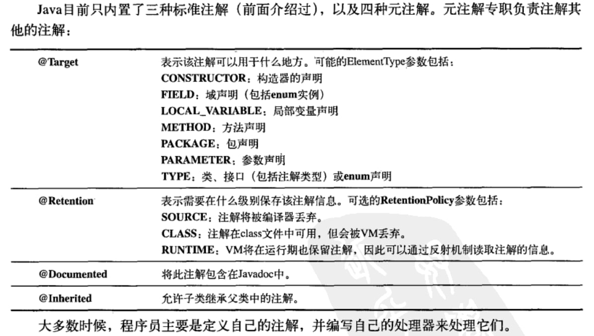

# 注释文档  
**1. 注释**:
* 行内注释：`//`
* 块注释：`/*   ...   */`

**2. 文档**
javadoc工具可以将代码上的文档输出成HTML形式的文档，默认只能输出public和protected的，增加-private选项则可以全部输出。

1. 直接内嵌HTML标记语言
```java
/**
* <pre>
* System.out.println("Hello world");
* </pre>
* 
* <ol>
* <li> Item 1 </li>
* <li> Item 2 </li>
* </ol>
*/
```

2. 标签示例

* @see: 引用其他类，当生成HTML文档时，会加入一个具有超链接的"See Also" （参见）条目。
* {@link package.class#member label}: 与see类似，只是用于行内并且生成label的一个超链接文本，而不用"See Also"。
* {@docRoot}: 该标签产生到文档根目录的相对路径，用于文档树页面的显式超链接。
* {@inheritDoc}: 该标签从当前这个类的最直接的基类中继承相关文档到当前的文档注释中。
* @version: @version version-information ，表示版本信息
* @author: 指明作者，可以使用多个标签列出所有作者。
* @since: 该标签允许你指定程序代码最早使用的版本。
* @param: 函数的参数， 用法：@param param-name description
* @return: 函数的返回值，用法：@return description
* @throws: 抛出的异常，用法：@throws exception-class-name description
* Deprecated: 过时的方法，强烈建议使用新特性。

**3.代码风格**
类：所有单词开头大写。
方法、字段、引用：驼峰标识

# 五、Java初始化与垃圾回收
Java会提供一个默认构造函数，但是当存在任意一个构造函数后则不会自动提供默认构造函数，需要手动创建。

初始化派生类时，如果第一行代码没有调用super(xx)或者this(xx)，则会默认调用super()。如果调用this(xxx)则相当于用该类的其他的构造函数初始化本构造函数。另外，this()和super()只能二选一，不能同时调用。

使用其他构造函数（this初始化）时，只能调用一次this，不能调用多次this初始化。
```Java
class A {
    A (){}
    A(int a){}
    A(int a, int b){
        this();
        this(10);       // error
    }
}
```


## finalize 方法 
一旦垃圾回收器准备好释放对象占用的存储空间时，将先调用其finalize方法，并且在下一次垃圾回收动作发生时，才会真正回收对象占用的内存。  

注意：finalize不是C++的析构函数，析构函数是基于RAII(资源获得则初始化方案)的资源管理，在对象离开作用域时一定会调用的，而finalize调用的时机并不确定，也有可能程序存在期间永不调用，因为在JVM没有用完内存之前，它是肯定不会浪费时间去执行垃圾回收的。另外，绝对不能手动调用finalize方法。


**finalize应用场景**：Java调用本地的C/C++方法时，可能调用了malloc方法，那么只有当调用finalize时自动调用free方法。或者用finalize来验证某种终结条件。

## 垃圾回收工作机制  
Java在堆上分配空间的速度可媲美C++的栈分配。C++的堆分配慢是因为C++需要将堆空间进行重用，需要几个大小不同的bin来管理、分配、重用堆空间。而Java的堆是如果空间不满则一直会分配新的空间，直到空间满了才会调用垃圾回收机制(GC)。

### 1. 引用计数法  
引用计数法常用来说明垃圾手机的工作方式，但似乎从未被应用于任何一种Java虚拟机实现中。C++的RAII资源管理方式采用了引用计数法，并使用weak_ptr来解决循环引用的问题。

Java垃圾回收并非基于引用计数技术，它的思想依据是：对任何“活”的对象，一定能最终追溯到其存活在栈和静态存储区之中的引用。这个引用链条可能会穿过多个对象层次。因此从栈和静态存储区开始，遍历所有引用，就能找到所有或的对象。（该方法不会存在循环引用不被发现的问题，因为循环引用的资源不会被遍历到，他们没有任何引用在栈上）。

### 2. 停止 - 复制法
先暂停程序的运行，然后将所有存活的对象从当前堆复制到另一个堆，没有被复制的全部都是垃圾。当对象被复制到新的堆时，它们是一个挨着一个的，所以新堆保持紧凑排列，这样后续就可以直接简单地分配新空间了。**当把对象从一处搬到另一处时，所有指向它的引用都必须修正**，位于栈和静态存储区的可以直接被修正，但是位于对象内的成员引用，则还需要遍历的时候才能修正。

### 3. 标记 - 清除法
如果只有少量的对象需要被清除，Java就会采用标记清除法。同样从栈和静态存储区出发，遍历所有的引用，进而找到所有存货的对象。每当找到一个存活的对象，就会给对象设一个标记，这个过程中不会回收任何对象。只有全部标记工作完成后，清理动作才会开始。在清理时，没有标记的对象将被释放，剩下的堆空间是不连续的，垃圾回收器会重新整理剩下的对象使其排列紧凑。

### 4. 分代收集  
分代回收 并不是一种垃圾回收算法，它是上述各种垃圾回收算法的一个落地应用方案。大部分对象会从产生开始在很短的时间内变成垃圾，而存在的很长时间的对象往往都有较长的生命周期。**根据对象的存活周期不同将内存划分为新生代和老年代**，存活周期短的为新生代，存活周期长的为老年代。这样就可以根据每块内存的特点采用最适当的收集算法。

新创建的对象存放在称为 新生代（young generation）中（一般来说，新生代的大小会比 老年代小很多）。高频对新生成的对象进行回收，称为「小回收」，低频对所有对象回收，称为「大回收」。每一次「小回收」过后，就把存活下来的对象归为老年代，「小回收」的时候，遇到老年代直接跳过。大多数分代回收算法都采用的「复制收集」方法，因为小回收中垃圾的比例较大。

### 5. Java 垃圾回收
将内存区域分为三大块：年轻代、老年代 和 永久代，并且**年轻代**也继续细分为：Eden区、S0 和 S1。

Eden : S0 : S1 的默认比例为 8:1:1，为什么这么设计呢？其实 IBM 有专门的研究表明，年轻代中 98% 的对象都是朝生夕死的，所以只需要划分为一个较大的 Eden 区和两个较小的 Survivor 区即可，而且这样做的好处是只有 10% 的 Survivor 区会被浪费掉，这也是可以接受的。

1. 对象首次创建进行内存分配的时候，首先会放置在 Eden 区，当 Eden 区放满了或者当该对象太大无法放进 Eden 区的时候，此时会对年轻代（Eden区 和 S0）进行一次 GC，将幸存下来的对象放置在 S1，然后清空掉 Eden区和 S0 区；（此时年轻代采用的是 复制算法）
2. 在上面第一步中对年轻代进行垃圾回收的时候，同时会对幸存的对象进行标记，统计每个幸存对象经历的 GC 次数；
3. 当 S1 区满了之后，或者年轻代的对象经历过指定次数的 GC 之后，这部分对象会被放置到老年代之中；
4. 当老年代也满了之后，便会对老年代进行一次 GC；（老年代采用的是 标记-整理算法）。

## Java 初始化  
Java 对象初始化：赋值、初始化块(对于匿名内部类是必须的)、构造函数。

静态初始化：静态初始化只会在必要时刻进行，如果不创建对应的类也不引用对应的类，则该类不会被创建和初始化。静态赋值、静态初始化块

# 八、多态  
运行时多态只能作用于方法，而不能作用于成员变量。比如下面的代码输出：  
```Java  
class Base {
    public int num = 1;

    private void func(){
        System.out.println("private func");
    }
}

class Derived extends Base{
    public int num = 2;
    public void func(){
        System.out.println("public func");
    }

    public static void main(String[] args) {
        Derived t = new Derived();
        Base base = new Derived();
        System.out.println(t.num);
        System.out.println(base.num);
    }
}
```  

输出：  
```shell
2
1
```
也就是说基类指针只访问基类的同名成员。这一点C++和Java是一致的，C++的对象内存模型里指针偏移后从指针开始的位置向下寻找变量。

## 构造器的多态行为  
当初始化Derived时，先初始化Base再初始化Derived。初始化Base时，Java中Base构造函数内是能够访问到已经被Derived覆盖的方法。所以看下列输出：  
```Java
class Base {
    public int num = 1;

    public Base (){
        func();
    }
    public void func(){
        System.out.println("Base func");
    }
}

class Derived extends Base{
    public int num = 2;
    public void func(){
        System.out.println("Derived func, num = "+num);
    }
}

public class Test {
    public static void main(String[] args) {
        new Derived();
    }
}
```
输出是：  
```Java
Derived func, num = 0       // 因为Derived还未初始化
```  
综上，Java的初始化方法是：  
1. 首先给对象分配存储空间，然后将其全部置为0.
2. 调用基类构造器，此时可以调用被覆盖后的方法（在派生类构造函数之前调用派生类覆盖的方法）。
3. 按照声明的顺序调用成员的初始化方法。
4. 调用导出的构造器主体。
该点与C++不同，C++构造函数初始化时，在初始化Base时会只会调用Base的方法。所以C++代码如下：  
```C++
class Base {
public:
    Base(){
        func();
    }
    virtual void func(){
        cout<<"Base func"<<endl;
    }
};

class Derived : public Base{
public:
    int num = 2;
    virtual void func(){
        cout<<"Derived func, num = "<<num<<endl;
    }
};

int main(){
    new Derived();
}

```
输出：  
```shell
Base func
```


# 十、内部类  
内部类实例必须与外部类实例相关联。
**1. 内部类可以访问到外部类的属性和方法。**
```Java
class Outer {
    int data = 0;
    class Inner {
        void func() {
            if(data == 0){      // 访问外部对象的成员变量
                System.out.println("Right");
            }
            else{
                System.out.println("Wrong");
            }
        }
    }
}
```
**2. 内部类的创建方法必须依靠外部类的实例才能创建**
```Java 
class Outer {
    class Inner{
        ...
    }

    public Inner getInnerClass(){       // 创建方法一
        return new Inner();
    }

    // 下面的方法无法编译通过，因为内部类必须要与实例绑定
    // 而不能单独成为静态方法创建
    public static Inner getInnerClass2(){       // X
        return new Inner();
    }
}

class Main{
    public static void main(String[] args){
        Outer outer = new Outer();
        Outer.Inner inner = outer.new Inner();
    }
}
```

**3. 内部类访问外部类的引用，Outer.this**
```Java
class Outer {

    class Inner {
        public Outer getOuter() {
            return Outer.this;
        }
    }
}
```

## 在方法和作用域内的内部类  
如果要声明一个类来辅助解决一些问题，但是又不希望这个类是公共可用的，那么可以选择：  
1. 定义在方法中的类
2. 定义在作用域内的类，此作用域在方法的内部
3. 实现了接口的匿名类
4. 匿名类，它扩展了有非默认构造器的类
5. 匿名类，它执行字段初始化
6. 匿名类，它通过实例初始化实现构造（匿名类不可能有构造器）

例如：
```Java
public class Person {
    public Destination getDestination(String s){
        class PDestination implements Destination {
            ......
        }
        return new PDestionation;
    }
}
```

## 匿名内部类  
```Java
class Base {
    int i = 10;
    void func(){
        System.out.println("Base");
    }
}

public class Test {
    public static void main(String[] args) {
        Base b = new Base(){            // 匿名类继承了Base
            void func(){
                System.out.println("Derived");
            }
        };
        b.func();
    }
}
```
同样可以针对接口:
```Java
interface Base {
    public void func();
}

public class Test {
    public static void main(String[] args) {
        Base b = new Base(){            // 匿名类继承Base
            public void func(){
                System.out.println("Derived");
            }
        };
        b.func();
    }
}
```
## 嵌套类  
如果不想内部类与外部类有联系，那么可以将内部类声明为static的，称之为嵌套类。
1. 要创建嵌套类的对象并不需要其外围类的对象。
2. 不能从嵌套类的对象中访问非静态的外围类对象
```Java
public class Test {
    // Inner Static Class
    public static class Inner{
        void func(){
            System.out.println("Inner");
        }
    }

    public static void main(String[] args) {
        Test.Inner inner = new Test.Inner();
        inner.func();
    }
}
```
当然，接口那也可以声明class，在接口那声明的class自动是public和static的。

## 使用内部类的原因  
**1. 提供外部类的功能扩展**
内部类提供了对外部类的的成员的访问功能，可以看做对外部类的功能扩展。因为Java是单继承体系，接口解决了部分问题，但是内部类有效地实现了多重继承的问题，也就是说内部类允许继承多个非接口类型。

**2. 内部类可以看做面向对象的闭包**
闭包的作用：
作用1：隐藏变量，避免全局污染，用函数来修改状态
作用2：可以读取函数内部的变量

闭包的作用之一就是，对一个对象产生相同名称的不同的回调函数。下面的例子里，Widget对象可以有两个名称为show()的不同的回调函数。  

```Java
abstract class ShowClass{
    public abstract void show();
}

class Widget extends ShowClass{
    public int pixel = 10;

    // 单继承形式
    public void show(){
        // show 1
        System.out.println("show1, pixel = "+pixel);
    }

    private class InnerShowClass extends ShowClass {
        public void show(){
            // show 2
            System.out.println("show2, pixel = " + pixel);
        }
    }

    // 内部类形式
    public ShowClass getInnSC2(){
        return new InnerShowClass();
    }

    // 匿名内部类形式
    public ShowClass getInnerSC3(){
        return new ShowClass(){
            public void show(){
                // show 3
                System.out.println("show3, pixel = "+pixel);
            }
        };
    }
}

public class Test {
    public static void callShow(ShowClass showClass) {
        showClass.show();
    }
    public static void main(String[] args) {
        Widget widget = new Widget();
        callShow(widget);
        callShow(widget.getInnSC2());
        callShow(widget.getInnerSC3());
    }
}

```

**3. 内部类实现 数据 和 控制 分割**
```Java
class MyController extends Controller {
    private int temperature = 10;
    private int water = 25;
    private double high = 5.6;

    public class LightOn extends Event {
        public LightOn(int millsec){super(millsec);}
        public void action(){
            // Turn on light
        }
    }

    public class LightOff extends Event {
        public LightOff(int millsec){super(millsec);}
        public void action(){
            // Turn off light
        }
    }

    public class WaterOn extends Event {
        public WaterOn(int millsec){super(millsec);}
        public void action(){
            // Turn on water, visit water variable
        }
    }
}

public class Test {
    public static void main(String[] args){
        MyController myController = new MyController();
        myController.addEvent(myController.new LightOn(200));
        myController.addEvent(myController.new LightOff(400));
        myController.addEvent(myController.new WaterOn(600));

    }
}
```

## 内部类的继承  
```Java
class Outer{
    class Inner{}
}

public class DerivedInner extends Outer.Inner{
    DerivedInner(Outer outer){      // 继承内部类，那么构造器必须这么写
        outer.super();
    }

    public static void main(String[] args){
        Outer outer = new Outer();
        DerivedInner derivedInner = new DerivedInner(outer);
    }
    
}
```

## 局部内部类  
与一般的内部类蕾丝，并且可以访问外部的常量。

## 内部类的命名  
每个类都会产生一个.class文件，如果是内部类，则命名规则是OuterName$InnerName.class，如果是匿名内部类，则InnerName是一个数字。

例如：
Counter.class
LocalInnerClass\$1.class
LocalInnerClass\$LocalCounter.class
L1class\$L2class\$L3class.class


# 十一、集合  
## Iterator  
实现了`Iterable<xxx>`接口的class能够使用forEach语法。例如：  
```Java
class NameList implements Iterable<String> {
    String[] nameList = new String[3];
    int len = 3;

    public NameList(){
        nameList[0] = "hello";
        nameList[1] = "world";
        nameList[2] = "yep";
    }

    @Override
    public Iterator<String> iterator() {
        // 匿名内部类
        return new Iterator<String>() {
            int idx = 0;
            @Override
            public boolean hasNext() {
                return idx < len;
            }

            @Override
            public String next() {
                return nameList[idx++];
            }
        };
    }
    
}

public class Test {
    public static void main(String[] args) {
        NameList nameList = new NameList();
        for(String str : nameList){
            System.out.println(str);
        }
    }
}
```

# 十三、字符串  
Java 的String是不可变的，在String类中每一个看起来会修改String值的方法，实际上都是创建一个全新的String对象。

## 重载 '+' 与 StringBuilder  
String 的 ‘+’是被重载过的运算符，Java不允许程序员重载任何操作符。`String s1 = "mongo"; String str = s1 + "db";`实际上在内存中生成了三个字符串：mongo、db、mongodb。而C++的字符串是要看成容器来使用，这与Java思想是不一样的。  

**一般构造一个可变的字符串可以使用StringBuilder或者StringBuffer**。StringBuffer 支持并发操作，线性安全的，适合多线程中使用。StringBuilder不支持并发操作，线性不安全的，不适合多线程中使用。

## 一种无意识的递归  
```C++
class Base {
    public String toString(){
        // 想要输出类的地址，调用this会出现无尽递归，错误！
        // 实际上是将Base类型转换为String，递归调用了Base的toString()方法
        return "Base" + this + "\n";    

        // 下面是正确的方法
        return "Base" + super.toString() + "\n";
    }
}
```

## 格式化输出  

**System.out.format()**
PrintStream.format(), PrintWriter.format()
```Java
String str = System.out.format("[%d %f]\n", x, y);
```

## 正则表达式  
创建一个正则表达式：java.util.regex中的Pattern类。

* C:    匹配一个符号
* \xhh: 匹配十六进制字符
* \uhhhh:   匹配一个unicode字符
* \t:   制表符
* \n:   换行符
* \r:   回车
* \f:   换页
--------
* ?:    重复前一个字符0或1次
* *:    重复前一个字符任意次或0次
* .:    匹配除换行符（\n、\r）之外的任何单个字符，相等于 [^\n\r]
* +:    匹配前面的子表达式一次或多次。要匹配 + 字符，请使用 \+。
--------
\[abc]: 包含abc任何字符。
\[^abc]: 不包含bac任何字符
\[a-zA-Z0-9]: 范围字符中的任意一个
A|B:    字符A或字符B
{n}:    匹配前一个模式固定长度
{n, m}: 匹配前一个模式固定长度，最少匹配 n 次且最多匹配 m 次


在匹配表达式后面增加一个?将转化为勉强型，也就是满足表达式的最短的字符串。  

## Scanner 扫描输入  
```Java
import java.util.regex.*;
import java.util.*;

class Base {
    public static void main(String[] args) {
        Scanner scanner = new Scanner(String|File|InputStream|BufferedReader);

        String pattern = "(\\d+[.]\\d+[.]\\d+)@" + 
        "(\\d{2}/\\d{2}/\\d{4})";
        while(scanner.hasNext(pattern)){
            scanner.next(pattern);
            MatchResult match = scanner.match();
            String ip = match.group(1);
            String date = match.group(2);
            System.out.printf("%s, %s\n", ip, date);
        }
    }
}
```

# 十四、类型信息  
运行时类型信息可以在程序运行时发现和使用类型信息。在Java中有两种方式，一种是传统的RTTI，它假定我们在编译时已经知道了所有的类型，另一种是反射机制，它允许我们在运行时发现和使用类的信息。  

## Class 对象
每个类都有一个Class对象，其被保存在.class文件中。为了生成一个对象，Java虚拟机使用类加载器的子系统运行这个程序。

所有的类都是在对其第一次使用时，动态加载到JVM中的。当程序创建第一个对类的静态成员引用时，就会加载这个类（构造器可以堪称类的静态方法）。类加载器首先检查Class对象是否已加载，如果尚未加载，默认的类加载器就会根据类名查找.class文件，在这个类的字节码被加载时，它们会接受验证，以确保其没有被破坏。  

`Class.forName("ClassName")`是取得Class对象的引用的静态方法，它是用一个包含目标类的文本名的String作输入参数，返回一个Class对象的引用。它可能会抛出找不到.class文件的一个异常。

Class对象有如下方法：
`getName()`: 获得完整名称。
`getSimpleName()`: 获得类名。
`getInterfaces()`: 返回Class对象，表示在感兴趣的Class对象中所包含的接口。
`getSuperClass()`: 获得直接基类。
`newInstance()`: 实现虚拟构造器的一种途径。该方法创建出的实力返回Object对象。使用newInstance创建出来的类必须带有默认构造器。

**类字面常量**
Java还提供了另一种方法生成对Class对象的引用，即类字面常量。例如：`FancyToy.class`，这样做不仅更简单，而且更安全，能够在编译时期受到检查，不需要try-catch，根除类对forName()方法的调用。基本类型的Class对象：  
|方法一|方法二|
|:--:|:--:|
|boolean.class|Boolean.TYPE|
|char.class|Char.TYPE|
|byte.class|Byte.TYPE|
|short.class|Short.TYPE|
|int.class|Integer.TYPE|

如果一个static域不是final的，那么对它访问时，总是要求它被读取之前，要先进行链接（分配空间）和初始化（初始化该存储空间）。

**Class对象使用范型，更具体**：
```Java
Class<? extends Number> bounded = int.class
```
向Class引用添加泛型语法仅仅是为了提供编译期类型检查。

**转型语法**
cast方法接受参数对象，并将其转型为Class引用的类型。
```Java
public class ClassCasts {
    public static void main(String[] args){
        Building b = new House();
        Class<House> houseType = House.class;
        // 下面的代码等价于 h = (House)b;
        House h = houseType.cast(b);
    }
}
```

## 类型转换前先做检查
Java中RTTI的三种形式：
1. 强制类型转化，由RTTI确保类型转换的正确性（C++中强制类型转换不做任何检查，但是static_cast、dynamic_cast会根据RTTI进行判断，前者是向上转换，编译期做检查，后者是向下转换，运行期根据typeid和type_info进行检查）。
2. 代表对象类型的Class对象，通过查询Class对象可以获取运行时所需的信息。
3. instanceof运算符，Java中instanceof运算符可以获得对象类型信息。


instanceof/isInstance 判断的是某个对象是否是这个类或者派生类，Class对象的==或者equals方法判断的是某个类是否是这个类（不考虑派生关系）。

## 反射：运行时的类信息
假设从次哦安文件或者网络连接中获取了一串字节，并且被告知这些字节代表一个类。根据这种方法创建对象，此时RTTI就无法实现了，因为RTTI必须要求编译时类型已知。此时就需要用到Java的反射。

Class类和java.lang.reflect类库一起对反射的概念进行了支持，该类库包含了Field、Method以及COnstructor类。这些类型的对象是由JVM在运行时闯进啊的，用以表示未知类里对应的成员，这样就可以使用Constructor创建新的对象，用get()和set()方法读取和修改与Field对象关联的字段，用invoke()方法调用Method对象关联的方法。另外还可以调用getFields()、getMethods()、getConstructors()等很便利的方法，以返回表示字段、方法和构造器的对象的数组。这样匿名对象的类信息就能在运行时被完全确定下来，而在编译时不需要知道任何事情。

当通过反射与一个未知类型的对象打交道时，JVM只是简单地检查这个对象，看它属于哪个特定的类，在用它作其他事情之前，必须先加载那个类的Class对象，因此那个类的.class文件对于JVM来说必须时可获取的，要么在本地上，要么通过网络取得。
所以RTTI与反射的区别在于，RTTI在编译时打开和检查.class文件，反射机制来说，.class文件在编译时不可获取的，所以是在运行时打开和检查.class文件。

一个反射打印方法的例子：
```Java
public class ShowMethods {
    private static Pattern p = Pattern.compile("\\w+\\.");
    public static void main(String[] args){
        try {
            Class<?> c = Class.forName(args[0]);
            Method[] methods = c.getMethods();
            for(Method method : methods){
                print(p.matcher(method.toString()).replaceAll(""));
            }
        }catch(Exception err){
            err.printStackTrace();
        }
    }
}
```
上面的Class.forName(args[0])在编译是不可知的，因此所有的方法特征签名信息都是在执行时被提取出来的。

## 代理模式  
代理是基本的设计模式之一，它是为了提供额外的操作，而用来代替实际对象的对象，这些操作通常设计与实际对象的通信，因此代理通常充当中间人的角色。

**静态代理**
```Java
// 接口
public interface User {
    public void save();
}

// 被代理的类
public class RealUser implements User{
    public void save(){
        System.out.println("Save Data");
    }
}

// 静态代理对象
public class UserProxy implements User {
    private User target;
    public UserProxy(User tar){
        this.target = tar;
    }

    public void save(){
        System.out.println("Begin Proxy");
        this.target.save();
        System.out.println("End Proxy");
    }
}

public class Main {
    public static void main(String[] args){
        // 目标对象
        User user = new RealUser();
        UserProxy proxy = new UserProxy(user);
        proxy.save();
    }
}
```  
优点：可以在不修改目标对象的前提下扩展目标对象的功能。
缺点：
1. 冗余。由于代理对象要实现与目标对象一致的接口，会产生过多的代理类，它会产生.class文件。
2. 不易维护。一旦接口增加方法，目标对象与代理对象都要进行修改。

**动态代理**
动态代理利用了JDK API，动态地在内存中构建代理对象，从而实现对目标对象的代理功能。动态代理又被称为JDK代理或接口代理。

静态代理与动态代理的区别主要在：
1.静态代理在编译时就已经实现，编译完成后代理类是一个实际的class文件
2. 动态代理是在运行时动态生成的，即编译完成后没有实际的class文件，而是在运行时动态生成类字节码，并加载到JVM中。

特点：动态代理对象不需要实现接口，但是要求目标对象必须实现接口，否则不能使用动态代理。

JDK中生成代理对象主要涉及的类有：
1. java.lang.reflect 的Proxy，主要方法是：
```Java
static Object newProxyInstance(ClassLoader loader, Class<?>[] interfaces,InvocationHandler h);
```
ClassLoader: 指定当前目标对象使用类加载器
Class<?>[]: 目标对象实现的接口的类型
InvocationHandler: 事件处理器

2. java.lang.reflect InvocationHandler，主要方法为:
```Java
// 在代理实例上处理方法调用并返回结果。
Object invoke(Object proxy, Method method, Object[] args);
```

下面是一个简单的例子：
User是接口，RealUser是实现了User的一个类。
```Java
public class UserProxy {
    private Object target;

    Public UserProxy(Object tar){
        this.target = tar;
    }

    public Object getProxyInstance(){
        // 调用Proxy.newProxyInstance生成代理
        // 重写InvocationHandler 设置代理内容
        return Proxy.newProxyInstance(target.getClass().getClassLoader(), target.getClass().getInterfaces(), new InvocationHandler(){
            public Object invoke(Object proxy, Method method, Object[] args) throw Throwable {
                System.out.println("Proxy Begin");
                // 执行目标对象方法
                Object returnValue = method.invoke(target, args);
                System.out.println("Proxy End");
                return null;
            }
        })
    }
}

// 测试
public class Main{
    public static void main(String[] args){
        User user = new RealUser();
        User proxy = (User) new UserProxy(user).getProxyInstance();
        proxy.save();
    }
}
```


## 空对象

## 利用反射调用private方法/对象
内部类、静态类、匿名内部类的private、peotected等权限的方法和变量均可以被调用。
```Java
public class Test{
    public static void callHiddenMethod(Object a, String methodName) throws Exception{
        Method g = a.getClass().getDeclaredMethod(methodName);
        g.setAccessible(true);
        g.invoke(a);        // 假设是无参调用
    }

    public static void main(String[] args){
        A a = new A();
        callHiddenMethod(a, "func");
    }
}
```

# 十五、泛型  
Java泛型中\<T\>仅仅在编译的时候做检查，运行时其被看成Object，并且类型会被擦出。C++泛型是针对每种不同的类型都生成一套新的代码。C++的参数化类型机制比Java的更灵活、更强大。


## 根据泛型生成对象
因为泛型在编译期间被擦出（并且不能确定是否存在无参构造函数），那么下面代码是不可行的：
```Java
class Base<E> {
    T x;
    public Base(){
        x = new T();            // ERROR
    }
}
```

所以必须使用工厂模式：
```Java
interface Factory<T> {
    T create();
}

class IntegerFactory implements Factory<Integer> {
    public Integer create() {
        return new Integer(0);
    }
}

class Widget {
    // 这里使用静态内部类，将工厂类放到Widget内部
    public static class Factory implements Factory<Widget> {
        public Widget create() {
            return new Widget();
        }
    }
}

// 使用工厂函数创建
class Foo2<T> {
    private T x;
    public <F extends Factory<T> > Foo2(F factory){
        x = factory.create();
    }
}

public class Main {
    public static void main(String[] args){
        new Foo2<Integer>(new IntegerFactory());
        new Foo2<Widget>(new Widget.Factory());
    }
}

```

**泛型数组**
不能够创建泛型数组`T[] array;`只能创建Object[]的引用，然后在编译期间进行类型检查。例如：  
```Java
public class GenericArray<T> {
    private Object[] array;
    public GenericArray(int sz){
        array = new Object[sz];
    }

    public void put(int index, T item){
        array[index] = item;
    }

    public T get(int index){
        return (T)array[index];
    }

    public T[] rep() {
        return array;       // 不能 (T())array，会有cast错误
    }
}
```

**边界**  
将泛型类型限定在某一类型的子集，重用extends关键字：  
```Java
class Colored<T extends HasColor> {
    ...
}

class Colored2<T extends HasColor> extends HoldItem<T> {
    ...
}
class Colored3<T extends Dimension & HasColor> extends Colored2<T>{

}
```

**通配符**
使用通配符`?`:
```Java
List<? extends Base> flist = new ArrayList<>();
```

Java数组是`协变`的：
```Java
public class CovariantArrays {
    public static void main(String[] args) {       
        Fruit[] fruit = new Apple[10];
        fruit[0] = new Apple(); // OK
        fruit[1] = new Jonathan(); // OK
        // Runtime type is Apple[], not Fruit[] or Orange[]:
        try {
            // Compiler allows you to add Fruit:
            fruit[0] = new Fruit(); // ArrayStoreException
        } catch(Exception e) { System.out.println(e); }
        try {
            // Compiler allows you to add Oranges:
            fruit[0] = new Orange(); // ArrayStoreException
        } catch(Exception e) { System.out.println(e); }
    }
}
```
main 方法中的第一行，创建了一个 Apple 数组并把它赋给 Fruit 数组的引用。这是有意义的，Apple 是 Fruit 的子类，一个 Apple 对象也是一种 Fruit 对象，所以一个 Apple 数组也是一种 Fruit 的数组。这称作数组的协变，Java 把数组设计为协变的，对此是有争议的，有人认为这是一种缺陷。

尽管 Apple[] 可以 “向上转型” 为 Fruit[]，但数组元素的实际类型还是 Apple，我们只能向数组中放入 Apple或者 Apple 的子类。在上面的代码中，向数组中放入了 Fruit 对象和 Orange 对象。对于编译器来说，这是可以通过编译的，但是在运行时期，JVM 能够知道数组的实际类型是 Apple[]，所以当其它对象加入数组的时候就会抛出异常。

泛型设计的目的之一是要使这种运行时期的错误在编译期就能发现，看看用泛型容器类来代替数组会发生什么：
```Java
// Compile Error: incompatible types:
ArrayList<Fruit> flist = new ArrayList<Apple>();
```
上面的代码根本就无法编译。当涉及到泛型时， 尽管 Apple 是 Fruit 的子类型，但是 `ArrayList<Apple>` 不是 `ArrayList<Fruit>` 的子类型，泛型不支持协变。

从上面我们知道，`List<Number> list = ArrayList<Integer>` 这样的语句是无法通过编译的，尽管 Integer 是 Number 的子类型。那么如果我们确实需要建立这种 “向上转型” 的关系怎么办呢？这就需要通配符来发挥作用了。

利用 `<? extends Fruit>` 形式的通配符，可以实现泛型的向上转型：
```Java
public class GenericsAndCovariance {
    public static void main(String[] args) {
        // Wildcards allow covariance:
        List<? extends Fruit> flist = new ArrayList<Apple>();
        // Compile Error: can’t add any type of object:
        // flist.add(new Apple());
        // flist.add(new Fruit());
        // flist.add(new Object());
        flist.add(null); // Legal but uninteresting
        // We know that it returns at least Fruit:
        Fruit f = flist.get(0);
    }
}
```
如上所述，通配符 `List<? extends Fruit>` 表示某种特定类型 ( Fruit 或者其子类 ) 的 List，但是并不关心这个实际的类型到底是什么，反正是 Fruit 的子类型，Fruit 是它的上边界。

**通配符super**
`<? super T>` 声明通配符是由某个特定类的任何基类来界定的。

**重载**
因为运行时泛型类型信息会被擦出，所以含有泛型的重载将不被成功：
```Java
class C1{}
class C2{}

class Main{
    // Error
    void func(List<C1> li){}
    void func(List<C2> li){}
}
```

**自限定**
```java
class SelfBounded<T extends SelfBound<T>>{

}
```
自限定能够保证类型参数必须与正在被定义的类相同。

## 混型
C++中类可以继承一个模板参数：
```C++
template<class T> class Derived: public T{

}
```

但是Java中不允许继承自一个参数，因为擦除会忘记基类类型。一个常见的解决方案是使用接口来产生混型效果，就像下面这样：
```Java
interface T {}
class Base implements T{}
```

**装饰器模式：**
```Java
// 基础功能
class Basic {
    private String value;
    public void set(String val){value = val;}
    public String get(){return value;}
}

// 装饰器接口
class Decorator extends Basic {
    protected Basic basic;
    public Decorator(Basic basic){this.basic = basic;}
    public void set(String val){basic.set(val);}
    public String get(){return basic.get();}
}

// 在装饰器接口上增加一个获得创建时的时间戳的功能
class Impl1 extends Decorator {
    private final long timeStamp;
    public Impl1(Basic basic){
        super(basic);
        timestamp = new Date().getTime();
    }
    public long getStamp(){return timeStamp;}
}

// 在装饰器上增加一个计数功能
class Impl2 extends Decorator {
    private static long counter = 1;
    private final long serialNumber = counter++;
    public Impl2(Basic basic){super(basic);}
    public long getSerialNum(){return serialNumber;}
}

public class Main{
    public static void main(String[] args){
        Impl2 basic = new Impl2(new Basic());
        basic.get()
        basic.set()
        basic.getSerialNum()
    }
}
```

**使用动态代理的混合**
...


# 二十、注解
注解，也称为元数据，为我们在代码中添加信息提供了一种形式化的方法，是我们可以在稍后某个时刻非常方便地使用这些数据。

Java的java.lang中定义了三种注解：  
* @Override: 表示当前方法将覆盖超类中的方法。
* @Deprecated: 过时的方法
* @SuppressWarning: 关闭当前的某个警告

**使用注解**
```Java
public class Main{
    public void execute(){
        System.out.println("execute");
    }

    // 使用注解
    @Test void testExecute(){
        execute();
    }
}
```
注解就像public、static、void这类修饰符一样使用。

**定义注解**
下面是一个定义注解的例子:
```Java
import java.lang.annotation.*

@Target(ElementType.METHOD)
@Retention(RetentionPolicy.RUNTIME)

public @interface Test{}
```

除了@符号外，@Test的定义很像一个空的接口。
定义注解时会需要用到一些**元注解**，例如@Target和@Retention。@Target用来定义注解将应用于什么地方（例如一个方法或者一个域）。@Retention用来定义该注解在哪一个级别可用（源代码SOURCE，类文件SOURCE，运行时RUNTIME）。

注解中一般会包含一些元素，这些元素可以看成接口的方法，唯一的区别是可以为其指定默认值。没有元素的注解被称为标记注解，例如上面的@Test


下面是一个简单的注解，用它可以跟踪一个项目的用例：
```java
@Target(ElementType.METHOD)
@Retentation(RetentationPolicy.RUNTIME)
public @interface UseCase {
    public int id();
    public String description() default "no description";
}


// 使用
public class PasswordUtils {
    @UseCase(id=47, description=
    "Password must contain at least one numeric")
    public boolean validatePassword(String password){
        return (password.matches("\\w\\d\\w*"));
    }

    @UseCase(id=48)
    public String encryptPassword(String password) {
        return new StringBuilder(password).reverse().toString();
    }
}
```




## 编写注解处理器  
如果没有注解处理器，那么注解和注释就没有区别。所以在使用注解的过程中，很重要的一个部分就是常见注解处理器，反射机制的API可以帮助程序员构造这类工具。

下面是一个注解处理器，它将读取PasswordUtils类，并使用反射机制查找@UseCase标记，然后列出在PasswordUtils中找到的用例的id值以及缺失用例。

```Java
public class UseCaseTracker {
    public static void trackUseCases(List<Integer> useCases, Class<?> cl){
        for(Method m : cl.getDeclareMethods()){
            // 传入注解定义的class
            UseCase uc = m.getAnnotation(UseCase.class);
            if(uc != null){
                System.out.println("Found Use Case: " + uc.id() + " " + 
                uc.description());
                useCases.remove(new Integer(uc.id()));
            }
        }

        for(int i: useCases){
            System.out.println("Warning: Missing use case-"+i);
        }
    }

    public static void main(String[] args){
        List<Integer> useCases = new ArrayList<Integer>();
        Collections.addAll(useCases, 47, 48, 49, 50);
        trackUseCases(useCases, PasswordUtils.class);
    }
}
```
上面程序用到了两个接口：getDeclaredMethods()和getAnnotation()，它们都属于AnnotatedElement接口(Class、Method与Field等类都实现了该接口)。getAnnotation()方法返回指定类型的注解对象，在这里就是UseCase，如果被注解的方法上没有改类型的注解则返回null。

**注解元素**
标签@UseCase由UseCase.java定义，其中包含int元素id和String元素description。注解元素可用的类型如下：
* 所有基本类型(int, float, boolean)
* String
* Class
* enum
* Annotation
* 以上类型的数组

1. 也就是说注解也可以嵌套。
2. 注解的元素要么有默认值要么在使用注解时提供元素的值。
3. 对于非基本类型的元素，无论在源代码中声明时，或是在注解接口定义默认值时都不可以null作为值。
4. 注解不支持继承


**Java Bean的一个示例**
定义JavaBean域的注解：
```Java
@Target(ElementType.FIELD)
@Retention(RetentionPolicy.RUNTIME)
public @interface Constraints {
    boolean primaryKey() default false;
    boolean allowNull() default true;
    boolean unique() default false;
}

@Target(ElementType.FIELD)
@Rentention(RetentionPolicy.RUNTIME)
public @interface SQLString {
    int value() default 0;
    String name() default "";
    // 注解的元素可以是注解
    Constraints constraints() default @Constraint;
}

@Target(ElementType.FIELD)
@Retention(RetentionPolicy.RUNTIME)
public @interface SQLInteger{
    String name() default "";
    Constraints constraints() default @Constraints;
}
```

下面是一个简单的Bean定义：
```Java
@DBTable(name="MEMBER")
public class Member {
    @SQLString(30) String   firstName;
    @SQLString(50) String   lastName;
    @SQLInteger    Integer  age;
    @SQLString(value=30, constraints=@Constraints) 
            String handle; 
    static int memberCount;

    public String getHandle(){return handle;}
    public String getFirstName(){return firstName;}
    ...
}
```
下面是一个注解处理器，它将读取一个类文件，检查其上的数据库注解，并生成用来创建SQL的命令：
```java
public class TableCreator{
    public static void main(String[] args){
        if(args.length < 1){
            System.out.println("arguments: annotated classes");
            System.exit(0);
        }

        for(String className: args){
            Class<?> cl = Class.forName(className);
            DBTable dbTable = cl.getAnnotation(DBTable.calss);
            if(dbTable == null){
                System.out.println("No DBTable annotations in class" + className);
                continue;
            }
            String tableName = dbTable.name();
            if(tableName.length() < 1)
                tableName = cl.getName().toUpperCase();
            List<String> columnDefs = new ArrayList<String>();
            for(Field field: cl.getDeclaredFields()){
                String columnName = null;
                Annotation[] anns = field.getDeclaredAnnotations();
                if(anns.length < 1) continue;

                // 该列是int类型
                if(anns[0] instanceof SQLInteger) {
                    SQLInteger sInt = (SQLInteger) anns[0];
                    if(sInt.name().length() < 1)
                        columnName = field.getName().toUpperCase();
                    else
                        columnName = sInt.name();
                    columnDefs.add(columnName+"INT"+getConstraints(sInt.constraints()))
                }
                // 该列是String类型
                if(anns[0] instanceof SQLString) {
                    SQLString sString = (SQLString) anns[0];
                    // use field name if name not specified
                    if(sString.name().length < 1)
                        columnName = field.getName().toUpperCase();
                    else
                        columnName = sString.name();
                    columnDefs.add(columnName+" VARCHAR("+sString.value()+")"+getConstraints(sString.constraints()));
                }
                Stringbuilder createCommand = new StringBuilder("CREATE TABLE "+tableName + "(");
                for(String columnDef: columnDefs){
                    createCommand.append("\n    "+columnDef+",");
                }
                // 移除最后一个逗号
                String tableCreate = createCommand.substring(0, createCommand.length()-1)+");";
                System.out.println(tableCreate);
            }

        }
    }
}
```

## 基于注解的单元测试
在使用注解出现之前的JUnit，程序员必须创建一个独立的类来保存其单元测试。有了注解，则可以直接在要验证的类里面编写测试。另一个好处是能够像测试public一样测试private的方法。

使用@Unit测试框架，程序员必须引入net.mindview.atunit，用@Unit的测试标记为合适的方法和域打上标记，然后让你的构建系统对编译后的类运行@Unit。

@Unit测试框架用的最多的是@Test注解。测试方法不带参数，并返回boolean结果来说明测试成功或失败。下面是一个例子：
```Java
import net.mindview.atunit.*;
import net.mindview.util.*;

public class AtUnitExmaple1 {
    public String methodOne(){
        return "This is methodOne";
    }

    public int methodTwo(){
        System.out.println("This is methodTwo");
        return 2;
    }

    @Test boolean methodOneTest(){
        return methodOne().equals("This is methodOne");
    }

    @Test boolean m2(){return methodTwo() == 2;}

    @Test private boolean m3(){return true;}

    @Test  boolean failureTest(){return false;}

    @Test boolean anotherDisappointment(){return false;}

    public static void main(String[] args)throws Exception{
        OSExecute.command("java net.mindview.atunit.AtUnit AtUnitExample1");
    }
}
// output:
/*
annotations.AtUnitExample1
    . methodOneTest
    . m2 This is methodTwo

    . m3
    . failureTest(failed)
    . anotherDisappointment(failed)
    (5 tests)

>>> 2 FAILURES <<<
    annotations.AtUnitExample1: failureTest
    annotations.AtUnitExample1: anotherDisappointment
*/
```
使用@Unit进行测试的类必须定义在某个包中。
@Test注解被置于methodOneTest()、m2()、m3()、failureTest()、anotherDisappointment()方法之前，它告诉@Unit将这些方法作为单元测试来运行。@Test将验证并确保这些方法没有参数，并且返回值是boolean或void。程序员编写单元测试时唯一要做的就是决定测试是成功还是失败(返回true或者false)。


有时候很难将测试方法嵌入到原本的类中，但是用继承或组合可以解决：
```Java
// 继承
public class AtUnitExternalTest extends AtUnitExample1 {
    @Test boolean _methodOne(){
        return methodOne().equals("This is methodOne");
    }
}
// 组合
public class AtUnitComposition{
    AtUnitExample1 testObject = new AtUnitExample1();
    @Test boolean _methodOne(){
        return testObject.methodOne().equals("This is methodOne");
    }
}
```

@TestObjectCreate注解用来测试静态方法，见《java编程思想》。
@TestProperty注解可以向单元测试中添加一些额外的域，并且只能在测试时候使用，并且也可以标记只在测试中用到的方法，而本身却不是测试方法。

**将@Unit用于泛型**
解决方法是让测试类继承自泛型类的一个特殊版本即可。对于需要测试的private，则要么将其改为protected，要么添加一个非private的@TestProperty方法，由它来调用private方法。

AtUnitRemover工具会将@TestProperty方法从产品的代码中自动删除掉。

# 二十一、并发
## 创建多线程任务
1. 定义一个实现了Runnable接口的类，并编写run()方法
2. 创建一个Thread对象并将Runnable接口类的对象传递进去
3. 调用start()方法。

**使用Executor**
执行器(Executor)可以管理Thread对象，简化并发编程。Executor在客户端和任务执行之间提供了一个间接层，它允许你管理异步执行的任务，而无须显式地管理线程的生命周期。

创建线程池：
```Java
public class Main{
    public static void main(String[] args){
        ExecutorService exec = Executor.new FixedThreadPool(5);
        // ExecutorService exec = Executor.new CachedThreadPool();
        for(int i = 0;i < 5; i++){
            exec.execute(new RunnableImpl());
        }
        exec.shutdown();
    }
}
```
shutdown()调用后，Executor会继续运行已经提交的所有任务，并且该程序在Executor线程运行完毕后停止。尽快结束对shuntdown调用，可以防止新的任务被提交给这个Executor。

`SingleThreadExecutor`就是线程数量为1的FixedThreadPool，如果向SingleThreadExecutor中提交了多个任务，那么这些任务将排队，每个任务都会在下一个任务开始之前运行结束，所有的任务将使用相同的线程。

**从任务中产生返回值**
Runnable是执行工作的独立任务，但是它不返回任何值。如果希望在完成时能够返回一个值，那么可以实现Callabel接口而不是Runnable接口。它的类型参数表示的是从方法call()（而不是run()）中返回的值，并且必须使用ExecutorService.submit()方法调用它，下面是一个简单示例：
```Java
class Task implements Callable<String> {
    private int id;
    public Task(int id){
        this.id = id;
    }
    public String call(){
        return "result of Task "+ id;
    }
}

public class Main{
    public static void main(String[] args){
        ExecutorService exec = Executors.newCachedThreadPool();
        ArrayList<Future<String>> results = new ArrayList<>();
        for(int i = 0;i<10; i++){
            results.add(exec.submit(new Task()));
        }

        // 这里获取结果
        for(Future<String> fs: results){
            try{
                // get() blocks until completion
                System.out.println(fs.get());
            } catch(InterruptedException e){
                System.out.println(e);
                return ;
            }catch(ExecutionException e){
                System.out;println(e);
            }finally{
                exec.shutdown();
            }
        }
    }
}
```
submit方法会产生Future对象，它用Callable返回结果的特定类型进行了参数话。你可以用isDone方法来查询Future是否已经完成。当任务完成时，它具有一个结果，你可以调用get()方法来获取该结果。

当不用isDone()而直接调用get()，则可能会被阻塞直至结果准备就绪，当然也可以调用具有超时的get()，或者调用isDone来查看任务是否完成。

**sleep**
在Runnable中的run中可以进行休眠：
```Java
class SleepingTask implements Runnable{
    public void run(){
        try{
            TimeUnit.MILLISECONDS.sleep(100);
        } catch(InterruptedException e){
            System.err.println("Interrupted");
        }
    }
}
```
**优先级**
线程的优先级将该线程的重要性传递给了调度器，优先级低的线程仅仅是执行的频率较低。
用getPriority()和setPriority()来设置线程的优先级：
```Java
public class Task implements Runnabel{
    private int priority;

    public Task(int priority){
        this.priority = priority;
    }

    public void run(){
        System.out.println(Thread.currentThread.getPriority());
        Thread.currentThread.setPriority(this.priority);
    }
}
```

**yield()让步，让出CPU**
Thread.yield()

**后台线程**
后台线程(daemon)是指程序运行的时候提供一种通用服务的线程，并且这种线程不属于程序中不可或缺的部分。必须在线程启动之前调用setDaemon()方法才能把它设置为后台线程。

守护线程是指**为其他线程服务的线程**。在JVM中，所有非守护线程都执行完毕后，无论有没有守护线程，虚拟机都会自动退出。因此，JVM退出时，不必关心守护线程是否已结束。
```Java
class Main{
    public static void main(String[] args){
        Thread daemon = new Thread(new Task());
        daemon.setDaemon(true);     // 必须在start之前调用
        daemon.start();
    }
}
```

isDaemon()函数用来判断一个线程是否是后台线程。

**当线程中最后一个非后台线程终止时，后台线程会突然终止，因此一旦main()退出，JVM就会立即关闭所有的后台线程。**
下面的代码不会执行finally子句：
```Java
class Daemon implements Runnable {
    public void run(){
        try{
            System.out.println("Start Daemon");
            TimeUnit.SECONDS.sleep(2);
            System.out.println("End Daemon");
        } catch(InterruptedException e){
            e.printStackTrace();
        }finally {
            System.out.println("finally");
        }
    }

}
public class Test{
    public static void main(String[] args) {
        Thread thread = new Thread(new Daemon());
        thread.setDaemon(true);
        thread.start();
        System.out.println("Main exit");
    }
}
// setDaemon(true) 输出:
Main exit
Start Daemon

// setDaemon(false)输出：
Main exit
Start Daemon
End Daemon
finally
```

> Java程序入口就是由JVM启动main线程，main线程又可以启动其他线程。当所有线程都运行结束时，JVM退出，进程结束。
如果有一个线程没有退出，JVM进程就不会退出。所以，必须保证所有线程都能及时结束。
但是有一种线程的目的就是无限循环，例如，一个定时触发任务的线程就是一个死循环。如果这个线程不结束，JVM进程就无法结束。问题是，由谁负责结束这个线程？
然而这类线程经常没有负责人来负责结束它们。但是，当其他线程结束时，JVM进程又必须要结束，怎么办？
答案是使用守护线程（Daemon Thread）。

**加入一个线程**
一个线程可以在其他线程之上调用join()方法，其效果是等待一段时间直到第二个线程结束才继续执行。

如果某个线程t1在另一个线程t2上调用t2.join()，则此线程将被挂起，直到目标线程t结束才恢复。也可以在调用join时附带上一个超时参数，这样超时了也会返回。

对join()方法的调用可以被中断，做法是在调用线程上调用interrupt()方法。

下面是个例子：
```Java
class Sleeper extends Thread {
    private int duration;
    public Sleeper(String name, int sleepTime){
        super(name);
        duration = sleepTime;
        start();
    }

    public void run(){
        try{
            sleep(duration);
        } catch(InterruptedExecption e){
            System.out.println(getName() + " was interrupted. isInterrupted(): "+ isInterrupted());
            return ;
        }
        System.out.println(getName()+ " has awakened");
    }
}

class Joiner extends Thread {
    private Sleeper sleeper;
    public Joiner(String name, Sleeper sleeper){
        super(name);
        this.sleeper = sleeper;
        start();
    }

    public void run(){
        try{
            sleeper.join();
        } catch(InterruptedException e){
            System.out.println("Interrupted");
        }
        System.out.println(getName() + " join completed");
    }
}

public class Main{
    public static void main(String[] args){
        Sleeper sleepy = new Sleeper("Sleepy", 1500);
        Sleeper grumpy = new Sleeper("Grumpy", 1500);
        Joinner dopey = new Joiner("Dopey", sleepy);
        Joinner doc = new Joiner("Doc", grumpy);
        grumpy.interrupt();
    }
}
```

在本线程中调用其他线程的join方法意味着等待其他线程结束再继续往下执行。

**线程捕获异常**
不能捕获从线程中逃逸的异常(RuntimeException)，为了捕获这样的异常只能使用Executor来解决这个问题。
```Java
// 执行线程类
class ExceptionThread implements Runnabel {
    public void run(){
        // Thread t = Thread.currentThread();
        throw new RuntimeException();
    }
}

// 利用UncaughtExceptionHandler处理运行时错误
class MyUncaughtExceptionHandler implements Thread.UncaughtExceptionHandler {
    public void uncaughtException(Thread t, Throwable e) {
        System.out.println("caught "+ e);
    }
}

// 每次执行新线程时都会调用，可以看成调用线程的装饰器
class HandlerThreadFactory implements ThreadFactory {
    public Thread newThread(Runnable r) {
        System.out.println(this+" creating new Thread");
        Thread t = new Thread(r);
        System.out.println("created "+ t);
        t.setUncaughtExceptionHandler(
            new MyUncaughtExceptionHandler()
        );
        System.out.println("xxx");
        return t;
    }
}

public class Main{
    public static void main(String[] args){
        ExecutorService exec = Executor.newCachedThreadPool(
            new HandlerThreadFactory();
        );
        exec.execute(new ExceptionThread());
    }
}
```

如果要处处都使用同一个异常处理器，那么则直接在Thread类中设置一个静态域，并将这个处理器设置为默认的未捕获异常处理器：
```Java
public class SettingDefaultHandler {
    public static void main(String[] args){
        Thread.setDefaultUncaughtExceptionHandler(
            new MyUncaughtExceptionHandler()
        );
        ExecutorService exec = Executor.newCachedThreadPool();
        exec.execute(new ExceptionThread());
    }
}
```
该方法只有不存在线程专有的未捕获异常处理器的情况下才会调用。

## 共享受限资源
**volatile关键字**
例如`x++`、`x = x * 10`等指令实际上会先读取原始指令，然后将结果进行运算后保存到x中。将变量x声明为volitile则意味着：
1. 简单的赋值和返回操作是原子性的
2. （多CPU下/对称多处理系统）保证了不同线程对这个**变量进行操作时的可见性**，即一个线程修改了某个变量的值，这新值对其他线程来说是立即可见的。
3. 禁止进行指令重排序。

**synchronized关键字**
修饰方法，对象锁也就是对对象内存进行上锁。对静态方法进行synchronized则意味着对类进行上锁。

**显式的mutex**
`java.util.concurrent.locks.*`中有锁，示例如下：
```Java
public class Main{
    private int cnt = 0;
    private Lock lock = new ReentrantLock();
    public int next(){
        lock.lock();
        try{
            ++cnt;
            Thread.yield();
            ++cnt;
            return cnt;
        }finally{
            lock.unlock();
        }
    }
}
```
必须在finally中调用lock.unlock，防止异常导致锁没有被释放。

另外，还可以传入一个时间参数，尝试在时间内获得锁，如果获得则返回true，否则返回false：
```Java
private Lock lock = new ReentrantLock();

public void timed(){
    boolean captured = false;
    try{
        captured = lock.tryLock(2, TimeUnit.SECONDS);
    }catch(InterruptedException){
        throw new RuntimeException(e);
    }
    // 获得锁后访问临界区
    try{
        System.out.println("tryLock(2, TImeUnit.SECONDS): "+captured);
    }finally {
        if(captured)
            lock.unlock();
    }
}
```

**原子性**
JavaSE 引入了诸如AtomicInteger、AtomicLong、AtomicReference等特殊原子性变量类，它们提供了下面形式的原子性条件更新操作:
```Java
boolean compareAndSet(expectedValue, updateValue);
```
例如：
```Java
public class AtomicInteger implements Runnable{
    private AtomicInteger i = new AtomicInteger(0);
    public int getValue(){return i.get();}
    private void eventIncrement(){i.addAndGet(2);}
    public void run(){
        while(true){
            eventIncrement();   // 该函数是原子的，效果和volitile、synchronized一样
        }
    }
}
```

**访问部分代码**
```Java
synchronized(syncObject){
    // ...
}

public void increment(){
    int x;
    int y;
    synchronized(this){
        incrementX();
        incrementY();
    }
}
```

多个进程可以同时进入同一个对象，只要这个对象上的方法是在不同的锁上同步的即可：
```Java
public class DualSync {
    private Object syncObject = new Object();

    // 该synchronized是加在this上的
    public synchronized void f(){
        for(int i = 0; i<10; i++){
            System.out.println("f()");
            Thread.yield();     // 让出CPU
        }
    }

    public void g(){
        // 该锁是加在syncObject上，所以可以和f()一起执行
        synchronized(syncObject){
            for(int i = 0;i<5; i++){
                System.out.println("g()");
                Thread.yield();
            }
        }
    }

    public static void main(String[] args){
        final DualSync ds = new DualSync();
        new Thread(){
            public void run(){
                ds.f();
            }
        }.strat();
        ds.g();
    }
}
```

**线程本地存储数据**
`ThreadLocal<xxx>`对象通常当作静态域存储。在创建ThreadLocal时，只能通过get()和set()方法访问该对象的内容，其中get()方法将返回线程相关联的对象的副本，而set()会将参数插入到其为线程存储的对象中，并返回存储中原有的对象。例如：
```Java
class ThreadLocalVariableHolder {
    // 创建静态存储域对象
    private static ThreadLocal<Integer> value = 
        new ThreadLocal<Integer>(){
            private Random rand = new Random(47);
            protected synchronized Integer initialValue(){
                return rand.nextInt(10000);
            }
        };
    
    public static void increment(){
        value.set(valye.get()+1);
    }

    public static int get(){return value.get();}
}

class Task implements Runnable{
    private final int id;
    public Task(int idn){id = idn;}
    public void run(){
        while(!Thread.currentThread().isInterrupted()){
            ThreadLocalVariableHolder.increment();
            System.out.println(this);
            Thread.yield();
        }
    }
    public String toString(){
        return "#" + id + ":" + ThreadLocalVariableHolder.get();
    }
}
```

ThreadLocal不是synchronized，因为线程内不会出现竞争条件。


## 终结任务
**中断**
在Runnable.run()方法的中间打断它。Thread类包含interrupt方法，调用后，即使线程阻塞，也会立刻唤醒然后抛出InterruptedException。为了调用interrupt()，调用者必须持有Thread对象，或者使用Executor来操作。Executor可以调用shutdownNow()方法，那么它将发送一个interrupt()调用给它所启动的所有线程。

Executor可以通过submit()来启动线程，这将返回一个泛型`Future<?>`，其中有一个未修饰的参数，并且不支持get()方法。持有Future者可以调用cancel()，并因此可以使用它来中断某个特定任务。如果将true传递给cancel()，那么它就会拥有在该线程上调用interrupt()以停止这个线程的权限。因此cancel()是一种中断由Executor()启动的单个线程的方式。

示例：
```Java
class Task implements Runnable{
    public void run(){
        try{
            TimeUnit.SECONDS.sleep(100);
        } catch(InterruptedException e){
            // 当调用interrupt()或cancel()时会执行如下
            System.out.println("Interrupted");
        }
        System.out.println("Exit Sleep");
    }
}

public class Main{
    private static ExecutorService exec = Executors.newCachedThreadPool();
    public static void main(String[] args){
        Future<?> f = exec.submit(new Task());
        TimeUnit.SECONDS.sleep(2);
        f.cancel(true);     // 调用 interrupt()
    }
}
```

cancel方法能够中断sleep()或者其他能够抛出InterruptException异常的调用，但是不能够中断正在获取synchronized锁或者试图执行IO操作的线程。一个底层的方法是直接执行exec.shutdownNow()

## 线程之间协作
### 1. wait() 与 notifyAll()
wait()可以使你等待某个条件发生变化，而改变这个条件的一般是其他线程。等待并不是空循环忙等待，而是会使线程进入到阻塞状态，并且只有在notify()或notifyAll()发生时，这个任务才会被唤醒并去检查所产生的变化。

对于synchronized方法或者锁的存在，**调用wait()会将锁释放**（调用sleep并不会释放锁，而调用wait会释放）。通过notify或者时间到期则线程会从wait中恢复。

wait()、notify()和notifyAll()是基类Object的一部分，而不属于Thread的一部分。

一个例子：
```Java
class Consumer implements Runnable{
    private boolean produced = false;
    public synchronized void consume(){
        produced = false;
        System.out.println("Consumer");
        notifyAll();
    }

    public synchronized void produce(){
        produced = true;
        System.out.println("Produce...");
        notifyAll();
    }

    public synchronized void waitForProduce() throws InterruptedException{
        while(produced == false)
            wait();
    }

    public synchronized void waitForConsume() throws InterruptedException{
        while(produced == true)
            wait();
    }

    public void run(){
        try{
            while(!Thread.interrupted()){
                TimeUnit.MILLISECONDS.sleep(100);
                this.waitForProduce();
                this.consume();
            }
        }catch(InterruptedException e){
            e.printStackTrace();
        }
    }

}

class Producer implements Runnable{
    Consumer consumer = null;
    public Producer(Consumer csm){
        this.consumer = csm;
    }

    public void run(){
        try{
            while(!Thread.interrupted()){
                TimeUnit.MILLISECONDS.sleep(200);
                consumer.produce();
                consumer.waitForConsume();
            }
        }catch(InterruptedException e){
            e.printStackTrace();
        }
    }
}

public class Test {
    public static void main(String[] args) {
        Consumer consumer = new Consumer();
        ExecutorService exec = Executors.newCachedThreadPool();
        exec.execute(consumer);
        exec.execute(new Producer(consumer));
        try {
            TimeUnit.SECONDS.sleep(10);
        } catch (InterruptedException e) {
            e.printStackTrace();
        }
        exec.shutdownNow();
    }
}
```

**信号丢失问题**
在notifyAll()调用之后其他线程再调用wait()则可能会出现信号丢失。

**notify与notifyAll区别**
notify()在众多等待同一个锁的任务中只有一个会被唤醒，因此如果希望使用notify()，就必须保证被唤醒的是恰当的任务。因此notifyAll最常被使用。

> notifyAll()唤醒正在等待此对象监视器锁的所有线程。也就是说调用notifyAll的方法内必须是synchronized。notifyAll()执行后，**只有一个线程能得到锁，其他没有得到锁的线程会继续保持在等待状态。**


区别： First and main difference between notify() and notifyAll() method is that, if multiple threads are waiting on any locks in Java, notify method sends a notification to only one of the waiting threads while notifyAll informs all threads waiting on that lock.

Read more: https://www.java67.com/2013/03/difference-between-wait-vs-notify-vs-notifyAll-java-thread.html#ixzz7Pwfs6SoB


**管道**
Java中线程间可以使用管道通信，PipedWriter类和PipedReader类，管道是一个阻塞队列。创建方法如下：
```Java
class Sender implements Runnable{
    private PipedWriter out = new PipedWriter();
    public void run(){
        try{
            while(true){
                for(char c = 'A'; c <= 'z'; c++){
                    out.write(c);
                }
            }
        }catch(IOException e){
            e.printStackTrace();
        }catch(InterruptedException e){
            e.printStackTrace();
        }
    }
}

class Receiver implements Runnable {
    private PipedReader in = null;
    public Receiver(Sender sender) throws IOException {
        in = new PipedReader(sender.out);
    }

    public void run(){
        try{
            while(true){
                System.out.println((char)in.read());
            }
        }catch(IOException e){
            e.printStackTrace();
        }
    }
}
```
PipedReader的创建，必须依赖于一个已经创建好的PipedWriter。

## 一些并发库的构建
**CountDownLatch**
这个工具经常用来用来协调多个线程之间的同步，或者说起到线程之间的通信（而不是用作互斥的作用）。
创建CountDownLatch: `latch = new CountDownLatch(SIZE);`。当创建完毕后，调用countDown()方法会让latch减1，调用await()方法会判断latch是否小于等于0，如果小于等于0则继续向下执行，如果不是0则阻塞，直到latch小于等于0为止。
```Java
class Sender implements Runnable {
    private CountDownLatch latch = null;
    public Sender(CountDownLatch latch){
        this.latch = latch;
    }

    public void run(){
        try {
            TimeUnit.MILLISECONDS.sleep((int)(Math.random() * 1000));
            latch.countDown();
            System.out.println("Sender, Object="+this.toString());
        }catch (InterruptedException e) {
            e.printStackTrace();
        }
    }
}

class Receiver implements Runnable {
    private CountDownLatch latch = null;
    public Receiver(CountDownLatch latch){
        this.latch = latch;
    }

    public void run(){
        try{
            TimeUnit.MILLISECONDS.sleep((int)(Math.random() * 1000));
            latch.await();
            System.out.println("Receiver, Object="+this.toString());
        }catch(InterruptedException e){
            e.printStackTrace();
        }
    }
}

public class Test {
    public static void main(String[] args) {
        CountDownLatch latch = new CountDownLatch(10);
        ExecutorService exec = Executors.newCachedThreadPool();

        exec.execute(new Receiver(latch));
        for(int i = 0;i<10; i++){
            exec.execute(new Sender(latch));
        }
    }
}
```
**CycleBarrier**
多个线程调用await()，调用await()数量到达某一值后，开始执行。

想象一个场景，运动会男子100米决赛，8名选手。
```Java
class Athlete implements Runnable {

    private CyclicBarrier cyclicBarrier;
    private String name;

    public Athlete(CyclicBarrier cyclicBarrier, String name) {
        this.cyclicBarrier = cyclicBarrier;
        this.name = name;
    }

    @Override
    public void run() {
        System.out.println(name + "就位");
        try {
            cyclicBarrier.await();
            Random random =new Random();
            double time = random.nextDouble() + 9;
            System.out.println(name + ": "+ time);
        } catch (Exception e) {
        }
    }
}

class Race {
    private CyclicBarrier cyclicBarrier = new CyclicBarrier(8);
    public void start() {
        List<Athlete> athleteList = new ArrayList<>();
        athleteList.add(new Athlete(cyclicBarrier,"博尔特"));
        athleteList.add(new Athlete(cyclicBarrier,"鲍威尔"));
        athleteList.add(new Athlete(cyclicBarrier,"盖伊"));
        athleteList.add(new Athlete(cyclicBarrier,"布雷克"));
        athleteList.add(new Athlete(cyclicBarrier,"加特林"));
        athleteList.add(new Athlete(cyclicBarrier,"苏炳添"));
        athleteList.add(new Athlete(cyclicBarrier,"路人甲"));
        athleteList.add(new Athlete(cyclicBarrier,"路人乙"));
        Executor executor = Executors.newFixedThreadPool(8);
        for (Athlete athlete : athleteList) {
            executor.execute(athlete);
        }
    }
}
```

**DelayQueue**
DelayQueue是一个无界的BlockingQueue，用于放置实现了Delayed接口的对象，其中的对象只能在其到期时才能从队列中取走。这种队列是有序的，即队头对象的延迟到期时间最长。注意：不能将null元素放置到这种队列中。

DelayQueue能做什么?
　1. 淘宝订单业务:下单之后如果三十分钟之内没有付款就自动取消订单。 
　2. 饿了吗订餐通知:下单成功后60s之后给用户发送短信通知。
　3.关闭空闲连接。服务器中，有很多客户端的连接，空闲一段时间之后需要关闭之。
　4.缓存。缓存中的对象，超过了空闲时间，需要从缓存中移出。
　5.任务超时处理。在网络协议滑动窗口请求应答式交互时，处理超时未响应的请求等。

DelayedQueue 中存放实现了Delayed接口的对象，实际上就是一个优先队列。包含offer和take操作，是同步的。

**ScheduledExecutor**
An Executor that can schedule commands to run after a given delay, or to execute periodically.

**Semphore**
正常的锁在任何时刻都只允许一个任务访问一项资源，计数信号量允许n个任务同时访问这个资源。
例子：
```Java
public class Pool<T>{
    private int size;
    private List<T> items = new ArrayList<T>();
    private Semaphore available;

    public Pool(Class<T> classObject, int size){
        this.size = size;
        checkOut = new boolean[size];
        available = new Semaphore(size, true);

        for(int i = 0;i<size; i++){
            try{
                items.add(classObject.newInstance());
            } catch(Exception e){
                throw new RuntimeException(e);
            }
        }
    }

    public T checkOut() throws InterruptionException {
        available.acquire();            // P 操作
        return getItem();
    }

    public void checkIn(T x){
        if(releaseItem(x))
            available.release();        // V操作
    }
    private synchronized T getItem(){
        for(int i = 0;i<size; i++){
            checkOut[i] = true;
            return items.get(i);
        }
        return null;
    }

    private synchronized boolean releaseItem(T item){
        int index = items.indexOf(item);
        if(index == -1) return false;
        if(!checkOut[index]){
            checkOut[i] = false;
            return true;
        }
        return false;
    }
}
```

**乐观加锁**
* synchronized是悲观锁，这种线程一旦得到锁，其他需要锁的线程就挂起的情况就是悲观锁。
* CAS操作的就是乐观锁，每次不加锁而是假设没有冲突而去完成某项操作，如果因为冲突失败就重试，直到成功为止。

所谓原子操作类，指的是java.util.concurrent.atomic包下，一系列以Atomic开头的包装类。例如AtomicBoolean，AtomicInteger，AtomicLong。它们分别用于Boolean，Integer，Long类型的原子性操作。**而Atomic操作的底层实现正是利用的CAS机制**。

示例：
```Java
public class Main{
    static final AtomicInteger[][] GRID = 
        new AtomicInteger[1000][30];
    static class Evolver implements Runnable {
        public void run(){
            while(!Thread.interrupted()){
                int element = rand.nextInt();
                for(int i = 0;i<1000; i++){
                    int previous = element - 1;
                    if(previous < 0) previous = 999;
                    int next = element + 1;
                    if(next >= 1000) next = 0;
                    int oldValue = GRID[elem][i].get();
                    int newValue = oldValue + GRID[previous][i].get() + GRID[next][i].get();
                    newValue /= 3;
                    if(!GRID[element][i].compareAndSet(oldValue, newValue)){
                        System.out.println("Old value changed from: "+oldValue);
                    }
                }
            }
        }
    }
}
```

compareAndSet将新值和旧值一起提交给这个方法，，如果旧值与它在Atomic对象中发现的值不一致，那么这个操作就失败。如果失败可以重试。

**ReadWriteLock**
ReadWriteLock对向数据结构相对不频繁地写入，但是多个任务经常频繁地读取这个数据结构的情况进行了优化。
```Java
public class Main<T>{
    private ArrayList<T> lockedList;
    private ReentrantReadWriteLock lock = new ReentrantReadWriteLock(true);
    public Main(int size, T initVal){
        lockedList = new ArrayList<T>(Collections.nCopies(size, initVal));
    }

    public T set(int index, T elem) {
        // 使用写锁
        Lock wlock = lock.writeLock();
        wlock.lock();
        try{
            return lockedList.set(index, elem);
        } finally {
            wlock.unlock();
        }
    }

    public T get(int index) {
        Lock rkicj = lock.readLock();
        rlock.lock();
        try {
            // 这里甚至可以查看readLock的数值
            if(lock.getReadLockCount() > 1){
                Systrm.out.println(lock.getReadLockCount());
            }
            return lockedList.get(index);
        } finally{
            rlock.unlock();
        }
    }
}
```

## 活动对象
和传统的面向过程的并发模型不同，“活动对象”实际上是把对象封装成一个独立的线程。它有自己的执行线程，以及等待执行的任务列表。自由线程会按照一定的顺序执行任务列表的中的任务。而所有对对象方法的调用都会被转化成在线程上排队的一个队列。所以看上去，这个对象就会自动处理对这个对象方法的调用，而且暂时来不及处理的请求也会被缓存起来，但同时调用方法不会被阻塞，而是直接就返回了，所以又有了异步执行的特性。

活动对象模型的核心就是Future对象。原理就是通过Executor的submit()方法，把一个Callable请求提交给私有线程，立即返回一个Future对象，并插入一个结果队列。最后可以通过Future对象的isDone()方法判断结果是否计算完成。

例子：
```Java
public class ActiveObjectDemo {
    private Executorservice ex = Executors.newSingleThreadExecutor();
    private Random rand = new Random(47);

    private void pause(int factor){
        try{
            TimeUnit.MILLISECONDS.sleep(100+rand.nextInt(factor));
        } catch(InterruptedException e){
            e.printStackTrace();
        }
    }

    public Future<Integer> calculateInt(final int x, final int y){
        return ex.submit(new Callable<Integer>(){
            public Integer call() {
                System.out.println("starting "+ x + " + " + y);
                pause(500);
                return x + y;
            }
        })
    }

    public Future<Float> calculateFloat(final float x, final float y){
        return ex.submit(new Callable<Float>(){
            public Float call(){
                System.out.println("starting "+ x + " + " y);
                pause(2000);
                return x + y;
            }
        })
    }

    public void shutdown(){ex.shutdown();}

    public static void main(String[] args){
        ActiveObjectDemo d1 = new ActiveObjectDemo();
        List<Future<?>> results = new CopyOnWriteArrayList<Future<?>>();

        for(float f = 0; f < 1.0f; f += 0.2f){
            results.add(d1.calculateFloat(f, f));
        }

        for(int i = 0; i<5; i++){
            results.add(d1.calculateInteger(i, i));
        }

        System.out.println("All async calls made")
        while(results.size() > 0){
            for(Future<?> f : results){
                if(f.isDone()){
                    try {
                        System.out.println(f.get());
                    } catch(Exception e){
                        e.printStackTrace();
                    }
                    results.remove(f);
                }
            }
        }
        d1.shutdown();
    }
}
```
使用CopyWOriteArrayList可以移除为了防止ConcurrentModificationException而复制List的这种需求。
> CopyOnWriteArrayList is a thread-safe variant of ArrayList where operations which can change the ArrayList (add, update, set methods) creates a clone of the underlying array.

活动对象使用条件：
1. 每个对象都可以拥有自己的工作器线程
2. 每个对象都将维护对它自己的域的全部控制权
3. 所有在活动对象之间的所有消息都要排队
4. 活动对象之间的所有消息都要排队


