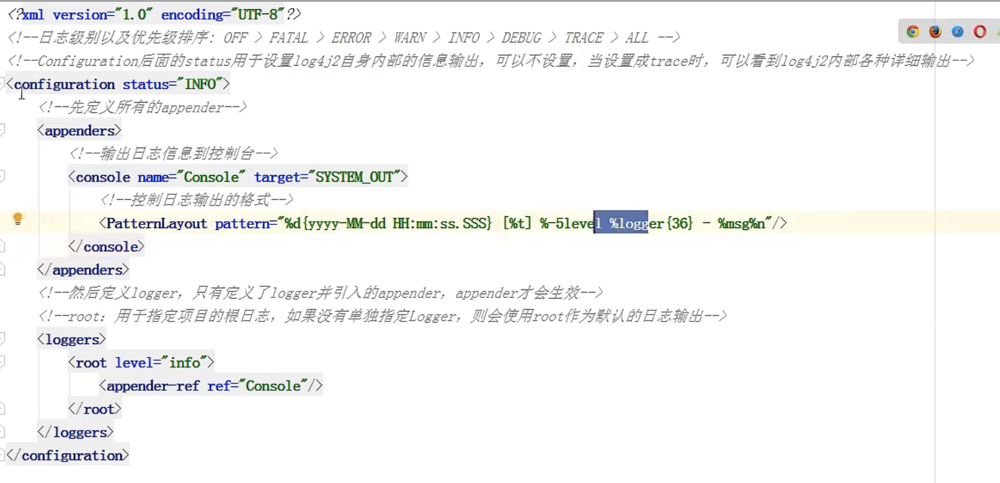
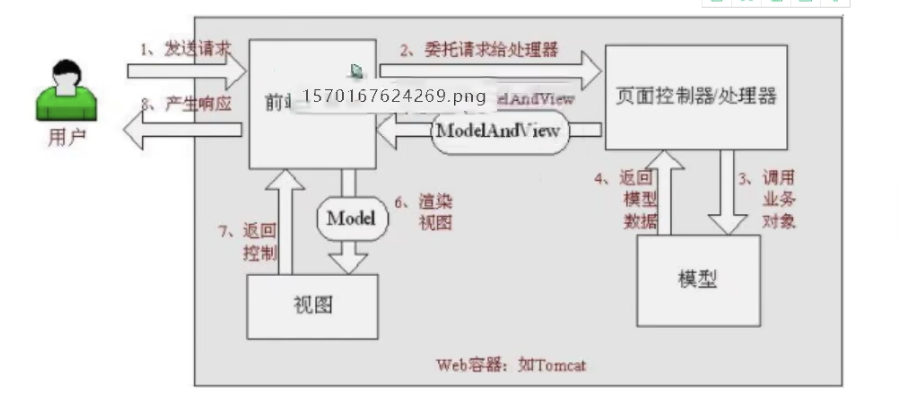
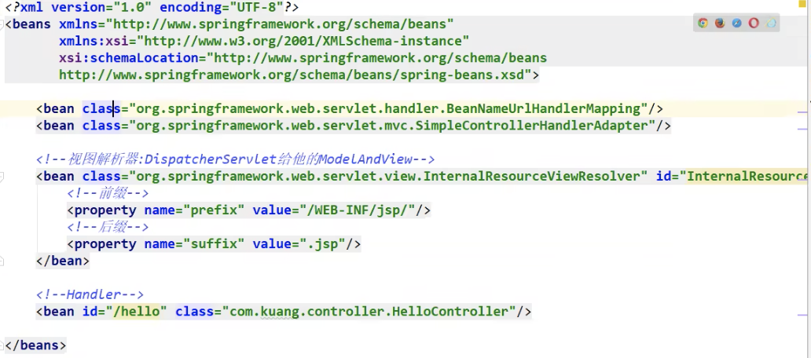

# Java 常见框架
Hibernate: 对JDBC的轻量级封装，使得开发人员可以像操作对象一样操作数据库。  

Structs: 是流行的、成熟的基于MVC设计模式的Web应用程序框架。

Structs+Hibernate: 整合struts和hibernate的基本思路是将MVC中M层交给hibernate处理.

Spring+Hibernate: 整合Spring与Hibernate，基本思路是常见DAO的时候注入SessionFactory。

Spring: Spring是一个基于IOC与Aop的架构多层j2ee系统的框架。

SSH: Structs、Spring、Hibernate三者整合。

SpringMVC: 是时下流行的MVC框架，配置和使用都很方便

Mybatis: 一款对SQL进行轻量级封装的高效率ORM框架。

SSM: Spring、SpringMVC、Mybatis整合，是时下最流行的做法。

Spring Boot: 几乎不用配置的SSH/SSM框架，但是还是需要理解SSM才能更好的使用Spring Boot。

# Spring 框架概述
Spring有两个核心部分：IOC和Aop。
(1) IOC: 控制反转，把创建对象过程交给Spring进行管理。
(2) Aop: 面向切面，不修改源代码进行功能增强。

# 入门案例

## 1. 下载Spring
1. 下载Spring Jar包方法
下载地址: https://repo.spring.io/ui/native/release/org/springframework/spring

2. Maven方法
```xml
<repository>
    <id>repository.spring.milestone</id>
    <name>Spring Milestone Repository</name>
    <url>https://repo.spring.io/milestone</url>
</repository>

...

<dependency>
    <groupId>org.springframework</groupId>
    <artifactId>spring-context</artifactId>
    <version>6.0.0-M2</version>
</dependency>
```

## 2. 常见Java工程

## 3. 导入Spring jar包
Spring_dir/libs/xxx.jar 复制到project_dir/lib，IDE里导入。

## 4. 创建一个普通的类，并创建一个普通的对象  
Spring中创建对象可以是配置或者注解

### 配置方法
(1) Spring 配置文件是xml格式文件。
```xml
<?xml version="1.0" encoding="UTF-8"?>
<beans xmlns="http://www.springframework.org/schema/beans"
    xmlns:xsi="http://www.w3.org/2001/XMLSchema-instance"
    xsi:schemaLocation="
        http://www.springframework.org/schema/beans http://www.springframework.org/schema/beans/spring-beans.xsd">
    <bean id="user" class="App"></bean>
</beans>
```

```Java
App.class:

public class App {
    public void add(){
        System.out.println("add");
    }
}

Test.class
import org.springframework.context.ApplicationContext;
import org.springframework.context.support.ClassPathXmlApplicationContext;

public class Test {
    public static void main(String[] args){
        ApplicationContext context = new ClassPathXmlApplicationContext("bean1.xml");
        App user = context.getBean("user", App.class);            // 根据id值获得
        System.out.println(user);
        user.add();
    }
}
```

# IOC 容器
内容包括：
1. IOC底层原理
2. IOC接口(BeanFactory)
3. IOC操作Bean管理(基于xml)
4. IOC操作Bean管理(基于注解)

## 1. IOC 底层原理
控制反转，是面向对象编程的一种设计原则。最常见的方式是依赖注入，还有一种方式叫依赖查找。通过控制反转，对象在被创建的时候，由一个控制系统内所有对象的外界实体将其所依赖的对象的引用传递给它，也可以说依赖被注入到对象中。

把对象的创建和对象之间的调用过程交给Spring进行管理，目的是为了将耦合度降低。

### xml解析、工厂模式、反射
（1） xml配置文件，配置创建的对象。
```xml
<bean id="dao" class="com.xxx.UserDao"></bean>
```
（2） 在有service类和dao类的情况下，创建工厂类
```Java
class UserFactory {
    public static UserDao getDao(){
        // xml 解析 + 反射 生成，而不是直接new
        String classValue = class属性中的值; // xml解析得到
        // 通过反射创建对象
        Class clazz = Class.forName(classValue);
        return (UserDao)clazz.newInstance();
    }
}
```
这样当类改变或者类的路径改变，则只需要修改配置文件即可。进一步降低耦合度。

## 2.IOC 接口
**1. IOC思想基于IOC容器完成，IOC容器底层就是对象工厂**
**2. Spring中提供IOC容器实现的两种方式：（两个接口），(1) BeanFactory, (2) ApplicationContext。**

**BeanFactory**
上面的例子创建对象的方法就是BeanFacory。IOC容器最基本实现，开发中一般不使用。
加载配置文件时不会创建对象，只有在获取/使用对象时才会创建，例如上面的App对象在getBean()时才会创建。

**ApplicationContext**
BeanFactory接口的子接口，提供更多更强大的功能，一般由开发人员进行使用。
加载配置文件的时候，就会把配置文件中的对象进行创建。


3. ApplicationContext实现类
ClassPathxxx, FileSystemXmlxxx，两个实现类，后者需要完全的路径名。


# IOC操作Bean管理
Bean管理就是**Spring创建对象**、**Spring注入属性**。

```Java
public class User {
    private String name;
    public void add(){
        System.out.println("add...");
    }
}
```
创建对象时，将name值设置。

## 基于xml配置文件方式
### 基于xml配置文件创建对象
```xml
<bean id="user" class="com.xxx.User"></bean>
```
在spring配置文件中，使用bean标签，标签里面添加对应属性就可以实现对象创建。

在bean标签里有很多属性，下面介绍几个常用属性：
**id**: 给对象取个别名，然后通过getBean等方法获得。
**class**: 创建对象的类的全路径（包+类名）
**name**: id不能加符号，name可以加符号，该属性以前是给其他框架使用。

创建对象时，默认执行无参构造函数。

### 基于xml配置文件注入属性
DI(dependency injection)：是IOC中的一种具体实现，表示依赖注入，注入属性。
```java
public class Book{
    private String bname;
    private String bauthor;

    public void setBname(String bname){
        this.bname = bname;
    }
    public void setBauthor(String bauthor){
        this.bauthor = bauthor;
    }
}
```
实现方式有两种。
**一种是使用setter方法**：
1. 创建类，定义属性和对应的set方法
2. 在spring配置文件配置对象创建，配置属性注入。

逻辑上先调用默认构造函数，然后调用setter方法。
```xml
<bean id="book" class="com.xxx.Book">
    <!--使用property完成属性注入-->
    <property name="bname" value="平凡的世界"></property>
    <proterty name="bauthor" value="路遥">
</bean>
```

**一种是通过有参构造函数直接new出来**
1. 创建类，定义属性和有参数的构造方法
2. 在spring配置文件中进行配置

```xml
<bean id="book" class="com.xxx.Book">
    <constructor-arg name="bname" value="平凡的世界"></constructor-arg>
    <constructor-arg name="bauthor" value="路遥"></constructor-arg>
</bean>

<!--按照参数编号注入：-->
<bean id="book" class="com.xxx.Book">
    <constructor-arg idx="0" value="平凡的世界"></constructor-arg>
    <constructor-arg idx="1" value="路遥"></constructor-arg>
</bean>
```
3. p名称空间注入，简化xml配置方式（还是用的setter方法注入）
```xml
<?xml version="1.0" encoding="UTF-8"?>
<beans xmlns="http://www.springframework.org/schema/beans"
    xmlns:xsi="http://www.w3.org/2001/XMLSchema-instance"
    xsi:schemaLocation="
        http://www.springframework.org/schema/beans http://www.springframework.org/schema/beans/spring-beans.xsd"
    xmlns:p="http://www.springframework.org/schema/p"
    >
    <bean id="user" class="App" p:bname="平凡的世界" p:author="路遥"></bean>
</beans>
```

**设置null值**
```xml
<property name="address"><null/></property>
```

**包含特殊符号**
```xml
<!-- <南京> -->
<property name="address" value="&lt;南京&gt;"></property>

<property name="address">
    <value><![CDATA[<<南京>>]]></value>
</property>
```

**注入属性-外部bean**
(1) 创建两个service类和dao类
(2) 在service调用dao里面的方法
```xml
<bean id="userService" class="UserVice">
    <!--属性值ref表示已经创建对象的id -->
    <property name="userDao" ref="userDao"></property>
</bean>
<bean id="userDao" class="UserDaoImpl"></bean>
```

**注入属性-内部bean**
```xml
<bean id="employee" class="Employee">
    <property name="ename" value="Lucy"></property>
    <property name="gender" value="女"></property>
    
    <!--嵌套内部Bean -->
    <property name="department">
        <bean id="dept" class="Department">
            <property name="dname" value="安保部"></property>
        </bean>
    </property>
</bean>
```

**注入属性-级联赋值**
```xml
<bean id="employee" class="Employee">
    <property name="ename" value="Lucy"></property>
    <property name="gender" value="女"></property>
    
    <!--嵌套内部Bean -->
    <property name="department" ref="dept"></property>
    <!--dept的getter必须提供 -->
    <property name="dept.dname" value="技术部"></property>
</bean>

<bean id="dept" class="Department">
    <property name="dname" value="安保部"></property>
</bean>
```

**注入集合属性**  
```java
public class Stu{
    private String[] courses;
    private List<String> list;
    private Map<String, String> maps;
    private Set<String> sets;

    public void setCourses(String[] courses){
        this.courses = courses;
    }

    public void setList(List<String> list){
        this.list = list;
    }

    public void setMaps(Map<String, String> maps){
        this.maps = maps;
    }

    public void setSets(Ste<String> sets){
        this.sets = sets;
    }

}
```
```xml
<bean id="stu" class="Stu">
    <!-- 数组类型注入-->
    <property name="courses">
        <array>
            <value>Java课程</value>
            <value>数据库课程</value>
        </array>
    </property>
    <!-- 列表类型注入-->
    <property name="list">
        <list>
            <value>张三</value>
            <value>李四</value>
        </list>
    </property>
    <!-- map类型注入-->
    <property name="maps">
        <map>
            <entry key="JAVA" value="java"></entry>
            <entry key="PHP" value="php"></entry>
        </map>
    </property>
    <!-- 集合类型注入-->
    <property name="sets">
        <set>
            <value>MySQL</value>
            <value>Redis</value>
        </set>
    </property>
</bean>
```

**注入对象集合**
```xml
<property name="courseList">
    <list>
        <ref bean="course1"></ref>
        <ref bean="course2"></ref>
    </list>
</property>

<bean id="course1" class="Course">
    ...
</bean>
<bean id="course2" class="Course">
    ...
</bean>
```

**把集合类型属性注入提取出来**
使用名称空间:
```xml
xmlns:util="http://springframework.org/schema/util"

xsi:schemaLocation="original...
http://www.springframework.org/schema/util http://www.springframework.org/schema/util/spring-util.xsd">
"
```

使用util标签完成list集合注入抽取
```xml
<util:list id="bookList">
    <value>CourseName</value>
    <!-- or -->
    <ref bean="course"></ref>
</util:list>

<bean id="xxx" class="xxx">
    <property name="list" ref="bookList"></property>
</bean>
```

## IOC 操作Bean管理 (FactoryBean)
Spring中有两种类型的bean，一种普通bean，上面的那种，另一种是工厂bean(FactoryBean)。

* 普通bean: xml中定义什么类型，就返回什么类型
* 工厂bean: xml中定义的可能是个工厂bean，返回的是其他类型。

工厂bean例子: 
```Java
// 必须要实现FactoryBean 接口
public class MyBean implements FactoryBean<Course>{
    // 返回bean
    @Override
    public Course getObject() throws Exception {
        Course course = new Course();
        course.setCname("abc");
        return course;
    }

    @Override
    public Class<?> getObjectType() {

    }

}

public class Main{
    public void test(){
        AppkicationContext context = new ClassPathXmlApplicationContext("bean.xml");

        // 传入的是Course.class，而不是MyBean.class 了
        Course course = context.getBean("myBean", Course.class);
    
    }
}
```

```xml
<beans xxxxx>
    <!-- 传入的是Factory -->
    <bean id="myBean" class="MyBean">
    
    </bean>
</beans>
```

### Bean 的作用域
1. 在Spring里，设置创建的Bean实例是单实例还是多实例。
2. 在Spring里面，默认情况下bean是单实例对象。
3. 设置多实例方法：bean标签里有一个属性scope来设置，singleton(单实例), prototype(多实例), request(很少用, 每次创建对象会放到Web请求的request中), session(很少用，每次请求都会将对象放到session中)。

> 单实例：多次调用context.getBean()时都只获得同一个实例。
> 多实例创建时机是getBean()时，而不是在最开始获取context时，他们创建时机不一样。

### Bean 的生命周期
Bean的生命周期如下：
(1)通过构造器创建Bean实例（无参数构造）
(2)为bean的属性设置值，调用setters
(3)调用bean的初始化的方法（需要进行配置）
(4)bean可以使用了（获取对象）
(5)当容器关闭的时候，调用bean的销毁方法（需要进行配置）

配置初始化方法：
```xml
<!-- bean的init-method属性中传入需要调用的初始化方法名，不加括号-->
<!-- bean的destroy-method属性中传入需要调用的销毁方法名，不加括号-->
<bean id="orders" class="com.xxx.bean.Orders" init-method="initMethod" 
destroy-method="destroyMethod"
></bean>
```

销毁context时才会调用destroy方法：
```Java
((ClassPathXmlApplicationContext) context).close();
```

bean的生命周期有七步。
(2.9) 把bean实例传递给Bean的后置处理器的方法， 
(3.1) 把bean实例传递给Bean的后置处理器方法

创建类，实现接口 BeanPostProcessor，创建后置处理器，其中实现两个方法，然后再配置后置处理器。

```Java
public class MyBeanPost implements BeanPostProcess {

    // 初始化之前会调用
    @Override
    public Object postProcessBeforeInitialization(Object bean, String beanName) throws BeansException {
        return bean;
    }

    // 初始化之后会调用这个
    @Override
    public Object postProcessAfterInitialization(Object bean, String beanName) throws BeansException {
        return bean;
    }
}
```
配置后置处理器：
```xml
<bean id="orders" class="Orders">
    <property name="oname" value="手机"></property>
</bean>

<!-- 对所有bean都会调用MyBeanPost，自动调用-->
<bean id="myBeanPost" class="MyBeanPost"></bean>
```

## IOC操作Bean管理 - XML自动装配
不用写property来设置属性值就是自动装配。根据指定装配规则（属性名称或者属性类型），Spring自动将匹配的属性值进行注入。

```Java
public class Emp {
    private Dept dept;

    public void setDept(Dept dept){
        this.dept = dept;
    }
}

public class Dept {

}
```
autowire自动装配，方法如下：
byName: 根据属性名称注入, 
byType: 根据属性类型装配
因为id的dept名称相同，则自动将emp类型的dept属性set为名称为dept的bean。

```xml
<bean id="emp" class="Emp" autowire="byName">
</bean>
<bean id="dept" class ="Dept"></bean>
```
在实际中一般使用注解的方法进行自动装配。

## IOC操作Bean管理 - 引用外部的属性文件
若xml的property太多，需要改xml，那么可以将property放入到其他文件。

例子：直接配置德鲁伊数据库连接池、引用外部属性文件配置数据库连接池。

直接方法：
```xml
<bean id="dataSource" class="com.alibaba.druid.pool.DruidDataSource">
    <property name="driveClassName" value="com.mysql.jdbc.Driver"></property>
    <property name="url" value="jdbc:mysql://localhost:3306/userDb"></property>
    <property name="username" value="root"></property>
    <property name="password" value="root"></property>
</bean>
```

引用外部文件方法：
创建property文件 -> 把外部properties属性文件引入到spring配置文件 ->

```js 
// filename: jdbc.properties
prop.driverClass=com.mysql.jdbc.Driver
prop.url=jdbc:mysql://localhost:3306/userDb
prop.userName=root
prop.password=root
```

引入context名称空间，然后使用该属性
```xml
<beans
xxxxx...xxx
xmlns:context="http://www.springframework.org/schema/context"
xsi:schemaLocation="xxxxxxx...xxxx http://www.springframework.org/schema/context http://www.springframework.org/schema/context/spring-context.xsd" 
>

<context:property-placeholder location="classpath:jdbc.properties">

<bean id="dataSource" class="com.alibaba.druid.pool.DruidDataSource">
    <property name="driveClassName" value="${prop.driverClass}"></property>
    <property name="url" value="${prop.url}"></property>
    <property name="username" value="${prop.username}"></property>
    <property name="password" value="${prop.password}"></property>
</bean>
</beans>
```

## 基于注解方式实现对象创建
注解时代码里特殊的标记，格式：`@注解名称(属性名称=属性值[,属性名称=属性值])`。

注解可以用在类、方法、属性。使用注解构建对象的目的是为了简化xml配置。

### Bean管理 - 创建对象提供注解
(1) @Component      普通的组件
(2) @Service        一般用在业务逻辑层
(3) @Controller     一般用在Web层
(4) @Repository     用在DAO曾和Mapper层
上面的四个注解的功能是一样的，都是用来创建Bean的实例。

创建步骤：
第一步：引入依赖 spring-aop.jar
第二步：开启组件扫描。在配置文件中引入一个名称空间：
```
xmlns:context="http://www.springframework.org/schema/context"

xsi:schemaLocation="http://www.springframework.org/schema/context http://www.springframework.org/schema/context/spring-context.xsd"
```
开启组件扫描：
```xml
<context:component-scan base-package="com.xxx.util,com.xxx.service"></context:component-scan>

<!-- 另一个写法，只写上层目录，该目录下全部扫描 -->
<context:component-scan base-package="com.xxx"></context:component-scan>
```

第三步 创建类，在类上添加创建对象的注解:
```java
import org.springframework.stereotype.Component;

@Component(value="userService")  // <bean id="userService" class="xxx">
public class UserService {
    public void add(){
        System.out.println("Service add...");
    }
}
```
注解中的属性value可以不写，默认名称是类的名称并且首字母小写。

测试：
```Java
public class Test{
    public static void main(String[] args){
        ApplicationContext context = new ClassPathXmlApplicationContext("bean1.xml");
        UserService service = context.getBean("userService", UserService.class);
        service.add();
    }
}
```

### 开启组件扫描的配置
```xml
<context:component-scan base-package="com.atguigu" use-defaulter-filters="false">
<!--use-default-filters="false", 现在自己配置filter-->
<!--只扫描带有Controller注解的类-->
    <context:include-filter type="annotation" expression="org.springframework.stereotype.Controller">
</context:component-scan>

<context:component-scan base-package="com.atguigu">
<!--设置不扫描的类，含有Controller的注解的类不扫描-->
    <context:exclude-filter type="annotation" expression="org.springframework.stereotype.Controller">
</context:component-scan>
```

### 基于注解方式的属性注入
@AutoWired: 根据属性类型自动装配

@Qualifier: 根据属性名称进行注入

@Resource: 根据类型注入或者根据名称注入

@Value: 注入普通类型属性

例子：对Service里添加属性Dao。不需要添加setters方法就可以注入。
```Java
@Component
public class UserDao {
    xxxxxx
}

// 注解生成对象userService
@Service
public class UserService {
    @AutoWired  // 根据类型将生成的userDao注入
    private UserDao userDao;

    public void add(){
        userDao.add();
        System.out.println("service add...");
    }
}
```

@Qualifier 和 @Autowired一起使用
```Java
@Component(value="userDaoImpl")
public class UserDao {
    public void add(){}
}

// 注解生成对象userService
@Service
public class UserService {
    @AutoWired  // 根据类型将生成的userDao注入
    @Qualifier(value="userDaoImpl")
    private UserDao userDao;

    public void add(){
        userDao.add();
        System.out.println("service add...");
    }
}
```

@Resource 效果：
```Java
@Component(value="userDaoImpl")
public class UserDao {
    public void add(){}
}

// 注解生成对象userService
@Service
public class UserService {

    @Resource(name="userDapImpl")
    private UserDao userDao;

    public void add(){
        userDao.add();
        System.out.println("service add...");
    }
}
```
@Resource 不给值则根据类型，如果给出name属性则根据名称注入。

@Value注入普通类型属性，不需要setters方法。
```Java
public class UserService{
    @Value(value="abc")
    private String name;
}
```

### 纯注解开发，完全使用注解而不是用配置文件
(1) 创建配置类，替代xml的配置文件
```Java
// 用这个注解来替代配置文件
@Configuration
@ComponentScan(basePackages={"com.atguign"})
public class SpringConfig{

}
```
(2) 注解创建类、注入属性

(3) 使用：
```Java
ApplicationContext context = new AnnotationConfigApplicationContext(SpringConfig.class);
context.getBean(xx);
```
实际上是使用Spring Boot来实现完全注解开发。


# AOP 基本
## AOP 基本概念
AOP称为面向切面编程，通过预编译方式和运行期间动态代理实现程序功能的统一维护的一种技术。利用AOP可以对业务逻辑的各个部分进行隔离，从而使得业务逻辑各个部分之间的耦合度降低，提高程序的可重用性，同时提高了开发的效率。

> 也就是不通过修改源代码方式，在主干功能里面添加新功能。

## AOP 底层原理
### 1. AOP 底层使用动态代理
(1) 两种情况的动态代理
第一种 有接口的情况，使用JDK动态代理
第二种 没有接口的情况，使用CGLIB动态代理

**动态代理有接口情况**：
```Java
interface UserDao {
    public void login();
}

class UserDaoImpl implements UserDao{
    public void login(){
        // 登录的实现
    }
}

// 在登录时进行增强
// 创建UserDao接口实现类代理对象，通过代理对象增强功能
```

**没有接口情况**
CGLIB动态代理：
1. 创建当前类**子类**的代理对象
```Java
public User {
    public void add(){}
}

class UserDaoImpl extends User {
    public void add(){
        // ...
        super.add();
        // ...
    }
}
```

### AOP 的JDK动态代理例子
java.lang.Proxy 类能够提供创建代理对象，该类有一个static方法
```Java
newProxyInstance(ClassLoader loader, class\<?\>[] interfaces, InvocationHandler h)
```
来创建代理类的实例。方法里有三个参数：类加载器、增强方法所在的类，所实现的接口，支持多个接口，InvocationHandler 写增强的逻辑(匿名内部类或者单独写一个类)。

```Java
interface UserDao {
    public int add(int a, int b);
    public String update(String id);
}

class UserDaoImpl implements UserDao{
    public int add(int a, int b){
        return a+b;
    }
    public String update(String id){
        return id;
    }
}

import java.lang.reflect.Proxy;
class UserDaoProxy implements InvocationHandler{
    private Object obj;
    public UserDaoProxy(Object obj){
        this.obj = obj;
    }

    // 每次方法被调用时，都调用invoke
    @Override
    public Object invoke(Object Proxy, Method method, Object[] args) throws Throwable {
        // 写增强逻辑
        System.out.println("Process before method, name: "+method.getName() + "param: "+Arrays.toString(args));
        
        Object res = method.invoke(obj, args);

        System.out.println("Process after method");
        return res;
    }
}

public class Main {
    public static void main(String[] args){
        // 创建代理实现类
        Class<?>[] interfaces = {UserDao.class};
        UserDao ud = new UserDaoImpl();
        ud = (UserDao)Proxy.newProxyInstance(Main.class.getClassLoader(), interfaces, new UserDaoProxy(ud));
        System.out.println(ud.add(3, 4));
    }
}
```

## AOP 相关术语
1. **连接点**：一个User类中哪些方法可以被增强，那么哪些方法就称为连接点。
2. **切入点**：实际被真正增强的方法就称为切入点。
3. **通知/增强**：实际被增强的逻辑部分称为通知/增强。（例如登录界面，增加了权限判断，那么这个权限判断就称为增强/通知）。通知有多种类型。
前置通知：add()方法之前执行
后置通知：add()方法之后执行
环绕通知：add()方法前后都执行
异常通知：add()方法出现异常后执行
最终通知：try-catch-finally中的finally，不管怎样，调用后都会执行。
4. **切面**：是一个动作，把通知应用到切入点的过程就称为切面。

## AOP 操作（准备）
在Spring框架中，一般基于AspectJ 实现AOP操作。
(1) 什么是AspectJ
AspectJ不是Spring组成部分，是独立的AOP框架。一般把AspectJ和Spring框架一起使用，进行AOP操作。

(2) 基于AspectJ实现方法
xml配置文件、注解实现，一般都使用注解方法实现。

(3) 引入AOP相关依赖spring-aop.jar、spring-aspects.jar、com.springsource.net.sf.cglib.jar, com.springsource.org.aopalliance.jar、com.springsource.org.aspectj.weaver.jar
 
(4) 切入点表达式
作用：知道对哪个类里面的哪个方法进行增强
语法结构：
```txt
execution([权限修饰符][返回类型][类的全路径][方法名称]([参数列表]))
```
举例1: 对com.atguigu.dao.BookDao类里面的add进行增强
```
*: public/private 都可以
返回类型可不写
..: 方法中的参数
execution(* com.atguigu.dao.BookDao.add(..))

// 对所有方法都增强
execution(* com.atguigu.dao.BookDao.*(..))

// 对包里的所有类的所有方法进行增强
execution(* com.atguigu.dao.*.*(..))
```

## AOP 操作（注解方式）
1. 创建被增强类，在类中定义方法。
2. 创建增强类（编写增强的逻辑），在增强类中创建不同的方法代表不同通知类型。
3. 进行通知的配置，在spring的配置文件中开启注解扫描，使用注解创建User和UserProxy对象，然后在增强的类上添加注解@Aspect，在spring的配置文件中开启生成代理对象。
4. 在增强类上添加注解@Aspect
5. 配置不同类型的通知，在增强类里，在需要增强的方法上添加增强类型的注解， 使用切入点表达式


bena.xml里需要引入aop名称空间：
```xml
<?xml version="1.0" encoding="UTF-8"?>
<beans xmlns="http://www.springframework.org/schema/beans"
    xmlns:xsi="http://www.w3.org/2001/XMLSchema-instance"
    xmlns:p="http://www.springframework.org/schema/p"
    xmlns:context="http://www.springframework.org/schema/context"
    xmlns:aop="http://www.springframework.org/schema/aop"
    xsi:schemaLocation="http://www.springframework.org/schema/beans http://www.springframework.org/schema/beans/spring-beans.xsd 
    http://www.springframework.org/schema/context http://www.springframework.org/schema/context/spring-context.xsd 
    http://www.springframework.org/schema/aop http://www.springframework.org/schema/aop/spring-aop.xsd"
>
<context:component-scan base-package="ttest">
</context:component-scan>

    <!-- 开启Aspect生成代理对象 -->
    <aop:aspect-autoproxy></aop:aspect-autoproxy>
</beans>
```
上面的xml中的aspcet-autoproxy用注解可以替代：
```java
@EnableAspectJAutoProxy(proxyTargetClass=true)
// 或者
@EnableAspectJAutoProxy
```
例子：
```Java
// 被增强类
@Component
public class User {
    public static void add(){
        System.out.println("add...");
    }
}

// 增强类
@Component
@Aspect         // 生成一个代理对象
public class UserProxy {
    // 配置代理方法
    @Before(value="execution(* ttest.User.add(..))")
    public void before(){
        System.out.println("before...");
    }
}

// 测试：
public class Main{
    public static void main(String[] args){
        ApplicationContext context = new ClassPathXmlApplicationContext("bean.xml");
        User user = context.getBean("user", User.class);
        user.add();
    }
}

// 输出：
// before...
// add...
```
其他的类型还有
@After: 在方法执行之后执行（最终通知）
@AfterReturning: 在方法返回结果之后执行（后置通知）
@AfterThrowing: 异常后执行
@Around: 环绕通知
...

### 相同的切入点抽取
定义切入点：对一个空方法上添加@Pointcut标记
使用切入点：@Before(value="pointdemo()")，调用该方法名称
```java
@Component
public class UserProxy {

    @Pointcut(value="execution(xxx)")
    public void pointdemo(){

    }

    @Before(value="pointdemo()")
    public void add(){
        ...
    }
}
```

### 多个增强类对同一个方法进行增强，设置增强类优先级
在增强类上面增加一个注解@Order(数字)，数字越小，优先级越高，从0开始
```Java
@Component
@Aspect
@Order(1)
public class PersonProxy {

    // 后置通知
    @Before(value="execution(* ttest.User.add(..))")
    public void addEnhance(){

    }
}

@Component
@Aspect
@Order(3)
public class UserProxy {

    // 后置通知
    @Before(value="execution(* ttest.User.add(..))")
    public void addEnhance(){

    }
}
```

## AOP 操作（AspectJ 配置文件操作）
实际中配置文件方式用的很少，一般都是用注解做到。

1. 创建两个类，被增强类和增强类，创建对应方法。
2. spring配置文件中创建两个类对象
3. 在spring配置文件中配置切入点

```java
public class Book {
    public void buy(){
        System.out.println("buy.........");
    }
}

public class BookProxy {
    public void beforeEnhanced(){
        Syetem.out.println("before......");
    }
}
```
在配置文件中创建对象
```xml
<beans xxxxxxxxxx>
    <!-- 创建两个类的对象 -->
    <bean id="book" class="ttest.Book"></bean>
    <bean id="bookProxy" class="ttest.BookProxy"></bean>

    <!-- 配置aop增强 -->
    <aop:config>
        <!-- 配置切入点 -->
        <aop:pointcut id="idx" expression="execution(* ttest.Book.buy(..))"></aop:pointcut>

        <!-- 配置切面，应用切入点的过程 -->
        <aop:aspect ref="bookProxy">
            <!--增强作用在具体的方法上 -->
            <aop:before method="beforeEnhanced" pointcut-ref="idx"></aop:before>
        </aop:aspect>
    </aop:config>
</beans>
```

## 完全注解开发
创建一个config包，不需要用xml开发类。
@EnableAspectJAutoProxy(proxyTargetClass=true)


# JdbcTemplate
JdbcTemplate对JDBC进行了封装，用它来实现对数据库的增删改查。

## 准备工作
1. 添加依赖
* mysql-connector-java-5.1.7-bin.jar
* druid-1.1.9.jar   （德鲁伊连接池）
* spring-jdbc-5.2.6.RELEASE.jar 
* spring-tx-5.2.6.RELEASE.jar   （事务相关依赖）
* spring-orm-5.2.6.RELEASE.jar

2. 在spring配置文件配置数据库连接池
```xml
<beans>
    <bean id="dataSource" class="com.alibaba.druid.pool.DruidDataSource" destroy-method="close">
        <property name="url" value="jdbc:mysql://101.42.221.61:3306/TEST"></property>
        <property name="" value="root"></property>
        <property name="password" value="root"></property>
        <property name="driverClassName" value="com.mysql.jdbc.Driver"></property>
    </bean>
</beans>
```

3. 配置JDBCTemplate对象，注入DataSource
```xml
<bean id="jdbcTemplate" class="org.springframework.jdbc.core.JdbcTemplate">
    <!-- 注入DataSource -->
    <property name="dataSource" ref="dataSource"></property>
</bean>
```

4. 创建service类，创建dao类，在dao注入jdbcTemplate对象。

* Service
注入BookDao的成员变量
* Dao
Dao接口
* DaoImpl
注入jdbcTemplate对象

## JdbcTemplate 增删改查
### 创建实体类
```Java
public class User {
    private String userID;
    private String username;
    private String ustatus;

    /* 生成 getter、setter方法 */
}
```

### 编写Service和dao
在Service中添加提供给外部的addUser操作，在dao接口中添加addUser接口，在daoImpl中添加addUser的SQL执行逻辑。（daoImpl中已经有jdbcTemplate了）

* jdbcTemplate.update(sql, Object ...)
* jdbcTemplate.execute

```java
public void add(User user){
    String sql = "insert into t_user values(?,?,?)";

    // 输出影响的行数
    int update_num = jdbcTemplate.update(sql, user.getID(), user.getUsername(), user.getUstatus());
}
```

批量操作：
```Java
jdbcTemplate.batchUpdate(String sql, List<Object[]> batchArgs);
```

### 查询操作
**jdbcTemplate 查询返回某个值**
```java
public int selectCount() {
    String sql = "select count(*) from t_book;";

    Integer count = jdbcTemplate.queryFroObject(String sql, Class<T>/* 返回类型的class */);
    return count;
}
```
**jdbcTemplate 查询返回对象**
使用到的函数
```java
JdbcTemplate.queryObject(String sql, RowMapper<T> rowMapper, Object ...args)
```
RowMapper: 是一个接口，使用他的实现类会进行数据的封装。

```java
public User func(){
    String sql = "select * from t_book where id=?";
    jdbcTemplate.queryForObject(sql, new User user = BeanPropertyRowMapper<User>(User.class), id);
    return user;
}
```

### 查询集合
```java
public List<User> findAllUser(){
    String sql = "select * from t_user;";

    List<User> ulist = jdbcTemplate.query(sql, new BeanPropertyRowMapper<User>(User.class));
    return ulist;
}
```

### 批量修改/删除
```java
jdbcTemplate.batchUpdate(String sql, List<Object[]> batchArgs);
```

## JDBC 事务操作
### 一个事务的例子
A向B转账100块，A账户减少100，B账户增加100.


创建Service，搭建dao，完成对象创建和注入关系。service注入dao，在dao注入jdbcTemplate，在jdbcTemplate注入DataSource。
```xml
<?xml version="1.0" encoding="UTF-8"?>
<beans xmlns="http://www.springframework.org/schema/beans"
    xmlns:xsi="http://www.w3.org/2001/XMLSchema-instance"
    xmlns:p="http://www.springframework.org/schema/p"
    xmlns:context="http://www.springframework.org/schema/context"
    xmlns:aop="http://www.springframework.org/schema/aop"
    xsi:schemaLocation="http://www.springframework.org/schema/beans http://www.springframework.org/schema/beans/spring-beans.xsd 
    http://www.springframework.org/schema/context http://www.springframework.org/schema/context/spring-context.xsd 
    http://www.springframework.org/schema/aop http://www.springframework.org/schema/aop/spring-aop.xsd"
>
    <bean id="dataSource" class="com.alibaba.druid.pool.DruidDataSource" destroy-method="close">
        <property name="url" value="jdbc:mysql://101.42.221.61:3306/TEST"></property>
        <property name="username" value="wt"></property>
        <property name="password" value="-"></property>
        <property name="driverClassName" value="com.mysql.jdbc.Driver"></property>
    </bean>

    <bean id="jdbcTemplate" class="org.springframework.jdbc.core.JdbcTemplate">
        <!-- 注入DataSource -->
        <property name="dataSource" ref="dataSource"></property>
    </bean>

    <bean id="bookService" class="ttest.BookService">
        <property name="bookDao">
            <bean id="bookDao" class="ttest.BookDaoImpl">
                <property name="jdbcTemplate" ref="jdbcTemplate"> </property>
            </bean>
        </property>

    </bean>
</beans>
```
没有事务：
```Java
// Dao操作
class UserDao {
    public void addMoney(){
        String sql = "update t_account set money=money-? and name=?";
        jdbcTemplate.update(sql, 100, "lucy");
    }

    public void reduceMoney(){
        String sql = "update t_account set money=money+? and name=?";
        jdbcTemplate.update(sql, 100, "mary");
    }
}

// Service 业务逻辑层
class Service {
    public void transfer(){
        dao.reduceMoney();
        dao.addMoney();
    }
}
```

### 事务操作


1. 事务需要添加到Service层上（业务逻辑层）
2. 在Spring进行事务管理操作：编程式事务管理和声明式事务管理（声明式最常用）。
3. 声明式事务管理有两种：基于注解方式、基于xml配置文件
4. Spring 在进行声明式事务管理时，底层使用了AOP，动态代理。

### Spring 事务管理API
提供了一个接口，代表事务管理器，这个接口针对不同框架提供不同实现类: `PlatfromTranscationManager`。

它针对JDBCTemplate提供了对应的实现类: `DataSourceTranscationManager`（MyBatis也是这个），如果项目中整合了Hibernate，则提供`HibernateTranscationManager`。

### 事务操作（注解声明式事务管理）
**1. 在Spring配置文件中配置事务管理器**
**2. 在配置文件中开启事务注解**
引入名称空间tx，与前面方法一致，在xmlns:tx

```xml
<?xml version="1.0" encoding="UTF-8"?>
<beans   xxx>
    <bean id="dataSource" class="com.alibaba.druid.pool.DruidDataSource" destroy-method="close">
        <property name="url" value="jdbc:mysql://101.42.221.61:3306/TEST"></property>
        <property name="username" value="wt"></property>
        <property name="password" value="-"></property>
        <property name="driverClassName" value="com.mysql.jdbc.Driver"></property>
    </bean>

    <bean id="jdbcTemplate" class="org.springframework.jdbc.core.JdbcTemplate">
        <!-- 注入DataSource -->
        <property name="dataSource" ref="dataSource"></property>
    </bean>

    <bean id="transcationManager" class="org.springframework.jdbc.datasource.DataSourceTranscationManager">
        <!-- 注入数据源 -->
        <property name="dataSource" ref="dataSource"></property>
    </bean>

    <tx:annotation-driven transcation-manager="transcationManager"></tx:annotation-driven>
</beans>
```
**3.在Service类上或者service类里面的方法上面添加事务注解**
@Transcational可以添加到类或方法上，添加到类上表示这个类的所有方法都添加到了事务。
```Java
@Service                // 默认会生成一个userService对象
@Transcational          // 添加事务注解，可以加到类或方法上
class UserService {
    public void transfer(){
        userDao.reduceMoney();

        int i = 10 / 0;         // 模拟一个错误
        userDao.addMoney();

        // 如果出现了错误，则lucy钱不会少，mary钱不会多，并且打印出异常程序退出。
    }
}
```

@Transcational(xxx)中的属性参数配置：
**propagation**: 多事务方法直接进行调用，这个过程中事务是如何进行管理的。比如有一个add方法和一个update方法。在add和update方法中都加了Transcational，并且在add方法中调用update方法，那么该行为怎么处理就是传播方法。
*REQUIRE*: 如果有事务在运行，当前方法就在这个事务内运行，否则就启动一个新的事务，并在自己的事务内运行。（update使用当前add方法里面的事务）
*REQUIRES_NEW*: 使用add方法调用update，如果add无论是否有事务，都创建新的事务（update是有事务的）
*SUPPORTS*, *NOT_SUPPORT*, *MANDATORY*, *NEVER*, *NESTED*等可以参见官方文档。

**isolation**: 事务隔离级别
(1) 多事务操作之间会产生影响，产生三个问题：脏读、不可重复读、幻读。
@ *脏读*：一个未提交的事务读取到另一个**未提交**事务的数据。A事务读取B事务尚未提交的数据，此时如果B事务发生错误并执行回滚操作，那么A事务读取到的数据就是脏数据。
@ *不可重复读*：前后多次读取，数据内容不一致。（针对的是另一个已经提交的事务的update的操作）
@ *幻读*：前后多次读取，数据总量不一致，也就是第二次操作发现多出了些数据，针对另一个事务的insert和delete操作。
@ 不可重复读一般使用行锁解决，幻读只能使用表锁。

*READ UNCOMMITTED*: 脏读、不可重复读、幻读
*READ COMMITTED*: 不可重复读、幻读
*REPEATABLE READ*: 幻读
*SERIALIZABLE*: 没有任何问题
**MySQL默认REPEATABLE READ**。
@Transcational(propagation=Propagation.REQUIRED, isolation=Isolation.REPEATABLE_READ)

**timeout**: 超时时间
事务在规定时间内提交，如果没有提交则进行回滚。超时时间默认是-1，以秒为单位：timeout=100。

**readOnly**: 是否只读
默认值是false，表示可以查询，可以添加修改删除操作。如果为true，则只能进行select操作。

**rollbackFor**: 回滚
设置哪些异常进行事务回滚。

**noRollbackFor**: 不回滚
设置出现哪些异常不进行回滚，设置noRollbackFor=NullPointerException.class即可。

## 事务操作（XML 声明式事务管理）
（1）配置事务管理器
（2）配置通知
（3）配置切入点和切面

```xml
<?xml version="1.0" encoding="UTF-8"?>
<beans   xxx>
    <bean id="dataSource" class="com.alibaba.druid.pool.DruidDataSource" destroy-method="close">
        <property name="url" value="jdbc:mysql://101.42.221.61:3306/TEST"></property>
        <property name="username" value="wt"></property>
        <property name="password" value="-"></property>
        <property name="driverClassName" value="com.mysql.jdbc.Driver"></property>
    </bean>

    <bean id="jdbcTemplate" class="org.springframework.jdbc.core.JdbcTemplate">
        <!-- 注入DataSource -->
        <property name="dataSource" ref="dataSource"></property>
    </bean>

    <bean id="transcationManager" class="org.springframework.jdbc.datasource.DataSourceTranscationManager">
        <!-- 注入数据源 -->
        <property name="dataSource" ref="dataSource"></property>
    </bean>

    <!-- 配置通知 -->
    <tx:advice id="txadvice">
        <tx:attributes>
            <!-- 指定在哪种名称符合规则的方法上添加事务-->
            <tx:method name="account*" propagation="REQUIRED"></tx:method>
        </tx:attributes>
    </tx:advice>
    <!--配置切入点和切面-->
    <aop:config>
        <!-- 配置切入点 -->
        <aop:pointcut id="pt" expression="execution(*  ttest.UserService.*(..))">

        <!--配置切面-->
        <aop:advisor advice-ref="txadvice" pointcut-ref="pt">
    </aop:config>
</beans>
```

## 事务操作 - 完全注解开发
通过配置类实现。
```Java
@Configuration
@ComponentScan(basePackage="ttest")     // 开启组建扫描
@EnableTranscationManagement        // 开启事务
public class TxConfig {
    // 在配置类中创建连接池
    @Bean
    public DruidDataSource getDruidDataSource() {
        DruidDataSource dataSource = new DruidDataSource();
        dataSource.setDriverClassName("com.mysql.jdbc.Driver");
        dataSource.setUrl("jdbc:mysql://101.42.221.61:3306/TEST");
        dataSource.setUsername("wt");
        dataSource.setPassword("-");
        return dataSource;
    }
    // 创建JDBCTemplate对象。传入参数则说明根据类型在Ioc容器中找到对应对象传入。也可以参数为空，但是会多出一个相同对象的副本
    @Bean
    public JdbcTemplate getJdbcTemplate(DataSource dataSource){
        HdbcTemplate jdbcTemplate = new JdbcTemplate();
        // 注入DataSource，这里也可以getBean获得
        jdbcTemplate.setDataSource(dataSource);
        return jdbcTemplate;
    }

    // 创建事务管理器对象
    @Bean
    public DataSourceTranscationManager getDataSourceTranscationManager(DataSource dataSource){
        DataSourceTranscationManager dstm = new DataSourceTranscationManager();
        dstm.setDataSource(dataSource);
        return dstm;
    }
}

public class Main {
    public static void main(String[] args){
        ApplicationContext context = new AnnotationConfigApplicationContext(TxConfig.class);

    }
}
```

# Spring 5 -- 新特性
1. 整个框架基于Java8，兼容JDK9进行操作。
2. Spring 5 框架自带了通用的日志封装
(1) Spring 5 已经移除了Log4jConfigListener，官方建议使用Log4j2版本。

## 整合log4j日志
第一步  引入jar包
* log4j-api-2.11.2.jar
* log4j-core-2.11.2.jar
* log4j-slf4j-impl-2.11.2.jar
* slf4j-api-1.7.30.jar

第二步 设置配置文件
新建log4j2.xml(名字必须固定，不能写其他名字)，内容如下：


第三部  进行输出
```java
import org.slf4j.Logger;

public class UserLog {
    private static final Logger log = LoggerFactory.getLogger(UserLog.class);

    public static void main(String[] args) {
        log.info("hello log4j2");
        log.warn("hello log4j2")
    }
}
```

## Spring5新特性 -- 核心容器支持@Nullable注解
（1）@Nullable注解可以使用在方法上面、属性上面、参数上面，表示方法返回可以为空，属性值可以为空，参数值可以为空。
```Java
public class A {
    // 下面的方法返回值可以为null
    @Nullable
    public String getId(){...}
}
```

## Spring 5 核心容器支持函数式操作编程对象
```Java
public class User {
    public static void main(String[] args) {
        GenericApplicationContext context = new GenericApplicationContext();

        // 调用context进行对象注册
        context.re fresh();
        // 将new出来的对象在spring的容器中注册
        context.registerBean(User.class, () -> new User());

        // 获取方式是全路径，因为传入的是User.class
        context.getBean("com.ttest.User");

        context.registerBean("user1", () -> new User());
        context.getBean("user1")
    }
}
```

## 对JUnit5测试进行整合
### 整合JUnit4
第一步：加入依赖jar包
* spring-test-5.26.jar
* junit4-4.12.jar
* hamcrest-core-1.3.jar

第二步：创建测试类
```Java
@RunWith(SpringJUnit4ClassRunner.class)     // 指定单元测试框架
@ContextConfiguration("classpath:bean1.xml")    // 加载配置文件
public class JTest4 {
    @Autowired      // 自动注入业务层的Service
    private UserService userService;

    @Test
    public void test1(){
        userService.accountMoney();
    }
}
```

### 整合JUnit5
第一步：引入jar包，5.3
第二步：创建测试类，使用JUnit5中的注解
```Java
@ExtendWith(SpringExtension.class)
@ContextConfiguration("classpath:bean1.xml")
public class JTest5 {
    @Autowired      // 自动注入业务层的Service
    private UserService userService;

    @Test           // Junit5 的@Test
    public void test1(){
        userService.accountMoney();
    }
}

// 上面的ExtendWith注解和ContextConfiguration注解可以合并
@SpringJUnitConfig(locations="classpath:bean1.xml")
```

# SpringMVC
MVC: 模型Model（Dao层，Service层），视图View（JSP/html），控制器Controller（Servlet，处理请求和相应）

MVC框架做的事情：
1. 将url映射到java类或java类的方法
2. 封装用户提交的数据
3. 处理请求 -- 调用相关的业务处理 -- 封装数据
4. 将响应的数据进行渲染 .jsp/html等表示层数据

常见的服务器端MVC框架：Structs、SpringMVC、ASP.NET MVC
常见的前端MVC框架：Vue、Angularjs、React

MVVM: M  -- V  --  V -- M ViewMode: 双向绑定。

SpringMVC 是基于纯Java的代码，底层实际上还是Servlet。

# SpringMVC执行流程
Spring的web框架围绕 DispatcherServlet（调度Servlet）设计。DispatcherServlet的作用是将请求分发到不同的处理器。正因为SpringMVC基于Spring，使用约定优于设置，能哦股进行简单的junit测试，支持Resuful风格，异常处理、本地化、国际化、数据验证、类型转换、拦截器等等的优势。

原始的 Javaweb 是每一个请求对应一个Servlet，也就是有多个Servlet来处理不同的请求，但是SpringMVC在多个Servlet上增加了一层，用户只与DispatcherServlet打交道，就不用每次都为每一个servlet配置web.xml。



* 前端处理器：JSP，JSP运行在服务端，再经过Tomcat服务器处理、执行上面的Java代码、访问Servlet后，生成对应的HTML文件返回给客户端。

默认已经将DispatcherServlet配置好了。

## 开发方法
1. 配置web.xml中的DispatcherServlet
2. 在src/main/resources/ 下面创建一个xxx.xml，编写`beans`，创建对应的配置文件：

3. 创建对应的Controller


