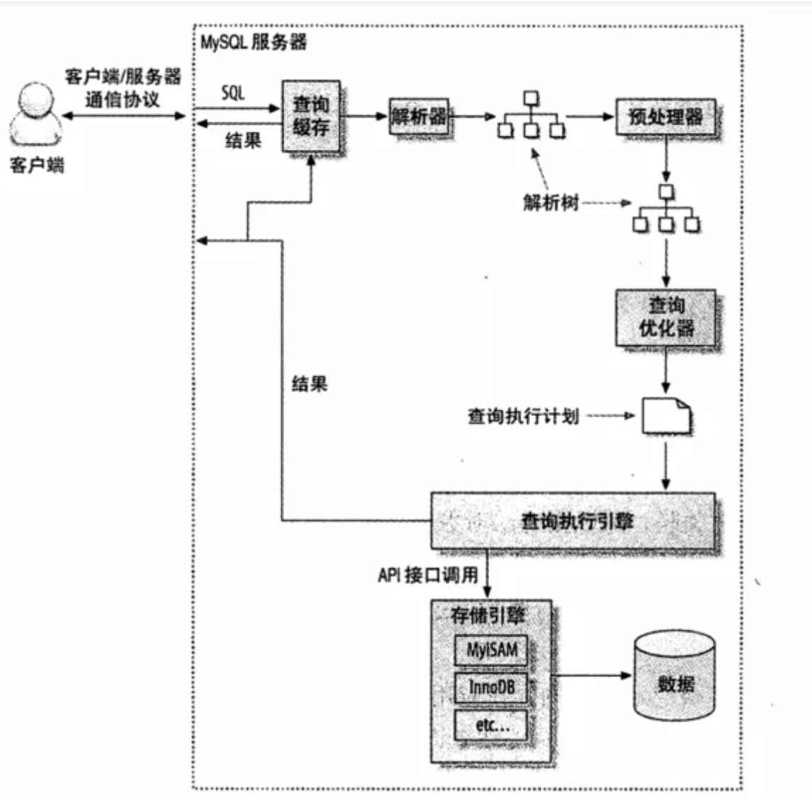

# 1. Explain 优化索引查询检测
EXPLAIN可以帮助开发人员分析SQL问题，explain显示了mysql如何使用索引来处理select语句以及连接表，可以帮助选择更好的索引和写出更优化的查询语句。

使用方法，在select语句前加上Explain就可以了：
```SQL
explain select * from ARTICLES where id > 10;
```
mysql在执行一条查询之前，会对发出的每条SQL进行分析，决定是否使用索引或全表扫描如果发送一条select * from blog where false，Mysql是不会执行查询操作的，因为经过SQL分析器的分析后MySQL已经清楚不会有任何语句符合操作。

```shell
mysql> EXPLAIN SELECT `birday` FROM `user` WHERE `birthday` < "1990/2/2"; 
-- 结果： 
id: 1 

select_type: SIMPLE -- 查询类型（简单查询、联合查询、子查询） 

table: user -- 显示这一行的数据是关于哪张表的 。

type: range -- 区间索引（在小于1990/2/2区间的数据)，这是重要的列，显示连接使用了何种类型。
从最好到最差的连接类型为system > const > eq_ref > ref > fulltext > ref_or_null > index_merge > unique_subquery > index_subquery > range > index > ALL。
const代表一次就命中，ALL代表扫描了全表才确定结果。一般来说，得保证查询至少达到range级别,最好能达到ref。 

possible_keys: birthday  -- 指出MySQL能使用哪个索引在该表中找到行。如果是空的，没有相关的索引。这时要提高性能，可通过检验WHERE子句，看是否引用某些字段，或者检查字段不是适合索引。  

key: birthday -- 实际使用到的索引。如果为NULL，则没有使用索引。如果为primary的话，表示使用了主键。 

key_len: 4 -- 最长的索引宽度。如果键是NULL，长度就是NULL。在不损失精确性的情况下，长度越短越好。

ref: const -- 显示哪个字段或常数与key一起被使用。  

rows: 1 -- 这个数表示mysql要遍历多少数据才能找到，在innodb上是不准确的。 

Extra: Using where; Using index -- 执行状态说明，这里可以看到的坏的例子是Using temporary和Using
```

**select_type**:
* simple:简单select（不使用union或子查询）。
* primary:最外面的select。
* union:union中的第二个或后面的select语句。
* dependent union:union中的第二个或后面的select语句，取决于外面的查询。
* union result:union的结果。
* subquery:子查询中的第一个select。
* dependent subquery:子查询中的第一个select，取决于外面的查询。
* derived:导出表的select（from子句的子查询）。

## 其他说明
**Distinct**: 一旦MySQL找到了与行相关联合匹配的就行，不再搜索。

**Not exist**: MySQL优化了LEFT JOIN，一旦它**找到了**匹配LEFT JOIN标准的行就不再搜索了。

**Range checked for each Record**: 没有找到理想的索引，因此对于从前面表中来的每一个行，MySQL检查使用哪个索引，并用它来从表中返回行，这是使用索引最慢的连接之一。

**Using filesort**: 看到这个的时候，查询就需要优化了。MYSQL需要进行额外的步骤来发现如何对返回的行排序。它根据连接类型以及存储排序键值和匹配条件的<u>全部行的行指针来**排序**全部行</u>。

**Using index**: 列数据是从仅仅使用了索引中的信息而没有读取实际的行动的表返回的，这发生在对表的全部的请求列都是同一个索引的部分的时候。

**Using temporary**: 看到这个的时候，查询需要优化了。这里，MYSQL需要创建一个临时表来存储结果，这通常发生在对不同的列集进行ORDER BY上，而不是GROUP BY上。

*type类型：*
**system**: 表只有一行：system表。这是const连接类型的特殊情况。
**const**: 表中的一个记录的最大值能够匹配这个查询（索引可以是主键或惟一索引）。因为只有一行，这个值实际就是常数,因为MYSQL先读这个值然后把它当做常数来对待。
**eq_ref**: 在**连接**中，MYSQL在查询时，从前面的表中，对每一个记录的联合都从表中读取一个记录，它在查询使用了索引为主键或惟一键的全部时使用。
**ref**: 这个**连接**类型只有在**查询使用了不是惟一或主键的键**或者是这些类型的部分（比如，利用最左边前缀）时发生。对于之前的表的每一个行联合，全部记录都将从表中读出。这个类型严重依赖于索引匹配的记录多少，越少越好。
**range**: 这个连接类型使用索引返回一个范围中的行，比如使用>或<查找东西时发生的情况。
**index**: 这个连接类型对前面的表中的每一个记录联合进行完全扫描（比ALL更好，因为索引一般小于表数据）。
**ALL**: 这个连接类型对于前面的每一个记录联合进行完全扫描，这一般比较糟糕，应该尽量避免。
**Only index**: 这意味着信息只用索引树中的信息检索出的，这比扫描整个表要快。
**where used**: 就是使用上了where限制。
**impossible where**: 表示用不着where，一般就是没查出来啥。

## 索引类型
**UNIQUE唯一索引**: 不可以出现相同的值，可以有NULL值。

**INDEX普通索引**: 允许出现相同的索引内容。

**PRIMARY KEY主键索引**: 不允许出现相同的值，且不能为NULL值，一个表只能有一个primary_key索引。


## 创建索引技巧
**1. 值的类型多样的列创建索引**
  * 要为维度高的列创建索引，例如年龄。性别就不适合创建索引，因为它取值只有2个。

**2. where, on, group by, order by** 中出现的列使用索引

**3. 对较小的数据列使用索引，这样会使索引文件更小，同时内存中也可以装载更多的索引键**

**4. 为较长的字符串使用前缀索引**
  * 字符串前缀尽量不一致，比如命名为nju_2022_wt的字符串就不如命名为wt_2022_nju。因为nju字符串很频繁多样性很少。

**5. 不要过多创建索引，除了增加额外的磁盘空间外，对于DML操作的速度影响很大，因为其每增删改一次就得从新建立索引。**

**6. 使用组合索引，可以减少文件索引大小，在使用时速度要优于多个单列索引。**
  * **多个单列索引查询方式**：MySQL将通过最有效率的索引（例如firstname）迅速把搜索范围限制到那些firstname="Mike"的记录，然后再在这个“中间结果集”上进行其他条件的搜索：它首先排除那些lastname不等于“Sullivan”的记录，然后排除那些age不等于17的记录。当记录满足所有搜索条件之后，MySQL就返回最终的搜索结果。
  * **组合索引**则会直接找到满足条件的行。

  * 创建一个(firstname, lastname, age)的一个组合索引，实际上当查询子句是`where firstname="MIKE" and lastname="Sullivan" and age="17"`、`where firstname="MIKE" and lastname="Sullivan"`、`where firstname="MIKE"`都会使用到索引，并且从左往右最先匹配索引。
  * 但是如果使用`where lastname="Sullivan" and age="17"`则不使用索引，直接全表扫描。
  * 前缀索引是创建索引的一种手段，对于字符串类型，如果索引保存整个字符串，那么会导致索引文件过大，不便于操作（经常需要页面置换），因此可以使用前缀索引的方式，将索引长度控制在一个合适的点。例如：`ALTER TABLE user ADD INDEX uname(title(10));`，只取前10个字符。

## 不走索引的SQL
**1) 索引列参与了计算**:
```SQL
SELECT `sname` FROM `stu` WHERE `age`+10=30;
```

**2) 索引列使用了函数运算**:
```SQL
SELECT `sname` FROM `stu` WHERE LEFT(`date`,4) <1990;
```

**3) 字符串前缀使用了模糊查询**: 
```SQL
SELECT * FROM `houdunwang` WHERE `uname` LIKE "%后盾%"

# 下面的SQL会使用索引：
SELECT * FROM `houdunwang` WHERE `uname` LIKE'后盾%'
```

**4) 正则表达式不使用索引，这应该很好理解，所以为什么在SQL中很难看到regexp关键字的原因**

**5) 字符串与数字比较不使用索引**
```SQL
CREATE TABLE `a` (`a` char(10)); 
EXPLAIN SELECT * FROM `a` WHERE `a`="1" -- 走索引 
EXPLAIN SELECT * FROM `a` WHERE `a`=1 -- 不走索引 
```
实际上字符串与数字比较，隐含了对列使用函数操作。

**6) 如果条件中有or，即使其中有条件带索引也不会使用，因此要避免使用or关键字**:
```SQL
select * from dept where dname='xxx' or loc='xx' or deptno=45
```
一个替代的方法是使用两个SQL然后用UNION去重。

**7) 避免使用!=或者<>操作符，否则将引擎放弃使用索引而进行全表扫描。**

**8) 应尽量避免在 where 子句中对字段进行 null 值判断，否则将导致引擎放弃使用索引而进行全表扫描**: 
```SQL
select id from t where num is null
```
可以在num上设置默认值0，确保表中num列没有null值，然后这样查询：
```SQL
select id from t where num=0;
```

**9) in 和 not in 也要慎用，否则会导致全表扫描，对于连续的数值，能用 between 就不要用 in**: 
```SQL
select id from t where num in(1,2,3)    -- 全表扫描

select id from t where num between 1 and 3  -- 走索引
```

**10) 很多时候用 exists 代替 in 是一个好的选择**
```SQL
-- 假设a、b的num都设置了索引：
select num from a where num in(select num from b)   -- 执行|a| * |b|次

select num from a where exists(select 1 from b where num=a.num) -- 执行|a|次
```

11)应尽可能的避免更新 clustered 索引数据列，因为 clustered 索引数据列的顺序就是表记录的物理存储顺序，一旦该列值改变将导致整个表记录的顺序的调整，会耗费相当大的资源。若应用系统需要频繁更新 clustered 索引数据列，那么需要考虑是否应将该索引建为 clustered 索引。

12)尽量使用数字型字段，若只含数值信息的字段尽量不要设计为字符型，这会降低查询和连接的性能，并会增加存储开销。这是因为引擎在处理查询和连接时会 逐个比较字符串中每一个字符，而对于数字型而言只需要比较一次就够了。

13)尽量使用表变量来代替临时表。如果表变量包含大量数据，请注意索引非常有限（只有主键索引）

14)如果使用到了临时表，在存储过程的最后务必将所有的临时表显式删除，先 truncate table ，然后 drop table ，这样可以避免系统表的较长时间锁定。


**15)多表连接时索引**
假设表a、b、c各有6条记录，执行如下：
```SQL
select a,b,c from a join b join c on a=b and b=c;
```
在没有添加索引时，会执行6 * 6 * 6 = 216次查询，explain的结果是全都是ALL。如果对每一列都添加索引后，第一张表要进行全表索引(type是index)，其余的结果为range，所以执行6 + 1 + 1 次查询。

多表查询时尽量使用left join，因为使用join时可能会出现笛卡尔积爆炸复杂度。left join可以将小的表放在左侧。

**16)EXIST语句改成连接语句**
MySQL 对待 EXISTS 子句时，仍然采用嵌套子查询的执行方式。所以尽量让exist语句转换为JOIN语句+条件过滤。

**17) order by的条件必须在where里也出现，否则不会走索引，会使用filesort**
```SQL
-- 不走age索引 
SELECT * FROM t order by age; 
 
-- 走age索引 
SELECT * FROM t where age > 0 order by age; 
```
对于上面的语句，数据库的处理顺序是：
* 第一步：根据 where 条件和统计信息生成执行计划，得到数据。
* 第二步：将得到的数据排序。当执行处理数据(order by)时，数据库会先查看第一步的执行计划，看 order by 的字段是否在执行计划中利用了索引。如果是，则可以利用索引顺序而直接取得已经排好序的数据。如果不是，则重新进行排序操作。
* 第三步：返回排序后的数据。

当 order by 中的字段出现在 where 条件中时，才会利用索引而不再二次排序，更准确的说，order by 中的字段在执行计划中利用了索引时，不用排序操作。

这个结论不仅对 order by 有效，对其他需要排序的操作也有效。比如 group by 、union 、distinct 等。

# 2. SQL语句优化查询
## 查询执行基础


1. 客户端发送一条查询给服务器。
2. 服务器先检查查询缓存，如果命中了缓存，则立刻返回存储在缓存中的结果。否则进入下一阶段。
3. 服务器端进行SQL解析、预处理，再由优化器生成对应的执行计划。
4. MySQL根据优化器生成的执行计划，调用存储引擎的API来执行查询。
5. 将结果返回给客户端。
注：MySQL8中查询缓存已经废弃。

## 慢查询日志
记录所有执行时间超过long_query_time秒的所有查询或不使用索引的查询。

**查看慢查询日志是否开启**: 
mysql>show variables like “%slow%”; 查看慢查询配置，没有则在my.cnf中添加。

**分析慢查询日志工具**: 
分析日志，可用mysql提供的mysqldumpslow，使用很简单，参数可–help查看。推荐用分析日志工具 – mysqlsla。
queries total: 总查询次数 unique:去重后的sql数量
sorted by : 输出报表的内容排序，最重大的慢sql统计信息, 包括 平均执行时间, 等待锁时间, 结果行的总数, 扫描的行总数.
Count, sql的执行次数及占总的slow log数量的百分比.
Time, 执行时间, 包括总时间, 平均时间, 最小, 最大时间, 时间占到总慢sql时间的百分比.
95% of Time, 去除最快和最慢的sql, 覆盖率占95%的sql的执行时间.
Lock Time, 等待锁的时间.
95% of Lock , 95%的慢sql等待锁时间.
Rows sent, 结果行统计数量, 包括平均, 最小, 最大数量.
Rows examined, 扫描的行数量.
Database, 属于哪个数据库
Users, 哪个用户,IP, 占到所有用户执行的sql百分比
Query abstract, 抽象后的sql语句
Query sample, sql语句

## 避免请求不需要的数据，例如select *

## 切分SQL
对于一些SQL语句（例如删除数据）来说，将一个大的SQL切分成几个小SQL要高效。删除旧的数据就是一个很好的例子。定期地清除大量数据时，如果用一个大的语句一次性完成的话，则可能需要一次锁住很多数据、占满整个事务日志、耗尽系统资源、阻塞很多小的但重要的查询。将一个大的DELETE语句切分成多个较小的查询可以尽可能小地影响MySQL性能，同时还可以减少MySQL复制的延迟。

## 分解关联的查询SQL
很多高性能的应用都会对关联查询进行分解。简单地，可以对每一个表进行一次单表查询，然后将结果在应用程序中进行关联。乍一看，这样做并没有什么好处，原本一条查询，这里却变成多条查询，返回的结果又是一模一样的。事实上，用分解关联查询的方式重构查询有如下的优势：

* **提高缓存效率**：对MySQL的查询缓存来说，如果关联中的某个表发生了变化，那么就无法使用**查询缓存**了，而拆分后，如果某个表很少改变，那么基于该表的查询就可以重复利用查询缓存结果了。
* **减少锁的竞争**：将查询分解后，执行单个查询可以减少锁的竞争。


**超大型数据尽可能尽力不要写子查询，使用连接（JOIN）去替换它**

## Limit 语句
当数据库的limit语句是`limit 10000000,10` 时，查询还是很缓慢，因为需要先查询到所有结果（查询结果很大），然后再挑出10条记录。一个简单的修改是前端传参时，把最大排序关键字也传回来，例如：
```SQL
-- 原始SQL
SELECT *
FROM   operation
WHERE  type = 'SQLStats'
       AND name = 'SlowLog'
ORDER  BY create_time
LIMIT  1000, 10;

-- 优化后
select * 
from operation
where type="SQLStatus"
and name="SlowLog"
and create_time > '2017-03-16 14:00:00'
order by create_time limit 10;
```

## 提前缩小范围
初始SQL时间消耗12s: 
```SQL
SELECT *
FROM   my_order o
       LEFT JOIN my_userinfo u
              ON o.uid = u.uid
       LEFT JOIN my_productinfo p
              ON o.pid = p.pid
WHERE  ( o.display = 0 )
       AND ( o.ostaus = 1 )
ORDER  BY o.selltime DESC
LIMIT  0, 15
```
将条件提前后时间为1ms：
```SQL
SELECT *
FROM (
SELECT *
FROM   my_order o
WHERE  ( o.display = 0 )
       AND ( o.ostaus = 1 )
ORDER  BY o.selltime DESC
LIMIT  0, 15
) o
     LEFT JOIN my_userinfo u
              ON o.uid = u.uid
     LEFT JOIN my_productinfo p
              ON o.pid = p.pid
ORDER BY  o.selltime DESC
limit 0, 15
```
