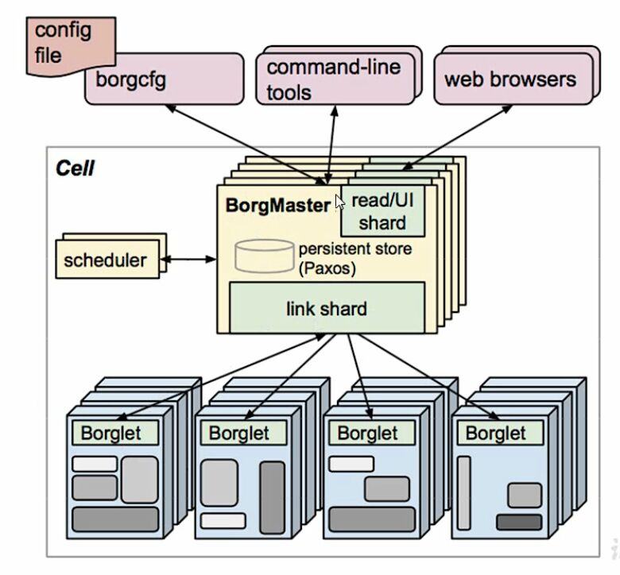
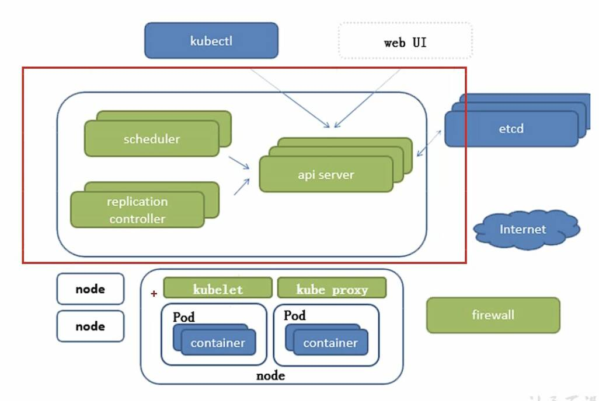
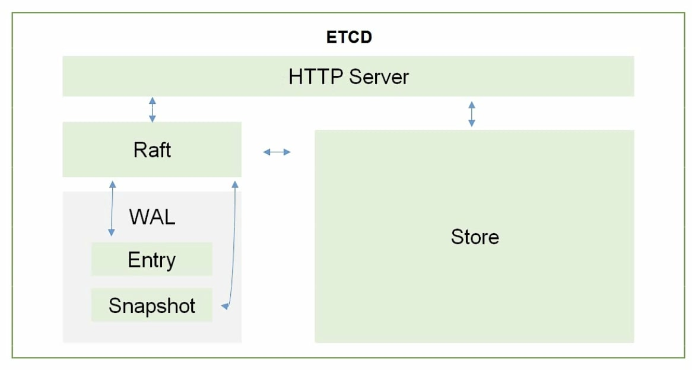
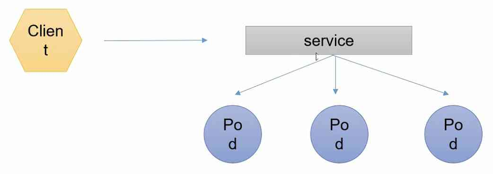

# 发展历程
docker 是 platform as a service新的标准，但是容器化的集群被需要。

Kubernetes 优点：
1. 轻量级（消耗的资源小，采用Go语言，编译型语言）
2. 开源
3. 弹性伸缩，增加节点、减少节点不需要重启等
4. 负载均衡，内部已经实现了负载均衡（采用IPVS负载均衡）

# 组件说明

## Borg系统

**BorgMaster**
负责请求分发。为了防止BorgMaster发生故障挂掉，实际上会设置很多Master的副本，一般是奇数个节点。调度集群的管理通信分为配置文件、命令行、浏览器，它们理解请求后对任务进行分发。
scheduler是调度器，它将数据写入至Paxos(persistent store)键值对的一致性数据库。Borglet会实时在poxes里监听，如果监听到对应请求，则borglet会执行。

**Borglet**: 工作节点

## K8S架构

K8S分为CS结构，master服务器和node节点。

**领导者**
borg中scheduler写到paxos，但是k8s中scheduler将请求写到api server，然后api server 再写入到etcd。

replication controller用来维护服务器的副本和期望值。

api server是所有服务的统一访问入口，scheduler、rc、kubectl(命令行工具)、web UI、etcd都需要与api server进行交互。

etcd天生支持集群方案，是一个分布式键值存储服务。

etcd v1版本不支持持久化，v2、v2版本支持，

**ETCD架构图**

ETCD使用HTTP协议通信，因为HTTP协议天生支持PUT、DELETE、还有各种认证流程。

**node节点**
node节点由kubelet、kube proxy和container(docker)三个部分组成，所以这三个软件都需要下载。

kubelet 会跟CRI（Container, Runtime, Interface）交互，操纵docker去创建对应的容器。

kube proxy用来实现负载均衡，通过操纵防火墙来实现Pod的映射。

### 总结
高可用集群副本数目最好是大于等于三并且是奇数。
Master: 
**Api Server**: 所有服务访问的统一入口。
**ControllerManager**: 维持副本期望数目。
**Scheduler**: 负责介绍任务，选择合适的节点进行分配任务。
**etcd**: 键值对数据库，存储K8S所有重要信息(持久化)。

Node: 
**Kuberlet**: 直接跟docker/容器引擎交互，实现容器的生命周期管理。

**Kuber proxy**: 负责写入规则至iptables或者IP VS，实现服务映射访问

CoreDNS: 可以为集群中的SVC创建一个域名-IP的对应关系解析(NAME记录)，是实现负载均衡的其中一项功能。
Dashboard: 给K8S集群提供一个B/S结构访问体系。
Ingress Controller: 官方的K8S只能实现四层代理，INGRESS可以实现七层代理。

Faderation: 提供一个可以跨集群中心多K8S统一管理的功能。
Prometheus: 提供一个K8S集群的监控能力
ELK: 提供K8S集群日志统一分析介入平台

# 基础概念
## Pod 概念
* 自主式Pod
* 控制器管理的Pod

一个Pod里可以封装很多容器，同一个Pod下多个容器共用同一个pause网络栈。所以同一个Pod下的网络地址是冲突的。同一个Pod下的多个容器共享同一个存储卷（文件系统）。

**Pod控制器**
**ReplicationController(RC)**用来确保容器应用的副本数始终保持在用户定义的副本数，如果有容器异常退出，会自动创建新的Pod来代替；而如果异常多出来的容器也会自动回收。在新版本的Kubernetes中建议使用ReplicaSet来取代ReplicationContriller。

**ReplicaSet(RS)** 跟 ReplicationController没有本质的不同，但是ReplicaSet支持集合式的selector。

虽然ReplicaSet可以独立使用，**但一般还是建议使用Deployment来自动管理ReplicaSet**，这样就无需担心跟其他机制不兼容问题。

**Horizontal Pod Autoscaling(HPA)**: 适用于Deploment和ReplicaSet，在V1版本中仅**支持根据Pod的CPU利用率所扩容**，在V1alpha版本中，支持根据内存和用户自定义的metric所扩容。

**StatefulSet**: 是为了解决有状态服务的问题（Deploments和ReplicaSets是为了无状态服务而设计），其应用场景包括：
* *稳定的持久化存储*，即Pod重新调度后还能访问到相同的持久化数据，基于PVC来实现。
* *稳定的网络标志*，即Pod重新调度后其PodName和HostName不变，基于Headless Service（即没有Cluster IP的Service）来实现
* *有序部署，有序扩展*，即Pod是有启动顺序的，在部署或者扩展的时候要根据定义的顺序依次进行（即从0到N-1，在下一个Pod运行之前所有之前的Pod必须都是Running和Ready状态），基于init containers来实现
* 有序收缩，有序删除（即从N-1到0开始删除服务）

> 无状态服务：负载均衡调度器、Apache Server
> 有状态服务：MySQL、MongoDB

**DaemonSet**: 确保全部（或者一些）Node上运行一个Pod副本。当有Node加入集群时，也会为他们新增一个Pod。当有Node从集群移除时，这些Pod也会被回收。删除DaemonSet将会删除它创建的所有Pod。

使用DaemonSet的一些典型用法：
* 运行集群存储daemon，例如在每个Node上运行glusterd、ceph。
* 在每个Node上运行日志收集daemon，例如fluentd、logstash
* 在每个Node上运行监控daemon，例如Prometheus Node Exporter

**Job**: 负责批处理任务，即仅执行一次的任务，它保证批处理任务的一个或多个Pod成功结束。

Cron Job 管理基于时间的Job，即：
* 在给定时间点只运行一次
* 周期性在给定时间点运行

## 服务发现

如果客户端想访问一组相关的Pod（比如同一个RS、RC、Deploment创建的Pod、或者同一标签）。

## 网络通讯方式

