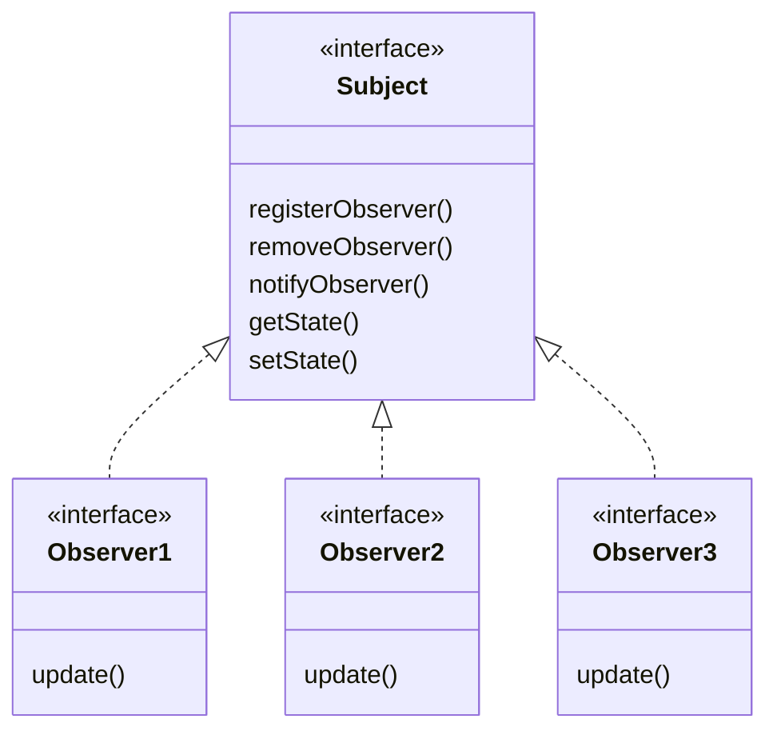
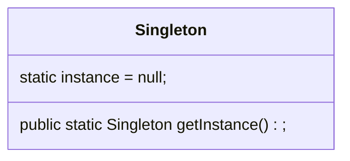
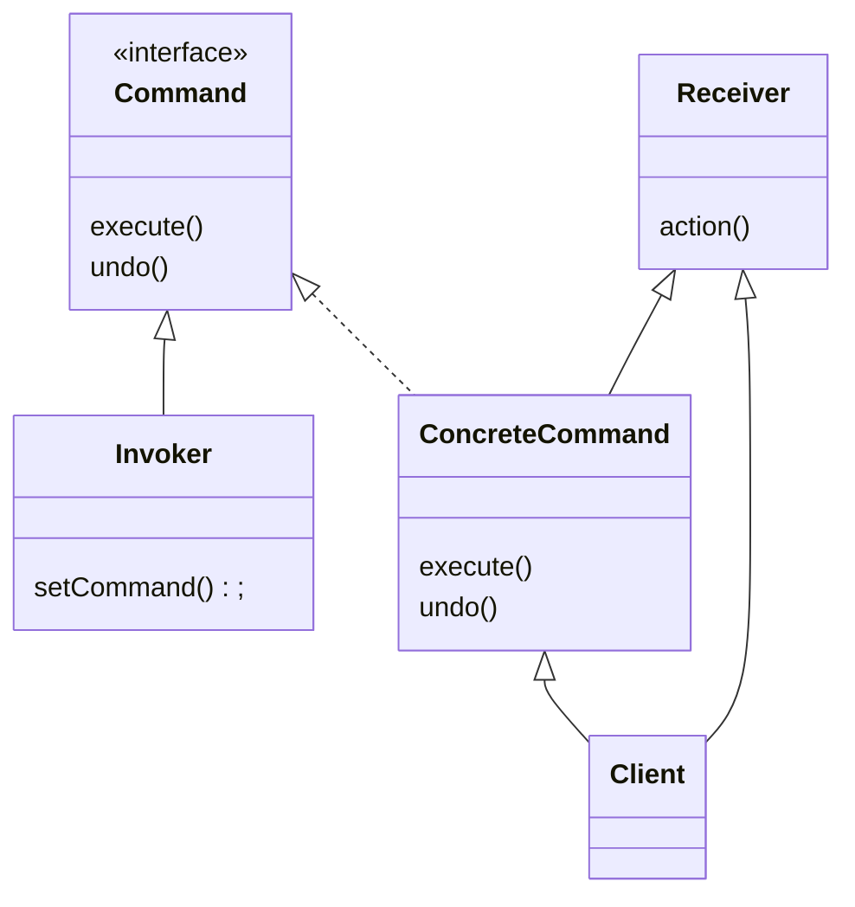
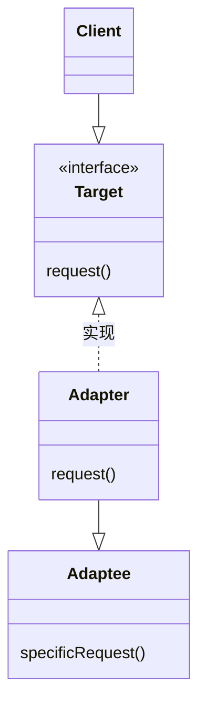
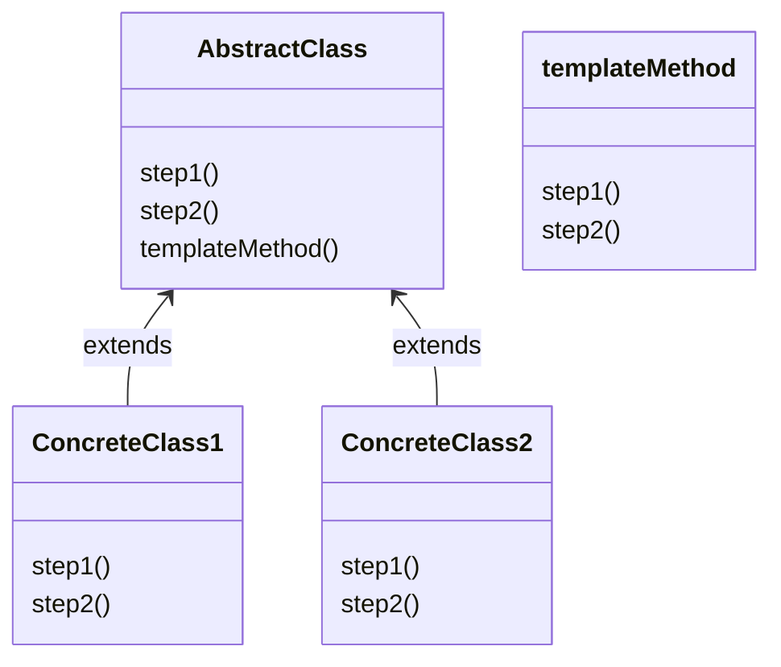
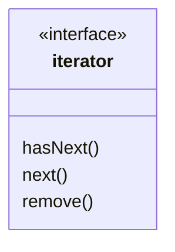
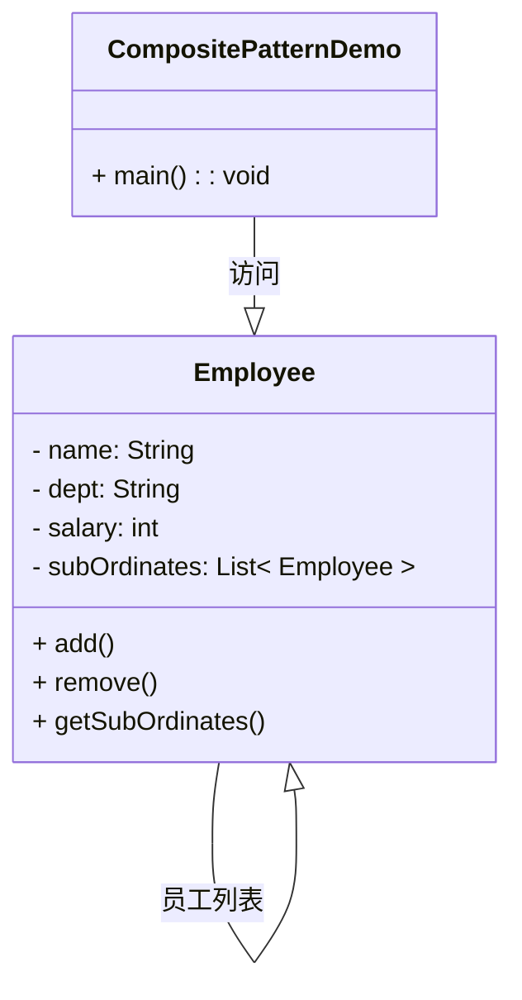

# 零、设计原则
**1. 找出应用中可能需要变化之处，把它们独立出来，不要和那些不需要变化的代码混在一起。**

**2. 针对接口编程，而不是针对实现编程。**
其实“针对接口编程，而不是针对实现编程”这句话正是利用了Java语言中的多态。编程时针对超类型（父类）进行编程，也就是说变量的声明类型（或方法的返回类型）是超类型，而不是具体的某个子类。超类型中的各个方法的具体实现不在超类型中，而是在各个子类中。这样在程序执行时可以根据实际状况执行到真正的（某个子类）行为。这样带来的好处是，我们在声明一个变量时无需关心以后执行时的真正的数据类型是哪种（某个子类类型），这是种解耦合（松耦合）的思想。我们之后维护的时候可以随时将声明的变量替换为真正需要要执行的类型，具有很高的可维护性和可扩展性。所以其实我们还可以换个说法：“针对超类型编程”，超类型则通常是接口或是一个抽象类。

**3. 类应该对扩展开放，对修改关闭**

**4. 依赖抽象，不要依赖具体的类**

**5. 高层调用底层，底层只需要提供具体参与计算的组件即可，高层控制何时以及如何调用。**

# 一、策略模式 (Strategy Pattern)
**策略模式**定义了算法族，分别封装起来，让它们之间可以互相替换，此模式让算法的变化独立于使用算法的客户。

意图：定义一系列的算法,把它们一个个封装起来, 并且使它们可相互替换。
何时使用：一个系统有许多许多类，而区分它们的只是他们直接的行为。
如何解决：将这些算法封装成一个一个的类，任意地替换。

**优点**： 1、算法可以自由切换。 2、避免使用多重条件判断。 3、扩展性良好。
**缺点**： 1、策略类会增多。 2、所有策略类都需要对外暴露。

例如：一个Duck会quack(), swim(), display()，如果按照传统模式：
```Java
class Duck {
    public void quack();
    public void swim();
    public void display();
}
```
此时如果让某些鸭子新增一个动作fly()。如果fly()放到Duck中，则不能fly()的鸭子会出现错误。如果放到一个接口中，则代码不能复用，不同鸭子的相同fly()方法会出现重复。

策略模式将易变行为和不常变化的行为分开，它定义一系列算法，将每一个算法封装起来，并让它们可以相互替换。策略模式让算法独立于使用它的客户而变化。

策略模式的Duck的fly和quack实现: 
```Java
/* 飞行的算法族 */
interface FlyBehavior {
    void fly();
}
class FlyWithWings implements FlyBehavior {
    public void fly(){/* fly with wings */}
}
class FlyNoWay implements FlyBehavior {
    public void fly() {/* cannot fly */}
}

/* 叫的算法族 */
interface QuackBehavior {
    void quack();
}
class Quack implements QuackBehavior {
    public void quack(){/* quack */}
}
class Squeak implements QuackBehavior {
    public void quack(){/* 橡皮鸭吱吱叫 */}
}
class MuteQuack implements QuackBehavior {
    public void quack(){/* cannot quack */}
}

/* 鸭子具体的实现类，将各个算法族封装 */
public class Duck {
    FlyBehavior flyBehavior = null;
    QuackBehavior quackBehavior = null;
    
    public Duck(){
        // 默认行为
        this.flyBehavior = new FlyWithWings();
        this.quackBehavior = new Quack();
    }

    public void swim(){}
    public void display(){}
    
    public void performFly(){       
        flyBehavior.fly();
    }
    public void performQuack(){
        quackBehavior.quack();
    }
}

/* 鸭子的继承类型 */
public class MallardDuck extends Duck {
    public MallardDuck(){
        super();
        // 会吱吱叫
        this.quackBehavior = new Squeak();
        // 不会飞
        this.flyBehavior = new FlyNoWay();
    }
}
```

# 二、观察者模式
**观察者模式**定义了对象之间的一对多依赖，这样一来，当一个对象改变状态时，它的所有依赖者都会收到通知并自动更新。

观察者模式可以看成订阅+发布模型。主题是真正拥有数据的人，观察者是主题的依赖者，在数据变化时更新，这样比起许多对象控制同一份数据来，可以得到更干净的OO设计。



**主要解决**：一个对象状态改变给其他对象通知的问题，而且要考虑到易用和低耦合，保证高度的协作。

**何时使用**：一个对象（目标对象）的状态发生改变，所有的依赖对象（观察者对象）都将得到通知，进行广播通知。

实现方法：在抽象类里有一个 ArrayList 存放观察者们

**优点**： 1、观察者和被观察者是抽象耦合的。 2、建立一套触发机制。

**缺点**： 1、如果一个被观察者对象有很多的直接和间接的观察者的话，将所有的观察者都通知到会花费很多时间。 2、如果在观察者和观察目标之间有循环依赖的话，观察目标会触发它们之间进行循环调用，可能导致系统崩溃。 3、观察者模式没有相应的机制让观察者知道所观察的目标对象是怎么发生变化的，而仅仅只是知道观察目标发生了变化。

观察者模式，气象站将气象数据广播：
```java
// 声明主题接口
public interface Subject {
    public void registerObserver(Observer o);
    public void removeObserver(Observer o);
    public void notifyObservers();
}

// 声明观察者接口
public interface Observer {
    public void update(float temp, float humidity, float pressure);
}

public interface DisplayElement {
    public void display();
}

// 声明主题的实现类
public class WeatherData implements Subject {
    private ArrayList observers;
    private float temperature;
    private float humidity;
    private float pressure;

    public WeatherData(){
        observers = new ArrayList();
    }

    public void registerObserver(Observer o){
        observer.add(o);
    }

    public void removeObserver(Oberver o){
        int i = observers.indexOf(o);
        if(i >= 0){
            observers.remove(i);
        }
    }

    public void notifyObservers(){
        for(int i = 0;i<observers.size(); i++){
            Observer observer = (Observer)observers.get(i);
            observer.update(temperature, humidity, pressure);
        }
    }

    public void measurementsChanged(){
        notifyObservers();
    }

    public void setMesurements(float tempurature, float humidity, float pressure) {
        this.temperature = temperature;
        this.humidity = humidity;
        this.pressure = pressure;
        measurementsChanged();
    }
}

// 观察者实现类
public class CurrentConditionsDisplay implements Observer, DisplayElement {
    private float temperature;
    private float humidity;
    private float pressure;

    private Subject weatherData;

    public CurrentConditionsDisplay (Subject weatherData){
        this.weatherData = weatherData;
        weatherData.registerObserver(this);
    }

    public void update(float tempurature, float humidity, float pressure){
        this.temperature = temperature;
        this.humidity = humidity;
        this.pressure = pressure;
        display();
    }

    public void display(){
        System.out.println("Current conditions: "+temperature + "F degrees and " + humidity + "% humidity");
    }
}
```

Java 内置了java.util.Observer和java.util.Observable，可以利用继承快速实现观察者模式。

# 三、装饰器模式
**装饰器模式**动态地将责任附加到对象上。若要扩展功能，装饰器提供了比继承更有弹性的替代方案。

一般的，我们为了扩展一个类经常使用继承方式实现，由于继承为类引入静态特征，并且随着扩展功能的增多，子类会很膨胀。为了**不想增加很多子类的情况下扩展类**，将具体功能职责划分，同时继承装饰者模式。

**关键代码**: 1、Component 类充当抽象角色，不应该具体实现。 2、修饰类引用和继承 Component 类，具体扩展类重写父类方法。

优点：装饰类和被装饰类可以独立发展，不会相互耦合，装饰模式是继承的一个替代模式，装饰模式可以动态扩展一个实现类的功能。

缺点：会增加很多装饰器小类，难以发现真正的组件本体。

应用场景：星巴克里有咖啡、茶、牛奶。在咖啡、茶、牛奶中可以添加摩卡(Mocha)、奶盖、白糖、柠檬等等。所以一共有3 * 4 = 12 种类。而配料的价格cost的价格都是固定的。为了不用每一类都声明，并且减少类的数目，可以使用装饰器模式。它的功能是增强咖啡、茶、牛奶。

```java
// 饮料基类
public abstract class Beverage {
    public String description = "Unkonown Beverage";
    public abstract int cost();
    public String Descirption() { return description;};
}

// 实际的饮料总类
class coffee extends Beverage {
    public double cost(){/* ... */}
    public String Description(){/* ... */}
}

class tea extends Beverage {
    public double cost(){/* ... */}
    public String Description(){/* ... */}
}

class milk extends Beverage {
    public double cost(){/* ... */}
    public String Description(){/* ... */}
}

// 抽象装饰器类
public abstract class Decorator extends Beverage{ // 装饰器类必须也是Beverage
    public abstract String Description();
}

// 具体的装饰器实现，包括摩卡和柠檬等
public class Mocha extends Decorator {
    Beverage beverage;
    public Mocha(Beverage beverage) {
        this.beverage = beverage;
    }

    public String Description() {
        return beverage.Description() + ", Mocha";
    }

    public double cost(){
        return 0.20 + beverage.cost();
    }
}

public class Lemon extends Decorator {
    Beverage beverage;
    public Lemon(Beverage beverage) {
        this.beverage = beverage;
    }

    public String Description() {
        return beverage.Description() + ", Lemon";
    }

    public double cost(){
        return 0.50 + beverage.cost();
    }
}

// 使用装饰器
class Main {
    public static void main(String[] args) {
        Beverage beverage = new coffee();       // 一杯咖啡
        beverage = new Mocha(beverage);         // 摩卡咖啡
        System.out.println("Description: "+beverage.Description()+", cost: "+ beverage.cost());

        Beverage beverage2 = new milk();       // 一杯咖啡
        beverage2 = new Lemon(beverage2);
        beverage2 = new Lemon(beverage2);         // 加两份柠檬
        beverage2 = new Mocha(beverage2);         // 摩卡
        System.out.println("Description: "+beverage2.Description()+", cost: "+ beverage2.cost());

    }
}
```

**Java I/O 中的装饰器**

抽象组件：InputStream
具体组件：FileInputStream、StringBufferInputStream、ByteArrayInputStream
装饰器抽象组件：FilterInputStream
装饰器具体组件：PushbackInputStream、BufferedInputStream、DataInputStream、LineNumberInputStream

具体组件可以被装饰器组件修饰。

# 四、工厂模式

**工厂模式**定义一个创建对象的接口，让其子类自己决定实例化哪一个工厂类，工厂模式使其创建过程延迟到子类进行。

**主要解决**：主要解决接口选择的问题。

**何时使用**：我们明确地计划不同条件下创建不同实例时。

例如：Hibernate 换数据库只需换方言和驱动就可以。

**优点**： 1、一个调用者想创建一个对象，只要知道其名称就可以了。 2、扩展性高，如果想增加一个产品，只要扩展一个工厂类就可以。 3、屏蔽产品的具体实现，调用者只关心产品的接口。

**缺点**：每次增加一个产品时，都需要增加一个具体类和对象实现工厂，使得系统中类的个数成倍增加，在一定程度上增加了系统的复杂度，同时也增加了系统具体类的依赖。这并不是什么好事。


举个例子：有很多Pizza商店，每个Pizza商店有不同类型的Pizza。Pizza商店中的制作流程都是确定的，则可以使用工厂模式来应对不同Pizza商店的不同Pizza的同一个制作流程。

```Java
// 抽象的工厂类
abstract class PizzaStore {
    public Pizza orderPizza(String type){
        Pizza pizza = createPizza(type);    // 创建Pizza的过程由派生类实现，订单过程由基类实现

        pizza.prepare();
        pizza.bake();
        pizza.cut();
        pizza.box();
    }

    public abstract Pizza createPizza(String type);     // 子类实现不同的创建方法
}

// 实现具体的工厂类
public class NYPizzaStore extends PizzaStore {
    Pizza createPizza(String type) {
        if(type.euqals("cheese")) {
            return new NYStyleCheezePizza();
        } else if(type.equals("veggie")) {
            return NYStyleVeggiePizze();
        }
        /* ... */
    }
}
public class ChicagoStore extends PizzaStore {
    Pizza createPizza(String type) {
        if(type.euqals("cheese")) {
            return new ChicagoCheezePizza();
        } else if(type.equals("veggie")) {
            return ChicagoWhitePizze();
        }
        /* ... */
    }
}

// 实现抽象的Pizza
public abstract class Pizza {
    String name;
    String dough;
    String sauce;
    ArrayList toppings = new ArrayList();

    void Prepare(){/* ... */}
    void bake(){/* ... */}
    void cut(){/* ... */}
    void box(){/* ... */}
}

// 实现具体的Pizza
public class NYStyleCheezePizza extends Pizza {
    /* ... */
}
public class NYStyleVeggiePizze extends Pizza {
    /* ... */
}
public class ChicagoCheezePizza extends Pizza {
    /* ... */
}
public class ChicagoWhitePizze extends Pizza {
    /* ... */
}

public class Test {
    public static void main(String[] args) {
        PizzaStore store1 = new NYPizzaStore();
        PizzaStore store2 = new ChicagoStore();

        Pizza p1 = store1.orderPizza("cheese");
        Pizza p2 = store2.orderPizza("cheese");
    }
}
```

# 五、单例模式
**单例模式**(Singleton Pattern): 单例模式确保某一个类只有一个实例，而且自行实例化并向整个系统提供这个实例，这个类称为单例类，它提供全局访问的方法。

**关键代码**：构造函数是私有的。



多线程下的单例模式：
1. 每次判断都对instance加锁，然后再判断instance是否为null，根据结果返回。
2. 急切创建实例，启动的时候就创建，比如在static的声明变量里直接new 出来一个。
3. 使用双重加锁，这样只有instance为null时才加锁，其他时候不加。


双重加锁版本：
```Java
public class Singleton {

    // volatile 关键字确保: 当instance被初始化成Singleton实例时，多个线程正确地处理instance变量
    private volatile static Singleton instance = null;

    private Singleton() {}      // 单例模式下构造函数必须声明为private
    public static Singleton getInstance () {
        if(instance == null) {
            mutex.lock();
            if(instance == null) {
                instance = new Singleton();
            }
            mutex.unlock();
        }
        return instance;
    }
}
```

volatile 两个功能[[1]](https://blog.51cto.com/u_15127650/2834299)：
1. 读取和写入直接针对内存，而不针对cache
2. volatile 修饰的变量在读写操作前后插入不同类型的内存屏障

# 六、命令模式
**命令模式**(Command Pattern)：将一个请求封装为一个对象，从而使我们可用不同的请求对客户进行参数化；对请求排队或者记录请求日志，以及支持可撤销的操作。命令模式是一种对象行为型模式，其别名为动作(Action)模式或事务(Transaction)模式。

## 命令模式的动机

在软件设计中，我们经常需要向某些对象发送请求，但是并不知道请求的接收者是谁，也不知道被请求的操作是哪个，我们只需在程序运行时指定具体的请求接收者即可，此时，可以使用命令模式来进行设计，使得请求发送者与请求接收者消除彼此之间的耦合，让对象之间的调用关系更加灵活。

命令模式可以对发送者和接收者完全解耦，发送者与接收者之间没有直接引用关系，发送请求的对象只需要知道如何发送请求，而不必知道如何完成请求。这就是命令模式的模式动机。

## 模式结构
命令模式包含如下角色：

* Command: 抽象命令类
* ConcreteCommand: 具体命令类
* Invoker: 调用者
* Receiver: 接收者
* Client:客户类



一个遥控器所使用的命令模式具体实例：
```Java
// 实现命令接口
public interface Command {
    public void execute();
}

// 实现具体的命令
public class LightOnCommand implements Command {
    Light light;

    public LightOnCommand(Light light) {
        this.light = light;
    }

    public void execute() {
        // 此处执行具体的指令
        light.on();
    }
}
public class LightOffCommand implements Command {
    public void execute() {/* ... */}
}
public class ConcreteCommand1 implements Command {
    public void execute(){/* ... */}
}
public class ConcreteCommand2 implements Command {
        public void execute(){/* ... */}
}

// 调用者Invoker
public class Invoker {
    Command[] onCommands;
    Command[] offCommands;

    public Invoker() {
        onCommands = new Command[7];
        offCommands = new Command[7];
        Command noCommand = new NoCommand();    // 空对象，也可以直接用null代替
        for(int i = 0;i < 7; i++){
            onCommands[i] = noCommand;
            offCommands[i] = noCommand;
        }
    }

    public void setCommand(int slot, Command onCommand, Command offCommand) {
        onCommands[slot] = onCommand;
        offCommands[slot] = offCommand;
    }

    public void onButtonPushed(int slot) {
        onCommands[slot].execute();
    }

    public void offButtenPushed(int slot) {
        offCommands[slot].execute();
    }
}

// 使用
public class Main {
    public static void main(String[] args) {
        Invoker invoker = new Invoker();

        Light light = new Light();
        LightOnCommand loc = new LightOnCommand(light);
        LightOffCommand lfc = new LightOffCommand();
        ConcreteCommand1 cc1 = new ConcreteCommand1();
        ConcreteCommand2 cc2 = new ConcreteCommand2();
        
        invoker.setCommand(0, loc, lfc);
        invoker.setCommand(1, cc1, cc2);

        // 使用具体的指令，信号槽为0，表示light
        invoker.onButtonPushed(0);
        invoker.offButtonPushed(0);
        invoker.onButtonPushed(1);
        invoker.offButtonPushed(1);
    }
}
```
> 上面有一个noCommand，表示一个空对象，它也含有一个execute()方法，将其execute方法设置为空，表示什么都不做。

# 七、适配器模式
**适配器模式**将一个类的接口，转换成客户期望的另一个接口。适配器让原本接口不兼容的类可以兼容。



**意图**：将一个类的接口转换成客户希望的另外一个接口。适配器模式使得原本由于接口不兼容而不能一起工作的那些类可以一起工作。

**主要解决**：主要解决在软件系统中，常常要将一些"现存的对象"放到新的环境中，而新环境要求的接口是现对象不能满足的。

**何时使用**： 1、系统需要使用现有的类，而此类的接口不符合系统的需要。 2、想要建立一个可以重复使用的类，用于与一些彼此之间没有太大关联的一些类，包括一些可能在将来引进的类一起工作，这些源类不一定有一致的接口。 3、通过接口转换，将一个类插入另一个类系中。（比如老虎和飞禽，现在多了一个飞虎，在不增加实体的需求下，增加一个适配器，在里面包容一个虎对象，实现飞的接口。）
**如何解决**：继承或依赖（推荐）。
**关键代码**：适配器继承或依赖已有的对象，实现想要的目标接口。

**优点**： 1、可以让任何两个没有关联的类一起运行。 2、提高了类的复用。 3、增加了类的透明度。 4、灵活性好。

**缺点**： 1、过多地使用适配器，会让系统非常零乱，不易整体进行把握。比如，明明看到调用的是 A 接口，其实内部被适配成了 B 接口的实现，一个系统如果太多出现这种情况，无异于一场灾难。因此如果不是很有必要，可以不使用适配器，而是直接对系统进行重构。 2.由于 JAVA 至多继承一个类，所以至多只能适配一个适配者类，而且目标类必须是抽象类。

编写一个Iterator的适配器，底层是Enumeration。采用组合方法：
```Java
public class EnumericationIterator implements Iterator {
    Enumeration enum;
    public EnumerationIterator(Enumeration enum) {
        this.enum = enum;
    }

    @Override
    public boolean hasNext() {
        return enum.hasMoreElements();
    }

    @Override
    public Object next() {
        return enum.nextElement();
    }

    @Override
    public void remove() {
        // 不能支持迭代器remove方法，所以需要跑出一个异常
        throw new UnsupportOperationException();
    }
}
```

# 八、模板方法模式
**模板模式**（Template Pattern）中，一个抽象类公开定义了执行它的方法的模板。它的子类可以按需要重写方法实现，但调用将以抽象类中定义的方式进行。这种类型的设计模式属于行为型模式。

**意图**：定义一个操作中的算法的骨架，而将一些步骤延迟到子类中。模板方法使得子类可以不改变一个算法的结构即可重定义该算法的某些特定步骤。
**主要解决**：一些方法通用，却在每一个子类都重新写了这一方法。

**优点**： 1、封装不变部分，扩展可变部分。 2、提取公共代码，便于维护。 3、行为由父类控制，子类实现。
**缺点**：每一个不同的实现都需要一个子类来实现，导致类的个数增加，使得系统更加庞大。


一个例子：

```Java
// 定义抽象类，cook是模板方法，调用子类的各个step
abstract class Cooking {
    protected abstract void step1();
    protected abstract void step2();

    public void cook() {
        System.out.println("Begin cooking")
        step1();
        step2();
        System.out.println("End cooking")
    }
}

// 子类实现对应特殊的step即可
class CookingFood1 extends Cooking {
    protected void step1() {
        System.out.println("CookingFood1 step1")
    }
    protected abstract void step2() {
        System.out.println("CookingFood1 step2")
    }
}

class CookingFood2 extends Cooking {
    protected void step1() {
        System.out.println("CookingFood2 step1")
    }
    protected abstract void step2() {
        System.out.println("CookingFood2 step2")
    }
}

// 使用方法
public class Main {
    public static void main(String[] args) {
        Cooking c = CookingFood2();
        c.cook();
    }
}
```

## 钩子的应用
在模版方法中，钩子可以控制是否执行某部分算法。
例如：
```JAVA
public class CoffeeWithHook extends CaffeineBeverageWithHook {

    // 模板函数
    public void TemplaFunc() {
        boilWater();
        brew();
        if(customerWantsCondiments()) {
            addCondiments();
        }
        pourInCup();
    }

    public void brew() {
        System.out.println("Dripping Coffee through filter");
    }

    public void addCondiments() {
        System.out.println("Adding Sugar and Milk");
    }

    // 覆盖这个钩子，提供自己的功能
    public boolean customerWantsCondiments() {
        String answer = getUserInput();
        if(answer.toLowerCase().startsWith("y")) {
            return true;
        }
        else {
            return false;
        }
    }
}

private String getUserInput(){
    /* ... */
}
```
# 九、迭代器模式
**迭代器模式**提供一种方法顺序访问一个聚合对象中的各个元素，而又不暴露其内部的表示。

**优点**： 1、它支持以不同的方式遍历一个聚合对象。 2、迭代器简化了聚合类。 3、在同一个聚合上可以有多个遍历。 4、在迭代器模式中，增加新的聚合类和迭代器类都很方便，无须修改原有代码。

**缺点**：由于迭代器模式将存储数据和遍历数据的职责分离，增加新的聚合类需要对应增加新的迭代器类，类的个数成对增加，这在一定程度上增加了系统的复杂性。


hasNext: 是否有下一个
next: 返回当前元素，并将游标指向下一个元素。
remove: 移除当前元素

一个具体的例子：
```java
public class DinerMenuIterator implements java.util.Iterator {
    MenuItem[] list;
    int position = 0;

    public DinerMenuIterator(MenuItem[] list) {
        this.list = list;
    }

    public Object next() {
        MenuItem item = list[position];
        position = position + 1;
        return item;
    }

    public boolean hasNext() {
        if(position >= list.length || list[position] == null) {
            return false;
        }
        else {
            return true;
        }
    }

    public void remove() {
        if(position < 0) {
            throw new IllegalStateException("You cann't remove an item until you've done at least one next()");
        }
        if(list[position-1] != null) {
            for(int i = position-1; i<(list.length-1); i++) {
                list[i] = list[i+1];
            }
            list[list.length-1] = null;
        }
    }
}
```

# 十、组合模式
**组合模式**（Composite Pattern），又叫部分整体模式，是用于把一组相似的对象当作一个单一的对象。组合模式依据树形结构来组合对象，用来表示部分以及整体层次。这种类型的设计模式属于结构型模式，它创建了对象组的树形结构。

**意图**：将对象组合成树形结构以表示"部分-整体"的层次结构。组合模式使得用户对单个对象和组合对象的使用具有一致性。

**主要解决**：它在我们树型结构的问题中，模糊了简单元素和复杂元素的概念，客户程序可以像处理简单元素一样来处理复杂元素，从而使得客户程序与复杂元素的内部结构解耦。

**关键代码**：树枝内部组合该接口，并且含有内部属性 List，里面放 Component。

例子：
我们有一个类 Employee，该类被当作组合模型类。CompositePatternDemo 类使用 Employee 类来添加部门层次结构，并打印所有员工。


```java
import java.util.ArrayList;
import java.util.List;
 
// 创建 Employee 类，该类带有 Employee 对象的列表。
public class Employee {
   private String name;
   private String dept;
   private int salary;
   private List<Employee> subordinates;
 
   //构造函数
   public Employee(String name,String dept, int sal) {
      this.name = name;
      this.dept = dept;
      this.salary = sal;
      subordinates = new ArrayList<Employee>();
   }
 
   public void add(Employee e) {
      subordinates.add(e);
   }
 
   public void remove(Employee e) {
      subordinates.remove(e);
   }
 
   public List<Employee> getSubordinates(){
     return subordinates;
   }
 
   public String toString(){
      return ("Employee :[ Name : "+ name 
      +", dept : "+ dept + ", salary :"
      + salary+" ]");
   }   
}

// 2. 使用 Employee 类来创建和打印员工的层次结构。
public class CompositePatternDemo {
   public static void main(String[] args) {
      Employee CEO = new Employee("John","CEO", 30000);
 
      Employee headSales = new Employee("Robert","Head Sales", 20000);
 
      Employee headMarketing = new Employee("Michel","Head Marketing", 20000);
 
      Employee clerk1 = new Employee("Laura","Marketing", 10000);
      Employee clerk2 = new Employee("Bob","Marketing", 10000);
 
      Employee salesExecutive1 = new Employee("Richard","Sales", 10000);
      Employee salesExecutive2 = new Employee("Rob","Sales", 10000);
 
      CEO.add(headSales);
      CEO.add(headMarketing);
 
      headSales.add(salesExecutive1);
      headSales.add(salesExecutive2);
 
      headMarketing.add(clerk1);
      headMarketing.add(clerk2);
 
      //打印该组织的所有员工
      System.out.println(CEO); 
      for (Employee headEmployee : CEO.getSubordinates()) {
         System.out.println(headEmployee);
         for (Employee employee : headEmployee.getSubordinates()) {
            System.out.println(employee);
         }
      }        
   }
}
```


