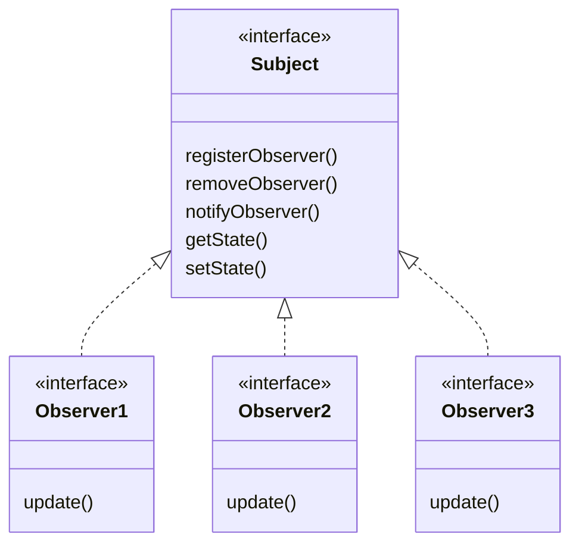

# 零、设计原则
**1. 找出应用中可能需要变化之处，把它们独立出来，不要和那些不需要变化的代码混在一起。**

**2. 针对接口编程，而不是针对实现编程。**
其实“针对接口编程，而不是针对实现编程”这句话正是利用了Java语言中的多态。编程时针对超类型（父类）进行编程，也就是说变量的声明类型（或方法的返回类型）是超类型，而不是具体的某个子类。超类型中的各个方法的具体实现不在超类型中，而是在各个子类中。这样在程序执行时可以根据实际状况执行到真正的（某个子类）行为。这样带来的好处是，我们在声明一个变量时无需关心以后执行时的真正的数据类型是哪种（某个子类类型），这是种解耦合（松耦合）的思想。我们之后维护的时候可以随时将声明的变量替换为真正需要要执行的类型，具有很高的可维护性和可扩展性。所以其实我们还可以换个说法：“针对超类型编程”，超类型则通常是接口或是一个抽象类。

**3. 类应该对扩展开放，对修改关闭**

# 一、策略模式 (Strategy Pattern)
**策略模式**定义了算法族，分别封装起来，让它们之间可以互相替换，此模式让算法的变化独立于使用算法的客户。

意图：定义一系列的算法,把它们一个个封装起来, 并且使它们可相互替换。
何时使用：一个系统有许多许多类，而区分它们的只是他们直接的行为。
如何解决：将这些算法封装成一个一个的类，任意地替换。

**优点**： 1、算法可以自由切换。 2、避免使用多重条件判断。 3、扩展性良好。
**缺点**： 1、策略类会增多。 2、所有策略类都需要对外暴露。

例如：一个Duck会quack(), swim(), display()，如果按照传统模式：
```Java
class Duck {
    public void quack();
    public void swim();
    public void display();
}
```
此时如果让某些鸭子新增一个动作fly()。如果fly()放到Duck中，则不能fly()的鸭子会出现错误。如果放到一个接口中，则代码不能复用，不同鸭子的相同fly()方法会出现重复。

策略模式将易变行为和不常变化的行为分开，它定义一系列算法，将每一个算法封装起来，并让它们可以相互替换。策略模式让算法独立于使用它的客户而变化。

策略模式的Duck的fly和quack实现: 
```Java
/* 飞行的算法族 */
interface FlyBehavior {
    void fly();
}
class FlyWithWings implements FlyBehavior {
    public void fly(){/* fly with wings */}
}
class FlyNoWay implements FlyBehavior {
    public void fly() {/* cannot fly */}
}

/* 叫的算法族 */
interface QuackBehavior {
    void quack();
}
class Quack implements QuackBehavior {
    public void quack(){/* quack */}
}
class Squeak implements QuackBehavior {
    public void quack(){/* 橡皮鸭吱吱叫 */}
}
class MuteQuack implements QuackBehavior {
    public void quack(){/* cannot quack */}
}

/* 鸭子具体的实现类，将各个算法族封装 */
public class Duck {
    FlyBehavior flyBehavior = null;
    QuackBehavior quackBehavior = null;
    
    public Duck(){
        // 默认行为
        this.flyBehavior = new FlyWithWings();
        this.quackBehavior = new Quack();
    }

    public void swim(){}
    public void display(){}
    
    public void performFly(){       
        flyBehavior.fly();
    }
    public void performQuack(){
        quackBehavior.quack();
    }
}

/* 鸭子的继承类型 */
public class MallardDuck extends Duck {
    public MallardDuck(){
        super();
        // 会吱吱叫
        this.quackBehavior = new Squeak();
        // 不会飞
        this.flyBehavior = new FlyNoWay();
    }
}
```

# 二、观察者模式
**观察者模式**定义了对象之间的一对多依赖，这样一来，当一个对象改变状态时，它的所有依赖者都会收到通知并自动更新。

观察者模式可以看成订阅+发布模型。主题是真正拥有数据的人，观察者是主题的依赖者，在数据变化时更新，这样比起许多对象控制同一份数据来，可以得到更干净的OO设计。



**主要解决**：一个对象状态改变给其他对象通知的问题，而且要考虑到易用和低耦合，保证高度的协作。

**何时使用**：一个对象（目标对象）的状态发生改变，所有的依赖对象（观察者对象）都将得到通知，进行广播通知。

实现方法：在抽象类里有一个 ArrayList 存放观察者们

**优点**： 1、观察者和被观察者是抽象耦合的。 2、建立一套触发机制。

**缺点**： 1、如果一个被观察者对象有很多的直接和间接的观察者的话，将所有的观察者都通知到会花费很多时间。 2、如果在观察者和观察目标之间有循环依赖的话，观察目标会触发它们之间进行循环调用，可能导致系统崩溃。 3、观察者模式没有相应的机制让观察者知道所观察的目标对象是怎么发生变化的，而仅仅只是知道观察目标发生了变化。

观察者模式，气象站将气象数据广播：
```java
// 声明主题接口
public interface Subject {
    public void registerObserver(Observer o);
    public void removeObserver(Observer o);
    public void notifyObservers();
}

// 声明观察者接口
public interface Observer {
    public void update(float temp, float humidity, float pressure);
}

public interface DisplayElement {
    public void display();
}

// 声明主题的实现类
public class WeatherData implements Subject {
    private ArrayList observers;
    private float temperature;
    private float humidity;
    private float pressure;

    public WeatherData(){
        observers = new ArrayList();
    }

    public void registerObserver(Observer o){
        observer.add(o);
    }

    public void removeObserver(Oberver o){
        int i = observers.indexOf(o);
        if(i >= 0){
            observers.remove(i);
        }
    }

    public void notifyObservers(){
        for(int i = 0;i<observers.size(); i++){
            Observer observer = (Observer)observers.get(i);
            observer.update(temperature, humidity, pressure);
        }
    }

    public void measurementsChanged(){
        notifyObservers();
    }

    public void setMesurements(float tempurature, float humidity, float pressure) {
        this.temperature = temperature;
        this.humidity = humidity;
        this.pressure = pressure;
        measurementsChanged();
    }
}

// 观察者实现类
public class CurrentConditionsDisplay implements Observer, DisplayElement {
    private float temperature;
    private float humidity;
    private float pressure;

    private Subject weatherData;

    public CurrentConditionsDisplay (Subject weatherData){
        this.weatherData = weatherData;
        weatherData.registerObserver(this);
    }

    public void update(float tempurature, float humidity, float pressure){
        this.temperature = temperature;
        this.humidity = humidity;
        this.pressure = pressure;
        display();
    }

    public void display(){
        System.out.println("Current conditions: "+temperature + "F degrees and " + humidity + "% humidity");
    }
}
```

Java 内置了java.util.Observer和java.util.Observable，可以利用继承快速实现观察者模式。

# 三、装饰器模式
**装饰器模式**动态地将责任附加到对象上。若要扩展功能，装饰器提供了比继承更有弹性的替代方案。

一般的，我们为了扩展一个类经常使用继承方式实现，由于继承为类引入静态特征，并且随着扩展功能的增多，子类会很膨胀。为了**不想增加很多子类的情况下扩展类**，将具体功能职责划分，同时继承装饰者模式。

**关键代码**: 1、Component 类充当抽象角色，不应该具体实现。 2、修饰类引用和继承 Component 类，具体扩展类重写父类方法。

优点：装饰类和被装饰类可以独立发展，不会相互耦合，装饰模式是继承的一个替代模式，装饰模式可以动态扩展一个实现类的功能。

缺点：会增加很多装饰器小类，难以发现真正的组件本体。

应用场景：星巴克里有咖啡、茶、牛奶。在咖啡、茶、牛奶中可以添加摩卡(Mocha)、奶盖、白糖、柠檬等等。所以一共有3 * 4 = 12 种类。而配料的价格cost的价格都是固定的。为了不用每一类都声明，并且减少类的数目，可以使用装饰器模式。它的功能是增强咖啡、茶、牛奶。

```java
// 饮料基类
public abstract class Beverage {
    public String description = "Unkonown Beverage";
    public abstract int cost();
    public String Descirption() { return description;};
}

// 实际的饮料总类
class coffee extends Beverage {
    public double cost(){/* ... */}
    public String Description(){/* ... */}
}

class tea extends Beverage {
    public double cost(){/* ... */}
    public String Description(){/* ... */}
}

class milk extends Beverage {
    public double cost(){/* ... */}
    public String Description(){/* ... */}
}

// 抽象装饰器类
public abstract class Decorator extends Beverage{ // 装饰器类必须也是Beverage
    public abstract String Description();
}

// 具体的装饰器实现，包括摩卡和柠檬等
public class Mocha extends Decorator {
    Beverage beverage;
    public Mocha(Beverage beverage) {
        this.beverage = beverage;
    }

    public String Description() {
        return beverage.Description() + ", Mocha";
    }

    public double cost(){
        return 0.20 + beverage.cost();
    }
}

public class Lemon extends Decorator {
    Beverage beverage;
    public Lemon(Beverage beverage) {
        this.beverage = beverage;
    }

    public String Description() {
        return beverage.Description() + ", Lemon";
    }

    public double cost(){
        return 0.50 + beverage.cost();
    }
}

// 使用装饰器
class Main {
    public static void main(String[] args) {
        Beverage beverage = new coffee();       // 一杯咖啡
        beverage = new Mocha(beverage);         // 摩卡咖啡
        System.out.println("Description: "+beverage.Description()+", cost: "+ beverage.cost());

        Beverage beverage2 = new milk();       // 一杯咖啡
        beverage2 = new Lemon(beverage2);
        beverage2 = new Lemon(beverage2);         // 加两份柠檬
        beverage2 = new Mocha(beverage2);         // 摩卡
        System.out.println("Description: "+beverage2.Description()+", cost: "+ beverage2.cost());

    }
}
```

**Java I/O 中的装饰器**

抽象组件：InputStream
具体组件：FileInputStream、StringBufferInputStream、ByteArrayInputStream
装饰器抽象组件：FilterInputStream
装饰器具体组件：PushbackInputStream、BufferedInputStream、DataInputStream、LineNumberInputStream

具体组件可以被装饰器组件修饰。

# 四、工厂模式

**工厂模式**定义一个创建对象的接口，让其子类自己决定实例化哪一个工厂类，工厂模式使其创建过程延迟到子类进行。

**主要解决**：主要解决接口选择的问题。

**何时使用**：我们明确地计划不同条件下创建不同实例时。

例如：Hibernate 换数据库只需换方言和驱动就可以。

**优点**： 1、一个调用者想创建一个对象，只要知道其名称就可以了。 2、扩展性高，如果想增加一个产品，只要扩展一个工厂类就可以。 3、屏蔽产品的具体实现，调用者只关心产品的接口。

**缺点**：每次增加一个产品时，都需要增加一个具体类和对象实现工厂，使得系统中类的个数成倍增加，在一定程度上增加了系统的复杂度，同时也增加了系统具体类的依赖。这并不是什么好事。


举个例子：有很多Pizza商店，每个Pizza商店有不同类型的Pizza。Pizza商店中的制作流程都是确定的，则可以使用工厂模式来应对不同Pizza商店的不同Pizza的同一个制作流程。

```Java
// 抽象的工厂类
abstract class PizzaStore {
    public Pizza orderPizza(String type){
        Pizza pizza = createPizza(type);    // 创建Pizza的过程由派生类实现，订单过程由基类实现

        pizza.prepare();
        pizza.bake();
        pizza.cut();
        pizza.box();
    }

    public abstract Pizza createPizza(String type);     // 子类实现不同的创建方法
}

// 实现具体的工厂类
public class NYPizzaStore extends PizzaStore {
    Pizza createPizza(String type) {
        if(type.euqals("cheese")) {
            return new NYStyleCheezePizza();
        } else if(type.equals("veggie")) {
            return NYStyleVeggiePizze();
        }
        /* ... */
    }
}
public class ChicagoStore extends PizzaStore {
    Pizza createPizza(String type) {
        if(type.euqals("cheese")) {
            return new ChicagoCheezePizza();
        } else if(type.equals("veggie")) {
            return ChicagoWhitePizze();
        }
        /* ... */
    }
}

// 实现抽象的Pizza
public abstract class Pizza {
    String name;
    String dough;
    String sauce;
    ArrayList toppings = new ArrayList();

    void Prepare(){/* ... */}
    void bake(){/* ... */}
    void cut(){/* ... */}
    void box(){/* ... */}
}

// 实现具体的Pizza
public class NYStyleCheezePizza extends Pizza {
    /* ... */
}
public class NYStyleVeggiePizze extends Pizza {
    /* ... */
}
public class ChicagoCheezePizza extends Pizza {
    /* ... */
}
public class ChicagoWhitePizze extends Pizza {
    /* ... */
}

public class Test {
    public static void main(String[] args) {
        PizzaStore store1 = new NYPizzaStore();
        PizzaStore store2 = new ChicagoStore();

        Pizza p1 = store1.orderPizza("cheese");
        Pizza p2 = store2.orderPizza("cheese");
    }
}
```

